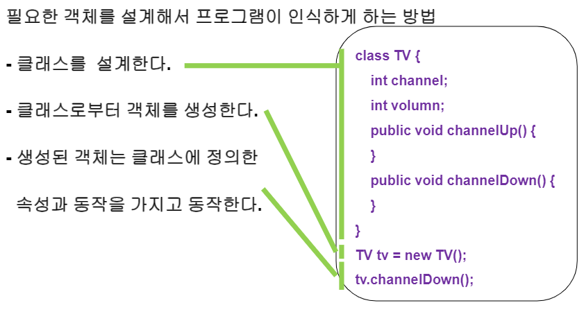
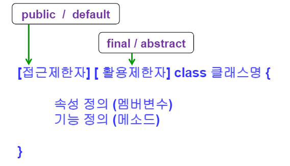
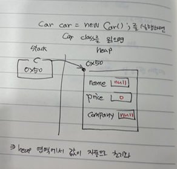
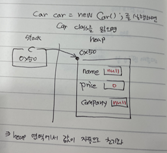
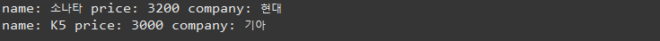
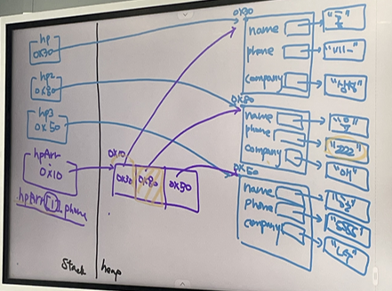
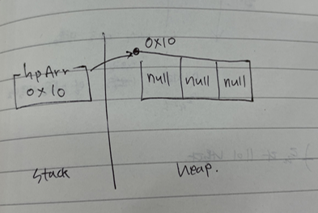
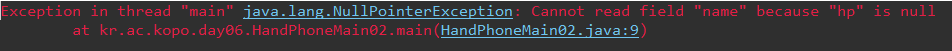
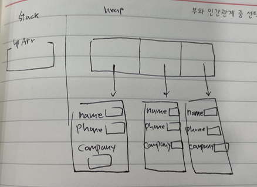
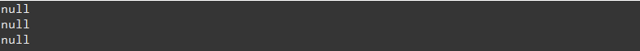

#### 과제 및 복습

- **3/12 키워드 복습**

배열(정의), 사용자의 변수 선언에 대한 노가다를 줄이기 위해서 배열이 나옴, 배열길이 = 배열명.length, Arrays.tostring (문자형 - 출력용), System.arraycopy


-  **과제 풀이**

  - 사용자가 생각하는 숫자 맞추기 문제는 숫자의 중앙값으로 되묻기 (7번 문제)

  

  - day05 2번 문제

  ```java
  package kr.ac.kopo.day06.homework;
  
  import java.util.Scanner;
  
  public class HomeworkMain01 {
  	
  	//day05 2번 문제
  	public static void main(String[] args) {
  		Scanner sc = new Scanner(System.in);
  		System.out.print("짝수 몇 개 입력? : ");
  		int evenNum = sc.nextInt();
  		System.out.print("홀수 몇 개 입력? : ");
  		int oddNum = sc.nextInt();
  		
  		int[] nums = new int[evenNum + oddNum]; 
  		
  		int evenIdx = 0 ; //짝수가 들어가는 index
  		int oddIdx = nums.length - 1; //홀수가 들어가는 index
  		
  		for(int i = 0 ; i < nums.length; i++) {
  			System.out.print("num" +(i+1) + ":" );
  			int num = sc.nextInt(); //입력받은 정수 
  			if(num % 2 ==0 && evenIdx < evenNum) { //짝수 && 짝수의 개수가 evenNum 이하인 경우 
  				nums[evenIdx++] = num; //evenIdx를 저장한 다음 evevIdx = evevIdx - 1 
  			}else if(num % 2 != 0 && oddIdx >= evenNum){ //홀수 && 홀수의 개수가 oddNum 이하인 경우 
  				nums[oddIdx--] = num;
  			}else { //홀수 또는 짝수의 개수를 넘어갔을 경우
  				i --;
  			}
  		}
  		System.out.println("< 총 >"+nums.length + "개 정수 출력 >");
  		for(int num : nums) {
  			System.out.print(num + "  ");
  		}
  		System.out.println();
  	}
  }
  ```

  

  - **day05 3번 문제**
    - 3번 틀림(다시 확인하기)

  ```java
  package kr.ac.kopo.day06.homework;
  
  public class HomeworkMain02 {
  	
  	//day05 3번 문제
  	public static void main(String[] args) {
  		int[] prime = new int[30] ; //자신의 앞의 소수를 넣는 배열 넉넉하게 길이를 30개
  		int loc = 0; //prime 배열의 index 초기화 (현재 소수의 개수 - 1)
  		
  		for(int num=2; num<=100; num++) {
  			boolean flag = true; //소수이다.
  			for(int i=0;i<loc;i++) {
  				if(num % prime[i] == 0) { //자신의 앞에 있는 소수로 나눠보기 
  					flag = false; //소수가 아니다.
  					break;
  				}
  			}
  			if(flag) {
  				prime[loc++] = num; //prime[loc]에 저장하고 loc 후위증가
  			}
  		}
  		for(int i = 0; i<loc;i++) {
  			System.out.print(prime[i] + "  ");
  			if((i+1) % 5 == 0){ //5개의 숫자만 찍고 enter
  				System.out.println();
  			}
  		}
  		
  	} //main
  }
  ```

  

  - **day05 4번 문제**
    - 틀림

  ```java
  package kr.ac.kopo.day06.homework;
  
  
  public class HomeworkMain03 {
  	
  	//day05 4번 문제
  	public static void main(String[] args) {
  		int[] nums = new int[99] ;  //2~100까지 슷자 저장
  		for(int i =0;i<nums.length;i++) {
  			nums[i] = i+2;
  		}
  		
  		for(int i=0;i<nums.length;i++) {
  			if(nums[i]!=0) { 
  				for(int j = i+1;j<nums.length;j++) { //i+1부터 nums[i]의 배수는 0으로 만들기
  					if(nums[j] % nums[i] == 0) {
  						nums[j] = 0;
  					}
  				}
  			}
  		}
          
  		//결과 print		
  		for(int num : nums) {
  			if(num != 0) {
  				System.out.print(num + "  ");
  			}
  		}
  	} //main
  }
  ```


---------------

#### 절차지향 & 객체지향

- **절차지향(Procedural Programming)**
  - 행동이 기반이고 유지보수가 어려움(주어가 없음)
  - 물이 위에서 아래로 흐르는 것처럼 순차적인 처리가 중요시 되고 전체가 유기적으로 연결되도록 만드는 그로그래밍 기법
  - 장점
    - 컴퓨터의 처리구조와 유사해 실행속도가 빠름
  - 단점
    - 실행 순서가 정해져 있으므로 코드의 순서가 바뀌면서 동일한 결과를 보장하기 어려움
    - 유지보수가 어려움
    - 디버깅이 어려움 


- **객체지향(Object Oriented Programming)**

  객체지향이란 **실제 세계를 모델링**하여 소프트웨어를 개발하는 방법이다. 객체지향 프로그래밍에서는 데이터와 절차를 하나의 덩어리로 묶어서 생각하게 된다. 이는 마치 컴퓨터 부품을 하나씩 사다가 컴퓨터를 조립하는 것과 같은 방법이다.

  - 눈에보이는 사물 하나를 단위로 만듦  그리고 그 사물끼리 커뮤니케이션을 통해서 어떠한 결과를 나타낼 수 있게함
    - 눈에 보이는 사물이 아닌 것도 만들어야 하는 상황이 발생하기도 한다.
  - 사물은 다 명사 형태이므로 그 사물의 특징을 표현
    - ex) 고양이, 강아지 등은 소리를 낸다라는 특징을 가지고 있음 그리고 소리를 낸다는 함수명을 동일하게 지정할 수 있다. (행위의 메소드명은 동일)
    - ex) nextInt 
      - Random에서의 nextInt
      - Scanner에서의 nextInt
  - 객체지향 프로그래밍 키워드 5가지
    - 클래스+인스턴스(객체)
    - 추상화
    - 캡슐화
    - 상속
    - 다형성
  - 장점
    - 코드의 재활용성이 높음
    - 코딩이 절차지향보다 간편함
    - 디버깅이 쉬움
  - 단점
    - 처리속도가 절차지향보다 느림
    - 설계에 많은 시간소요가 들어감

  > https://jeong-pro.tistory.com/95 (참고 링크)


-----------

#### 클래스

- **클래스 정의**

  - 눈에보이는 사물에 대한 하나의 추상화 단위 (눈에 보이는 것을 모두 프레이밍 할 필요가 없고 내가 원하는 기능만 구현하면 된다 - 추상화)
    - 사물의 특징(명사), 행동(동사)을  class 안에 넣는다.
    - 하나의 class 안에 특징을 변수로 만들고 행동을 메소드로 구성
  - 즉, 어떤 문제를 해결하기 위한 데이터를 만들기기 위해 추상화를 거쳐 집단에 속하는 **속성**(attribute)과 **행위**(behavior)를 **변수**와 **메소드**로 정의한 것
  - 클래스는 객체가 아니고 객체를 만들 수 있는 기본적인 단위(설계 도면)
    - 클래스를 이용해서 객체를 생성
  - 모든 객체들의 생산처
  - 클래스 = 객체를 생성하는 틀
    - 객체 : 메모리에 생성된 것
  - 프로그래밍이 쓰이는 목적을 생각하여 어떤 객체를 만들어야 하는지 결정한다.
  - 각 객체들이 어떤 특징(속성과 동작)을 가지고 있을지 결정한다.
  - 객체들 사이에서 메시지를 주고 받도록 만들어 준다.

  


- 필요한 객체를 설계해서 프로그램이 인식하게 하는 방법
  - 눈에보이는 사물들을 추상화시켜서 클래스를 생성
    - 추상화란 여러 객체에 공통적으로, 사용되어야 하는 내용을 뽑아내는 것
  - 클래스를 통해서 객체를 생성
  - 메모리(heap)영역에 공간을 생성 (new TV())
  - heap 영역의 주소값을 가지고 있는 참조변수(TV tv =) 
  - new를 이용해서 만들어진 객체를 인스턴스 객체(new TV() 이부분) 라고 부른다.




- **클래스의 선언**

  - class명.java (하나의 .java파일에 하나의 class가 있는데 이 파일명과 클래스명이 동일해야함)

  

  ###### <Car.java>

```java
package kr.ac.kopo.day06;

//참조클래스
public class Car { 
	String name;
	int price;
	String company;
}
```


###### <CarMain.java>

```java
package kr.ac.kopo.day06;

//실행클래스 (눈에보이는 사물을 추상화시킨 class는 아니고 프롬을 실행시키기 위한 class
public class CarMain {

	public static void main(String[] args) {
		Car c = new Car(); 
		//JVM이 Car class를 해석하는데 JVM이 해석한 class를 메모리에 올려놓는다.
		//main 메소드를 읽으면서 해석한 class만 메모리에 올려놓는 것이다.
		//또한, import 시킨 애들만 메모리에 올려 놓는다.
		Car c2 = new Car();
		
		System.out.println(c.name);//Car class에 있는 name에 접근
		System.out.println(c2.name); //name의 메소드는 모두 같음 
	}
}
```


- 인스턴스는 heap영역에 올라가므로 int를 초기화 하지 않아도 heap 영역에서는 모두 자동 초기화가 된다.

 


###### <CarMain.java>

```java
package kr.ac.kopo.day06;

//실행클래스 (눈에보이는 사물을 추상화시킨 class는 아니고 프롬을 실행시키기 위한 class
public class CarMain {

	public static void main(String[] args) {
		Car c = new Car(); 
		//JVM이 Car class를 해석하는데 JVM이 해석한 class를 메모리에 올려놓는다.
		//main 메소드를 읽으면서 해석한 class만 메모리에 올려놓는 것이다.
		//또한, import 시킨 애들만 메모리에 올려 놓는다.
		Car c2 = new Car();
		
		c.name = "소나타" ; 
		c.price = 3200;
		c.company = "현대";
		
		c2.name = "K5" ;
		c2.price = 3000;
		c2.company = "기아";
 		
		System.out.println("name: " + c.name + " price: " +c.price + " company: "  + c.company);
		System.out.println("name: " + c2.name + " price: " +c2.price + " company: "  + c2.company);
		
	}
}
```



 


------------

###### <HandPhone.java>

```java
package kr.ac.kopo.day06;

public class HandPhone {
	String name; /** 소유주명 */
	String phone; /** 핸드폰 번호 */
	String company; /** 핸드폰 제조사 */
}
```


###### <HandPhoneMain.java>

```java
package kr.ac.kopo.day06;

public class HandPhoneMain {

	public static void main(String[] args) {
		HandPhone hp = new HandPhone();
		hp.name = "홍길동" ; 
		hp.phone = "010-2345-6789" ; 
		hp.company = "삼성";
		
		HandPhone hp2 = new HandPhone();
		hp2.name = "윤길동" ; 
		hp2.phone = "010-3333-4444" ; 
		hp2.company = "애플";
		
		HandPhone hp3 = new HandPhone();
		hp3.name = "한길동" ; 
		hp3.phone = "010-5555-6666" ; 
		hp3.company = "엘지";
		
		System.out.println("소유주명: " + hp.name + "전화번호: " + hp.phone + "제조사: "+hp.company);
		
		System.out.println("==========================");
		//3개의 값을 하나하나 찍기에 시간이 많이 걸림 
		//그래서 핸드폰 배열을 생성
		HandPhone[] hpArr = {hp, hp2, hp3} ;
		for(int i=0; i<hpArr.length;++i) {
			System.out.println("소유주 명 :" + hpArr[i].name);
			System.out.println("전화번호 :" + hpArr[i].phone);
			System.out.println("제조사 :" + hpArr[i].company);
		}
		//배열 확인하는 다른 방법
		for(HandPhone arr : hpArr) {
			System.out.println("소유주 명 :" + arr.name);
			System.out.println("전화번호 :" + arr.phone);
			System.out.println("제조사 :" + arr.company);
		}
	}

}
```

 

 


- **HandPhone 타입의 배열 생성**
  - 아직 핸드폰 타입의 인스턴스 객체를 만든 것이 아니다.
  - 인스턴스 객체를 만드는 방법은 new Type () ; (ex. new HandPhone();)
  - 위의 사진 파란색처럼 3개의 인스턴스 객체를 따로 만들어야함 

###### <HandPhoneMain02.java>

```java
package kr.ac.kopo.day06;

public class HandPhoneMain02 {

	public static void main(String[] args) {
		
		HandPhone[] hpArr = new HandPhone[3] ;		
	}
}
```

 


- **위에서 생성한 배열 확인**
  - 아직 인스턴스 객체가 생성하기 전이므로 null이 들어있는 상태이다. 그래서 에러 발생

```java
package kr.ac.kopo.day06;

public class HandPhoneMain02 {

	public static void main(String[] args) {
		
		HandPhone[] hpArr = new HandPhone[3] ;
		for(HandPhone hp : hpArr) {
			System.out.println(hp.name);
		}
	}
}
```




- **HandPhone 인스턴스 객체 만들기**

```java
package kr.ac.kopo.day06;

public class HandPhoneMain02 {

	public static void main(String[] args) {
		//핸드폰 인스턴스 객체 만들기
		HandPhone[] hpArr = new HandPhone[] {new HandPhone(), new HandPhone(), new HandPhone()} ;
	}
}
```

 


- **인스턴스 객체 생성 후 배열 출력**
  - null값이 나온다 (heap 영역에서는 null값으로 초기화되기 때문이다.)

```java
package kr.ac.kopo.day06;

public class HandPhoneMain02 {

	public static void main(String[] args) {
		//핸드폰 인스턴스 객체 만들기
		HandPhone[] hpArr = new HandPhone[] {new HandPhone(), new HandPhone(), new HandPhone()} ;
		for(HandPhone hp : hpArr) {
			System.out.println(hp.name);
		}
	}
}
```




- **배열에 값넣기**

```java
package kr.ac.kopo.day06;

public class HandPhoneMain02 {

	public static void main(String[] args) {
		//핸드폰 인스턴스 객체 만들기
		HandPhone[] hpArr = new HandPhone[] {new HandPhone(), new HandPhone(), new HandPhone()} ;
		hpArr[0].name = "홍길동";
		hpArr[0].phone = "010-1111-2222";
		hpArr[0].company = "삼성";
		
		hpArr[1].name = "윤길동";
		hpArr[1].phone = "010-3333-4444";
		hpArr[1].company = "애플";
		
		hpArr[2].name = "한길동";
		hpArr[2].phone = "010-5555-6666";
		hpArr[2].company = "엘지";
		
		for(HandPhone hp : hpArr) {
			System.out.println("소유주 명 : " + hp.name);
			System.out.println("전화번호 : " + hp.phone);
			System.out.println("제조사 : " + hp.company);
		}
	}
}
```


