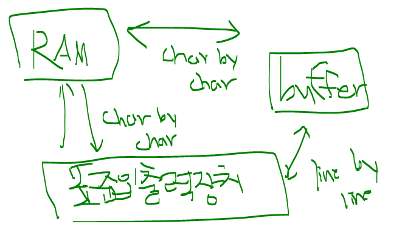
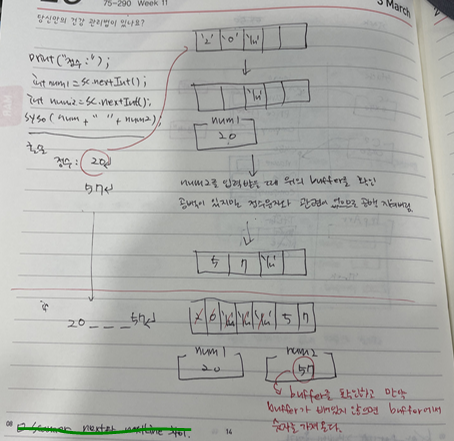
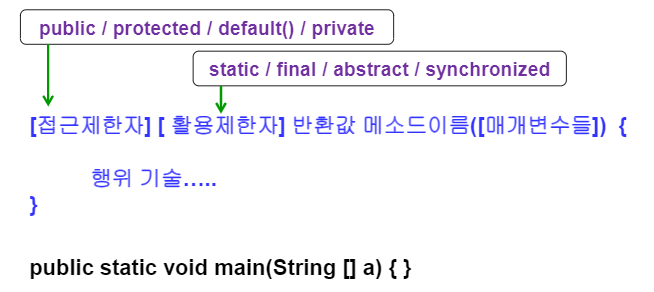
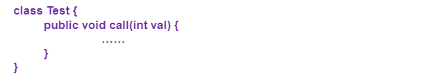
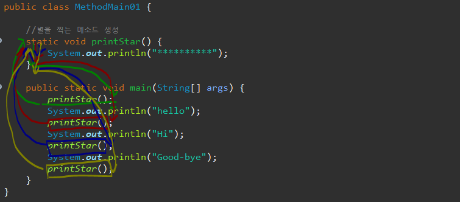
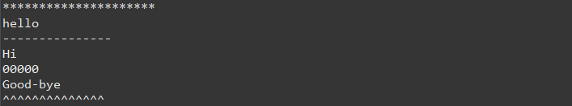
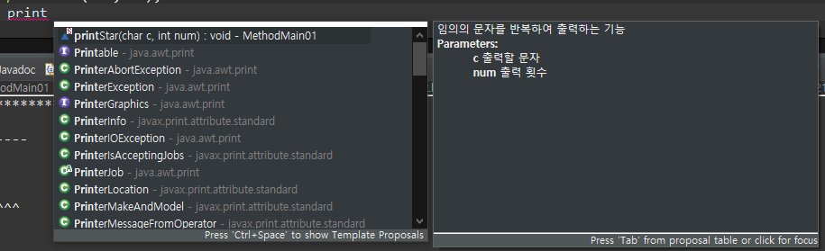
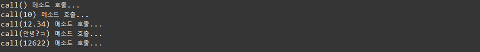
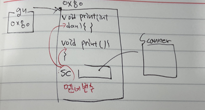

#### 3/15 키워드 복습

- class 개념(눈에 보이는 사물들을 추상화시키기 위해 class를 설계)
- class 만드는 이유
  - 실제 객체지향 프로그래밍은 객체간의 통신을 통해 어떠한 결과를 도출시키는데 이 객체를 만드는 기본적인 단위가 class이다. 
- 같은 기능이라도 목적에 따라 다르게 사용할 수 있고 유지보수가 쉽다. 
- 추상화 시킬 때는 2가지 형태로 표현할 수 있다
  - 멤버변수 : 추상화시킨 특징이 명사인 경우 
  - 메소드 : 동사(행위)인 경우
- new 키워드를 통해서 class를 이용한 인스턴스 객체를 생성
- 멤버변수들을 외부에서 직접적으로 접근할 수 없게 만드는게 유지보수 하기 쉽다. (은닉성) 


#### 3/16 과제 

- **Scanner의 next() 와 nextLine() 차이 확인**
  - next() : 공백을 기준으로 입력을 받는다. 즉, 띄어쓰기(=\\s)을 기준으로 입력을 받는다.
  - nextLine() : 한 라인을 기준으로 입력을 받는다. 즉, 개행문자(=줄넘김)(=\n)을 기준으로 입력을 받는다.
- **buffer**
  - 변수를 생성하면 일반적으로 램에 저장한다. 
  - 표준 입출력 장치로 RAM에 변수를 넣어주거나 RAM에 있는 변수를 볼 수 있다. 
  - RAM과 표준입출력 장치에서 데이터를 주고 받을 때 문자 단위(Byte)로 움직인다. 
  - 정수의 자리 수에 따라서 표준입출력장치와 RAM사이를 왔다갔다 하는 횟수가 다르다. 
  - 자리 수에 따라서 속도의 차이가 나는 것을 해결하기 위해서 왔다갔다 하는 횟수를 줄이는 방법을 선택. 즉, 움직이는 단위가 하나의 문자씩 움직이다가 중간에 buffer라는 장치를 통해서 buffer 단위로 입출력을 한다. (출력할 것을 모아놨다가 line나올 때까지 즉, enter가 나올 때까지)  
  - 그래서 표준입출력장치에서 buffer로 움직이는 단위를 line by line으로 움직이고 ram과 buffer는 char by char로 움직인다. 컴퓨터에서는 enter나올 때까지 입력 




- **buffer를 사용하는 개념**

  - nextInt를 실행해서 키보드 입력을 받을 때 먼저 buffer가 비어있는지 확인
  - 만약 비어있다면 키보드 입력을 받음(enter)가 나올 때까지
  - 정수 20을 입력하고 enter를 누르면 '2' '0' 'enter' 가 들어간다.
  - 그리고 숫자문자가 아니면 멈춘다. 그래서 공백에서 멈춘다.
  - 다음으로 입력을 받을 때 buffer를 확인한다. 그리고 공백이 있는 것을 확인하는데 정수 타입과 맞지 않으면 버린다.(공백만 버림) 즉, 공백을 없애버림
  - 그리고 다시 반복

   


```java
package kr.ac.kopo.day07;

import java.util.Scanner;

public class KeyboardTestMain {

	public static void main(String[] args) {
		Scanner sc = new Scanner(System.in); 
		
		
		System.out.println("정수 입력:");
		int num = sc.nextInt();
		
		//방법1.
		//sc.nextLine();
		
		//방법2.
		//int num = Integer.parseInt(sc.nextInt());
		
		System.out.println("문자열을 입력:");
		String str = sc.nextLine();
		
		System.out.println("str:" + str + ", num" + num);
		//int를 입력하고 enter를 누르면 buffer에 엔터가 들어가서
		//다음 nextLine은 string을 인식할 때 string이 엔터를 인식한다.
		//그래서 str 값이 나오지 않음
		
		// 방법1.
		//그래서 String 값을 입력받기 전에 buffer에서 공백을 지워주는 작업을 해준다.
		//즉, String을 입력 받기 전에 sc.nextLine();을 추가해야함 
		
		// 방법2.
		//정수를 입력하든 실수를 입력하든 무조건 문자열로 입력받음
		//buffer에 남아있는 것을 모두 없애주기 위해서 
		//그리고 int로 변환해줌
		//int num = Integer.parseInt(sc.nextInt()); //String을 정수로 변경
	}
}
```


--------------

#### 메소드

- **메소드(Method)**

  - 객체가 할 수 있는 행동을 정의
  - 클래스 안에다 정의를 해야함
  - 메소드의 이름을 소문자로 시작하는 것이 관례
  - 메소드는 수정에 대한 노가다를 줄여주기 위해서 나왔음 

  


- **메소드 선언**

  - 선언시 {} 안에 메소드가 해야 할 일을 정의

  


- **메소드 호출**

  - 호출한 메소드가 선언되어 있는 클래스를 접근한다.
  - 클래스객체.메소드 이름으로 호출
  - static이 메소드에 선언되어 있을 때는 클래스이름.메소드이름으로 호출
  - 메소드를 이용하면 수정하기 용이함

  ```java
  package kr.ac.kopo.day07;
  
  /*
      **********
      hello
      **********
      hi
      **********
      good-bye
      **********
   */
  
  public class MethodMain01 {
  	
  	//별을 찍는 메소드 생성
  	static void printStar() {
  		System.out.println("**********");
  	}
  	
  	public static void main(String[] args) {
  		printStar();
  		System.out.println("hello");
  		printStar();
  		System.out.println("Hi");
  		printStar();
  		System.out.println("Good-bye");
  		printStar();
  		
  	}
  }
  ```

  - printStar()는 메소드 안에 정의된 메소드는 실행되면 잠시 실행됐다가 실행이 끝나면 사라짐
  - main과 printStar에 같은 변수를 가지고 있어도 괜찮아 둘은 서로 독립적인 관계이므로 각각 따로 움직인다.

   

  - main 메소드를 호출자 메소드라고 부르고 printStar를 피호출자 메소드라고 부른다.
  - 반환값은 피호출자가 호출자에게 대화를 시도하기 위한 통로
  - 매개변수는 호출자가 피호출자에게 대화를 시도하기 위한 통로

  ```java
  package kr.ac.kopo.day07;
  
  /*
      **********
      hello
      **********
      hi
      **********
      good-bye
      **********
   */
  
  public class MethodMain01 {
  	
  	//별을 찍는 메소드 생성
  	/**
  	 * 임의의 문자를 반복하여 출력하는 메소드
  	 * @param c 출력할 문자
  	 * @param num 출력 횟수 
  	 */
  	static void printStar(char c, int num) {
  		for(int i=0;i<num;i++) {
  			System.out.print(c);
  		}
  		System.out.println();
  	}
  	
  	public static void main(String[] args) {
  		
  		printStar('*', 21);
  		System.out.println("hello");
  		printStar('-', 15);
  		System.out.println("Hi");
  		printStar('0', 5);
  		System.out.println("Good-bye");
  		printStar('^', 14);
  	}
  }
  ```

   

  - printStar()의 호출이 끝나면 num이 사라진다.
  - cf. 디버그 실행시 f6 : 세미콜론을 기준으로 한 줄씩 시작 f5 : 메소드 안으로 들어감 

  - 메소드 위에 문서화 주석을 달 수 있다.

   

  - 반환형이 참조자료형도 넘길 수 있다.

  ```java
  package kr.ac.kopo.day07;
  
  import kr.ac.kopo.day06.Car;
  
  /*
      **********
      hello
      **********
      hi
      **********
      good-bye
      **********
   */
  
  public class MethodMain01 {
  	
  	//별을 찍는 메소드 생성
  	
  	/**
  	 * 임의의 문자를 반복하여 출력하는 기능
  	 * @param c 출력할 문자
  	 * @param num 출력 횟수
  	 */
  	static Car printStar(char c, int num) {
  		for(int i=0;i<num;i++) {
  			System.out.print(c);
  		}
  		System.out.println();
  		
  		Car car = new Car();
  		return car;
  	}
  	
  	public static void main(String[] args) {
  		
  		printStar('*', 21);
  		System.out.println("hello");
  		printStar('-', 15);
  		System.out.println("Hi");
  		printStar('0', 5);
  		System.out.println("Good-bye");
  		printStar('^', 14);
  	}
  }
  ```

  

- **만약 여러 개의 값을 retrun 하고 싶다면?**

  - 배열 이용
  - 반환타입: String[]         이름: getSingerList         매개변수 : void

  ```java
  String[] getSingerList(){
  	String[] list = {"강남스타일", "명동스타일"};
  	retutn list;
  }
  ```

  

  - 반환타입: Singer[]         이름: getSingerList         매개변수 : String type

  ```java
  String[] getSingerList(String type){
  	Singer[] list = {new Singer("장윤정"), new Singer("태진아")} ; 
  }
  ```

  

- **오버로딩(Overloading)**

  - 같읕 클래스 내에 동명의 메소드이면서 매개변수의 개수 또는 타입이 다른 것
  - 리턴타입이 다르고 나머지가 같은 경우는 같은 메소드라고 인식한다. 리턴타입과는 상관이 없다. 

  ###### <Method.java>

  ```java
  package kr.ac.kopo.day07;
  
  /*
  	메소드 오버로딩(Overloading)
  	: 같읕 클래스 내에 동명의 메소드이면서 매개변수의 개수 또는 타입이 다른 것
  
   */
  
  public class Method {
  	void call() {
  		System.out.println("call() 메소드 호출...");
  	}
  	void call(int i) {
  		System.out.println("call("+ i + ") 메소드 호출...");
  	}
  	void call(double d) {
  		System.out.println("call("+ d + ") 메소드 호출...");
  	}
  	void call(String s) {
  		System.out.println("call("+ s + ") 메소드 호출...");
  	}
  }
  ```

  ###### <MethodMain02.java>

  ```java
  package kr.ac.kopo.day07;
  
  public class MethodMain02 {
  	
  	public static void main(String[] args) {
  		Method m = new Method();
  		m.call();
  		m.call(10);
  		m.call(12.34);
  		m.call("안녕?ㅋ");
  		m.call('ㅎ'); //error가 발생하지 않음 (묵시적 형변환이 일어나기 때문에)
          //int 로 따라감, 작은 것 먼저 들어감
  	}//main
  }
  ```

  


- 구구단 출력
  - 오버로딩을 사용해서 메소드 생성

###### <Gugudan.java>

```java
package kr.ac.kopo.day07;

import java.util.Scanner;

/**
 * 구구단과 관련된 여러가지 기능을 가지는 기능클래스
 * @author HP
 *
 */
public class Gugudan {
	
	int getDan(String str) { //몇 단인지 받아오기 메소드
		Scanner sc = new Scanner(System.in);
		System.out.println(str);
		int dan = sc.nextInt();
		sc.nextLine(); //buffer 비워주기 (숫자를 입력하고 엔터를 입력하면 엔터도 buffer에 들어간다.
		return dan;
	}
	
	void print(int dan) {
		for(int i=1;i<=9;++i) {
			System.out.println(dan + " * " + i + " = " + (dan*i));
		}
	}
	
	void print() { //all
		for(int i=2;i<=9;++i) {
			System.out.println(i + "단");
			this.print(i); //코드의 중복을 제거 (this는 생략할 수 있음)
			System.out.println();
		}
		
		//또는 
		//print(2,9);
	}
	
	void print(int start, int end) {
		for(int i =start; i<=end; ++i) {
			print(i);
			System.out.println();
		}
	}
}
```

###### <GugudanMain.java>

```java
package kr.ac.kopo.day07;


public class GugudanMain {

	public static void main(String[] args) {
		Gugudan g = new Gugudan();
		
		int dan = g.getDan("2 - 9 사이의 정수를 입력해봐 : ");
		
		g.print(dan); 
		g.print(); //all
		
		int startDan = g.getDan("시작 단을 입력 : ");
		int endDan = g.getDan("종료 단을 입력 : ");
		g.print(startDan, endDan);
	}
}
```

 


