#### 3/16 과제 풀이(day07 과제 풀이)

- **day07 1번**
  - Icecream에는 하나의 아이스크림만 받고 Icecream에서 받은 하나 하나의 아이스크림을 IcecreamMarket에서 여러 개의 아이스크림을 담는 배열을 작성

###### <Icecream.java>

```java
package kr.ac.kopo.day08.homework;

//day07 과제 풀이
public class Icecream {
	String name; //아이스크림 명
	int price; //아이스크림 가격
	
	void set(String n, int p) {
		name = n;
		price = p;
	}
	
	String getName() {
		return name;
	}
	int getPrice() {
		return price;
	}
}

```

###### <IcecreamMarket.java>

```java
package kr.ac.kopo.day08.homework;

import java.util.Scanner;

public class IcecreamMarket {
	Icecream[] iceArr ;
	Scanner sc = new Scanner(System.in);
	
	
	//int를 받는 메소드
	int inputInt(String msg) {
		System.out.println(msg);
		int num = sc.nextInt();
		sc.nextLine();
		return num;
	}
	
	//String을 받는 메소드
	String inputString(String msg) {
		System.out.println(msg);
		String str = sc.nextLine();
		return str;
	}
	
	void doSomething() {
		//손님이 아이스크림을 구매
		buy();
		
		//구매정보 출력
		info();
	}
	
	//아이스크림 몇 개 구매할 것인가?
	void buy() {
		int count = inputInt("아이스크림 몇 개 구매할래?");
		iceArr = new Icecream[count]; //아이스크림 정보 입력하는 배열 생성
		for(int i = 0 ; i<iceArr.length;++i) { //아이스크림 정보를 배열에 담기 
			System.out.println("*** "+ (i+1) + "번째 아이스크림 구매정보 입력 ***");
			String name = inputString("아이스크림 명" );
			int price = inputInt("아이스크림 가격: ");
			
			iceArr[i] = new Icecream(); 
			iceArr[i].set(name, price);
		}
	}
	
	void info() {
		System.out.println("< 총 " + iceArr.length + "개 구매정보 출력 >");
		System.out.println("번호\t아이스크림명\t아이스크림 가격");
		for(int i = 0; i<iceArr.length; ++i) {
			//System.out.println((i+1)+"\t"+iceArr[i].name+"\t"+iceArr[i].price);
			//메소드로 통신 하면 유지보수 하는 것이 더 쉽다.
			//그래서 웬만하면 멤버변수를 직접 접근하지 않는다.
			System.out.println((i+1)+"\t"+iceArr[i].getName()+"\t"+iceArr[i].getPrice());
		}
	}
	
}
```

###### <IcecreamMain.java>

```java
package kr.ac.kopo.day08.homework;

public class IcecreamMain {

	public static void main(String[] args) {
		IcecreamMarket market = new IcecreamMarket();
		market.doSomething();
	} //main
}
```

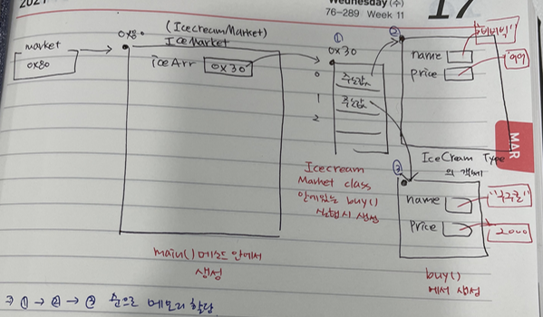 


--------

#### 생성자

- **생성자의 특징**

  - 생성자는 메소드와 비슷한 특징을 가지나 메소드는 아니다.
  - 클래스 명과 이름이 동일하다. (대문자로 시작)
  - 반환타입이 없다.

  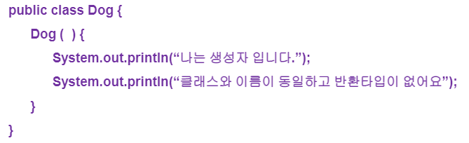

  - 생성자는 인스턴스 객체를 만들 때 생성이 된다. 
  
- 하나의 클래스를 만들 때 개발자가 정의한 생성자가 없다면 JVM이 자동으로 생성자를 만들어 준다. 
  
- 디폴트 생성자
  
    - 클래스 내에 생성자가 하나도 정의되어 있지 않을 경우 JVM이 자동으로 제공하는 생성자
  - 형태 : 매개변수가 없는 형태, 클래스명(){}
  
  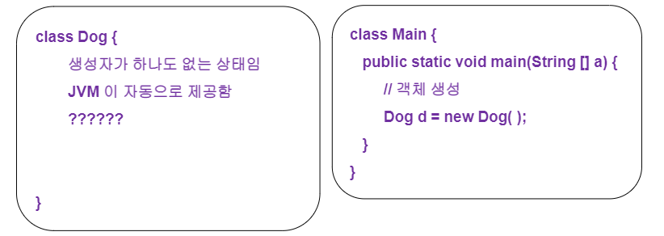
  
- 오버로딩을 지원한다.
  
  - 클래스 내에 메소드 이름이 같고 매개변수의 타입 또는 매수가 다른 것
  
  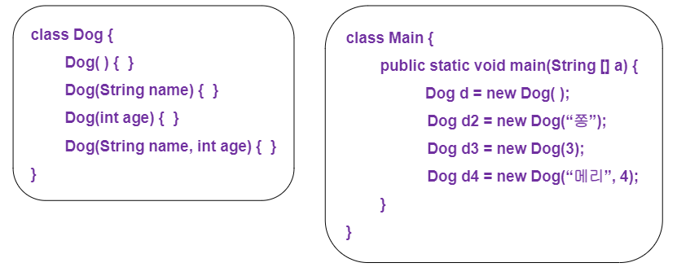
  
- 객체를 생성할 때 속성의 초기화를 담당하게 한다.
  
    - 멤버변수를 사용해서 이름을 정하면 보안 또는 유지보수 할 때 좋은 방법이 아닐 수 있다. 그래서 객체를 만들면서 이름과 나이를 정해준다. (생성할때부터 초기화)
  - 생성자를 하나 따로 만들었을 경우 JVM이 자동으로 디폴트 생성자를 만들지 않는다. 그래서 디폴트 생성자를 반드시 추가해줘야지 Error가 발생하지 않는다.
  

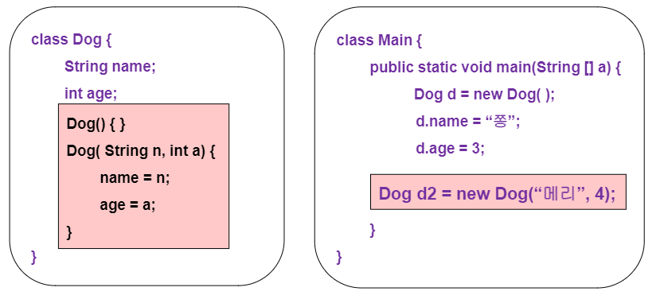

  - this의 활용 : static 영역에서는 사용이 불가하다.
    - 나와 똑같이 정의되어있는 class에 메소드를 호출하는 경우(this([인자값..]))
    - 내 객체에 있는 멤버변수를 접근하는 경우에 사용 가능(this.멤버변수)
    - 생성자는 new 키워드와 함께 사용해야 한다. 
    - 이미 호출된 생성자는 그 안에서 생성자를 다시 호출하고 싶을 때는 this (이미 만들어진 것을 사용할 때는)
  - 생성자 내에서 첫 번째 구문에 위치해야 한다.

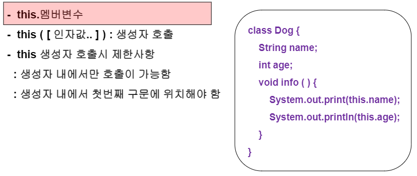

  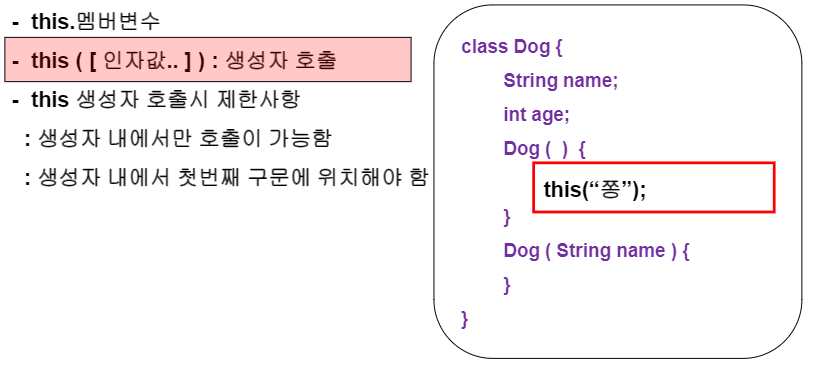


- **생성자의 목적**
  - 멤버변수의 값을 초기화하기 위함
  - 인스턴스 객체를 생성할 때 멤버변수가 자동으로 초기화가 된다. (o or false or null) 그러나 내가 원하는 임의의 값으로 멤버변수를 초기화할 수 있다.


- **예**

###### <Car2.java>

```java
package kr.ac.kopo.day08;
/*
 * 생성자의 특징
 * 1. 클래스 명과 동일
 * 2. 반환형이 존재하지 않는다.
 * 3. 디폴트 생성자를 지원
 * 4. 생성자 오버로딩 지원
 * 5. 객체의 초기화 담당
 */
public class Car {
	Car(){ //디폴트 생성자(생성자를 만들었지 않았을 경우 자동으로 생성)
		System.out.println("Car() 디폴트 생성자 호출");
	} 
	
	Car(String s){
		System.out.println("Car(String) 생성자 호출");
	}
	
	Car(int i, String s){
		System.out.println("Car(int, String) 생성자 호출");
	}
	
	void Car() { //이건 메소드이다.(클래스명과 동일한) - 메소드는 소문자로 적어야 한다.
		System.out.println("일반 메소드 Car() 호출");
	}
}

```


###### <CarMain.java>

```java
package kr.ac.kopo.day08;

public class CarMain {

	public static void main(String[] args) {
		Car c1 = new Car();
		Car c2 = new Car("소나타");
		Car c3 = new Car(1000,"모닝");
		c1.Car(); //Car() 메소드 호출
	}

}

```

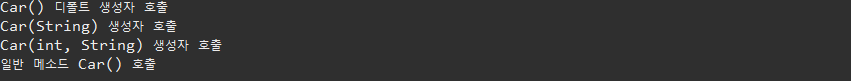


------

- **객체 초기화 예**

###### <Member.java>

```java
package kr.ac.kopo.day08;

public class Member {
	String name ;
	int age;
	String bloodType;
	
	//생성자는 멤버변수와 메소드 사이에 넣는다.
	Member(){ //매개변수가 없는 생성자
		name = "알 수 없음";
		age = -1;
		bloodType = "알 수 없음";
	}
	
	Member(String name){ //this.멤버변수
		this.name = name;
		this.age = -1;
		this.bloodType = "알 수 없음";
		
	}
	
	Member(String name, int age){ //this.멤버변수
		this.name = name;
		this.age = age;
		this.bloodType = "알 수 없음";
		
	}
	
	Member(String name, int age, String bloodType){ //this.멤버변수
		this.name = name;
		this.age = age;
		this.bloodType = bloodType;
	}
	
	void info() {
		System.out.println("이름 : " + name + ", 나이: " + age + ", 혈액형 : " + bloodType);
	}
}

```


###### <ConstructorMain02.java>

```java
package kr.ac.kopo.day08;

public class ConstructorMain02 {
	
	public static void main(String[] args) {
		Member m1 = new Member();
		Member m2 = new Member("홍길동");
		Member m3 = new Member("홍길동", 20);
		Member m4 = new Member("홍길동", 33, "AB");
		
		
		m1.info();
		m2.info();
		m3.info();
		m4.info();
	}

}

```


- **위의 방법으로 하면 알 수 없음이 여러개이고, 만약 알 수 없음을 다른 값으로 수정하고 싶을 때 번거로움이 발생**
  - new를 통해 객체가 만들어진 상태에서는 this를 사용한다.
  - this를 사용하면 {가 시작될 때 바로 this를 입력해야 한다. (맨 위에 줄에 입력) 
  - this는 하나의 생성자 안에서는 하나만 사용할 수 있다.

###### <ConstructorMain02.java>

```java
package kr.ac.kopo.day08;

public class Member {
	String name ;
	int age;
	String bloodType;
	
	//생성자는 멤버변수와 메소드 사이에 넣는다.
	Member(){ //매개변수가 없는 생성자
		this("알 수 없음",-1,"알 수 없음");
	}
	
	Member(String name){ //this.멤버변수
		this(name, -1,"알 수 없음");
	}
	
	Member(String name, int age){ 
		this(name,age,"알 수 없음") ; 
	}
	
	Member(String name, int age, String bloodType){ //this.멤버변수
		this.name = name;
		this.age = age;
		this.bloodType = bloodType;
	}
	
	void info() {
		System.out.println("이름 : " + name + ", 나이: " + age + ", 혈액형 : " + bloodType);
	}
}
```


- 위의 코드를 보면 2개 매개변수를 받아도 3개의 변수를 모두 호출하므로 1개의 매개변수 일 때는 2개의 매개변수가 호출될 수 있도록 코드를 수정한다. (2개짜리 매개변수를 호출해도 결국 3개짜리의 매개변수를 호출한다.) - 나중에 수정에 용이하도록 코드 수정
  - 생성자를 계속 호출하므로 속도는 더 느리다.

```java
package kr.ac.kopo.day08;

public class Member {
	String name ;
	int age;
	String bloodType;
	
	//생성자는 멤버변수와 메소드 사이에 넣는다.
	Member(){ //매개변수가 없는 생성자
		this("알 수 없음");
	}
	
	Member(String name){ //this.멤버변수
		this(name, -1);
	}
	
	Member(String name, int age){ 
		this(name,age,"알 수 없음") ; 
	}
	
	Member(String name, int age, String bloodType){ //this.멤버변수
		this.name = name;
		this.age = age;
		this.bloodType = bloodType;
	}
	
	void info() {
		System.out.println("이름 : " + name + ", 나이: " + age + ", 혈액형 : " + bloodType);
	}
}
```

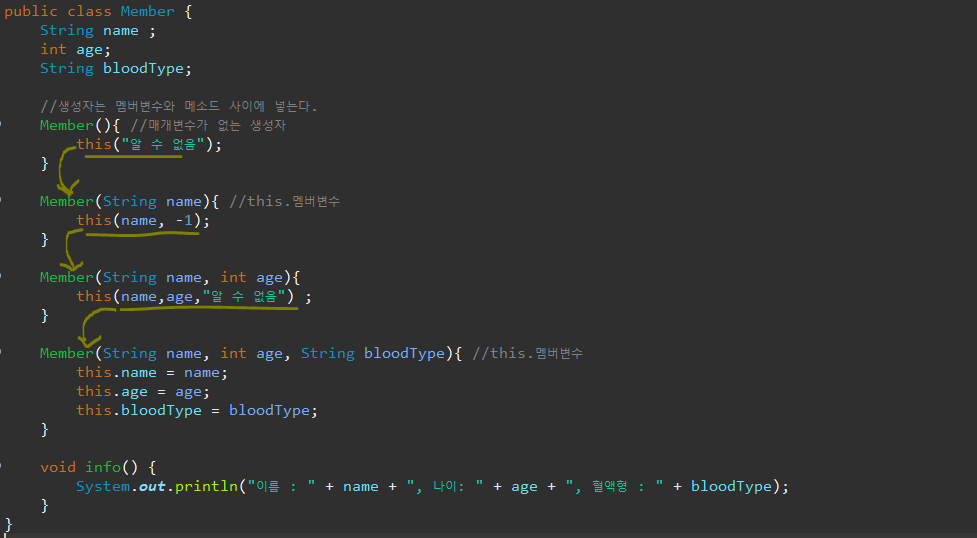


#### Java 문자열과 API 사용법

- **문자열 정의**
  - 자바에서는 문자열을 객체로 취급(레퍼런스 타입은 모두 객체로 취급)
  - java.lang 패키지에 포함
    - 패키지가 서로 다른 class에서 사용하더라도 import하지 않아도 사용 가능하다.
  - java.lang.String, StringBuffer, StringBuilder 클래스 제공
    - 문자열을 저장하기 위한 클래스들 
    - String 클래스 : 한 번에 생성된 다음 변하지 않는 문자열에 사용(내가 만든 값을 수정할 수 없음. 즉, 다시 공간을 할당하여 그 공간을 가르키는 것임. 즉, 읽기 전용임)
    - StringBuffer 클래스 : 계속하여 변할 수 있는 문자열에 사용, 동기화 작용
    - StringBuilder 클래스 : 계속하여 변할 수 있는 문자열에 사용, 비동기화
    - 속도는 StringBuffer, StringBuilder가 더 빠르다.


- **construct (String class의 생성자)**

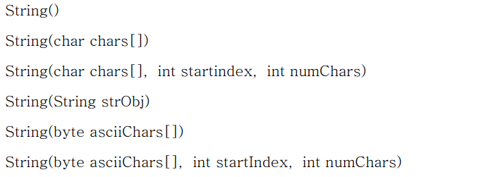


- **String**

```java
package kr.ac.kopo.day08;

public class StringMain01 {

	public static void main(String[] args) {
		String str = new String();
		char[] chars = {'a','b','c','d','e','f'};
		String str2 = new String(chars);
		String str3 = new String(chars,1,3);
		byte[] bytes = {97,98,99,100,101};
		String str4 = new String(bytes);
		String str5 = new String("Hello");
		String str6 = "Hello" ; 
		
		System.out.println("str : [" + str + "]");
		System.out.println("str : [" + str2 + "]");
		System.out.println("str : [" + str3 + "]");
		System.out.println("str : [" + str4 + "]"); //유니코드
		System.out.println("str : [" + str5 + "]");
		System.out.println("str : [" + str6 + "]"); //str5, str6은 다르다.
	}

}
```

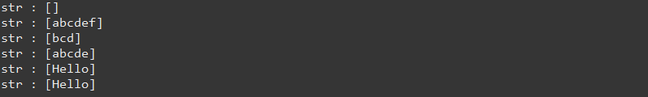


- **String s = new String("Hello"); 와 String s = "Hello" 의 차이점**

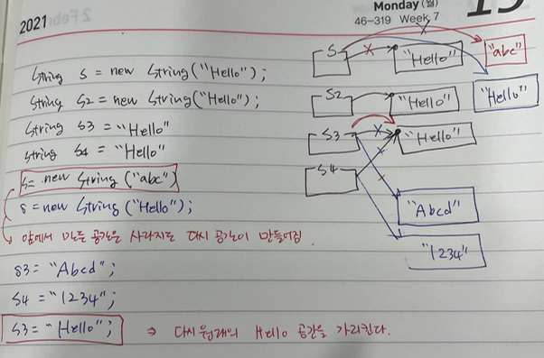 


- **문자열 길이**

  - String에서는 length() 가 메소드이다.

  


- **문자열 추출**
  - 문자열.charAt(idx); : 문자열 중에서 i번째 문자를 반환


```java
package kr.ac.kopo.day08;

import java.util.Scanner;

public class StringMain02 {

	public static void main(String[] args) {
		String str = "Hello World" ;
		System.out.println("[" + str + "]의 길이 : " + str.length());
		System.out.println("0번째에 위치한 문자 : " + str.charAt(0));
		System.out.println("7번째에 위치한 문자 : " + str.charAt(7)); //charAt은 return형이 char
		
		Scanner sc = new Scanner(System.in);
		System.out.println("문자를 입력 : ");
		//sc.nextLine();는 return형이 ""
		char c = sc.nextLine().charAt(0); //문자열에서 하나의 문자를 입력받는 방법
		
		//char 배열을 문자열로 바꾸기
		char[] chars = {'h','e','l','l','o'};
		String str1 = new String(chars);
		
		//문자열을 char 배열에 넣기
		String str2 = "hello";
		char[] chars2 = new char[str.length()];
		//방법1.
		str2.getChars(0, str2.length(), chars, 0);
		//방법2.
		for(int i=0;i<str.length();++i) {
			chars[i] = str.charAt(i);
		}
		
		//3번지부터 9번지까지만 배열에 저장하는 방법
		str2.getChars(3, 9, chars2, 0);
	}
}
```

