#### 인터페이스(interface)

- abstract를 사용한 부모 class에서 자식 class에 extends를 사용하여 상속을 받으면 부모 클래스 안에 있는 모든 추상 메서드를 오버라이딩 해야함. 그러나 각 자식 클래스마다 기능이 다를 수 있으므로 필요한 메서드만 사용하기 위해서 인터페이스를 사용하면 된다.
  - 기능의 확장성을 위한 것이 인터페이스이다. 클래스의 자체에 규모가 커졌다가 작아졌다를 편리하게 해준다.  
  - 인터페이스는 기능의 집합이고 추상 메서드의 집합이다. 그리서 멤버변수가 들어올 수 없고 상수변수만 들어올 수 있다.  
  - 추상클래스는 구현된 메서드와 추상 메서드, 멤버변수를 모두 가질 수 있다. 인터페이스는 추상 메서드만 있어야 한다.
  - 추상클래스는 동일한 부모를 가지는 클래스를 묶는 개념으로 상속을 받아서 기능을 확장시키는 것이 목적이다.
  - 인터페이스는 구현 객체가 같은 동작을 한다는 것을 보장하는 것이 목적이다. 


- **정의** 

  - 완벽한 추상화된 객체
  - 반즘 완성된 객체
  - 설계도
  - 기능에 대한 추가 (클래스 안에 기능을 넣다 뺐다를 할 수 있도록 인터페이스를 구현)

  

- **특징**

  - interface 키워드를 이용하여 선언
    - 왜 인터페이스를 사용하나 ? ? 추상 클래스 간의 상속은 단일 상속만 가능했다. 다른 것을 추가해서 확장시킬 수 없었다. 그래서 부모에게 추가시키거나 부모의 부모에 올리는 방식을 사용했어야 했는데, 인터페이스 경우는 **다중 상속**을 지원한다.

  ```java
  interface ServerConstants{}
  ```

  - 선언되는 변수는 모두 상수로 적용
    - 인터페이스에 public static final을 사용해서 변수를 정의하지 않아도 자동으로 이렇게 만들어짐.

  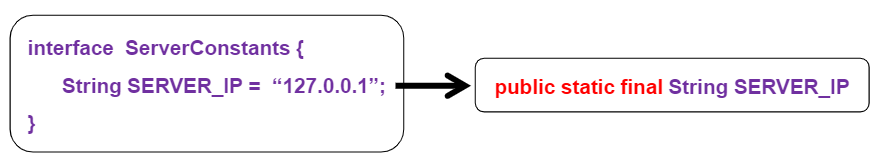

  - 선언되는 메서드는 모두 추상 메서드로 적용
    - 인터페이스 안에 있는 추상 메서드는 무조건 public 이어야한다. 접근제한자를 바꿀 수 없다. 
    - public abstract를 붙이지 않아도 사용할 수 있다. 붙이지 않아도 인터페이스를 해석하는 JVM이 public abstract가 붙어있다고 인지한다.

  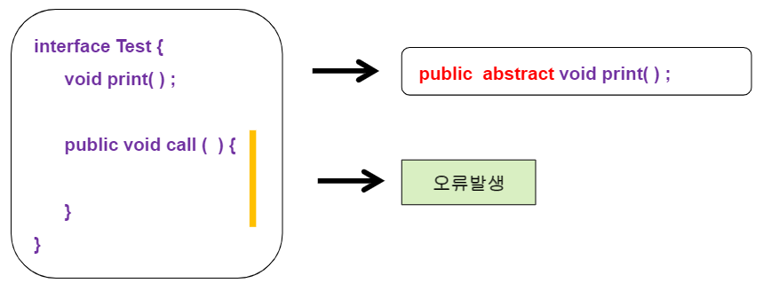

  - 객체 생성이 불가능(추상 클래스와 동일한 특성)
    - 추상메서드이므로
    - 인터페이스를 상속받은 클래스에서 객체 생성하면 된다. 

  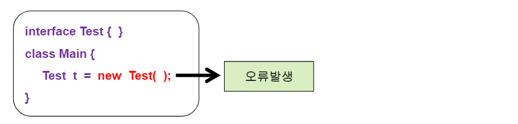

  - 클래스가 인터페이스를 상속할 경우에는 extends 키워드가 아니라 implements 키워드를 이용한다.

  - 인터페이스를 상속받는 하위클래스는 추상메서드를 반드시 오버라이딩(재정의)해야한다.
    - **인터페이스 안에는 public 이 생략되어도 public으로 인식하지만 일반 class에서는 public이 생략되면 안 된다.**  **(중요!!!)**

  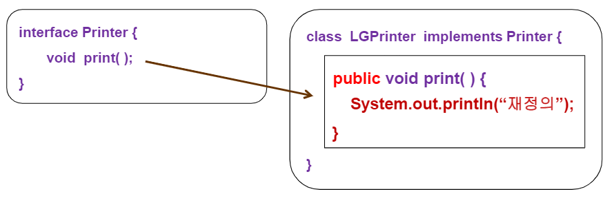

  - 인터페이스 객체변수는 하위클래스를 이용함

  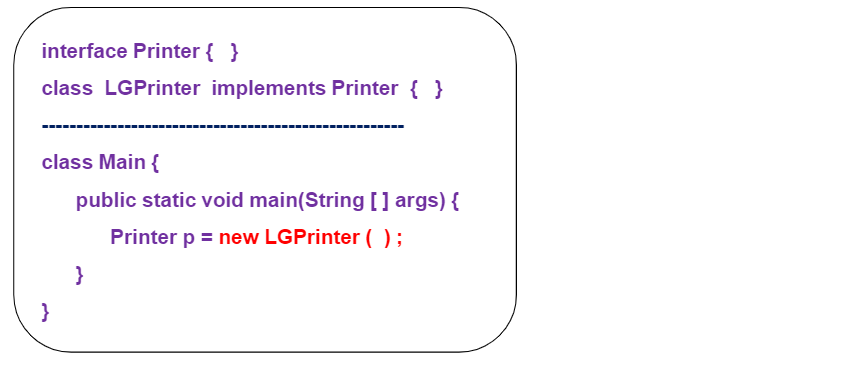

  

- **예**
  - 삼성티비와 엘지티비의 기능 메서드 명이 다른 경우 

###### <kr.ac.kopo.day12.inter01.SamsungTV>

```java
package kr.ac.kopo.day12.inter01;

public class SamsungTV {
	
	private boolean power;
	private int channerNo;
	private int volumSize;
	
	public SamsungTV() {
		power = false;
		channerNo = 3;
		volumSize = 6;
		System.out.println("삼성 티비를 구매하였습니다.");
	}
	
	public void powerOn() {
		System.out.println("전원을 켭니다.");
	}
	
	public void powerOff() {
		System.out.println("전원을 끕니다.");
	}
	
	public void channerUp() {
		System.out.println("채널을 올립니다.");
	}
	
	public void channerDown() {
		System.out.println("채널을 내립니다.");
	}
	
	public void volumeUp() {
		System.out.println("볼륨을 올립니다.");
	}
	
	public void volumeDown() {
		System.out.println("볼륨을 내립니다.");
	}
}
```


###### <kr.ac.kopo.day12.inter01.LGTV>

```java
package kr.ac.kopo.day12.inter01;

public class LGTV {
	public LGTV() {
		System.out.println("LGTV를 구매하였습니다.");
	}
	
	public void turnOn() {
		System.out.println("티비 전원 on...");
	}
	
	public void turnOff() {
		System.out.println("티비 전원 off...");
	}
	
	public void channerUp() {
		System.out.println("channerUp...");
	}
	
	public void channerDown() {
		System.out.println("channerDown...");
	}
	
	public void soundUp() {
		System.out.println("soundUp...");
	}
	
	public void soundDown() {
		System.out.println("soundDown...");
	}
}
```


###### <kr.ac.kopo.day12.inter01.UserMain>

```java
package kr.ac.kopo.day12.inter01;

public class UserMain {

	public static void main(String[] args) {
		//삼성과 엘지 기능 메서드 명이 다르다.
        //그러나 기능은 동일 
        SamsungTV sam = new SamsungTV();
		sam.powerOn();
		sam.powerOff();
		sam.channerUp();
		sam.channerDown();
		sam.volumeDown();
		sam.volumeUp();
		
		LGTV lg = new LGTV();
		lg.turnOff();
		lg.turnOn();
		lg.channerUp();
		lg.channerDown();
		lg.soundDown();
		lg.soundUp();
	}
}
```

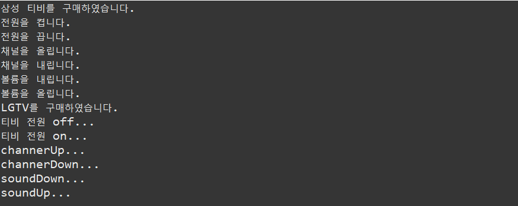


--------------

- 위의 엘지티비와 삼성티비가 기능 메서드 명은 다르지만 같은 기능이다. 그래서 이를 해결하기 위해서 인터페이스로 이름을 정의하고 각 브랜드마다 같은 메서드명으로 기본적인 기능을 수행할 수 있도록 한다. 
  - 기능의 표준화는 인터페이스로 받는 것이 더 좋음
  - 상속 클래스인 경우는 기능의 확장임(ex. 티비의 종류는 삼성티비, 엘지티비 등이 있다는 것을 정해놓는 것은 상속 클래스를 사용하는 것임)


###### <kr.ac.kopo.day12.inter02.TV>

```java
package kr.ac.kopo.day12.inter02;

public interface TV {
	public final static int MAX_VOLUME_SIZE = 50; //인터페이스는 상수변수만
	//public final static은 생략해도 된다.
	int MIN_VOLUME_SIZE = 0;
	
	public abstract void powerOn();
	void powerOff();
	void channerUp();
	void channerDown();
	void soundUp();
	void soundDown();
	void mute();
}
```


###### <kr.ac.kopo.day12.inter02.SamsungTV>

```java
package kr.ac.kopo.day12.inter02;

public class SamsungTV implements TV{
	//생성자
	public SamsungTV() {
		System.out.println("삼성티비 구매 완료...");
	}
	
	kr.ac.kopo.day12.inter01.SamsungTV sam = new kr.ac.kopo.day12.inter01.SamsungTV();
	@Override
	public void powerOn() {
		sam.powerOn();
	}

	@Override
	public void powerOff() {
		sam.powerOff();
	}

	@Override
	public void channerUp() {
		sam.channerUp();
	}

	@Override
	public void channerDown() {
		sam.channerDown();
	}

	@Override
	public void soundUp() {
		sam.volumeUp();
	}

	@Override
	public void soundDown() {
		sam.volumeDown();
	}

	@Override
	public void mute() {
		System.out.println("음소거 중입니다.");
	}
}
```


###### <kr.ac.kopo.day12.inter02.LGTV>

```java
package kr.ac.kopo.day12.inter02;


public class LGTV implements TV {
	
	public LGTV() {
		super();
		System.out.println("엘지티비 구매 완료...");
	}
	
	kr.ac.kopo.day12.inter01.LGTV lg = new kr.ac.kopo.day12.inter01.LGTV();
	@Override
	public void powerOn() {
		lg.turnOn();
	}

	@Override
	public void powerOff() {
		lg.turnOff();
	}

	@Override
	public void channerUp() {
		lg.channerUp();
	}

	@Override
	public void channerDown() {
		lg.channerDown();
	}

	@Override
	public void soundUp() {
		lg.soundUp();
	}

	@Override
	public void soundDown() {
		lg.soundDown();
	}

	@Override
	public void mute() {
		System.out.println("음소거 중입니다.");
	}
}
```


###### <kr.ac.kopo.day12.inter02.UserMain>

- **다형성**
  - 하나의 메서드로 여러 곳에서 사용

```java
package kr.ac.kopo.day12.inter02;

public class UserMain {

	public static void main(String[] args) {
		TV tv = new SamsungTV();
		//TV tv = new LGTV();
		tv.channerDown();
		tv.channerUp();
		tv.soundDown();
		tv.soundUp();
		tv.powerOff();
		tv.powerOn();
		tv.mute();
	}
}
```

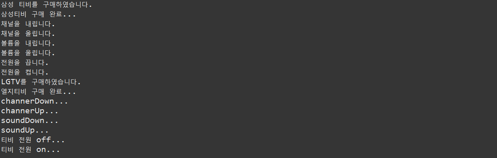

###### 

--------------------

- **생성자를 이용해서 초기 값 설정해주고 각 기능 메서드 실행 시 변수 값 변경**

###### <kr.ac.kopo.day12.inter02.SamsungTV>

```java
package kr.ac.kopo.day12.inter02;

public class SamsungTV implements TV{
	
	private String modelName;
	private boolean power;
	private int volumeSize;
	private int channelNo;
	private boolean muteToggle;
	private int currentVolumeSize;
	
	//생성자
	public SamsungTV() {
		System.out.println("삼성티비 구매 완료...");
		modelName = "삼성TV";
		power = false;
		volumeSize = 10;
		channelNo = 30;
		muteToggle = false; //인스턴스 객체를 만들면 
							//알아서 false로 되기 때문에 안 써도 된다.
	}
	
	kr.ac.kopo.day12.inter01.SamsungTV sam = new kr.ac.kopo.day12.inter01.SamsungTV();
	@Override
	public void powerOn() {
		power = true;
		sam.powerOn();
	}

	@Override
	public void powerOff() {
		power = false;
		sam.powerOff();
		info();
	}

	@Override
	public void channerUp() {
		sam.channerUp();
		++channelNo;
		if(channelNo == 101) {
			channelNo = 1;
		}
		info();
	}

	@Override
	public void channerDown() {
		sam.channerDown();
		--channelNo;
		if(channelNo == 0) {
			channelNo = 100;
		}
		info();
	}

	@Override
	public void soundUp() {
		sam.volumeUp();
		if(muteToggle) { //음소거 중
			volumeSize = currentVolumeSize;
			muteToggle = false;
		}
		if(volumeSize < TV.MAX_VOLUME_SIZE) {
			++volumeSize;
		}
		info();
	}

	@Override
	public void soundDown() {
		sam.volumeDown();
		if(volumeSize < TV.MIN_VOLUME_SIZE) {
			--volumeSize;
		}
		info();
	}

	@Override
	public void mute() {
		if(muteToggle) { 
			System.out.println("음소거 해제");
			volumeSize = currentVolumeSize;
			info();
		}else {
			System.out.println("음소거 중...");
			currentVolumeSize = volumeSize;
			volumeSize = TV.MIN_VOLUME_SIZE;
			info();
		}
		muteToggle = !muteToggle;
	}
	
	//내부에서만 info()를 사용하면 private로 설정하면 된다.
	private void info() {
		System.out.println("채널 번호 : " + channelNo + ", 음량크기 : " + volumeSize);
	}
}
```


-------

#### final

- **final 3가지 사용법**

  - 변수 : 상수
    - final이 붙으면 할당 금지(수정 안 됨)
  - 메서드 : 오버라이딩 금지

  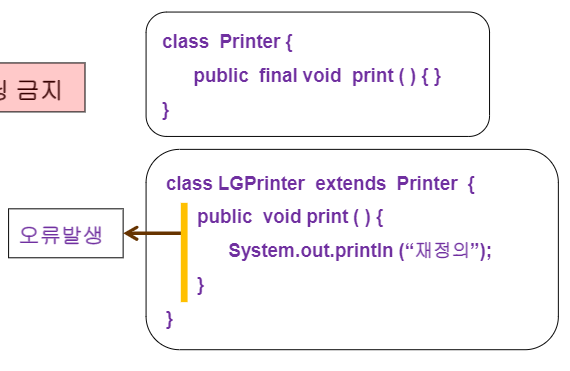

  - 클래스 : 상속을 금지
    - 클래스에 final이 붙으면 부모 클래스가 될 수 없음

  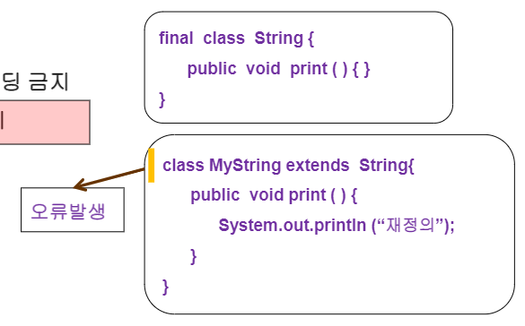

- **예**

###### <kr.ac.kopo.day12.FinalMain>

```java
package kr.ac.kopo.day12;

import java.util.Random;

/*final*/ class Super { 
	
	private /* final */ int MAX = 100;
	
	public /* final*/ void info() {
		System.out.println("Super 클래스에서 정의된 메소드...");
		MAX = 50; //MAX가 final이면 값을 수정할 수 없음
	}

}

class Sub extends Super { //Super 클래스가 final 이면 상속 못 받음
	@Override
	public void info() { 
		System.out.println("Sub 클래스에서 재정의된 메소드...");
        //Super의 info 메서드가 final이면 override 할 수 없음
	}
}


public class FinalMain {

	public static void main(String[] args) {
	}

}
```


- **1부터 n까지 랜덤 수를 추출하는 클래스를 생성**

###### <kr.ac.kopo.day12.FinalMain>

```java
class MyRandom extends Random {
	/**
	 * bound가 10일 대 1 ~ 10사이의 난수 추출
	 * @param bound 난수 범우
	 * @return 1 ~ bound 사이의 난수 
	 */
	@Override
	public int nextInt(int bound) {
		return super.nextInt(bound) + 1;
	}
	
}

//String class는 final class라서 상속받을 수 없다.
//class MyString extends String {
//	
//}

public class FinalMain {

	public static void main(String[] args) {
		/*
		 * 1 ~ 100 사이의 난수를 발생시켜 출력하는 코드를 작성
		 */
		Random r = new MyRandom();
		int random = r.nextInt(2);
		System.out.println("추출된 정수 값은 : " + random);
	}
}
```


- interface와 interface 끼리의 상속은 extends => 규모가 커지는 것이므로
  - 같은 type 끼리의 상속은 extends 


- 만약, 다 만들어진 interface인 TV 클래스 안에 copyright 메서드를 넣고 싶다면?
  - 원래 인터페이스는 추상 메서드만 가져야 한다. 전부 설계한 클래스 안에서 유지보수할 때 구현된 메서드를 추가해야하는 상황에서 설계도가 다 바뀔 문제를 대비하여 인터페이스도 일반 메서드를 가질 수 있도록 추가됨 (jdk1.8 버전 때) 
  - 인터페이스에서 메서드 앞에 default를 넣으면 구현된 메서드를 사용할 수 있다. (접근 제한자의 default와는 다르다.)
  - 원래 구현된 메서드만 가져야하는데 유지보수시 어쩔 수 없이 추가되어야 하는 상황에서만 사용한다. (설계 시 default를 사용하면 안 됨)


###### <kr.ac.kopo.day12.inter02TV.>

```java
package kr.ac.kopo.day12.inter02;

public interface TV {
	public final static int MAX_VOLUME_SIZE = 50; //인터페이스는 상수변수만
	//public final static은 생략해도 된다.
	int MIN_VOLUME_SIZE = 0;
	
	public abstract void powerOn();
	void powerOff();
	void channerUp();
	void channerDown();
	void soundUp();
	void soundDown();
	void mute();
    
    //인터페이스 안에 default를 이용한 구현된 메서드를 넣음
	default void copyright() {
		System.out.println("모든 기술은 tv 협회에 귀속됩니다.");
	}
}
```


-----

#### 예외처리

- **예외 정의**
  - 프로그램이 실행되는 동안에 발생하는 예기치 않은 에러
  - 예외는 컴파일 시점(checked exception)과 실행 시점(runtime error)으로 나눌 수 있음
    - 컴파일 시점 
      - ex. 코드를 작성할 때 a.txt파일에 관련한 코드를 작성했을 때 만약 a.txt의 파일이 없는 경우 프로그램이 제대로 동작하지 않으니 예외처리 하라는 메시지가 나오는 것이 컴파일 시점 에러
      - 1:1 대화에서 한 명이 접속하지 않았을 경우 문제가 발생할 수 있으니 예외처리 해야하는 것을 알려주는 것이 컴파일 시점의 예외
  - 예외가 발생하는 예
    - 정수를 0으로 나누는 경우
    - 배열의 첨자가 음수 또는 범위를 벗어나는 경우
  - 자바 언어는 프로그램에서 예외를 처리할 수 있는 기법을 제공
  - 발생할 수 있는 예외를 클래스로 정의
  - 문제가 발생 시 소프트웨어가 강제적으로 종료되지 않고 문제가 있는 문장을 제외하고 계속 실행될 수 있도록 예외처리를 진행한다.


- **예외 클래스**

  - JVM이 갑자기 멈춤으로 발생하는 것을 에러

  - 개발자의 코드 실수로 발생하는 것이 예외

    

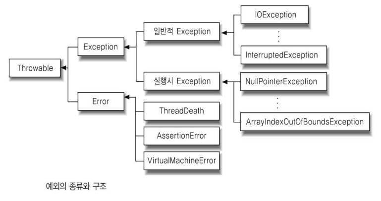


- **예외관련 키워드(꼭 기억해야 할 키워드 5가지)**
  - 사용자 정의 예외처리 : 원래는 예외는 아니지만 사용자가 지정한 예외 

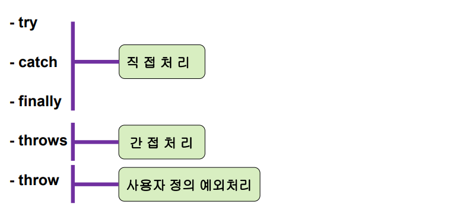


- **예외처리**

  - **직접처리**

    - 개발자가 처리할 수 있는 부분은 if로 잡아낼 수 있지만 예기치 못한 것은 try ~ catch
    - try : 예외가 발생할만한 코드를 기술하는 부분
    - catch : try 블럭에서 예외가 발생하면 예외를 처리하는 부분
      - try에서 예외가 발생하지 않으면 catch를 실행하지 않음
    - finally : 예외 발생여부와 상관없이 무조건 실행하는 부분

    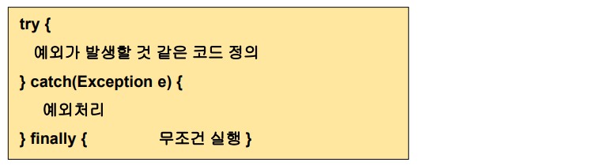

    

- **예외처리 진행 순서** 

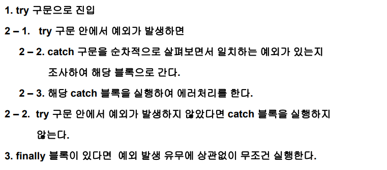


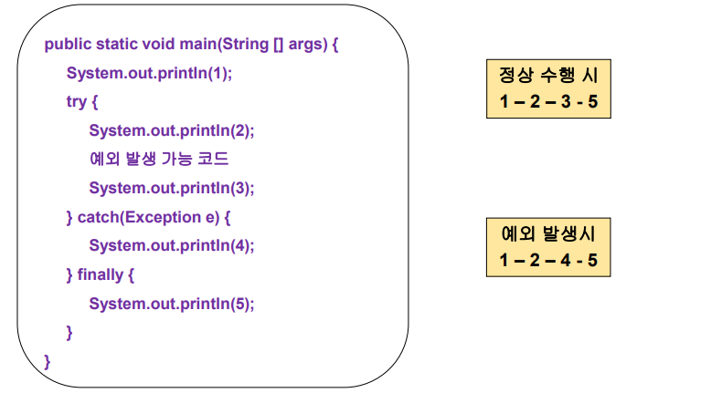


- throws

  - 메서드 내에서 발생된 예외를 자신이 직접 처리하는 것이 아니라 자신을 호출한 쪽으로 예외처리를 떠넘기는 역할을 하는 키워드

  

- **예**

###### <kr.ac.kopo.day12.ExceptionMain01>

```java
package kr.ac.kopo.day12;

import java.util.Random;

public class ExceptionMain01 {

	public static void main(String[] args) {
		System.out.println("main start...");
		
		Random r = new Random();
		int num = r.nextInt(3); //0 - 2 난수 발생
		System.out.println("num : " + num);
		
		System.out.println(10 / num);
		
		System.out.println("main end...");
	}
}
```

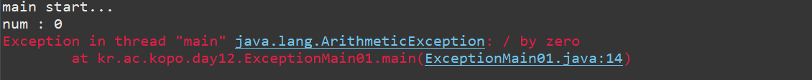

- JVM이 예외발생 상황을 알려줌.
  - 예외 발생하면서 종료되고 그 아래의 명령문은 실행되지 않음


- 예외처리

###### <kr.ac.kopo.day12.ExceptionMain01>

```java
package kr.ac.kopo.day12;

import java.util.Random;

public class ExceptionMain01 {

	public static void main(String[] args) {
		System.out.println("main start...");
		
		Random r = new Random();
		int num = r.nextInt(3); //0 - 2 난수 발생
		System.out.println("num : " + num);
		try {
			System.out.println(10 / num);			
		}catch(ArithmeticException ae) { //ArithmeticException이 발생하면 catch가 일을 처리
			System.out.println("catch 블럭 진입...");
			System.out.println("원인 : " + ae.getMessage());; //에러 원인
			//getMessage()를 보고 message라는 private 멤버변수가 있다는 것을 알 수 있다.
			ae.printStackTrace();; //문제가 발생된 것에 대한 메서드를 볼 수 있다.
		}finally {
			System.out.println("main end...");			
		}
		
	}
}
```

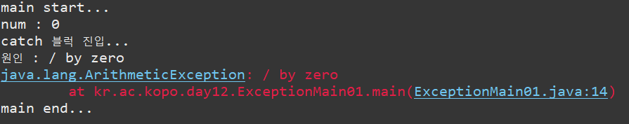


- **다른 예외 상황**
  - catch를 여러개 만들 수 있다.
  - num이 0이라도 그 아래줄은 실행하지 않아서 ArithmeticException은 발생하지 않는다.

###### <kr.ac.kopo.day12.ExceptionMain01>

```java
package kr.ac.kopo.day12;

import java.util.Random;

public class ExceptionMain01 {

	public static void main(String[] args) {
		System.out.println("main start...");
		
		Random r = new Random();
		int num = r.nextInt(3); //0 - 2 난수 발생
		System.out.println("num : " + num);
		
		String str = null;
		
		try {
			System.out.println("첫 번째 문자 : " + str.charAt(0));
			System.out.println(10 / num);			
		}catch(ArithmeticException ae) { //ArithmeticException이 발생하면 catch가 일을 처리
			System.out.println("catch 블럭 진입...");
			System.out.println("원인 : " + ae.getMessage());; //에러 원인
			//getMessage()를 보고 message라는 private 멤버변수가 있다는 것을 알 수 있다.
			ae.printStackTrace();; //문제가 발생된 것에 대한 메서드를 볼 수 있다.
		}catch (NullPointerException ne){ 
			System.out.println("NullPointerException 진입....");
		}finally {
			System.out.println("main end...");			
		}
		
	}
}
```

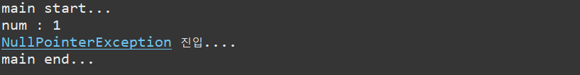


###### <kr.ac.kopo.day12.ExceptionMain01>

- 예외처리 묶기

```java
package kr.ac.kopo.day12;

import java.util.Random;

public class ExceptionMain01 {

	public static void main(String[] args) {
		System.out.println("main start...");
		
		Random r = new Random();
		int num = r.nextInt(3); //0 - 2 난수 발생
		System.out.println("num : " + num);
		
		String str = null;
		
		try {
			System.out.println("첫 번째 문자 : " + str.charAt(0));
			System.out.println(10 / num);			
		}catch(ArithmeticException | NullPointerException e) { //ArithmeticException이 발생하면 catch가 일을 처리
			System.out.println("catch 블럭 진입...");
			System.out.println("원인 : " + e.getMessage());; //에러 원인
			//getMessage()를 보고 message라는 private 멤버변수가 있다는 것을 알 수 있다.
			e.printStackTrace();; //문제가 발생된 것에 대한 메서드를 볼 수 있다.
			System.out.println("NullPointerException 진입....");
		}
		System.out.println("main end...");			
		
		
	}
}
```

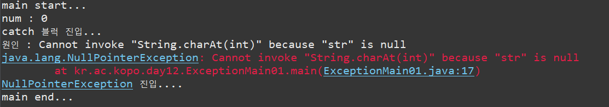


- **예외처리 묵시적 형변환**

###### <kr.ac.kopo.day12.ExceptionMain01>

```java
package kr.ac.kopo.day12;

import java.util.Random;

public class ExceptionMain01 {

	public static void main(String[] args) {
		System.out.println("main start...");
		
		Random r = new Random();
		int num = r.nextInt(3); //0 - 2 난수 발생
		System.out.println("num : " + num);
		
		String str = null;
		
		try {
			System.out.println("첫 번째 문자 : " + str.charAt(0));
			System.out.println(10 / num);			
		}catch(Exception e) { // 묵시적 형변환에 의해서 모든 에러를 확인 가능
			//Exception을 상속받았음
			System.out.println("catch 블럭 진입...");
			System.out.println("원인 : " + e.getMessage());; 
			e.printStackTrace();; 
			System.out.println("NullPointerException 진입....");
		}
		System.out.println("main end...");			
		
	}
}
```

