#### 3/24 복습

- **인터페이스**
  - 추상메서드(public abstract)와 상수값(public static final)의 집합
  - 목적 : 표준화를 통해 다형성을 표현
  - 편하게 유지보수 할 수 있음
  - 때때로 구현된 메서드를 가질 수 있음 
    - 설계 할 때부터 default를 작성하는 것이 아닌 유지보수 단계에서 추가해야하는 상황이 발생하면 사용 
- **예외처리**
  - 프롬을 실행 중에 발생되는 예기치 않은 문제점 
    - 0으로 나누거나 배열의 인덱스가 넘거나 가리키는 객체가 없는데 메서드가 호출될 때 등 
  - 직접처리 : try ~ catch ~ finally
    - 멀티 catch 블럭을 사용하거나
    - 객체형변환을 통해서 Exception이라는 부모 클래스의 타입으로 받아서 처리


----------

#### 예외처리

- checked exception(컴파일 시점)과 runtimeexception(실행 시점)

  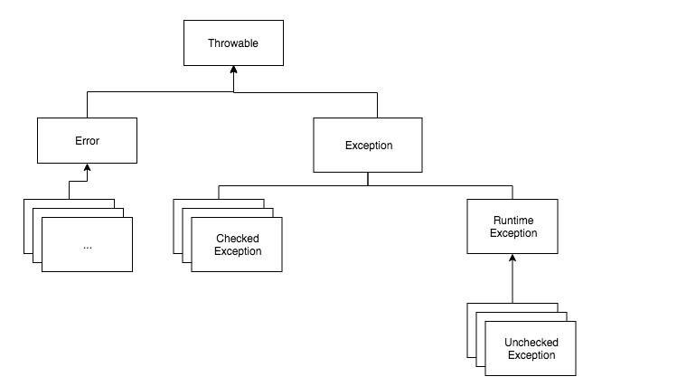

  Error는 시스템이 비정상적인 상황에서 발생하다. 이 수준의 Error는 시스템 레벨에서 발생하는 심각한 수준의 오류이기 때문에 개발자가 미리 예측할 수도 없고 처리할 수 있는 방법도 없다. 애플리케이션 반에서는 Error에 대한 처리를 신경 쓰지 않아도 된다. OutOfMemoryError이나 ThreadDeath 같은 에러는 try catch으로 잡아도 할 수 있는 것이 없기 때문이다.

  그러기 때문에 어플리케이션단 에서는 Checked,Unchecked Exception에 대한 처리가 상대적으로 중요합니다.

  

  | .                          | Checked Exception         | Unchecked Exception                            |
  | :------------------------- | :------------------------ | :--------------------------------------------- |
  | **처리 여부**              | 반드시 예외 처리 해야함   | 예외 처리 하지 않아도됨                        |
  | **트랜잭션 Rollback 여부** | Rollback 안됨             | Rollback 진행                                  |
  | **대표 Exception**         | IOException, SQLException | NullPointerException, IllegalArgumentException |

  - Unchecked Exception(컴파일 시점 예외) : 명시적인 예외 처리를 강제하지 않는 특징이 있기 때문에 Unchecked Exception이라 하며, catch로 잡거나 throw로 호출한 메서드로 예외를 던지지 않아도 상관이 없습니다.
    - code를 잘못 만들어서 생기는 예외
    - 컴파일하는데 문제 없다. 실행하면 문제가 발생함
    - 배열의 범위를 벗어나거나(IndexOutOfBoundsException) 값이 null인 참조변수의 멤버를 호출했다거나(NullPointerException) 클래스간의 형변환을 잘못했다던가(ClassCastException) 정수를 0으로 나누려 했다던가(ArithmeticException) 하는 경우에 발생
  - Checked Exception : 반드시 명시적으로 처리해야 하기 때문에 Checked Exception이라고 하며, try catch를 해서 에러를 잡든 throws를 통해서 호출한 메서드로 예외를 던져야 합니다.
    - Code상의 문제가 아니라, 실행상황에 따라 발생가능성 있는 예외
    - 프로그램 구현 흐름상 발생할 수 있는 예외
    - 프로그램 실행 흐름상 예외발생 가능성 있는 상황을 표현
    - file 불러오는 코드에서 파일이 없는 경우 에러가 발생할 수 있으니 checked exception이 발생 


- **finally 붙이는 이유**

  - finally가 없는 경우

  ###### <kr.ac.kopo.day13.ExceptionMain03>

  ```java
  package kr.ac.kopo.day13;
  
  public class ExceptionMain03 {
  
  	public static void main(String[] args) {
  		
  		System.out.println("main start...");
  		
  		for(int i = -2; i < 3; i++) {
  			System.out.println(i + "번째 반복문 수행 중....!");
  			try {
  			System.out.println(10 / i); //i가 0일 때 예외 발생하면서 종료 
  			}catch (ArithmeticException ae){
  				
  			}
  		}
  		System.out.println("main end...");
  	}
  }
  ```

  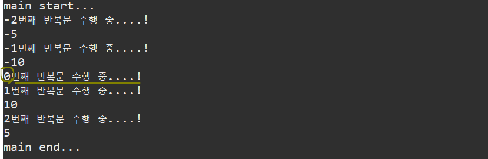

  - finally가 없어도 전체 다 실행되는데 왜 사용할까?
  - 만약 예외가 발생하는 순간 break로 for문을 빠져나오라고 한다면 ? 

  ```java
  package kr.ac.kopo.day13;
  
  public class ExceptionMain03 {
  
  	public static void main(String[] args) {
  		
  		System.out.println("main start...");
  		
  		for(int i = -2; i < 3; i++) {
  			System.out.println(i + "번째 반복문 수행 중....!");
  			try {
  				System.out.println(10 / i); //i가 0일 때 예외 발생하면서 종료 
  			}catch (ArithmeticException ae){
  				System.out.println("예외 발생...");
  				break;
  			}
  			System.out.println("반복문 수행 중");
  		}
  		System.out.println("main end...");
  	}
  }
  ```

  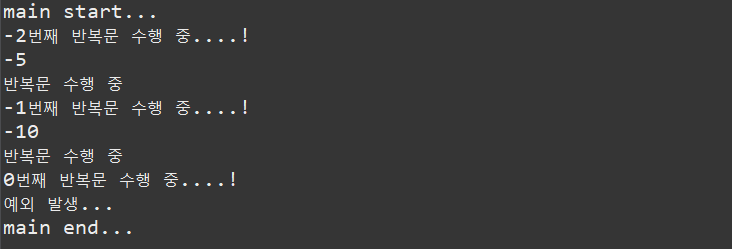

  - break되면서 반복문을 빠져나오고 "반복문 수행 중"이라는 것을 출력하지 않는다.
  - 그래서 finally를 넣어서 "반복문 수행 중"을 출력할 수 있도록 한다.
  - for문 안에 finally가 있어도 무조건 실행된다. 

  ```java
  package kr.ac.kopo.day13;
  
  public class ExceptionMain03 {
  
  	public static void main(String[] args) {
  		
  		System.out.println("main start...");
  		
  		for(int i = -2; i < 3; i++) {
  			System.out.println(i + "번째 반복문 수행 중....!");
  			try {
  			System.out.println(10 / i); //i가 0일 때 예외 발생하면서 종료 
  			}catch (ArithmeticException ae){
  				System.out.println("예외 발생...");
  				break;
  			}finally {
  				System.out.println("반복문 수행 중");
  			}
  		}
  		System.out.println("main end...");
  	}
  }
  ```

  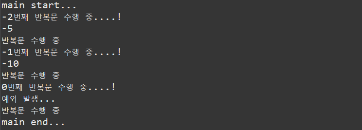


- **파일 불러오기 예외처리**

  - FileReader는 파일을 읽어오는 class
  - java.io 패키지 밑에 있음
  - a.txt의 파일을 읽어오겠다. 그러나 이 파일이 없을 수도 있으니 예외처리를 무조건 해야한다는 강제성을 부여
  - 컴파일 시점 예외처리 

  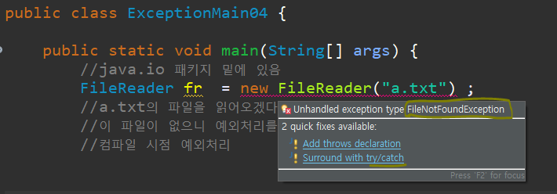

  - java.lang 패키지에 없는 예외는 대부분 강제성을 가진다.
  - 외부장치를 제어할 때는 대부분 checked exception(컴파일 시점)
  - 로그파일을 정할 때 외부장치를 제어하는 것이므로 checked exception 발생으로 try ~ catch를 반드시 해줘야함.

  ```java
  package kr.ac.kopo.day13;
  
  import java.io.FileNotFoundException;
  import java.io.FileReader;
  import java.io.FileWriter;
  import java.io.IOException;
  
  public class ExceptionMain04 {
  
  	public static void main(String[] args) {
  
  		try {
  			FileReader fr  = new FileReader("a.txt") ; //checked exception
  		} catch (FileNotFoundException e) { 
  			//로그파일
  			try {
  				FileWriter fw = new FileWriter("error.log");
  			} catch (IOException e1) {
  				e1.printStackTrace();
  			}
  			e.printStackTrace();
  		}
  	}
  }
  ```

  


- **간접처리**

  - 예외를 떠넘길때 메서드 단위로 넘어간다. 

  - **throws** 

    메서드 내에서 발생된 예외를 자신이 직접 처리하는 것이 아니라 자신을 호출한 쪽으로 예외처리를 떠넘기는 역할을 하는 키워드 

  - 떠넘기기는 하지만 직접처리 하는 것과 간접처리 하는 것의 결과가 다를 수 있다.

  - 메서드의 선언부에 사용

  - 특정한 예외에 대해서만 떠넘길 수 있음

  - 예외처리 하는 부분을 한 쪽으로 몰고 싶어서 사용

  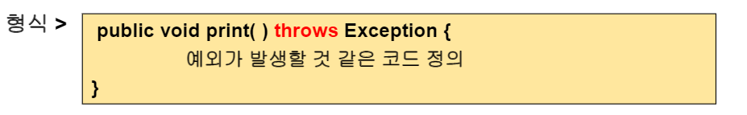

  - 예
    - b()에서 나는 예외를 b()를 호출한 main으로 throws 했고 그래서 main에서 b()에 대한 예외처리를 진행함

  ###### <kr.ac.kopo.day13.ExceptionMain05>

  ```java
  package kr.ac.kopo.day13;
  
  import java.io.FileNotFoundException;
  import java.io.FileReader;
  
  public class ExceptionMain05 {
  	
  	public static void b() throws ArithmeticException{
  		System.out.println("b() 메소드 호출....");
  		System.out.println(1 / 0); //에러나는 문장 호출
  	}
  	
  	public static void main(String[] args) {
  		try {
  			b();
  		} catch (ArithmeticException ae) {
  			System.out.println("main() 예외처리...");
  			ae.printStackTrace();
  		}
  	} //main
  }
  ```

  

  - 2개의 예외를 throws 하는 경우

  ```java
  package kr.ac.kopo.day13;
  
  import java.io.FileNotFoundException;
  import java.io.FileReader;
  
  public class ExceptionMain05 {
  	
  	public static void b() throws ArithmeticException, NullPointerException{
  		System.out.println("b() 메소드 호출....");
  		String str = null;
  		System.out.println(str.charAt(0)); //null 예외 
  		System.out.println(1 / 0); //에러나는 문장 호출
  	}
  	
  	public static void main(String[] args) {
  
  		try {
  			b();
  		} catch (ArithmeticException ae) {
  			System.out.println("main() 예외처리...");
  			ae.printStackTrace();
  		}
  	} //main
  }
  ```

  

  - 어떤 예외가 발생하든 모두 떠넘기기 위한 방법
    - throws Exception

  ```java
  package kr.ac.kopo.day13;
  
  import java.io.FileNotFoundException;
  import java.io.FileReader;
  
  public class ExceptionMain05 {
  
  	public static void b() throws Exception{
  		System.out.println("b() 메소드 호출....");
  		String str = null;
  		System.out.println(str.charAt(0)); //null 예외 
  		System.out.println(1 / 0); //에러나는 문장 호출
  	}
  	
  	public static void main(String[] args) {
  
  		try {
  			b();
  		} catch (ArithmeticException ae) {
  			System.out.println("main() 예외처리...");
  			ae.printStackTrace();
  		}
  	} //main
  }
  ```

  

  - JVM에도 예외처리할 수 있다. 그래서 main부분에서도 예외처리를 떠넘길 수 있다. (JVM에게 넘김. 그러나 그렇게 좋은 방법은 아니다.)

  ```java
  package kr.ac.kopo.day13;
  
  import java.io.FileNotFoundException;
  import java.io.FileReader;
  
  public class ExceptionMain05 {
  
  	public static void b() throws Exception{
  		System.out.println("b() 메소드 호출....");
  		String str = null;
  		System.out.println(str.charAt(0)); //null 예외 
  		System.out.println(1 / 0); //에러나는 문장 호출
  	}
  	
  	public static void main(String[] args) throws Exception{
  
  		try {
  			b();
  		} catch (ArithmeticException ae) {
  			System.out.println("main() 예외처리...");
  			ae.printStackTrace();
  		}
  	} //main
  }
  ```

  

  - 인터페이스에서 하나의 추상메서드를 만들 때 예외처리 throws한다. 그리고 이 메서드를 호출한 곳에서 예외처리를 진행하지 않으면 checked exception이 발생한다.

  ```java
  package kr.ac.kopo.day13;
  
  import java.io.FileNotFoundException;
  import java.io.FileReader;
  
  abstract class Parent {
  	public abstract void print();
  	public abstract void scan() throws Exception; 
  	//추상 메서드에 throws 간접처리 
  }
  
  class Child extends Parent {
  	@Override
  	public void print() {
  		// TODO Auto-generated method stub
  		
  	}
  	@Override
  	public void scan() throws Exception {
  		// TODO Auto-generated method stub
  		
  	}
  }
  
  public class ExceptionMain05 {
  	
  	public static void main(String[] args) {
  		
  		Child obj = new Child();
  		obj.print();
  		obj.scan(); //checked exception
  	} //main
  }
  ```

  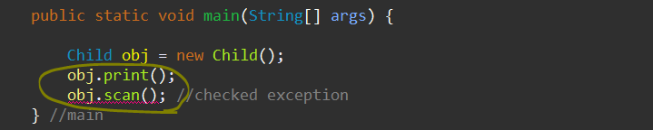 

  

  - 그래서 try ~ catch를 사용한다.

  ```java
  public static void main(String[] args) {
  	Child obj = new Child();
      obj.print();
      try {
          obj.scan();
      } catch (Exception e) {
          // TODO Auto-generated catch block
          e.printStackTrace();
      } //checked exception
  }
  ```

  

  - throws는 메서드 뿐만이 아니고 생성자에도 붙일 수 있다.

  

  - **throw** 

    JVM이 예외를 바생시키는 것이 아니라 인위적으로 특정 시점에 예외를 발생시킬 때 사용하는 키워드

  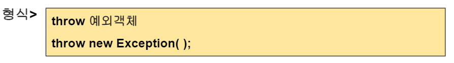

  

  - **사용자 정의 예외 클래스**

    API에 정의된 예외상황이 아니라 프로그램 내에서 특별한 예외 상황에 맞는 예외를 정의할 경우 사용

    - Exception 클래스를 상속받아서 정의

    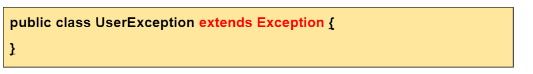

    

  - **예외처리를 이용하여 ID 유효성 검사**

  - **방법 1.**

  ```java
  package kr.ac.kopo.day13;
  
  import java.util.Scanner;
  
  /*
   	등록할 ID를 입력하세여 : hello1234
   	ID는 최대 8글자만 가능
   	
   	등록할 ID를 입력하세여 : hello1234
   	ID를 등록하였습니다.
   */
  public class ExceptionMain06 {
  	
  	public static void main(String[] args) {
  		
  		Scanner sc = new Scanner(System.in);
  		System.out.println("등록할 ID를 입력하세요.");
  		String id = sc.nextLine();
  		
  		try {
  			if(id.length() >8) {
  				throw new Exception("ID는 최대 8글자만 가능합니다;;"); //예외 발생 이유를 적어주기
  			}
  		}catch(Exception e) {
  			e.printStackTrace(); //어디서 발생한 에러인지, 어떤 이유인지 다 뜬다.
  			//System.out.println(e.getMessage()); 
  			//예외 발생 이유만 나옴 (ID는 최대 8글자만 가능합니다;;)
  		}
  		
  	} //main
  }
  ```

  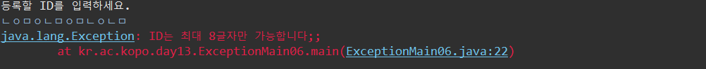

  

  - **방법 2.**

  ###### <kr.ac.kopo.day13.CheckIDException>

  ```java
  package kr.ac.kopo.day13;
  
  public class CheckIDException extends Exception{
  	//Exception에 있는 생성자를 가져옴
  	public CheckIDException() {
  		super();
  	}
  
  	public CheckIDException(String message) {
  		super(message);
  	}
  }
  
  ```

  

  ###### <kr.ac.kopo.day13.ExceptionMain06>

  ```java
  package kr.ac.kopo.day13;
  
  import java.util.Scanner;
  
  /*
   	등록할 ID를 입력하세여 : hello1234
   	ID는 최대 8글자만 가능
   	
   	등록할 ID를 입력하세여 : hello1234
   	ID를 등록하였습니다.
   */
  public class ExceptionMain06 {
  	
  	public static void main(String[] args) {
  		
  		Scanner sc = new Scanner(System.in);
  		System.out.println("등록할 ID를 입력하세요.");
  		String id = sc.nextLine();
  		
  		try {
  			if(id.length() >8) {
  				throw new CheckIDException("ID는 최대 8글자만 가능합니다;;");
  			}
  		}catch(Exception e) {
  			e.printStackTrace(); //어디서 발생한 에러인지, 어떤 이유인지 다 뜬다.
  			//System.out.println(e.getMessage()); 
  			//예외 발생 이유만 나옴 (ID는 최대 8글자만 가능합니다;;)
  		}
  		
  	} //main
  }
  ```

  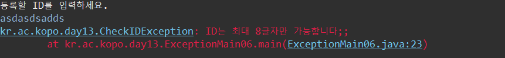

  

  - **방법 3.**

  ```java
  package kr.ac.kopo.day13;
  
  import java.util.Scanner;
  
  /*
   	등록할 ID를 입력하세여 : hello1234
   	ID는 최대 8글자만 가능
   	
   	등록할 ID를 입력하세여 : hello1234
   	ID를 등록하였습니다.
   */
  public class ExceptionMain06 {
  	
  	public static void register() throws CheckIDException{
  		Scanner sc = new Scanner(System.in);
  		System.out.println("등록할 ID를 입력하세요.");
  		String id = sc.nextLine();
  		
  		if(id.length() > 8) {
  			throw new CheckIDException("ID는 최대 8글자만 가능합니다.");
  		}
  		
  		System.out.println("ID를 등록하였습니다.");
  	}
  	
  	public static void main(String[] args) {
  		
  		try {
  			register();
  		} catch (CheckIDException e) {
  			System.out.println(e.getMessage());
  		}
  	
  	} //main
  }
  ```

  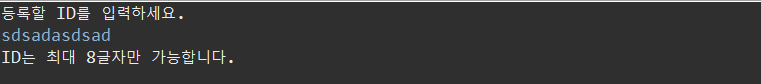


-----------

#### 생성자 정리

- 생성자 정의 시 필수사항
  - 반환형을 가지고 있지 않음
  - class명과 동일
- 디폴트 생성자를 지원
  - 자신의 클래스에서 생성자가 하나도 없는 경우에 JVM이 디폴트 생성자를 만들어줌
- 오버로딩 지원
- 속성의 초기화
  - 멤버변수를 초기화 시켜주는 목적으로 사용
- this의 활용 
  - 생성자 안에서 생성자를 호출할 때 사용 
  - 생성자의 맨 첫 라인에서만 수행됨


#### static 정리

- 로딩시점
  - non tatic 과 static 변수는 로딩시점이 다르다. non static은 new했을 때마다 로딩 반면 static은 클래스를 한 번 읽을 때 로딩 
- 메모리 할당
  - non static은 new할때마다 독립적인 공간이 할당, static은 독립적인 공간이 하나 생김
  - static이 빠르다.
- 사용상의 차이
  - static 메서드에서 일반 메서드나 멤버변수를 호출할 수 없다. (static이 더 빠르게 생성되므로)
  - non-static 메서드에서는 static 메서드나 static 변수를 사용할 수 있다.


#### 상속 정리

- 재사용성과 확장성
  - 하나를 같이 사용할 수 있도록
  - 부모 클래스에 있는 메서드를 내것처럼 사용하기 위한 목적
  - 접근제한자에 따라서 접근 범위가 다르다.
  - 자식이 부모를 접근할 수 있는 접근제한자 public, protected 
- extends 키워드
- super 키워드
- 오버라이딩

- 다형성


#### 접근제한자 정리

- public : 모든 곳에서 접근 가능
- protected : 상속 관계인 경우는 서로 다른 패키지에서도 접근이 가능하다.
- default
- private


#### 추상클래스 정리

- abstract 키워드
- 추상메서드
  - 선언부는 가지고 있지만 바디(내용부)는 가지고 있지 않음
- 부모가 메서드를 가지고 있으면 그 메서드를 자식이 오버라이드 하도록 강제성을 부여
  - 반드시 오버라이드 해야함
- 인스턴스 생성여부 = > x 
- 일반메서드와 추상메서드 모두 가질 수 있다. 
- 하위 클래스에서 해야 할 일
  - 부모가 가진 메서드를 오버라이드
- 추상클래스 객체 변수 얻기


#### 객체의 형변환 정리

- 정의
  - 대입 연산산자를 기준으로 좌변의 우변의 데이터 타입이 다른 경우 객체 형변환이 진행
- 조건
  - 좌변과 우변의 데이터 타입이 상속 관계인 경우에만 가능 
- 종류
  - 묵시적 : 자식 타입을 부모가 가지게 하는 것
    - 부모가 자식의 위치값을 가지고 있어도 접근할 수 있는 것은 부모가 정의한 멤버변수와 메서드만 접근 가능
    - 그러나 자식이 오버라이딩 하는 경우 그 오버라이드 된 메서드는 접근 가능 
  - 명시적 : 부모의 주소값을 자식이 가지고 있는 것 
    - 메모리 구조를 봤을 때 부모의 메모리 공간이 좁기 때문에 불가능함 그래서 묵시적 형변환이 되어있는 부모의 변수 값을 자식이 갖도록 해야함


#### 인터페이스

- 선언되는 메서드 및 변수
  - 상수와 추상메서드만 가질 수 있음
  - 그냥 변수를 선언해도 public static final로 인식이 된다.
- 기능의 집합
- 인스턴스 생성여부 => x
- implements 
- 하위 클래스에서 해야할 일
  - 인터페이스에서 가지고 있는 추상 메서드를 오버라이드 
- 인터페이스 객체 변수 얻기


#### final 정리

- 변수에 적용
  - 상수가 된다.
- 메소드에 적용
  - 오버라이드 할 수 없다.
- 클래스에 적용
  - 상속 금지 


#### 예외처리 정리

- 프롬을 실행할때 예치지 못한 문제점이 예외
  - 프로그램이 강제 종료되는 것을 방지하기 이ㅜ해서 예외처리 
- try : 예외가 발생할 가능성이 있는 집합
- catch : 예외가 발생했을 떄 예외 처리
- finally : 예외가 발생하거나 발생하지 않아도 무조건 실행
- throws (간접) : 예외가 발생했을 때 예외가 발생한 메서드를 호출한 메서드에게 예외를 떠넘김
- throw : 예외가 발생할 시점이 아닌데 사용자가 강제적으로 예외를 발생할 때 사용함


- 생성자의 특징

생성자 내에서 다른 생성자를 호출이 불가능하다. => 다른 클래스에서 상속이 되어있지 않은 경우 불가능 

반환타입은 없다.


static 

인스턴스 객체마다 메모리가 할당되지 않는다.


abstract  는 클래스, 메소드에만 사용 가능


-----------

#### 날짜 API

- **날짜관련 API 클래스**
  - Data (java.util)
  - Calender (java.util)
  - SimpleDataFormat : 데이터 형식 설정 (java.text)


- **Date**
  - 1.0 버전부터 지원되는 클래스
  - 1.1 버전부터는 Calendar 클래스 사용을 권장


- 생성자
  - Date()
  - Date(long msec)


- **Date 메소드**

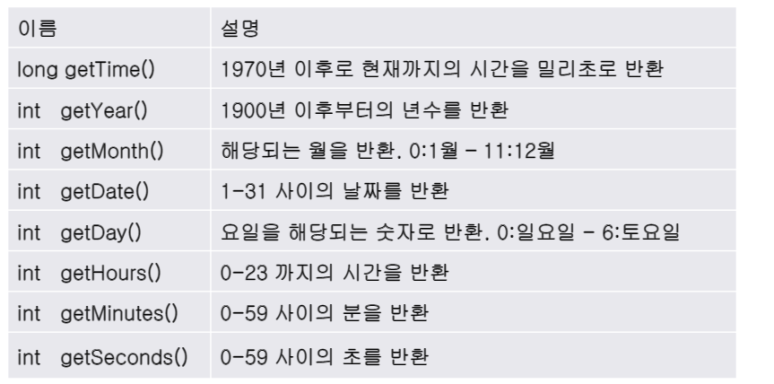


- **예**

```java
package kr.ac.kopo.day13;

import java.util.Date;

public class DateMain {

	public static void main(String[] args) {
		//오늘은 2021년 3월 24일입니다.
		
		Date d = new Date();
		System.out.println("d : " + d);
		d.toString();
		//d가 주소값이 찍히지 않는 이유는?
		//명령을 내리는 기본적인 단위는 메서드이다.
		//출력하는 메소드(System.out.print)에서 객체명을 찍으면 
		//내부적으로 객체명.toString()이 호출되어
		//그 리턴타입(가상의 주소)이 나온다.
		//그러면 d는 왜 안찍히냐면 Date class에서 Object에 있는 toString의 메서드를
		//오버라이드 했으므로 현재날짜 시간이 나온다. 
		
	}
}
```


```java
package kr.ac.kopo.day13;

import java.util.Date;

public class DateMain {

	public static void main(String[] args) {
		//오늘은 2021년 3월 24일입니다.
		
		Date d = new Date();
		System.out.println("d : " + d);
		int year = d.getYear() + 1900; // - 1900
		int month = d.getMonth() + 1; //0 ~ 11
		int date = d.getDate();
		System.out.println("오늘은 " + year + "년 " + month + "월"
				+ date + " 일 입니다.");
		
		
	}
}
```

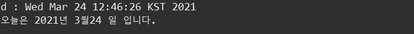


- **Calender** 

  - 추상클래스
  - 객체를 얻기위해 Calendar.getInstance()를 활용
    - getInstance는 구현된 메서드이다.
    - Calender는 추상클래스이므로 객체를 생성할 수 없다.
    - 객체를 만들지 않고도 getInstance를 사용할 수 있는 방법은 static이다. 
    - 그래서 new(객체)를 사용하지 않고  static을 이용해서 메서드를 사용한다.
    - 그래서 Class명.getInstance() 를 사용한다. getInstance는 static
  - Calender 메서드
    - 객체 얻기 : static Calender getInstance()
    - 정보 추출 : int get(int calendarField)

  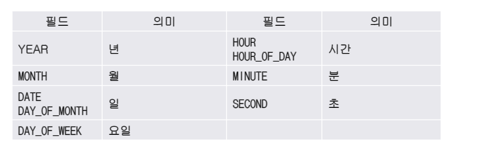

  - 날짜 설정

  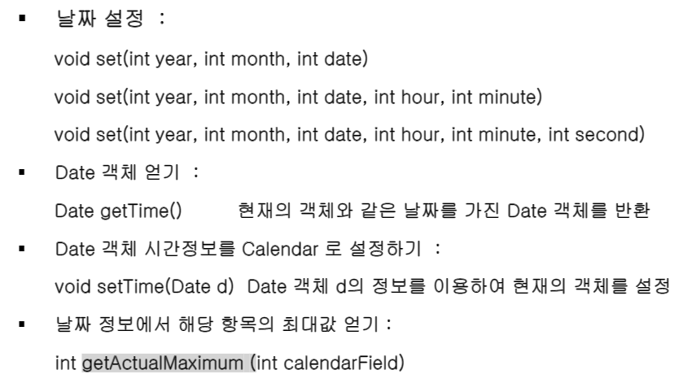

  - 예

  ```java
  package kr.ac.kopo.day13;
  
  import java.util.Calendar;
  
  public class DateMain {
  
  	public static void main(String[] args) {
  		
  		Calendar c = Calendar.getInstance();
  		System.out.println("c : " + c); //GregorianCalendar
  		int year = c.get(1);
  		int month = c.get(2);
  		System.out.println(year + ", " + month);
  		//숫자는 외우지 못할 수 있다.
  		//public static final int YEAR = 1; 이기 때문에
  		//static final이기 때문에 Calendar.YEAR 라고 적어주면 된다.
  		int year1 = c.get(Calendar.YEAR);
  		int month1 = c.get(Calendar.MONTH) + 1; //month는 0~11
  		int date = c.get(Calendar.DATE);
  		int date1 = c.get(Calendar.DAY_OF_MONTH);
  		
  		//요일
  		int day = c.get(Calendar.DAY_OF_WEEK); //1(일) ~ 7(토)
  		String[] dayArr = {"" , "일", "월", "화", "수", "목", "금", "토"};
  		
  		System.out.println("오늘은 " + year1 + "년 " + month1 + "월 " + date + "일"
  				+ "(" + date1 + "일) " + dayArr[day] + "요일");
  		
  	}
  }
  ```

  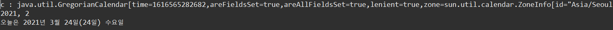

  

  - **5/5일은 무슨 요일?**

  ```java
  package kr.ac.kopo.day13;
  
  import java.util.Calendar;
  
  public class DateMain {
  
  	public static void main(String[] args) {
  		
  		Calendar c = Calendar.getInstance();
  		
  		//요일
  		int day = c.get(Calendar.DAY_OF_WEEK); //1(일) ~ 7(토)
  		String[] dayArr = {"" , "일", "월", "화", "수", "목", "금", "토"};
  	
  		//5월 5일은 무슨 요일???
  		c.set(2021, 5-1, 5); //month는 0 ~ 11이므로 
  		day = c.get(Calendar.DAY_OF_WEEK);
  		System.out.println("2021년 5월 5일은 " + dayArr[day] + "요일");
          
          //5월의 마지막 날이 몇 일???
  		int lastDay = c.getActualMaximum(Calendar.DAY_OF_MONTH);
  		System.out.println("5월은 " + lastDay + "일로 구성되어 있습니다.");
          
          //2월의 마지막 날이 몇 일????
  		c.set(c.MONTH, 2 - 1);
  		int lastDay1 = c.getActualMaximum(Calendar.DAY_OF_MONTH);
  		System.out.println("5월은 " + lastDay1 + "일로 구성되어 있습니다.");
          
  		
          
  	}
  }
  ```

  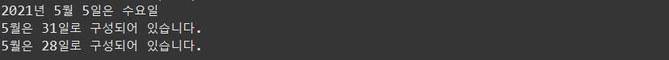

  

- **SimpleDateFormat**

  날짜 객체로부터 원하는 형태의 문자열로 변환

  특정한 포멧 문자열을 사용하여 날짜 정보를 추출

  - 주요 메소드

  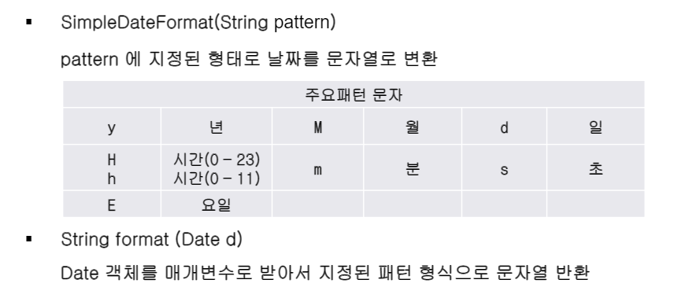

  - 예

  ```java
  package kr.ac.kopo.day13;
  
  import java.text.SimpleDateFormat;
  import java.util.Calendar;
  import java.util.Date;
  
  public class DateMain {
  
  	public static void main(String[] args) {
  		//날짜 형식 지정
  		String pattern = "yy-MM-dd";
  		String pattern1 = "yyyy년 MM월 dd일 HH시 mm분 ss초(E)";
  		SimpleDateFormat sdf = new SimpleDateFormat(pattern1);
  		String data = sdf.format(new Date());
  		System.out.println(data);
  		
          //Calendar를 Date 형으로 변경하여 수행
          Date d = c.getTime();
  		String data1 = sdf.format(d);
  		System.out.println(data1);
  	}
  }
  ```

  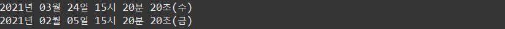


--------

#### Collection API

- 객체들을 한 곳에 모아놓고 편리하게 사용할 수 있는 환경을 제공
- 같은 타입의 데이터들을 메모리에 효과적으로 모아놓고 그 집합에서 빠르게 탐색할 수 있는 것이 자료구조
- 정적 자료구조(Static structure)
  - 고정된 크기의 자료구조
  - 배열이 대표적인 정적 자료구조
  - 선언시 크기를 명시하면 바꿀 수 없음
- 동적자료구조(Dynamic structure)
  - 요소의 개수에 따라 자료구조의 크기가 동적으로 증가하거나 감소
  - 벡터,  리스트,  스택,  큐 등
- collection과 자료구조 

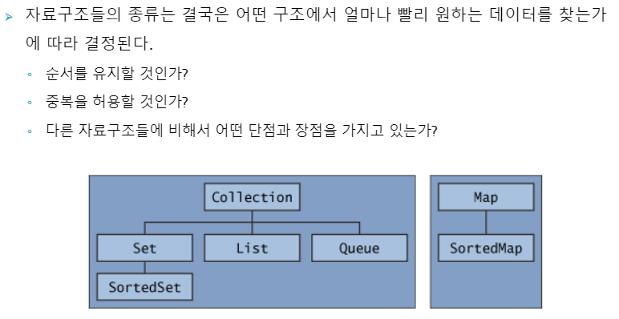

