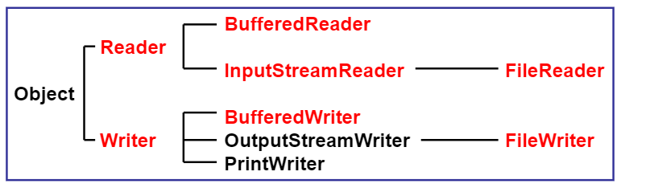
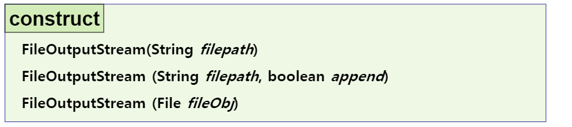

#### Wrapper Class(래퍼 클래스)

- 기본자료형을 class로 표현하는 것은 Wrapper Class(래퍼 클래스)

- 제너릭에  int가 들어가지 않는 것을 해결하기 위해 사용 

```java
package kr.ac.kopo.day15;

import java.util.ArrayList;
import java.util.List;

/*
 	Wrapper class
 	기본자료형을 참조자료형으로 쓸 수 있는 class
 	기본자료형을 class화 시킴
 	기본자료형을 매개변수로 받음
 	기본자료형		Wrapper class
 	boolean		Boolean
 	char		Character
 	byte		Byte
 	short		Short
 	int			Integer
 	long		Long
 	float		Float
 	double		Double
 */
public class WrapperMain {

	public static void main(String[] args) {
		List<Integer> list  = new ArrayList<>();
		list.add(new Integer(1));
		list.add(new Integer(2));
		list.add(new Integer(3)); 
		//원래는 위처럼 써야하는데
		//Wrapper class는 auto box하므로
		list.add(4);
		list.add(5); //이처럼 적어도 된다.
		//wrapper class는 java.lang 패키지에 들어있음 
		
		int i = 123;
		
		Integer i2 = new Integer(123);
		
		Integer i3 = 123;	//auto boxing
		//123은 int형인데 i3는 참조자료형이다.
		//int를 value를 가지고 있는 인스턴스 객체가 필요하다. 
		//근데 Wrapper class를 사용하는 경우 
		//자동으로 박싱을 한다. (클래스의 객체로 포장)
		
		int i4 = new Integer(123); //auto unboxing
		//인스턴스 객체에서 기본 자료형만 뽑아오는 것
		
		//auto boxing, unboxing이 되고 있어서 디플리케이션 됨
		
		System.out.println("i : " + i);
		System.out.println("i2 : " + i2);
		System.out.println("i3 : " + i3);
		
		String str = "10234" ; 
		int num = Integer.parseInt(str); //숫자문자를 정수로 바꾸기
		System.out.println(num + 100);
		
		int num2 = Integer.valueOf(str); //이렇게 적어도 됨 (정수로 바꿔줌)
		System.out.println(num2 + 100);
		
		//두 개의 차이점 -> return 타입의 차이가 있다.
		//num2 는 integer라는 참조자료형이 return
		//반면에 num은 return 값이 기본자료형 int이다.
		//그래도 알아서 auto boxing이 되므로 int num에 들어가는 것임
	
	}
}
```

 


---------

#### Map

- 두 가지 이상의 인스턴스 객체 타입을 return하는 방법

  - 방법 1. Object[]의 형태로 넘기기
    -  그러나 각 인덱스마다 어떤 타입의 객체가 들어있는지 알아야 사용이 가능하다. 
  - 방법2. Map<> 사용
  - 방법3.두 타입이 포함된 하나의 클래스를 생성해서 생성자를 통해 넘기기

  ```java
  package kr.ac.kopo.day15;
  
  import java.util.HashMap;
  import java.util.Map;
  
  class Member {
  	
  }
  
  class Car {
  	
  }
  
  class MemberInfo {
  	Member member;
  	Car car;
  	public MemberInfo(Member member, Car car) {
  		this.member = member;
  		this.car = car;
  	}
  }
  
  class test {
  	
  	//두 가지 이상의 인스턴스 객체를 return
  	public Object[] returnTest() {
  		
  		
  		//방법 1. Object 배열 
  		Member m = new Member();
  		Car c = new Car();
  		
  		Object[] arr = new Object[2];
  		arr[0] = m;
  		arr[1] = c;
  		return arr;
  	}
  	
  	//방법2. map
  	public Map<String, Object> returnTest2() {
  		
  		Member m = new Member();
  		Car c = new Car();
  		
  		Map<String, Object> map = new HashMap<>();
  		map.put("member", m);
  		map.put("car", c);
  		
  		return map;
  	}
  	
  	//방법3. 하나의 class를 생성해서 넘기기 
  	public MemberInfo returnTest3() {
  		
  		Member m = new Member();
  		Car c = new Car();
  		
  		MemberInfo info = new MemberInfo(m, c);
  		
  		return info;
  	}	
  }
  
  public class MapMain02 {
  
  	public static void main(String[] args) {
  
  	}
  
  }
  ```


- 한 명 당 하나의 차량만 등록할 수 있다.

```java
package kr.ac.kopo.day15;

import java.util.HashMap;
import java.util.Map;

class Member {
	private String name;
	private String phone;
	
	public Member(String name, String phone) {
		super();
		this.name = name;
		this.phone = phone;
	}

	@Override
	public int hashCode() {
		final int prime = 31;
		int result = 1;
		result = prime * result + ((name == null) ? 0 : name.hashCode());
		result = prime * result + ((phone == null) ? 0 : phone.hashCode());
		return result;
	}

	@Override
	public boolean equals(Object obj) {
		if (this == obj)
			return true;
		if (obj == null)
			return false;
		if (getClass() != obj.getClass())
			return false;
		Member other = (Member) obj;
		if (name == null) {
			if (other.name != null)
				return false;
		} else if (!name.equals(other.name))
			return false;
		if (phone == null) {
			if (other.phone != null)
				return false;
		} else if (!phone.equals(other.phone))
			return false;
		return true;
	}

	/*
	@Override
	public boolean equals(Object obj) {
		boolean result = false;
		//매개변수를 받으면 Object 이므로 묵시적 형변환이 된거다.
		//그래서 object가 접근가능한 범위는 object 클래스만 가능하다.
		//그래서 명시적 형변환을 진행해야 한다.
		Member mem = (Member) obj;
		
		if((this.name.equals(mem.name)) && (this.phone.equals(mem.phone))) {
			result = true;
		}
		return result;
	}

	@Override
	public int hashCode() {
		// TODO Auto-generated method stub
		return 100;
	}
	
	//해쉬
	 */
}

class Car {
	private String name; //모델명
	private String id; //차량 번호
	
	public Car(String name, String id) {
		super();
		this.name = name;
		this.id = id;
	}
}
/*
class MemberInfo {
	Member member;
	Car car;
	public MemberInfo(Member member, Car car) {
		this.member = member;
		this.car = car;
	}
}

class test {
	
	//두 가지 이상의 인스턴스 객체를 return
	public Object[] returnTest() {
		
		
		//방법 1. Object 배열 
		Member m = new Member();
		Car c = new Car();
		
		Object[] arr = new Object[2];
		arr[0] = m;
		arr[1] = c;
		return arr;
	}
	
	//방법2. map
	public Map<String, Object> returnTest2() {
		
		Member m = new Member();
		Car c = new Car();
		
		Map<String, Object> map = new HashMap<>();
		map.put("member", m);
		map.put("car", c);
		
		return map;
	}
	
	//방법3. 하나의 class를 생성해서 넘기기 
	public MemberInfo returnTest3() {
		
		Member m = new Member();
		Car c = new Car();
		
		MemberInfo info = new MemberInfo(m, c);
		
		return info;
	}
}
*/
public class MapMain02 {

	public static void main(String[] args) {
		Map<Member, Car> carList = new HashMap<Member, Car>();
		carList.put(new Member("홍길동","010-1111-1111"), new Car("소나타", "11소1111"));
		carList.put(new Member("윤길동","010-2222-2222"), new Car("모닝", "22가2222"));
		carList.put(new Member("박길동","010-3333-3333"), new Car("그랜저", "33도3333"));
		carList.put(new Member("강길동","010-4444-4444"), new Car("카니발", "44고4444"));
		
		System.out.println("등록 대수 : " + carList.size());
		//동명이인 일 때?
		carList.put(new Member("홍길동","010-5555-5555"), new Car("SM3", "55허5555"));
		System.out.println("등록 대수 : " + carList.size());
		
		//첫 번째 홍길동의 차량 UPDATE
		//키는 중복을 허용하지 않아서 같은 것으로 put하면 알아서 update해준다.
		carList.put(new Member("홍길동","010-1111-1111"), new Car("제네시스", "66소6666"));
		System.out.println("등록 대수 : " + carList.size()); //근데 6이 나옴(update 된거라면 5가 나와야함)
		//new를 통해 인스턴스 객체를 새로 생성했으므로 주소값이 다르다. 
		//그래서 값이 같은지 확인하기 위해서 Object안에 equals를 사용한다. (==은 주소값을 비교하기 때문이다.)
		//Object 안에 있는 equals 메서드는 주소값을 비교(==)
		
		//예
		/*
		Member m1 = new Member("홍길동","010-1111-1111");
		Member m2 = new Member("홍길동","010-1111-1111");
		
		if(m1.equals(m2)) {
			System.out.println("같은 사람입니다.");
		}else {
			System.out.println("다른 사람입니다.");
		}
		//object 안에 있는 equals 이므로 주소값을 비교해서 다른 사람으로 인식
		//그래서 equals 메서드를 오버라이드해서 재정의 해줘야한다.
		//재정의 해줘야 같은 사람이라고 나온다.
		*/
		
		//map에서 같은 데이터로 인식하려면 equals가 true이면서 hash 코드 값도 같아야함.
		//문자열같은 경우는 hash 코드 값이 모두 같다 (new Stirng()이든 = "";로 하든)
	}
}
```

- Object의 equals는 값이 같다고 하더라도 주소값이 다르면 다르다는 결과가 나오지만 String인 경우는 주소값이 달라도 값이 같으면 같다고 나온다. 왜냐하면!! Stirng 같은 경우는 Object의 equals 메서드를 오버라이드해서 재정의했기 때문이다.


- **해쉬코드와 equals 주소값이 아닌 값으로 같게 설정하는 법**
  - equals 만들어서 사용하는 방법은 알아야 한다.


 


----------------

#### 입출력 API

- 변수는 ram 메모리 (휘발성 메모리), 현재 실행되고 있는 소프트웨어에서만 저장하고 프로그램이 종료되면 메모리가 사라짐
  - 그래서 꾸준하게 값을 유지하기 위해서 입출력 API 사용
  - 다른 장치에서 입력을 받거나 다른 장치에 넣어주는 것이 입출력

- java.io 패키지를 제공함

  - 바이트 스트림과 문자 스트림을 사용
  - 입, 출력을 위해서 스트림을 사용함(byte, character)
  - 자바에서 넘기는 char by char는 유니코드 기반, 자바는 2byte 형태로 움직인다.
    - c는 아스키 코드 기반이라 
  - 자바는 데이터를 주고 받을 때 원래는 유니코드 기반(문자스트림)이지만 이기종에서도 주고 받기 위해서 아스키 코드 기반(바이트 스트림)으로도 사용한다.
  - 영상이나 사진은 byte 단위 즉, 바이트 스트림 사용   
  - '사랑합니다'가 한 번에 보내지는 것처럼 보이지만 한 글자로 쪼개져러 날아간다. 쪼개서 보내는 통로가 스트림이고, 쪼개는 반위가 유니코드 기반인지 아스키 코드 기반인지로 나뉘는 것이고 이것을 무자 스트림 바이트 스트림이라고 한다.

  

  - 특징
    - FIFO
    - 단방향이다.
    - 지연될 수 있다.


- **처리 단위** 
  - byte 단위의 최상위 클래스 InputStream, OutputStream
  - char 단위의 최상의 클래스 Reader, Writer


- **바이트 스트림**
  - 장치기반 (외부장치를 입력용: input, 외부장치를 출력용 : output)
  - 외부장치를 어떤 용도로 쓸 것인지가 기반
  - fileinput or fileoutput은 1byte씩 읽어오거나 저장함
    - byte 단위로 움직이므로 왔다갔다 하는 횟수가 늘어남(속도가 느리다)
    - 빠르게 움직이기 위해서 buffer 사용한다.(byte단위가 아닌 모아놨다가 더 많은 것을 담아서 움직인다. 그래서 움직이는 횟수가 줄어든다.)
    - 원래 바이트 단위로 넘기지만 기본 자료형의 단위로 데이터를 주고받는 것처럼 보이게할 수 있는 클래스가 DataInputStream, DataOutputStream
    - 클래스 단위로 주고 받는 것처럼 보이는 것은 ObjectOutputStream 


- **문자스트림**

  - 2byte로 움직임 
  - 속도를 빠르게 해주기 위해서 Buffer
  - 만약 2byte로 움직이는 서버면? 1byte로 들어왔을 때 바이트 스트림을 문자 스트림으로, 문자 스트림을 바이트 스트림으로 바꿔주는 것이 inputStreamReader, OutputStreamWriter이다.

  

  

- **바이트 스트림**

  - InputStream

  

  

  - OutputStream

  

  

  - 예
    - 외부장치와 관련있는 것은 checked exception이므로 throws Exception 추가

  ```java
  package kr.ac.kopo.day15;
  
  import java.io.InputStream;
  import java.io.InputStreamReader;
  
  //키보드에서 엔터가 나올 떄까지
  //입력받은 문자를 화면에 출력
  public class FileIOMain01 {
  
  	public static void main(String[] args) throws Exception{
  		System.out.println("입력을 하세요. ctrl +z를 누르면 종료합니다.");
  		InputStream is = System.in;
  		//키보드로 입력받은 모든 정수값은 0보다 같거나 큰 수이다. 
  		//읽은 바이트가 파일의 끝이면 -1을 반환(읽은 것을 실패했을 떄 반환)
  		//즉, ctrl + z를 누르면 -1이 반환된다.
  		
  		while(true) {
  			int c = is.read(); //read는 한 바이트를 읽어 int형으로 반환한다.
  			if(c == -1) break;
  			//System.out.print(c); //입력하고 엔터를 치면 출력이 된다.
  			//왜냐하면 buffer를 사용하기 때문이다.
  			//byte단위로 다 출력되는 것이 아니고 한번에 받은 다음에
  			//엔터를 누르면 출력
  			
  			System.out.print((char)c); //형변환 안하면 숫자가 나옴
  			
  			//한글을 입력하면 다른 글자가 나온다. 
  			//자바에서는 한글 하나가 2byte이므로 1byte씩 들어가서 
  			//다르게 출력된다. 그래서 byte 스트림으로 들어온 데이터를
  			//문자 스트림으로 변환할 있게 해야한다.
  			//즉, 한글은 문자스트림으로 읽어야함
  			//InputStreamReader
  		}
  	}
  }
  ```

  

  

  - InputStreamReader(문자 스트림으로 읽기)

  ```java
  package kr.ac.kopo.day15;
  
  import java.io.InputStream;
  import java.io.InputStreamReader;
  
  //키보드에서 엔터가 나올 떄까지
  //입력받은 문자를 화면에 출력
  public class FileIOMain01 {
  
  	public static void main(String[] args) {
  		System.out.println("입력을 하세요. ctrl +z를 누르면 종료합니다.");
  		InputStream is = System.in;
  		InputStreamReader isr = new InputStreamReader(is);
  		int s = isr.read();
  	}
  }
  ```

  - 에러가 발생
    - 예외처리를 해줘야함 checked exception

  

  

  - 예외처리 후 진행

  ```java
  package kr.ac.kopo.day15;
  
  import java.io.IOException;
  import java.io.InputStream;
  import java.io.InputStreamReader;
  
  //키보드에서 엔터가 나올 떄까지
  //입력받은 문자를 화면에 출력
  public class FileIOMain01 {
  
  	public static void main(String[] args) {
  		System.out.println("입력을 하세요. ctrl +z를 누르면 종료합니다.");
  		InputStream is = System.in;
  
  		InputStreamReader isr = new InputStreamReader(is);
  		try {
  			while(true) {
  				int s = isr.read();
  				if(s == -1) break;
  				System.out.print((char)s);
  			}
  		} catch (IOException e) {
  			e.printStackTrace();
  		}
  	}
  }
  ```

  

  

  - FileInputStream (읽기)
    - filepath가 없으면 에러가 발생하므로 checked exception

  

  

  - FileOutputStream (쓰기)
    - 하드디스크에 파일이 없으면 새로운 파일을 만든다.
    - 이미 그 파일이 있으면 그파일을 지우고 새로운 파일을 만든다.
    - 그래서 원래 내용을 보존하기 위해서는 append를 true라고 쓰면 파일 맨 마지막에 내용에서 이어붙인다. 디폴트가 false이다.

  

  

  

  - **예**
    - 실행시키면 workspace의 프로젝트 폴트 안에 파일이 생성된다.

  ```java
  package kr.ac.kopo.day15;
  
  import java.io.FileNotFoundException;
  import java.io.FileOutputStream;
  
  public class FileIOMain02 {
  
  	public static void main(String[] args) throws FileNotFoundException {
  		
  		FileOutputStream fos = new FileOutputStream("aa.txt");
  	}
  }
  ```

  

  

  - package Exploer에는 안보임 왜냐하면 실시간이 아니기 때문에 새로고침을 하면 보인다.

  

  

  - 폴더를 추가하고 이미지 파일을 추가 해놓는다.

  

  

  - 지정된 경로로 이미지 복사
    - iodata/test.jpg -> iodata/test2.jpg 로 복사
    - test는 입력장치, test2 출력장치 
    - 파일대 파일로 바로 움직일 수 없다. 파일의 내용을 메모리로 가져와서 메모리에서 다시 파일로 가는 방식이다. 
    - 그래서 파일 출력하기 위해서는 스트림을 열어야 한다. 다 완료하고 스트림을 없애면 된다.
    - 파일이 없을 수 있으므로 checked exception이 발생한다. 그래서 예외처리를 해줘야 함

  ```java
  package kr.ac.kopo.day15;
  
  import java.io.FileInputStream;
  import java.io.FileNotFoundException;
  import java.io.FileOutputStream;
  
  public class FileIOMain02 {
  
  	public static void main(String[] args) {
  		
  		//FileOutputStream fos = new FileOutputStream("aa.txt");
  		
  		/*
  		 * ioData/test.jpg -> ioData/test2.jpg 로 복사
  		 * 
  		 * 작업 순서
  		 * 1. stream open
  		 * 2. read/write
  		 * 3. stream close
  		 */
  		
  		try {
  			//1. stream open
  			FileInputStream fis = new FileInputStream("ioData/test.jpg");
  			FileOutputStream fos = new FileOutputStream("iodata/test1.jpg");
  		} catch (FileNotFoundException e) {
  			e.printStackTrace();
  		}
  		
  	}
  
  }
  ```

  

  - 크기가 0이다. 통로만 연결시켜 준 것이다.

  

  

  - read / write를 진행해야함
    - 파일을 다 읽었으면 ctrl + z가 들어간다. 그러면 ctrl + z를 만났을 때 파일의 끝이라고 인식할 수 있다. 
      - 컴퓨터에서는 -1로 인식 
    - ctrl + z가 들어간 다음 자리부터 다음 파일을 읽기 시작하기 때문에 ctrl + z의 다음 주소가 참조변수에 들어간다.

  ```java
  package kr.ac.kopo.day15;
  
  import java.io.FileInputStream;
  import java.io.FileOutputStream;
  import java.io.IOException;
  
  public class FileIOMain02 {
  
  	public static void main(String[] args) {
  		FileInputStream fis = null; 
  		FileOutputStream fos = null ;
  		//FileOutputStream fos = new FileOutputStream("aa.txt");
  		
  		/*
  		 * ioData/test.jpg -> ioData/test2.jpg 로 복사
  		 * 
  		 * 작업 순서
  		 * 1. stream open
  		 * 2. read/write
  		 * 3. stream close
  		 */
  		
  		try {
  			//1. stream open
  			fis = new FileInputStream("ioData/test.jpg");
  			fos = new FileOutputStream("iodata/test1.jpg");
  			
  			//2. read/write 
  			//파일의 끝까지 
  			while(true) {
  				int c = fis.read();
  				if(c == -1) break;
  				fos.write(c);
  			}
  			
  			System.out.println("복사 완료.....");
  			//while(true);
  		} catch (Exception e) {
  			e.printStackTrace();
  		} 
  	}//main
  }
  ```

  

  - 만약 try 밑에 while(true);를 넣어 무한 루프를 만들면 test2.jpg의 파일 크기가 0byte이다.
    - 무한 루프를 끄면 복사가 되는 것을 확인할 수 있다.
    - 이미 파일 복사가 완료 되었지만 lock이 걸려있어서 외부에서 보이지 않는다. 스트림이 연결되어 있는 사람만 볼 수 있음
    - 즉, 연결되어 있는 스트림을 끊어야 외부 사람들도 볼 수 있다.
    - 소프트웨어가 종료되면 lock이 해제된다. 그래서 무한루프가 된 상황에서는 lock이 걸려있는 상태라서 update 된 내용을 볼 수 없다. 
    - 그래서 stream open하고 작업이 다 끝났으면 스트림을 닫아야한다.(close)

  

  

  - fis, fos가 지역변수이므로 밖으로 뺴준다. 그리고 finally에서 try, catch로 예외를 잡아준다.

  ```java
  package kr.ac.kopo.day15;
  
  import java.io.FileInputStream;
  import java.io.FileOutputStream;
  import java.io.IOException;
  
  public class FileIOMain02 {
  
  	public static void main(String[] args) {
  		FileInputStream fis = null; 
  		FileOutputStream fos = null ;
  		//FileOutputStream fos = new FileOutputStream("aa.txt");
  		
  		/*
  		 * ioData/test.jpg -> ioData/test2.jpg 로 복사
  		 * 
  		 * 작업 순서
  		 * 1. stream open
  		 * 2. read/write
  		 * 3. stream close
  		 */
  		
  		try {
  			//1. stream open
  			fis = new FileInputStream("ioData/test.jpg");
  			fos = new FileOutputStream("iodata/test1.jpg");
  			
  			//2. read/write 
  			//파일의 끝까지 
  			while(true) {
  				int c = fis.read();
  				if(c == -1) break;
  				fos.write(c);
  			}
  			
  			System.out.println("복사 완료.....");
  			//while(true);
  		} catch (Exception e) {
  			e.printStackTrace();
  		} finally {
  			//3. stream close
  			//복사가 실패하면 catch로 가서 close를 하지 못한다.
  			//그래서 finally로 가야한다.
  			try {
  				fis.close();
  			} catch (IOException e) {
  				e.printStackTrace();
  			}
  			try {
  				fos.close();
  			} catch (IOException e) {
  				e.printStackTrace();
  			}
  			
  		}
  	}
  }
  ```

  

  - BufferedInputStream

  

  

  - BufferedOutputStream

  

  

  - buffer를 사용해서 파일 복사
    - buffer도 open하고 다 사용하면 close 해야함
    - buffer를 사용하는게 더 빠르다.

  ```java
  package kr.ac.kopo.day15;
  
  import java.io.BufferedInputStream;
  import java.io.BufferedOutputStream;
  import java.io.FileInputStream;
  import java.io.FileOutputStream;
  import java.io.IOException;
  
  public class FileIOMain03 {
  
  	//test.jpg -> dog3.jpg 복사 (버퍼를 사용해서)
  	public static void main(String[] args) {
  		FileInputStream fis = null;
  		BufferedInputStream bis = null;
  		FileOutputStream fos = null;
  		BufferedOutputStream bos = null;
  		
  		try {
  			//1. stream open
  			fis = new FileInputStream("ioData/test.jpg");
  			fos = new FileOutputStream("ioData/test3.jpg");
  			
  			//버퍼를 붙여서 속도를 빠르게 해줌
  			//버퍼를 사용하기 위해 객체를 연결
  			bis = new BufferedInputStream(fis);
  			bos = new BufferedOutputStream(fos);
  			
  			//2. 복사 수행
  			while(true) {
  				int c = bis.read();
  				if(c == -1) {
  					break;
  				}
  				bos.write(c);
  			}
  			System.out.println("test3.jpg 복사 완료....");
  		}catch(Exception e) {
  			e.printStackTrace();
  		}finally {
  			//buffer 먼저 닫는다. 
  			if(bis != null) {
  				try {
  					bis.close();
  				} catch (IOException e) {
  					e.printStackTrace();
  				}
  			}
  			
  			if(bos != null) {
  				try {
  					bos.close();
  				} catch (IOException e) {
  					e.printStackTrace();
  				}
  				
  			}
  			
  			if(fis != null) {
  				try {
  					fis.close();
  				} catch (IOException e) {
  					e.printStackTrace();
  				}
  				
  			}
  			
  			if(fos != null) {
  				try {
  					fos.close();
  				} catch (IOException e) {
  					e.printStackTrace();
  				}
  			}
  		}
  	}
  }
  ```

  - close는 메소드를 따로 만들어서 사용해보자

  ###### <kr.ac.kopo.util.FileClose>

  ```java
  package kr.ac.kopo.util;
  
  import java.io.InputStream;
  import java.io.OutputStream;
  
  public class FileClose {
  //	public static void close(FileInputStream fis) {
  //		
  //	}
  //	public static void close(BufferedInputStream fis) {
  //		
  //	}
  	//FileInputStream과 BufferedInputStream 모두 
  	//InputStream을 상속 받아서 사용해서 묵시적 형변환
  	public static void close(InputStream is) {
  		if(is != null) {
  			try {
  				is.close();
  			}catch (Exception e) {
  				e.printStackTrace();
  			}
  		}
  	}
  	
  	public static void close(OutputStream os) {
  		if(os != null) {
  			try {
  				os.close();
  			}catch (Exception e) {
  				e.printStackTrace();
  			}
  		}
  	}
  	
  	public static void close(InputStream bis, InputStream fis) {
  		FileClose.close(bis);
  		FileClose.close(fis);
  	}
  	
  	public static void close(OutputStream bos, OutputStream fos) {
  		FileClose.close(bos);
  		FileClose.close(fos);
  	}
  }
  ```

  

  ###### <kr.ac.kopo.day15.FileIOMain03>

  ```java
  package kr.ac.kopo.day15;
  
  import java.io.BufferedInputStream;
  import java.io.BufferedOutputStream;
  import java.io.FileInputStream;
  import java.io.FileOutputStream;
  import java.io.IOException;
  
  import kr.ac.kopo.util.FileClose;
  
  public class FileIOMain03 {
  
  	//test.jpg -> dog3.jpg 복사 (버퍼를 사용해서)
  	public static void main(String[] args) {
  		FileInputStream fis = null;
  		BufferedInputStream bis = null;
  		FileOutputStream fos = null;
  		BufferedOutputStream bos = null;
  		
  		try {
  			//1. stream open
  			fis = new FileInputStream("ioData/test.jpg");
  			fos = new FileOutputStream("ioData/test3.jpg");
  			
  			//버퍼를 붙여서 속도를 빠르게 해줌
  			//버퍼를 사용하기 위해 객체를 연결
  			bis = new BufferedInputStream(fis);
  			bos = new BufferedOutputStream(fos);
  			
  			//2. 복사 수행
  			while(true) {
  				int c = bis.read();
  				if(c == -1) {
  					break;
  				}
  				bos.write(c);
  			}
  			System.out.println("test3.jpg 복사 완료....");
  		}catch(Exception e) {
  			e.printStackTrace();
  		}finally {
  			//buffer 먼저 닫는다. 
  //			FileClose.close(bis);
  //			FileClose.close(bos);
  //			FileClose.close(fis);
  //			FileClose.close(fos);
  			FileClose.close(bis,fis);
  			FileClose.close(bos,fos);
  		}
  	}
  }
  ```

  

  - **크기가 다른 변수를 파일에 저장 = > DataInputStream / DataOutputStream** 

  

  - DataInput

  

  - DataOutput

  

  

   

  - **예**

  ###### <kr.ac.kopo.util.FileIOMain04>

  ```java
  package kr.ac.kopo.day15;
  
  import java.io.DataInputStream;
  import java.io.DataOutputStream;
  import java.io.FileInputStream;
  import java.io.FileOutputStream;
  
  import kr.ac.kopo.util.FileClose;
  
  public class FileIOMain04 {
  	public static void write() {
  		// 이것들을 파일에 저장하고 싶을 때 ? 
  		char c = 'A'; // 2byte
  		int i =97; // 4byte
  		double d = 12.34; // 8byte
  		//바이트를 조합해서 필터 클래스를 사용하면 된다.
  		
  		FileOutputStream fos = null;
  		DataOutputStream dos = null;
  		
  		try {
  			fos = new FileOutputStream("ioData/testFile.dat");
  			dos = new DataOutputStream(fos);
  			
  			dos.writeChar(c); //char가 2바이트이니까 
  			//메모장이 생성될 때 _A가 출력(앞에 한 칸 띄어쓰기)
  			//2바이트로 출력
  			dos.writeInt(i);
  			dos.writeDouble(d);
  			
  		} catch (Exception e) {
  			e.printStackTrace();
  		}finally {
  			FileClose.close(fos);
  			FileClose.close(dos);
  		}
  		System.out.println("쓰기 완료");	
  	}
  	
  	public static void main(String[] args) {
  		write();
  		
  	}
  }
  ```

   

  - 출력 (**********실해안됨 다시 확인!!!!!!!*********)

  ```java
  package kr.ac.kopo.day15;
  
  import java.io.DataInputStream;
  import java.io.DataOutputStream;
  import java.io.FileInputStream;
  import java.io.FileOutputStream;
  
  import kr.ac.kopo.util.FileClose;
  
  public class FileIOMain04 {
  	public static void write() {
  		// 이것들을 파일에 저장하고 싶을 때 ? 
  		char c = 'A'; // 2byte
  		int i =97; // 4byte
  		double d = 12.34; // 8byte
  		//바이트를 조합해서 필터 클래스를 사용하면 된다.
  		
  		FileOutputStream fos = null;
  		DataOutputStream dos = null;
  		
  		try {
  			fos = new FileOutputStream("ioData/testFile.dat");
  			dos = new DataOutputStream(fos);
  			
  			dos.writeChar(c); //char가 2바이트이니까 
  			//메모장이 생성될 때 _A가 출력(앞에 한 칸 띄어쓰기)
  			//2바이트로 출력
  			dos.writeInt(i);
  			dos.writeDouble(d);
  			
  		} catch (Exception e) {
  			e.printStackTrace();
  		}finally {
  			FileClose.close(fos);
  			FileClose.close(dos);
  		}
  		System.out.println("쓰기 완료");
  		
  	}
  	
  	//읽어오기
  	public static void read() {
  		FileInputStream fis = null;
  		DataInputStream dis = null;
  		try {
  			fis = new FileInputStream("ioData/test.dat");
  			dis = new DataInputStream(fis);
  			
  			char c = dis.readChar();
  			int i = dis.readInt();
  			double d = dis.readDouble();
  		}catch (Exception e) {
  			e.printStackTrace();
  		}finally {
  			FileClose.close(dis,fis);
  		}
  	}
  	public static void main(String[] args) {
  		//read(); //읽어오기 
  		write();
  		
  		
  	}
  }
  ```

  

  - **예**

  ###### <kr.ac.kopo.day15.Dog>

  ```java
  package kr.ac.kopo.day15;
  
  public class Dog {
  	private String name;
  	private int age;
  	public String kind;
  	public Dog() {
  		super();
  	}
  	public Dog(String name, int age, String kind) {
  		super();
  		this.name = name;
  		this.age = age;
  		this.kind = kind;
  	}
  	
  	
  	public String getName() {
  		return name;
  	}
  	public void setName(String name) {
  		this.name = name;
  	}
  	public int getAge() {
  		return age;
  	}
  	public void setAge(int age) {
  		this.age = age;
  	}
  	public String getKind() {
  		return kind;
  	}
  	public void setKind(String kind) {
  		this.kind = kind;
  	}
  	
  	@Override
  	public String toString() {
  		return "Dog [name=" + name + ", age=" + age + ", kind=" + kind + "]";
  	}
  	
  	
  }
  
  ```

  ###### <kr.ac.kopo.day15.FileIOMain05>

  ```java
  package kr.ac.kopo.day15;
  
  import java.io.DataInputStream;
  import java.io.DataOutputStream;
  import java.io.FileInputStream;
  import java.io.FileOutputStream;
  import java.util.Arrays;
  
  import kr.ac.kopo.util.FileClose;
  
  public class FileIOMain05 {
  	
  	//파일 읽기
  	public static void read() {
  		FileInputStream fis = null;
  		DataInputStream dis = null;
  		
  		try {
  			fis = new FileInputStream("ioData/dogInfo.txt");
  			dis = new DataInputStream(fis);
  			
  			String data = dis.readUTF();
  			//출력 방법 1. (콘솔창에)
  			String[] strArr = data.split(":");
  			System.out.println(Arrays.toString(strArr));
  			
  			//출력 방법 2. (콘솔창에)
  			Dog d = new Dog(strArr[0], Integer.parseInt(strArr[1]), strArr[2]);
  			System.out.println(d);
  			
  		} catch (Exception e) {
  			e.printStackTrace();
  		} finally {
  			FileClose.close(fis,dis);
  		}
  	}
  	
  	//파일 쓰기
  	public static void write() {
  		Dog d = new Dog("앙꼬",4, "푸들");
  		
  		FileOutputStream fos = null;
  		DataOutputStream dos = null;
  		
  		try {
  			fos = new FileOutputStream("ioData/dogInfo.txt");
  			dos = new DataOutputStream(fos);
  			
  			//한글이 깨지지 않게 저장
  			dos.writeUTF(d.getName() + ":" + d.getAge() + ":" + d.getKind());
  			
  		}catch (Exception e) {
  			e.printStackTrace();
  		}finally {
  			FileClose.close(dos,fos);
  		}
  		System.out.println("dogInfo.txt.에 저장 완료");
  	}
  	
  	public static void main(String[] args) {
  		write();
  		read();
  	}
  }
  ```

  - 만약 강아지가 2마리인 경우는? 생각해보기
    - Dog d = new Dog("앙꼬",4, "푸들");
    - Dog d2 = new Dog("콩이",2, "푸들");


