#### 3/17 키워드 복습

- **생성자**

  - class와 이름이 동일하다
  - 반환형이 존재하지 않는다.
  - 오버로딩
  - class 내에 생성자가 하나도 존재하지 않는다면 JVM이 디폴트 생성자를 만들어준다.
  - 멤버변수의 값을 원하는 값으로 초기화하기 위해서
  - this 멤버변수와 지역변수의 이름이 같은 경우 멤버변수에 this를 사용한다. (this.멤버변수)
  - 메소드도 내 클래스에서 정의된 다른 메소드를 호출할 때 this가 생략되어 있는 것
  - this를 통해서 오버로딩 된 생성자를 호출 가능(이미 만들어진 것에서 오버로딩 된 생성자를 호출할 때 this를 사용), 생성자의 맨 처음 라인에 정의되어야 한다.

- **String**

  - 자바에서 문자열은 java.lang 패키지에 있는 String class
  - String 한번 생성하면 수정할 수 없음, 변화하지 않은 문자열 
  - 두 개의 String을 합치면 합친 공간이 따로 할당되어 그곳에 저장된다.

  - String 오버로드된 생성자들 (캐릭터/바이트 배열을 String으로 변환(그 반대도))
  - 문자열 길이 str.length() (Stirng은 메소드(length()), 배열에서는 멤버변수(length))
  - String 은 문자들의 집합처럼 배열에 저장되어 있다.


-----------

#### String

- **문자열 비교**

  - compareTo는 두개의 문자열을 비교했을 때 사전순으로 어떤 것이 더 앞에 오는지에 대해서 크다 작다고 결과가 나옴(사전순으로 앞에 있으면 더 작다고 표현)

    - 숫자의 비교 같은 경우는 단순히 크다(1), 같다(0), 작다(-1)의 관한 결과값을 리턴

    - 문자열의 비교는 유니코드 값으로 뺀다. 

      - 같다(0), 그 외 양수/음수 값이 도출

        > https://mine-it-record.tistory.com/133 참고

  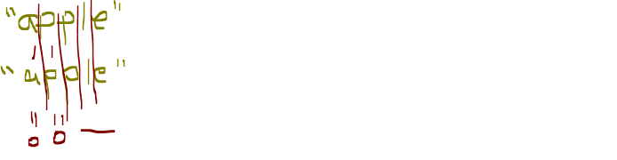

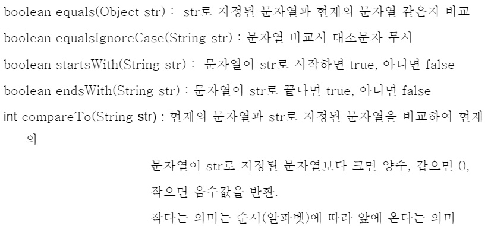


- **문자열 비교**

```java
package kr.ac.kopo.day09;

public class StringMain03 {

	public static void main(String[] args) {
		
		//방법1.
		//이렇게 str, str2를 정의하고 비교하면 같다고 나온다.
		//String str = "hello";
		//String str2 = "hello";
		
		//방법2.
		//str, str2가 다르다고 나옴
		String str = new String("hello");
		String str2 = new String("hello");
		String str3 = new String("HELLO");
		
		System.out.println("****문자열 비교(==)****");
		//주소 비교
		if(str == str2) {
			System.out.println("str == str2");
		}else {
			System.out.println("str != str2");
		}
		
		//왜냐하면 ==의 비교는 주소에 대한 비교이다. 
		//방법 1인 경우는 하나의 문자열 "hello"를 같이 가리킨다.(같은 주소)
		//방법 2인 경우는 생성할 때마다 공간을 할당되므로 주소값이 다르다.
		//그래서 문자 비교는 equals로 해야함
		
		//문자열 비교
		System.out.println("\n****문자열 비교(equals)****");
		boolean bool = str.equals(str2);
		if(bool) {
			System.out.println("str == str2");
		}else {
			System.out.println("str != str2");
		}
		
		//소문자 대문자
		System.out.println("\n****소문자 대문자****");
		boolean bool2 = str.equals(str3);
		boolean bool3 = str.equalsIgnoreCase(str3);
		if(bool2) {
			System.out.println("str == str2");
		}else {
			System.out.println("str != str2");
		}
		
		if(bool3) {
			System.out.println("str == str2");
		}else {
			System.out.println("str != str2");
		}
		
		//문자열 hello로 시작하는지 확인
		System.out.println("\n****문자열 특정 문자열로 시작하는지 확인(startsWith)****");
		String str4 = "hello!!!!!!";
		String sub = "hello";
		boolean bool4 = str4.startsWith(sub);
		if(bool4) {
			System.out.println("[" + str4 + "]은 [" + sub + "]로 시작합니다.");
		}else {
			System.out.println("[" + str4 + "]은 [" + sub + "]로 시작하지 않습니다.");
		}
		
		//문자열이 특정 문자열로 끝나는지 확인
		System.out.println("\n****문자열이 특정 문자열로 끝나는지 확인(endsWith)****");
		String str5 = "hello.txt";
		boolean bool5 = str5.endsWith(".txt");
		if(bool5) {
			System.out.println("[" + str5 + "]은 텍스트 파일입니다.");
		}else {
			System.out.println("[" + str5 + "]은 텍스트 파일이 아닙니다.");
		}
		
		//문자열 크기비교
		System.out.println("\n****문자열 크기비교(compareTo)****");
		String str6 = "boat";
		String str7 = "board";
		int compare = str6.compareTo(str7);
		if(compare == 0) {
			System.out.println(str + " == " + str2);
		}else if(compare < 0) {
			System.out.println(str + " < " + str2);
		}else {
			System.out.println(str + " > " + str2);
		}
		
		//String 멤버변수 연습 
		String[] names = {"강길동", "홍길동", "홍길순", "김길동", "윤길동", "박철홍", "홍길동"};
		
		System.out.println("\n****이름이 홍길동인 사람 검색(equals)****");
		for(String name : names) {
			if(name.equals("홍길동")) {
				System.out.print(name + "\t");
			}
		}
		
		System.out.println("\n****성이 홍씨인 사람 검색(startsWith)****");
		for(String name : names) {
			if(name.startsWith("홍")) {
				System.out.print(name + "\t");
			}
		}
		
		System.out.println("\n****이름이 길동인 사람 검색(endsWith)****");
		for(String name : names) {
			if(name.endsWith("길동")) {
				System.out.print(name + "\t");
			}
		}
		
		System.out.println("\n****이름에 홍이 포함된 사람 검색(contains)****");
		for(String name : names) {
			if(name.contains("홍")) {
				System.out.print(name + "\t");
			}
		}
	}
}
```

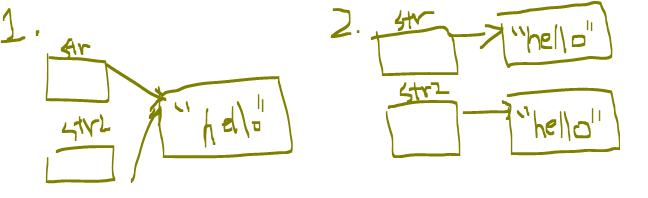


- **문자열 탐색**
  - indexOf : 특정 문자열이 있는지 확인(특정 문자열이 어디에 있는지 index값이 출력)  
  - lastindexOf : 끝에서부터 검색

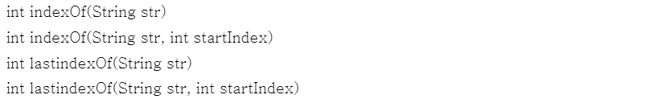

```java
package kr.ac.kopo.day09;

public class StringMain03 {

	public static void main(String[] args) {
		
		System.out.println("\n\n****문자열 탐색(index)****");
		String str8 = "hello world";
		
		int searchIdx = str8.indexOf("o");
		System.out.println("o의 indexOf() : " + searchIdx);
		
		searchIdx = str8.indexOf("p");
		System.out.println("p의 indexOf() : " + searchIdx);
		
		searchIdx = str8.lastIndexOf("o");
		System.out.println("o의 lastOf() : " + searchIdx);
		
		searchIdx = str8.indexOf("o",5);
		System.out.println("index('o',5) : " + searchIdx);
		
		
		System.out.println("\n< " + str8 +"에서 l의 위치 출력 > ");
		System.out.println("첫 번째 방법");
		char ch = 'l' ;
		searchIdx = str8.indexOf(ch);
		while(searchIdx != -1) {
			System.out.println("검색된 위치 : " + searchIdx);
			searchIdx = str8.indexOf(ch,searchIdx+1);
		}
		
		//===========================================
		System.out.println("\n두 번째 방법");
		searchIdx = -1;
		while((searchIdx = str8.indexOf(ch, searchIdx+1)) != -1) {
			System.out.println("검색된 위치 : " + searchIdx);
		}
	}
}
```

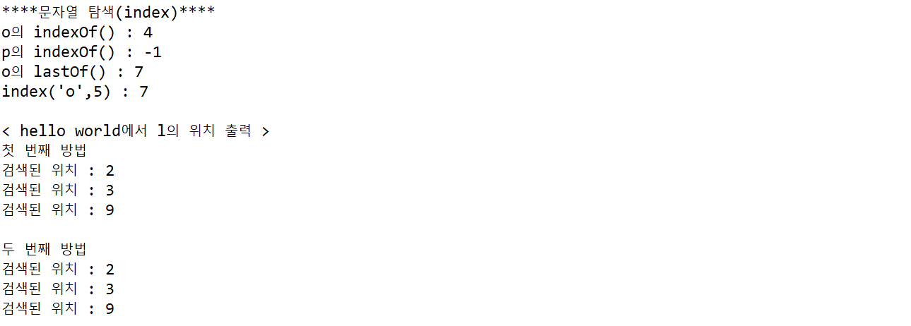


- **문자열 변환**
  - 자신의 데이터는 바뀌지 않음(그 속성이 바뀌지 않음)
  - substring는 endIndex-1 번지 까지 출력 

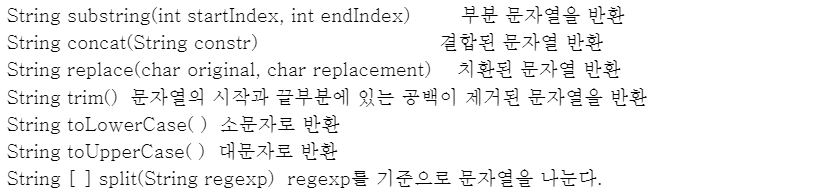


```java
package kr.ac.kopo.day09;

import java.util.Arrays;

public class StringMain04 {

	public static void main(String[] args) {
		
		String str = "hello world" ; 
		System.out.println("str : [" + str +"]");
		
		//***substring()***
		System.out.println("\n****substring****");
		String subStr = str.substring(1,5);
		System.out.println("substring(1,5) : ["+subStr+"]");
		//String은 한 번 만들면 변화하지 않는 문자열이기 때문에 원본은 변하지 않음
		System.out.println("str : ["+str+"]");
		
		subStr = str.substring(6);
		System.out.println("substring(1) : ["+subStr+"]"); //substirng(6,str.length())과 같은 말 
		
		//***concat()***
		System.out.println("\n****concat****");
		String str1 = "hello" ; 
		String str2 = "!!!!!" ;
		str = str1.concat(str2);
		System.out.println("str1.concat(str2) : [" + str + "]");
		System.out.println("str1 + str2 : [" + (str1 + str2) + "]");
		
		//***replace()***
		System.out.println("\n****replace****");
		System.out.println("replace() 전 : " + str);
		str = str.replace("ll", "rrrrrr") ;
		System.out.println("replace() 후 : " + str); //들어간 문자나 문자열이 모두 바뀐다.
		
		//***trim()***
		System.out.println("\n****trim****");
		str = "    he  llo       " ; 
		System.out.println("trim() 전 [" + str + "] 길이 : " +str.length());
		str = str.trim();
		//중간의 공백은 제거되지 않음 좌우 공백만 제거
		System.out.println("trim() 전 [" + str + "] 길이 : " +str.length());
		
		//***toLowerCase(), toUpperCase()***
		System.out.println("\n****toLowerCase(), toUpperCase()****");
		str = "Hello World!!!" ;
		System.out.println("str : " + str);
		System.out.println("toLowerCase() : " + str.toLowerCase());
		System.out.println("toUpperase() : " + str.toUpperCase());
		
		//***split()***
		System.out.println("\n****split()****");
		str = "홍길동전:허균:조선시대" ; 
		String[] strArr = str.split(":");
		System.out.println(Arrays.toString(strArr));
		
		String ip = "192.168.5.203" ; 
		String[] ipArr = ip.split("\\."); //.은 구분자로 표시할 수 있게 하기위해 \\
		System.out.println(Arrays.toString(ipArr)); 
	}
}
```

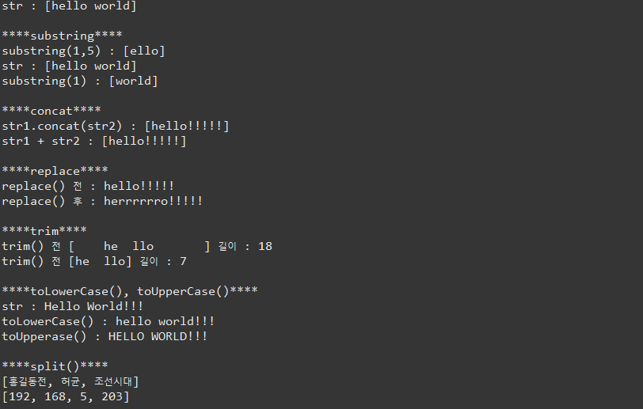


- **형변환**
  - 어떤 값이든 모두 문자열로 변환

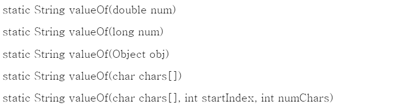

```java
package kr.ac.kopo.day09;

import java.util.Arrays;

public class StringMain04 {

	public static void main(String[] args) {
		
		System.out.println("\n****valueOf()****");
		int num = 123;
		//정수를 문자로 바꾸는 방법1.
		String strNum = num + "";
		//정수를 문자로 바꾸는 방법2.
		strNum = String.valueOf(num) ; 
		System.out.println("strNum(문자열) + 30(정수) : " + strNum + 30); 
		
	}
}
```

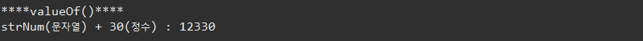


- **Stirng** 
  - 문자열은 한 번 만들면 수정할 수 없다. (변화하지 않는다. )
  - 즉, 다시 heap영역에 새로 공간을 만들어서 그 새로 만들어진 공간의 주소값을 변수에 저장하는 것이다.
  - 그래서 int형과 String형에서 속도 차이가 나는 것이다.
  - 그래서 변하는 문자열인 StringBuffer나 StringBuilder를 사용하면 더 빠르다.

###### < int type >

```java
package kr.ac.kopo.day09;

public class StringMain05 {

	public static void main(String[] args) {
		
		long start = System.currentTimeMillis();
		int sum = 0;
		for(int i = 0; i < 100000; i++) {
			sum += i ;
		}
		long end = System.currentTimeMillis();
		System.out.println("소요시간 : " + (end - start) / 1000.0 + "초");
	}
}
```


###### < String type >

```java
package kr.ac.kopo.day09;

public class StringMain05 {

	public static void main(String[] args) {
		
		long start = System.currentTimeMillis();
		String str = "";
		for(int i = 0; i < 100000; i++) {
			str += i ;
		}
		long end = System.currentTimeMillis();
		System.out.println("소요시간 : " + (end - start) / 1000.0 + "초");
	}
}
```


###### < String & StringBuffer type >

```java
package kr.ac.kopo.day09;

public class StringMain05 {

	public static void main(String[] args) {
		
		long start = System.currentTimeMillis();
		int sum = 0;
		String str = "";
		for(int i = 0; i < 100000; i++) {
			str += i ;
		}
		long end = System.currentTimeMillis();
		System.out.println("소요시간(String) : " + (end - start) / 1000.0 + "초");
		
		//--------------------------------------------------------------
		
		start = System.currentTimeMillis();
		StringBuffer buffer = new StringBuffer(); //비어있는 문자열 형태로 생성
		
		for(int i = 0; i < 100000; i++) {
			buffer.append(i) ; 
		}
		end = System.currentTimeMillis();
		System.out.println("소요시간(StringBuffer) : " + (end - start) / 1000.0 + "초");
		
	}
}
```


#### static

- **static의 특징**

  - static에는 변수나 메소드에만 붙일 수 있다. class에 붙이지 못 함.
  - static은 하나만 만들고 공유한다.
  - 로딩시점
    - static : 클래스 로딩 시(더 빠르게 생성됨)
    - nonStatic : 객체 생성 시
  - 메모리상의 차이
    - static : 클래스당 하나의 메모리 공간만 할당
    - nonStatic : 인스턴트 당 메모리가 별도로 할당
  - 생성시점은 static이 빠르다.

  - 실행 시 메모리 영역
    - 상수값들은 모두 Method Area에 저장되어 하나의 값을 공유한다.
    - static에서 나오는 class variables가 Method Area에 저장된다.

  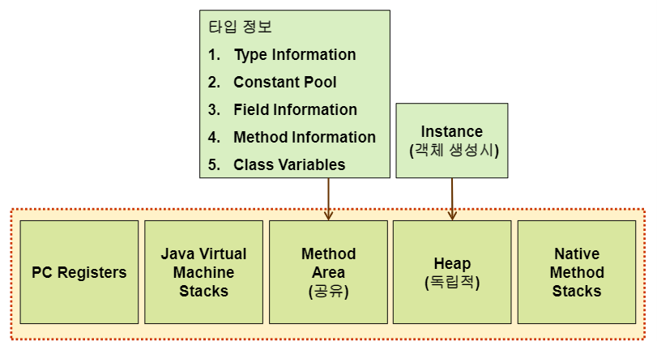

  - 문법적 특징

    - static : 클래스 이름으로 접근
    - nonStatic : 객체 생성 후 접근
      - static은 클래스당 하나의 메모리 공간만 할당된다.
      - static의 메소드나 변수가 생성되어 있을 수도 있지만 nonStatic은 아직 생성되지 않았을 수도 있다(생성 시점이 다르므로) 그래서 static 영역에서는 non-static 영역을 직접 접근이 불가능하다.
      - 그러나 non-static 영역이 생겼을 때는 static 영역도 생겼으므로 non-static 영역에서는 모두 접근 가능
      - static 키워드가 가장 먼저 만들어짐
        - Employee e 를 했을 때 method Area의 공간에 empCount가 생성된다.
        - 그러면 heap 영역에 e의 참조변수가 만들어지기 전에 empCount에 어떻게 접근하는지?
        - 그래서 클래스명.변수명(Employee.empcount) 로 접근한다.

    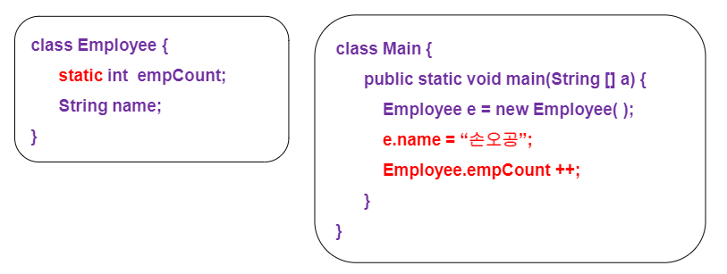 

    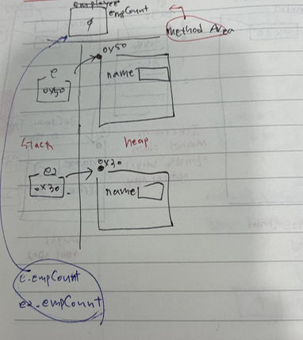 

  - static 영역에서는 non-static 영역을 직접 접근이 불가능하다.

  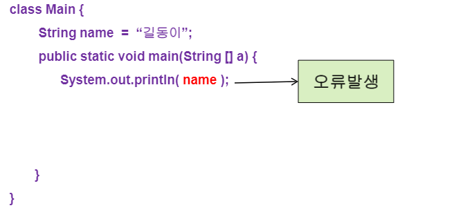

  - static 메소드에서는 this를 사용하지 못함(객체와 관련되지 않았으므로)
  - non-static 영역에서는 static 영역에 대한 접근이 가능

  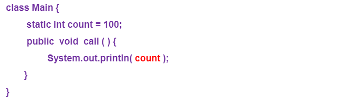

  - 인스턴스 객체가 이미 만들어져 있는 시점에는 static 변수를 사용할 수 있다.
    - Cat class 안에 getKind() 메소드가 있는 상황이고 kind는 static 변수
    - 만약 kind 변수가 static이라면 Cat c = new Cat(); c.getKind(); 로 사용 할 수 있다. (이미 인스턴스 객체가 만들어진 상황) 
    - 근데 인스턴스 객체가 만들어지지 않은 상황이라면 Cat.kind 로 찍어도 된다. 그러나 직접적으로 멤버변수를 호출하는 것을 좋지 않다. 그러나 getKind()는 일반 메소드로 인스턴스 객체가 생성된 후 사용이 가능하기 때문에 인스턴스 객체를 생성하지 않고 메소드를 사용하고 싶다면 getKind()를 만들 때 static을 붙이면 된다.
    - static을 사용하는 시점에 일반 메소드(or 변수)가 만들어졌다는 보장이 없다. 그래서 static 메소드 내에서는 일반 변수를 사용할 수 없다. 
    - 그러나 일반 메소드를 사용하는 시점에서는 static이 모두 만들어진 상황이므로 일반 메소드 안에서 static 변수(or 메소드)를 사용할 수 있다.
    - 그래서 static 메소드 안에서 this를 사용할 수 없다.(this)는 멤버변수를 지정하기 위해서 사용하는 것인데 static을 사용할 때 멤버변수가 생성되어 있다는 보장이 없기 때문이다.


- **static** **사용** **예**

###### <Employee.java>

```java
package kr.ac.kopo.day09;

public class Employee {
	
	static int totalEmployee ;
	private String name;
	private int salary;
	private String grade;
	Employee() {
		++totalEmployee ;
	}
	
	Employee(String name, int salary, String grade) {
		this.name = name;
		this.salary = salary;
		this.grade = grade;
		++Employee.totalEmployee ;
	}
	
	void info(){
		//this는 생략 가능
		System.out.println("사원명 : " + this.name 
				+ ", 연봉 : " + this.salary + ", 직급 : " + this.grade );
		Employee.printTotalEmployee();
		//static 메소드 사용 가능 
		//일반메소드 안에서 static 메소드 사용 가능
	}
	
	static void printTotalEmployee() {
		System.out.println("총 사원 수 : " + Employee.totalEmployee);
		//static 변수라는 것을 한 눈에 확인할 수 있도록 class명.변수명으로 적어준다.
		
		//info()를 호출할 수 없다. 
		//static 메소드 안에서 일반 메소드를 호출할 수 없다.
		//static만 만들어져 있는 시점에 일반 메소드가 생성이 되지 않을 수도 있으므로 
		//this도 사용 불가능
	}
	
	public String getName() {
		return name;
	}
	public void setName(String name) {
		this.name = name;
	}
	public int getSalary() { 
		return salary;
	}
	public void setSalary(int salary) {
		this.salary = salary;
	}
	public String getGrade() {
		return grade;
	}
	public void setGrade(String grade) {
		this.grade = grade;
	}
}
```

###### <EmployeeMain.java>

```java
package kr.ac.kopo.day09;

public class EmployeeMain {

	public static void main(String[] args) {
		
		Employee.printTotalEmployee();
		
		Employee e = new Employee("홍길동",1200,"과장");
		Employee e2 = new Employee("조세진",6000,"사원");
		Employee e3 = new Employee("윤길동",3600,"사원");
		e.info();
		e2.info();
		e3.info();
		
		//총 사원 수 
		Employee.printTotalEmployee();
		//static을 사용하지 않으면 총 1명이라고 나온다.
		//왜냐하면, 인스턴스 객체를 생성할 때마다 totalEmployee의 변수는
        //0으로 초기화 된다. 그래서 1명이라고 나오는 것임
		
		System.out.println("첫 번째 사원 명 : " + e.getName());
		//연봉협상 홍길동
		e.setSalary(2000);
		System.out.println("첫 번째 사원 연봉 : " +e.getSalary());
		
	}
}
```

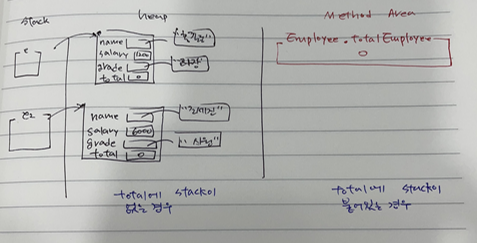 

- totalEmployee는 인스턴스 객체가 생성할 때마다 초기화되어 0으로 된다. 그래서 static을 붙이지 않으면 총 사원 수는 : 1이 나온다. 그래서 totalEmployee는 class당 1개의 공간만 생성되면 된다. 그래서 공유할 수 있는 static을 붙여서 생성하면 된다. 

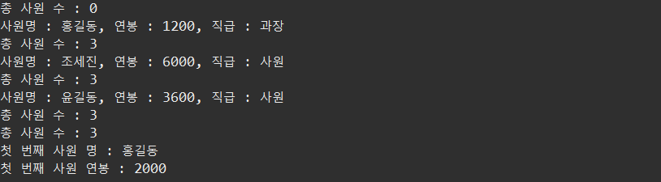

- static 변수인데 상수로 만들고 싶다면 static final을 붙여서 변수를 생성하면 된다.
- 총 개수를 셀 때, 클래스가 같은 값을 갖는 경우 static을 사용한다.

