#### 3/18 복습

- **static**
  - 멤버 변수나 메소드에 붙일 수 있다.
  - static final인 경우는 굳이 static 메소드를 사용하지 않아도 된다.(final 같은 경우는 외부에서 수정할 수 없어서)
  - static 변수는 JVM이 class를 읽을 때(load할 때) 생성되고 하나의 메모리를 할당받아 사용한다. 
  - non-static 변수는 인스턴스 객체가 만들 때 생성된다 그리고 인스턴스 객체를 만들 때마다 각자의 메모리를 할당받아 생성된다.
- **String**
  - indexOf(), compareTo(), equalsIgnoreCase(), trim(), toLowerCase(), concat(), toUpperCase(), valueOf() ...


#### 과제 

- day09 5번문제 - 문자열을 입력받아 거꾸로 변경하는 reverseString 메소드

```java
package kr.ac.kopo.day10.homework;

public class StringUtil {
	/**
	 * day09 과제 메소드및문자열 5번
	 * 문자열을 거꾸로 변경하는 메소드
	 * @param 변경할문자열 
	 * @return 변경될문자열
	 */
	//방법1
	public String reverseString(String str) {
		
		char[] charArr = new char[str.length()];
		for(int i = str.length() -1 ,j=0;i>=0;i--) {
			charArr[j++] = str.charAt(i);
		}
		return new String(charArr);
	}
	
	//방법2
	public String reverseString2(String str) {
		//String class는 수정이 불가능하지만
		//StringBuffer는 수정이 가능하다.
		StringBuffer sb = new StringBuffer();
		for(int i = str.length() -1;i>=0;i--) {
			sb.append(str.charAt(i));
		}
		return sb.toString();
	}
	
	//방법3
	public String reverseString3(String str) {
		//0번지 n번지, 1번지 n-1번지, 2번지 n-2번지와 서로 char를 바꾸기
		int length = str.length();
		char[] charArr = new char[length];
		str.getChars(0, length, charArr, 0);
		for(int i=0,j=length-1;i<length/2;i++,j--) {
			char temp = charArr[i];
			charArr[i] = charArr[j];
			charArr[j] = temp;
		}
		return new String(charArr);
	}
		
}
```


- day09 - 메소드 및 문자열 6번 문제

```java
package kr.ac.kopo.day10.homework;

public class StringUtil {
	/**
	 * 문자열을 대문자로 변경하는 메소드
	 * @param String
	 * @return String
	 */
	//방법1 - byte 배열
	public String toUpperString(String str) {
		//byte 배열 
		byte[] bytes = new byte[str.length()];
		for(int i=0;i<str.length();++i) {
			byte b = (byte)str.charAt(i);
			//소문자인 경우 대문자로 변경
			if(b>='a' && b<='z') {
				b = (byte)(b - ('a' - 'A'));
			}
			bytes[i] = b;
		}
		return new String(bytes);
	}
	//방법2 - char 배열
	public String toUpperString2(String str) {
		char[] chars = new char[str.length()];
		str.getChars(0, str.length(), chars, 0);
		for(int i=0;i<chars.length;++i) {
			//소문자인 경우 대문자로 변경
			if(chars[i]>='a' && chars[i]<='z') {
				chars[i] -= ('a' - 'A');
			}
		}
		return new String(chars);
	}
}
```


------

#### 상속

- 확장성, 재사용성

- 클래스 선언 시 extends 키워드를 명시

  - Manager class는 Employee class를 상속받았다.

  

- 관계

  - 부모(상위, Super) 클래스 : Employee
  - 자식(하위, Sub) 클래스 : Manager

- 자식 클래스는 부모 클래스에 선언되어 있는 멤버변수, 메소드를 자신의 것처럼 사용할 수 있다.

  - 단, 접근제한자에 따라 사용 여부가 달라진다.
  - 부모 클래스에 있는 변수명을 자식 클래스에서도 사용할 수 있다. 대신 자신의 클래스에서 선언한 것이 우선되어 실행된다.
  - 그래서 만약에 Manager class에  no의 변수가 정의되었다면 this.no는 자식의 no가 된다.
  - 만약 부모의 no를 사용하고 싶다면 super.no

  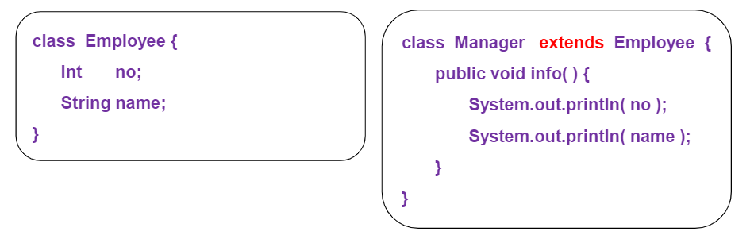

  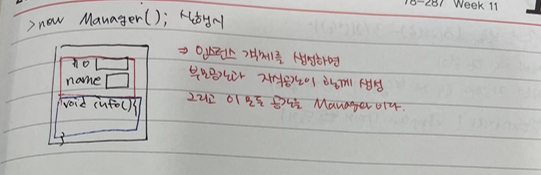 

  

- super 키워드

  - super.변수 : 상위클래스의 멤버변수 접근
  - super.메소드명 : 상위클래스의 메소드 접근
  - super ([인자,..]) : 상위 클래스 생성자 호출
    - this와 super는 같이 쓰지 못한다. 왜냐하면 this나 super는 생성자의 맨 처음 줄에 나와야 한다. 그래서 생략할 수 있음
    - ex) 모든 클래스의 생성자가 생성될 때 그 안에 super();가 생략되어 있는 거임 그래서 맨 처음 줄에 this()를 사용할 수 있다.
      - Manager() { super(); }

  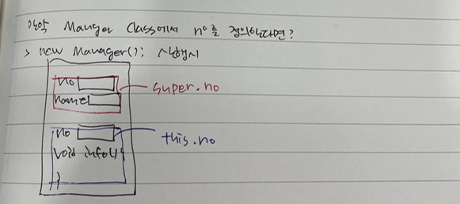 


- **extends**
  - 한명의 자식은 하나의 class만 상속 받을 수 있다.(다중상속 안됨)

```java
package kr.ac.kopo.day10;

class One{
	One(){
		System.out.println("One 생성자 호출...");
	}
}

class Two extends One{
	Two(){
		//super();이게 숨어있기때문에 One 생성자도 호출되는 것이다. 
		System.out.println("Two 생성자 호출...");
	}
}

class Three extends Two {
	Three(){
		//super();이게 숨어있기때문에 Two 생성자도 호출되는 것이다. 
		System.out.println("Three 생성자 호출...");
	}
}

public class ExtendsMain {

	public static void main(String[] args) {
//		new One();
//		new Two();
		new Three();
	}
}
```


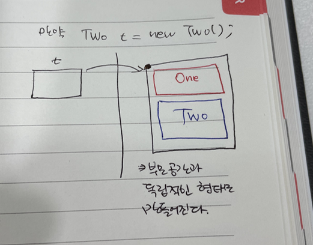 


- **사원관리** **class**
  - 관리자도 사원의 한 형태이므로 관리자와 사원 class에서 겹치는 변수가 많다.
  - 그래서 상속관계로 바꿔줘야함

###### <Employee.java>

```java
package kr.ac.kopo.day10;

//사원 클래스
public class Employee {
	int no; //사원번호
	String name; 
	int salary;
	String grade;
	
	Employee() {
		
	}
	Employee(int no, String name, int salary, String grade) {
		this.no = no;
		this.name = name;
		this.salary = salary;
		this.grade = grade;
	}
	void info() {
		System.out.println("사원번호 : " + no + ", 이름 : " + name 
				+ ", 연봉 : " + salary + ", 직급 : " + grade);
	}
	
}

```

###### <Manager01.java>

```java
package kr.ac.kopo.day10;

//관리자 클래스
public class Manager01 {
	int no ;
	String name;
	int salary;
	String grade;
	Employee[] empList; //관리사원 목록
	
	Manager() {
		
	}
	Manager(int no, String name, int salary, String grade, Employee[] empList){
		this.no = no;
		this.name = name;
		this.salary = salary;
		this.grade = grade;
		this.empList = empList;
	}
	
	void info() {
		System.out.println("사원번호 : " + no + ", 이름 : " + name 
				+ ", 연봉 : " + salary + ", 직급 : " + grade);
		System.out.println("======================================");
		System.out.println("관리사원 목록");
		System.out.println("======================================");
		for(Employee e : empList) {
			e.info();
		}
		System.out.println("======================================");
	}
}

```

###### <ExtendsMain02.java>

```java
package kr.ac.kopo.day10;

//Employee와 함께 예 
public class ExtendsMain02 {

	public static void main(String[] args) {
		//*****사원정보 등록*****
		System.out.println("\n\n*****사원*****");
		//사원번호가 1, 연봉을 4000을 받는 홍길동 사원 객체 생성
		Employee e = new Employee(1,"홍길동",4_000,"사원");
		//숫자에서 3자리 수마다_문자가 ,라고 생각하면 됨
		//자릿수에 대해서 보기 편하게 하기 위함(출력은 안 됨)
		Employee e2 = new Employee(1,"박길동",4_200,"사원");
		Employee e3 = new Employee(1,"강길동",4_800,"대리");
		Employee e4 = new Employee(1,"한길동",5_500,"과장");
		Employee e5 = new Employee(1,"윤길동",5_200,"대리");
		
		e.info();
		e2.info();
		e3.info();
		e4.info();
		e5.info();
		
		System.out.println("\n\n*****관리자*****");
		//*****관리자*****
		Employee[] empList = {e, e2, e4};
		Manager m = new Manager(100, "나캡틴", 9_000, "부장", empList);
		m.info();
		
		
	}

}
```

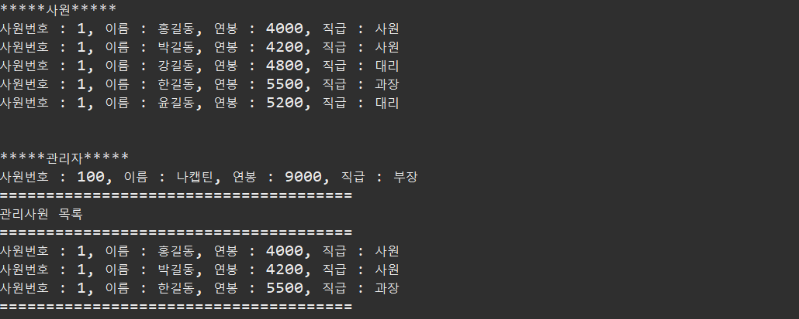


- 상속하여 사원 관리
  - 상속으로 중복 제거
  - 자신의 클래스에 없는 멤버변수를 this를 사용해도 에러가 안나는 이유는
    - 자신의 클래스에서 멤버변수가 없다면 부모 클래스에서 자동으로 확인해서 에러가 나지 않는다.

###### <Manager02.java>

```java
package kr.ac.kopo.day10;

//관리자 클래스
public class Manager02 extends Employee{
	
	Employee[] empList; //관리사원 목록
	
	Manager02() {
		
	}
	Manager02(int no, String name, int salary, String grade, Employee[] empList){
		this.no = no; 
		//this를 사용하면 원래 자신의 클래스에 있는 멤버변수를 지칭하는 것인데
		//상속을 받았을 때 자신의 클래스에 멤버변수가 존재하지 않으면
		//부모 클래스에서 자동으로 확인하므로 에러가 발생하지 않는다.
		this.name = name;
		this.salary = salary;
		this.grade = grade;
		this.empList = empList;
	}
	
	void info() {
		super.info();
		System.out.println("======================================");
		System.out.println("관리사원 목록");
		System.out.println("======================================");
		for(Employee e : empList) {
			e.info();
		}
		System.out.println("======================================");
	}
}
```

###### <Employee.java>

```java
package kr.ac.kopo.day10;

//사원 클래스
public class Employee {
	int no; //사원번호
	String name; 
	int salary;
	String grade;
	
	Employee() {
		
	}
	Employee(int no, String name, int salary, String grade) {
		this.no = no;
		this.name = name;
		this.salary = salary;
		this.grade = grade;
	}
	void info() {
		System.out.println("사원번호 : " + no + ", 이름 : " + name 
				+ ", 연봉 : " + salary + ", 직급 : " + grade);
	}
}
```

###### <ExtendsMain02.java>

```java
package kr.ac.kopo.day10;

//Employee와 함께 예 
public class ExtendsMain02 {

	public static void main(String[] args) {
		//*****사원정보 등록*****
		System.out.println("\n\n*****사원*****");
		//사원번호가 1, 연봉을 4000을 받는 홍길동 사원 객체 생성
		Employee e = new Employee(1,"홍길동",4_000,"사원");
		//숫자에서 3자리 수마다_문자가 ,라고 생각하면 됨
		//자릿수에 대해서 보기 편하게 하기 위함(출력은 안 됨)
		Employee e2 = new Employee(1,"박길동",4_200,"사원");
		Employee e3 = new Employee(1,"강길동",4_800,"대리");
		Employee e4 = new Employee(1,"한길동",5_500,"과장");
		Employee e5 = new Employee(1,"윤길동",5_200,"대리");
		
		e.info();
		e2.info();
		e3.info();
		e4.info();
		e5.info();
		
		System.out.println("\n\n*****관리자*****");
		//*****관리자*****
		Employee[] empList = {e, e2, e4};
		//Manager01 m = new Manager01(100, "나캡틴", 9_000, "부장", empList);
		Manager02 m = new Manager02(100, "나캡틴", 9_000, "부장", empList);
		m.info();
		
		
	}
}
```


- **오버라이딩(재정의)**
  - 상속관계에서 발생
  - 오버라이딩은 메소드 명과 매개변수 타입, 개수도 동일해야 한다.
  - 상위클래스의 메소드를 하위클래스에서 도일한 메소드 선언을 하는 것. 내용부를 다르게 정의함
  - 메소드 선언 부분에서 접근 제한자 부분은 다를 수 있다.
    - 단, 하위 클래스 접근 제한자가 상위 클래스 접근제한자보다 좁으면 안된다.
    - 접근범위 : public > protected > default  > private

###### <Manager02.java>

- 부모의 info()를 오버라이딩 했을 때 어노테이션을 사용해서 오버라이딩 했음을 적어놓으면 error가 났을 때 확인할 수 있다.

```java
package kr.ac.kopo.day10;

//관리자 클래스
public class Manager02 extends Employee{
	
	Employee[] empList; //관리사원 목록
	
	Manager02() {
		
	}
	Manager02(int no, String name, int salary, String grade, Employee[] empList){
		this.no = no; 
		//this를 사용하면 원래 자신의 클래스에 있는 멤버변수를 지칭하는 것인데
		//상속을 받았을 때 자신의 클래스에 멤버변수가 존재하지 않으면
		//부모 클래스에서 자동으로 확인하므로 에러가 발생하지 않는다.
		this.name = name;
		this.salary = salary;
		this.grade = grade;
		this.empList = empList;
	}
	
	@Override
	void info() {
		super.info();
		System.out.println("======================================");
		System.out.println("관리사원 목록");
		System.out.println("======================================");
		for(Employee e : empList) {
			e.info();
		}
		System.out.println("======================================");
	}
}
```


###### <Manager03.java>

- no, name, salary, grade는 Manager03에서 정의한 것이 아니고 부모 클래스에서 정의한 것이다.
- Employee의 값을 초기화할 수 있는 생성자가 존재한다. 그래서 부모 클래스에서 처리할 수 있도록 코드를 작성

```java
package kr.ac.kopo.day10;

//관리자 클래스
public class Manager03 extends Employee{
	
	Employee[] empList; //관리사원 목록
	
	Manager03() {
		
	}
	Manager03(int no, String name, int salary, String grade, Employee[] empList){
		super(no,name,salary,grade); //부모 클래스의 생성자를 호출
        //매개변수가 없는 class를 호출할 때는 생략해도 되는데
        //매개변수가 있는 경우는 생략하면 안된다.
		this.empList = empList;
	}
	
	@Override
	void info() {
		super.info();
		System.out.println("======================================");
		System.out.println("관리사원 목록");
		System.out.println("======================================");
		for(Employee e : empList) {
			e.info();
		}
		System.out.println("======================================");
	}
}
```


- 변수를 직접 가져와서 사용하는 것은 보안상, 유지보수상 좋지 않다. 그래서 부모클래스에 있는 멤버변수들을 private로 바꾸면 그 변수를 직접 가져와서 사용했던 Manager02는 에러가 발생
  - 그래서 생성자와 오버라이딩을 사용하는 것임(Manager03은 에러가 발생하지 않음)

###### <Employee.java>

```java
package kr.ac.kopo.day10;

//사원 클래스
public class Employee {
	private int no; //사원번호
	private String name; 
	private int salary;
	private String grade;
	
	
	Employee() {
		
	}
	Employee(int no, String name, int salary, String grade) {
		this.no = no;
		this.name = name;
		this.salary = salary;
		this.grade = grade;
	}
	void info() {
		System.out.println("사원번호 : " + no + ", 이름 : " + name 
				+ ", 연봉 : " + salary + ", 직급 : " + grade);
	}
	
}

```

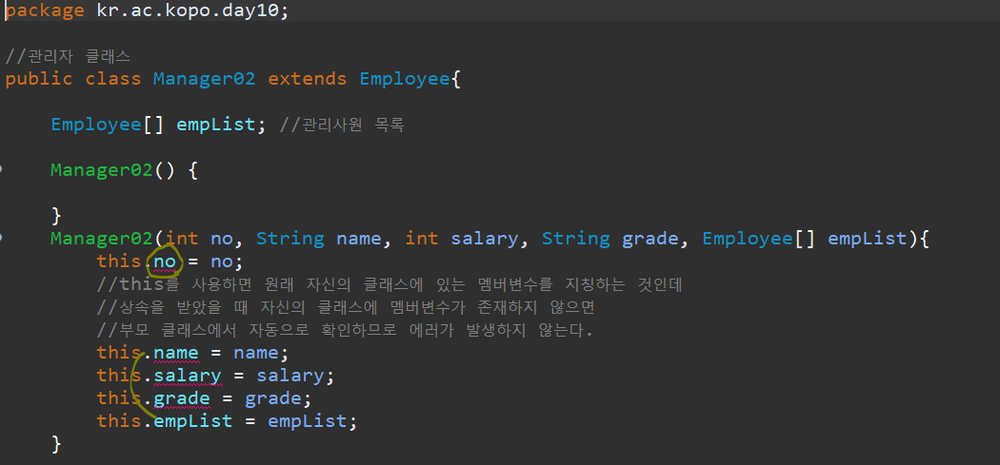


-------------

#### 접근제한자

- 접근제한자
  - public : 모든 위치에서 접근이 가능
  - protected : 같은 패키지에서 접근이 가능, 다른 패키지 접근 불가능
    - 단, 다른 패키지의 클래스와 상속관계가 있을 경우 접근 가능
  - default : 같은 패키지에서만 접근이 허용
    - 접근제한자가 선언이 안 되었을 경우 default가 기본 적용
  - private : 자신 클래스에서만 접근이 허용
  - 클래스(외부) 사용 가능 : public, default
  - 내부클래스, 멤버변수, 메소드 사용 가능 : 4가지 모두 가능

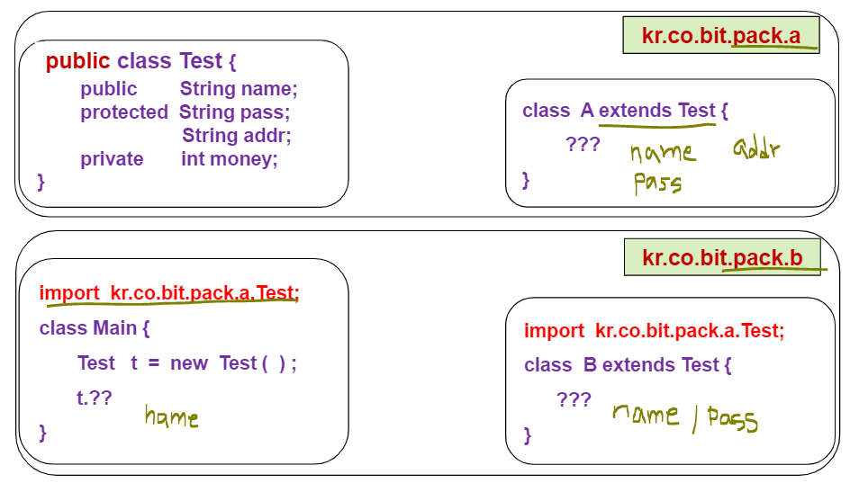


- .java 파일을 생성해서 class를 만들면 그 class는 기본적으로 public으로 정의되어 있다. 근데 main파일 위에 만들어진 class는 public을 사용하면 에러가 난다.


-------------

#### UML 도구 다운로드

- Help - Install New 

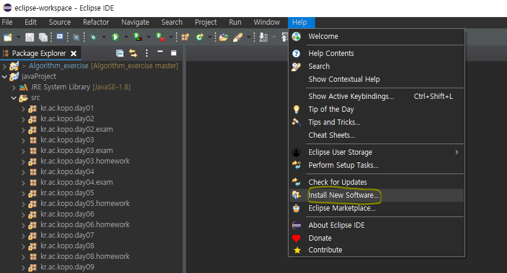


- Work with에 http://takezoe.github.io/amateras-update-site  입력 > enter


- Modeler만 선택 > Next

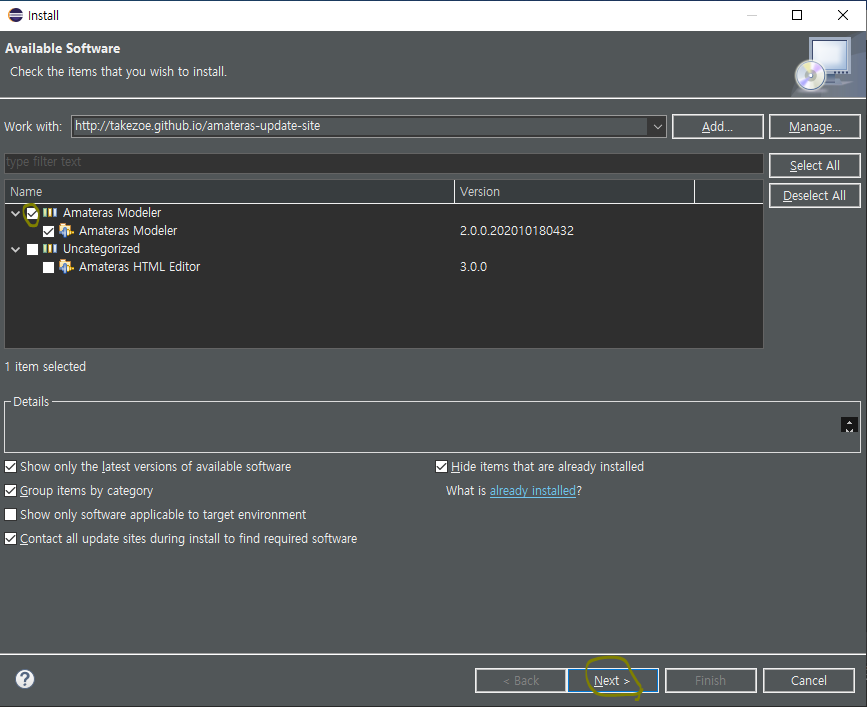


- Next

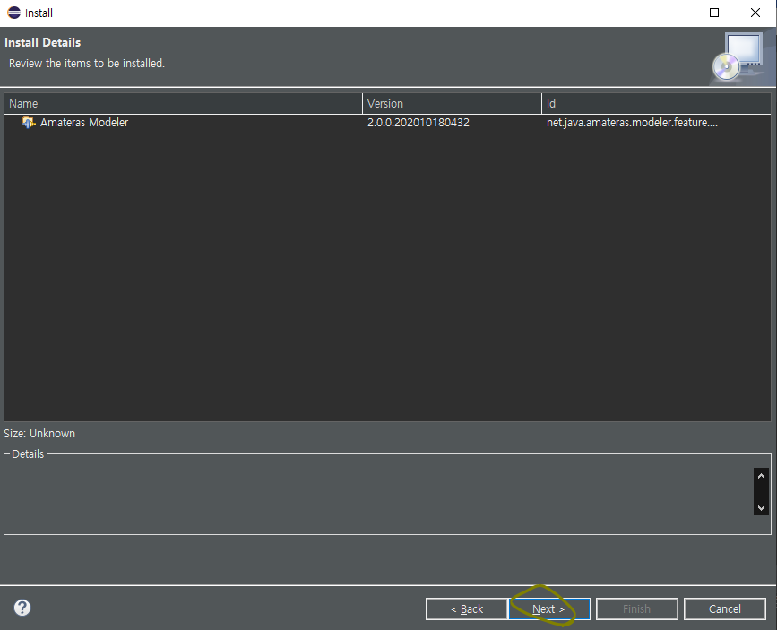


- Finish

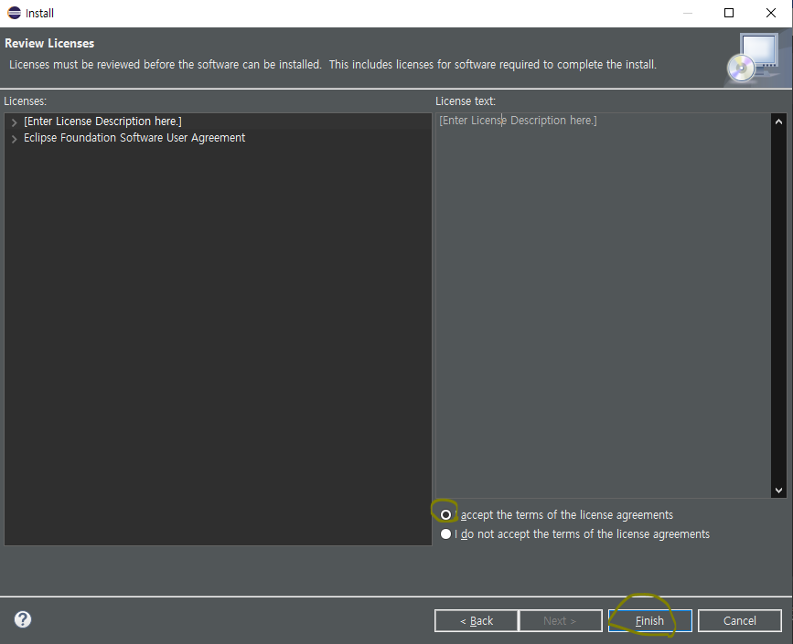


- Install anyway

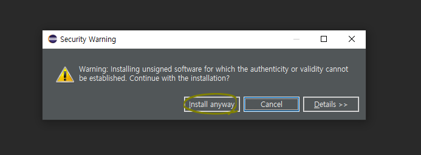 


- Restart Now

 


- 설치 확인
  - ctr + n > AmaterasUML

 

 

- .cld라는 확장자 남겨두고 class diagram 생성

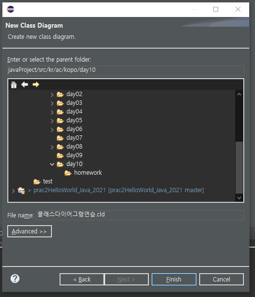 


------------

#### Class Diagram

 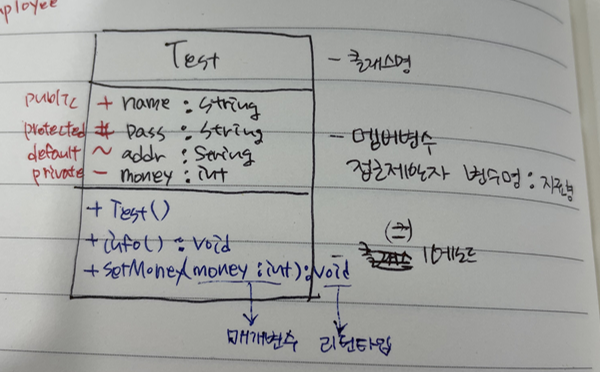

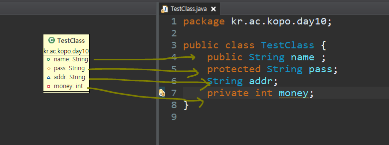

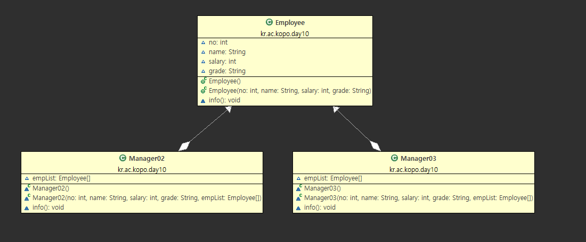


- 클래스 다이어그램 export

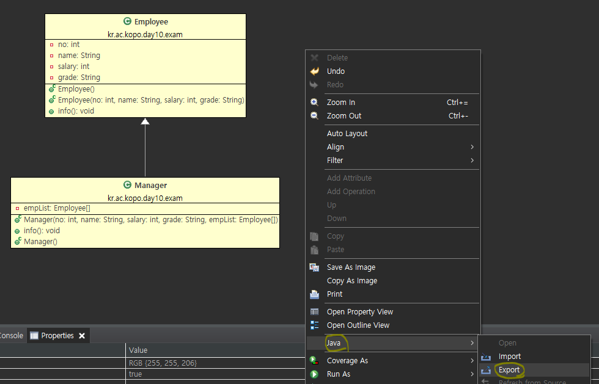

 