#### 3/19 복습

- **상속**
  - 클래스와 클래스 간의 관계를 설정해주는 것
  - 'A는 B다'. '또는 B는 A의 한 종류다.' 라는 관계가 만족해야한다. 그러면 A를 상속받은 B를 만들 수 있다.
    - A를 부모 클래스, B는 자식 클래스
    - extends
  - 접근제한자
  - 상속관계에서는 오버라이딩 (부모가 가지고 있는 메서드를 자식 클래스에서 재정의 - 리런타입 메서드명 매개변수가 모두 같아야 한다.)
    - @Override (에러까지 체크해준다.)
  - this : 자신의 객체에 멤버변수, 생성자, 메서드를 접근
  - super : 부모의 생성자나 메서드, 멤버변수를 접근
  - 기본 생성자를 만들어 주면 super() 생성자를 기본으로 호출(생략되어 있음)
  - 어떤 클래스를 만들든지 내부적으로 Object class를 상속 받는다. 그래서 super()라는 키워드가 있는 것이다. 자바는 단일 상속만 지원하므로 extends object를 사용하지 않는다.(사용하면 다른 class를 상속하지 못하므로)
  - toString(), equals() 는 많이 사용한다.
  - 부모보다 자식의 접근제한자가 큰 범위거나 같아야 한다.


#### 과제 풀이 (day10)

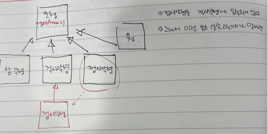 


---------------

#### 추상클래스(abstract)

- 위에서 배운 상속을 받는 이유가 변화에 둔감하게 만들어 주기 위해서이다. (확장성, 재사용성)
- 유지보수 시 수정을 줄이기 위해서 일정한 메서드 명을 유지하기 위해서 상속을 통해 메서드 명을 지정해준다.(표준을 잡아주는 작업)

- **추상 클래스**

  - abstract를 클래스 선언 부분에 추가함

  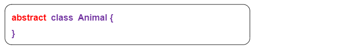

  - 하나 이상의 추상 메서드를 가지고 있는 class를 추상클래스라고 한다. (특징)


- **추상 메서드**

  - 추상 메서드는 메서드의 내용부를 가지고 있지 않다.
  - 선언부만 있고 바디({})가 없음

  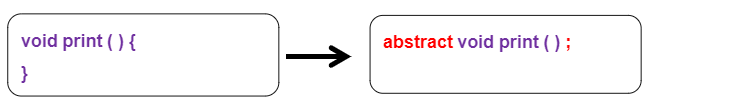

  

- **추상메소드를 포함하는 클래스는 반드시 추상클래스로 선언 되어야 함**

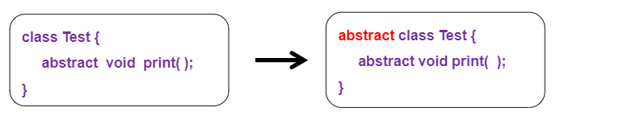


- **추상 클래스는 인스턴스 생성이 불가능함. (new 키워드사용불가능)** 
  - 표준을 만드는 것이 목적이므로 인스턴스 생성을 할 수 없다.
  - 자식의 class를 이용해서 인스턴스 객체를 만들어야 한다.

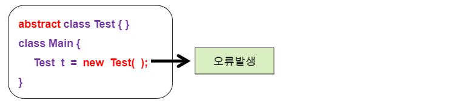


- **추상클래스는 일반(구현된) 메소드와 추상 메소드 모두 선언이 가능함.**
  - 그치만 추상 메서드가 있으면 반드시 추상 class로 만들어 줘야한다.
  - 그러나 인터페이스 같은 경우는 추상 메서드만 가질 수 있다.(일반 메서드를 사용할 수 없다.)

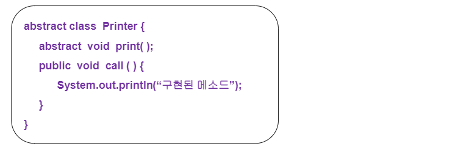


- **추상클래스를 상속받는 하위클래스는 상위클래스의 추상메소드를 반드시 오버라이딩(재정의)  해야한다.**
  - LGPrinter가 오류가 나는 것을 고치는 방법 2가지
    - LGPrinter를 print()를 오버라이딩 하거나
    - LGPrinter를 추상 클래스로 만들어주거나

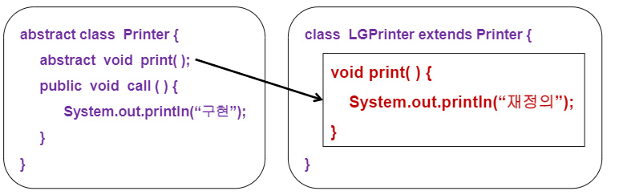


- **추상클래스의 객체변수는 하위클래스를 이용함.**
  - 하위 클래스에서 인스턴스 객체를 생성해야 하므로 객체 변수는 하위 클래스를 이용한다.

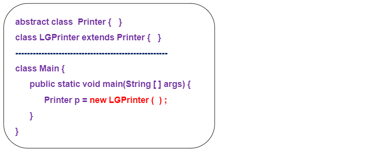


- **예**

  - /*

    프린터를 선택하세요(1. LG, 2. 삼성) = > 1
    */

  - 프린터 회사에 상관없이 프린트하는 기능은 같으므로 회사마다 프린트하는 기능을 따로 만들면 수정하는데 시간이 오래 걸린다. 그래서 프린트 하는 메서드는 하나로 통일하고 이름을 설정하는 메서드를 추가하는 것이 더 좋다.
    - 그래서 printer라는 상위 클래스를 생성하고 그 안의 print()라는 메서드로 출력하는 기능을 통일 
    - 그러나 회사가 달라도 같은 내용이 출력되므로 회사의 차이를 느끼지 못함.

###### <kr.ac.kopo.day11.abs01.Printer.java>

```java
package kr.ac.kopo.day11.abs01;

public class Printer {
	String productName; //제품 명
	
	public void print() {
		System.out.println("출력 중...");
	}	
}
```


###### <kr.ac.kopo.day11.abs01.Menu.java>

```java
package kr.ac.kopo.day11.abs01;

import java.util.Scanner;

public class Menu {
	Scanner sc = new Scanner(System.in);
	
	//프린터 선택
	public int selectMenu() {
		System.out.print("LV1 프린터를 선택하세요.(1. LG, 2. 삼성) => ");
		int no = sc.nextInt();
		sc.nextLine();
		return no;
	}
	
	//전체
	public void choice () {
		int type = selectMenu();
		print(type);
	}
	
	//선택한 번호의 출력 값
	public void print(int no) {
		switch(no) {
		case 1 :
			LGPrinter lg = new LGPrinter();
			lg.print();
			break;
		case 2 :
			SamsungPrinter sam = new SamsungPrinter();
			sam.print();
			break;
		}
	}
}
```


###### <kr.ac.kopo.day11.abs01.userMain.java>

```java
package kr.ac.kopo.day11.abs01;

/*
 * 프린터를 선택하세요(1. LG, 2. 삼성) = > 1
 */
public class UserMain {

	public static void main(String[] args) {
		Menu menu = new Menu();
		menu.choice();
	}

}
```


- **위의 문제점**인 같은 메서드를 실행하면 같은 내용이 출력되는 것을 막기위해서 Printer.java를 **추상클래스**로 만들어 준다. 그리고 하위 클래스에서 재정의 하면서 다른 내용이 출력될 수 있도록 재정의(오버라이딩)한다.


###### <kr.ac.kopo.day11.abs02.Printer.java>

```java
package kr.ac.kopo.day11.abs02;

public abstract class Printer {
	String productName; //제품 명
	
	public abstract void print();
	
	
}

```


###### <kr.ac.kopo.day11.abs02.LGPrinter.java>

```java
package kr.ac.kopo.day11.abs02;

public class LGPrinter extends Printer{
	
	@Override
	public void print() {
		System.out.println("lg 프린터에서 출력 중...");
	}
	
}

```


###### <kr.ac.kopo.day11.abs02.SamsungPrinter.java>

```java
package kr.ac.kopo.day11.abs02;

public class SamsungPrinter extends Printer{
	
	@Override
	public void print() {
		System.out.println("삼성 프린터에서 출력 중...");		
	}
}

```


###### <kr.ac.kopo.day11.abs02.Menu.java>

```java
package kr.ac.kopo.day11.abs02;

import java.util.Scanner;

public class Menu {
	Scanner sc = new Scanner(System.in);
	
	//프린터 선택
	public int selectMenu() {
		System.out.print("LV2 프린터를 선택하세요.(1. LG, 2. 삼성) => ");
		int no = sc.nextInt();
		sc.nextLine();
		return no;
	}
	
	//전체
	public void choice () {
		int type = selectMenu();
		print(type);
	}
	
	//선택한 번호의 출력 값
	public void print(int no) {
		switch(no) {
		case 1 :
			LGPrinter lg = new LGPrinter();
			lg.print();
			break;
		case 2 :
			SamsungPrinter sam = new SamsungPrinter();
			sam.print();
			break;
		}
	}
}

```


###### <kr.ac.kopo.day11.abs02.UserMain.java>

```java
package kr.ac.kopo.day11.abs02;

/*
 * 프린터를 선택하세요(1. LG, 2. 삼성) = > 1
 */
public class UserMain {

	public static void main(String[] args) {
		Menu menu = new Menu();
		menu.choice();
	}
}
```

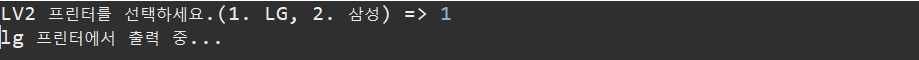


- 프린터를 추가할 때는 해당 회사의 프린터 class를 생성하고 Menu class에서 print(int no) 메서드와 selectMenu()만 수정해주면 된다.


- **모두 Printer class에서 print()라는 메서드를 오버라이딩 하고 있는 상태이다.(상속관계) 그래서 자식의 인스턴스 객체의 주소 값을 부모가 가질 수 있다.**
  - 수정을 더 줄이기 위해서 객체의 주소 값을 부모가 가지게 할 수 있다. 그러나 객체의 주소 값을 부모가 가졌을 때와 자식이 객체의 주소를 가지고 있을 때는 차이가 있다.
    - 좌변과 우변의 타입이 다른 경우 객체 형변환이 나타나고 있는 것임

###### <kr.ac.kopo.day11.abs02.Menu>

```java
package kr.ac.kopo.day11.abs02;

import java.util.Scanner;

public class Menu {
	Scanner sc = new Scanner(System.in);
	
	//프린터 선택
	public int selectMenu() {
		System.out.print("LV2 프린터를 선택하세요.(1. LG, 2. 삼성, 3. HP) => ");
		int no = sc.nextInt();
		sc.nextLine();
		return no;
	}
	
	//전체
	public void choice () {
		int type = selectMenu();
		print(type);
	}
	
	//선택한 번호의 출력 값
	public void print(int no) {
		Printer printer =null;
		switch(no) {
		case 1 :
			printer = new LGPrinter();
			break;
		case 2 :
			printer = new SamsungPrinter();
			break;
		
		case 3 :
			printer = new HPPrinter();
			break;
		}
		if(printer != null) {
			printer.print();
		}else {
			System.out.println("잘못 선택했네?");
			choice();
		}
	}
}
```


- **프린터가 레이저 프린터와 잉크젯 프린터로 나뉘는 경우**
  - HPPrinter도 추상 클래스로 만들어 주고 그 안에 잉크젯 프린터와 레이저 프린터 class로 나누어 준다.(HPPrinter를 상속 받음)

###### <kr.ac.kopo.day11.abs02.HPPrinter>

```java
package kr.ac.kopo.day11.abs02;

//HPPrinter도 추상클래스로 바꿔주기
public abstract class HPPrinter extends Printer {

}

//hp 프린터 중에서 레이저 프린터 class
class HPLaserPrinter extends HPPrinter {
	@Override
	public void print() {
		System.out.println("HP 레이저 프린터에서 출력 중....");
	}
	
}

//hp 프린터 중에서 잉크젯 프린터 class
class HPInkjetPrinter extends HPPrinter {
	@Override
	public void print() {
		System.out.println("HP 잉크젯 프린터에서 출력 중....");
	}
}
```


###### <kr.ac.kopo.day11.abs02.Menu>

```java
package kr.ac.kopo.day11.abs02;

import java.util.Scanner;

public class Menu {
	Scanner sc = new Scanner(System.in);
	
	//프린터 선택
	public int selectMenu() {
		System.out.print("LV2 프린터를 선택하세요.(1. LG, 2. 삼성, 3. HP) => ");
		int no = sc.nextInt();
		sc.nextLine();
		return no;
	}
	
	//전체
	public void choice () {
		int type = selectMenu();
		print(type);
	}
	
	//선택한 번호의 출력 값
	public void print(int no) {
		Printer printer =null;
		switch(no) {
		case 1 :
			printer = new LGPrinter();
			break;
		case 2 :
			printer = new SamsungPrinter();
			break;
		
		case 3 :
			printer = new HPInkjetPrinter(); //잉크젯 클래스로 변경
			break;
		}
		if(printer != null) {
			printer.print();
		}else {
			System.out.println("잘못 선택했네?");
			choice();
		}
	}
}
```

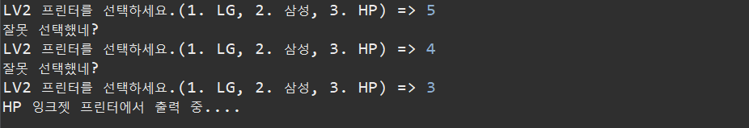


---------

#### 객체 형변환

- cf. 캡슐화 상속 추상화 다형성

- **정의** 
  - 대입 연산자("=")를 기준으로 좌변과 우변의 데이터 타입이 다른 경우에 발생
    - 대입 연산자에서만 되는 것임


- **조건**

  - 좌변과 주변의 객체가 **상속관계**가 있어야 함

  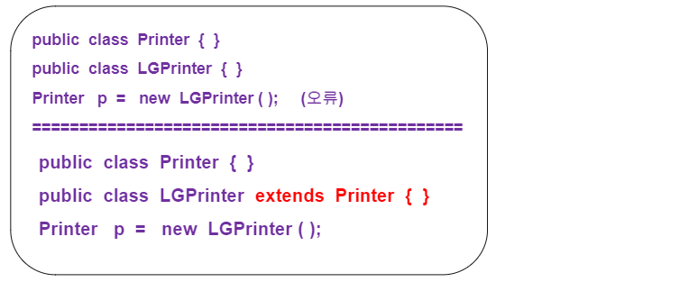


- **객체 형변환의 종류**

  - **묵시적 형변환**

    - 상위(부모) 클래스 타입 = 하위(자식) 클래스 타입

      Printer p = new LGPrinter();

    - 부모의 타입은 자식타입을 포함

    - 기억해야 할 중요 포인트:

      - 형변환 된 상위 클래스 변수가 사용할 수 있는 범위는 자신 클래스에 정의된 변수와 메소드만 사용이 가능
      - 단, 상위 클래스의 메소드를 하위 클래스에서 오버라이딩(재정의) 했을 경우 하위 클래스에 선언된 메소드가 호출

      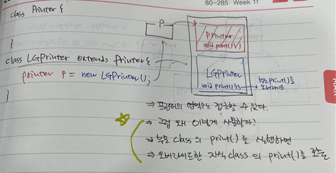

      

    - 접근 가능 예제

      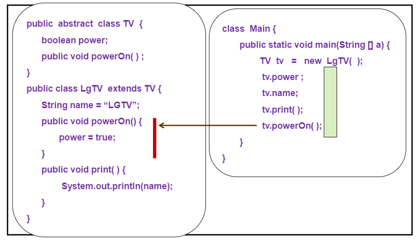

      - tv.power : 접근 가능
      - tv.name : 접근 불가
      - tv.print() : 접근 불가
      - tv.powerOn() :접근 가능

    

  - **명시적 형변환**

    - 형변환 연산자를 이용해서 변환

    - 하위 클래스 타입 = (하위클래스 타입) 상위 클래스타입

      LGPrinter lg = (LGPrinter) p;

      - 저 변수 p는 이미 묵시적 형변환을 한 변수여야 한다.
      - 즉, LGPrinter lg = (LGPrinter) new Printer(); 가 불가능하다. 
      - 먼저, Printer p = new LGPrinter(); 가 진행되고
      - LGPrinter lg = (LGPrinter) p ;

    - 기억해야할 주요 포인트 : 

      - 상위 클래스 타입 자리에 올 수 있는 객체는 실제 가리키는 메모리가 하위 클래스 타입이어야 가능

    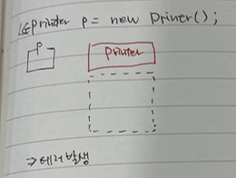 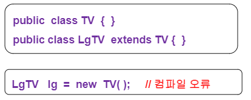

    

    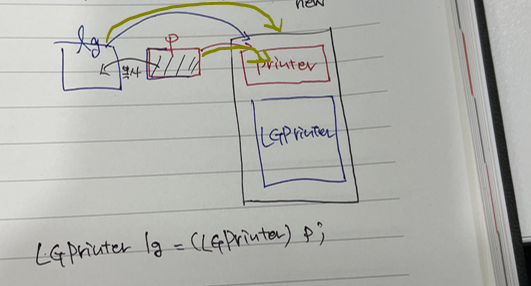 

    

  - 3번째가 오류가 나는 이유 : LGTV의 인스턴스를 만들지 않아서 할당할 메모리가 없다. 

  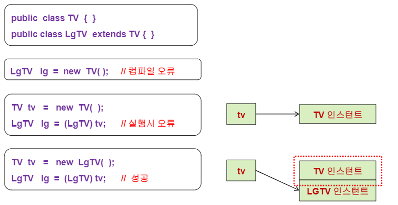


- **예(묵시적 형변환)**

###### <kr.ac.kopo.day11.Parent>

```java
package kr.ac.kopo.day11;

public class Parent {
	String name = "부모" ;
	int age = 50 ;
	
	public void info() {
		System.out.println("name : " + name + ", age : " + age);
	}
}
```


###### <kr.ac.kopo.day11.Child01>

- Parent class에서 info()를 override 해서 작성

```java
package kr.ac.kopo.day11;

public class Child01 extends Parent{
	String name = "자식01";
	
	public void study() {
		System.out.println("나는 공부를 합니다.");
	}
	
	public void sleep() {
		System.out.println("나는 잡니다.");
	}
	
	@Override
	public void info() {
		System.out.println("chile01 클래스에서 재정의된 메소드....");
	}
}

```


###### <kr.ac.kopo.day11.Child02>

- Parent class에서 info()를 override 해서 작성

```java
package kr.ac.kopo.day11;

public class Child02 extends Parent{
	String name = "자식02";
	
	public void sing() {
		System.out.println("나는 노래를 부릅니다.");
	}
	
	public void play() {
		System.out.println("나는 놉니다.");
	}
	
	@Override
	public void info() {
		System.out.println("chile02 클래스에서 재정의된 메소드....");
	}
}

```


###### <kr.ac.kopo.day11.CaseMain01>

```java
package kr.ac.kopo.day11;

public class CaseMain01 {

	public static void main(String[] args) {
		System.out.println("*****Child*****");
		Child01 c01 = new Child01();
		System.out.println(c01.name + ", " + c01.age);
		System.out.print("c01.info : ");
		c01.info();
		
		Child02 c02 = new Child02();
		System.out.print("c02.info : ");
		c02.info();
		
		System.out.println("\n*****Parent*****");
		Parent p = new Parent();
		System.out.println(p.name + ", " + p.age);
		System.out.print("p.info : ");
		p.info();
		
		//묵시적 형변환 발생
		System.out.println("\n*****묵시적 형변환*****");
		Parent p1 = new Child01();
		System.out.println(p1.name + ", " + p1.age);
		System.out.print("p1.info : ");
		p1.info(); //재정의 된 child01이 호출된다.
	}
}
```
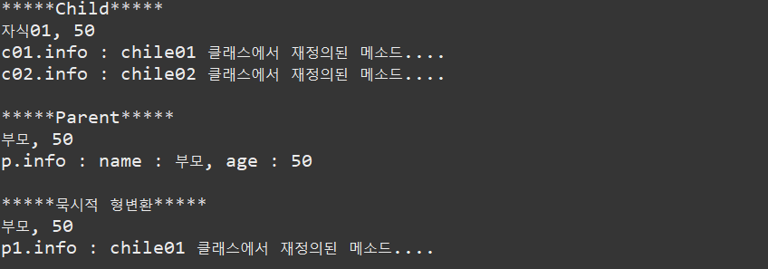

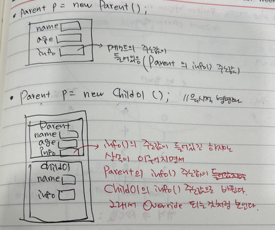 


###### <kr.ac.kopo.day11.CaseMain01>

```java
package kr.ac.kopo.day11;

public class CaseMain01 {
	//info()를 호출하는 print() 생성
    //매개변수가 다른 메서드 오버로드
	public static void print(Child01 c) {
		c.info();
	}
	
	public static void print(Child02 c) {
		c.info();
	}
	
	public static void print(Parent p) {
		p.info();
	}
	
	public static void main(String[] args) {
		System.out.println("*****Child*****");
		Child01 c01 = new Child01();
		System.out.println(c01.name + ", " + c01.age);
		System.out.print("c01.info : ");
		print(c01);
		
		Child02 c02 = new Child02();
		System.out.print("c02.info : ");
		print(c02);
		
		System.out.println("\n*****Parent*****");
		Parent p = new Parent();
		System.out.println(p.name + ", " + p.age);
		System.out.print("p.info : ");
		print(p);
		
		//묵시적 형변환 발생
		System.out.println("\n*****묵시적 형변환*****");
		Parent p1 = new Child01();
		System.out.println(p1.name + ", " + p1.age);
		System.out.print("p1.info : ");
		p1.info(); //재정의 된 child01이 호출된다.
	}
}
```


- 그러나 묵시적 형변환을 통해서 print()를 오버로드 하지 않아도 매개변수로 Parent p만 받고 묵시적 형변환을 통해서 하나의 메서드로 대체 가능하다.
  - 자식 class에서 부모 class의 메서드를 오버라이딩 한 메서드만 가능한 것임
  - 즉, info() 매서드만 사용이 가능하다.

```java
package kr.ac.kopo.day11;

public class CaseMain01 {
	//info()를 호출하는 print() 생성
	/*
	 * public static void print(Child01 c) { c.info(); }
	 * 
	 * public static void print(Child02 c) { c.info(); }
	 */
	
    //묵시적 형변환으로 메서드 하나로 사용할 수 있다.
	public static void print(Parent p) { 
		p.info();
	}
	
	public static void main(String[] args) {
		System.out.println("*****Child*****");
		Child01 c01 = new Child01();
		System.out.println(c01.name + ", " + c01.age);
		System.out.print("c01.info : ");
		print(c01);
		
		Child02 c02 = new Child02();
		System.out.print("c02.info : ");
		print(c02);
		
		System.out.println("\n*****Parent*****");
		Parent p = new Parent();
		System.out.println(p.name + ", " + p.age);
		System.out.print("p.info : ");
		print(p);
		
		//묵시적 형변환 발생
		System.out.println("\n*****묵시적 형변환*****");
		Parent p1 = new Child01();
		System.out.println(p1.name + ", " + p1.age);
		System.out.print("p1.info : ");
		p1.info(); //재정의 된 child01이 호출된다.
	}
}
```


- **예(명시적 형변환)**

###### <kr.ac.kopo.day11.CastMain02>

```java
package kr.ac.kopo.day11;

public class CastMain02 {

	public static void main(String[] args) {
		//Child01 c = (Child01) new Parent(); //실행시 예외 발생
		//묵시적 형변환
		Parent p = new Child02() ; //현재 p가 가리키고 있는 공간은 
								//child02에 있는 sing()과 play()는 접근할 수 없다.
		p.info(); //오버라이딩 된 info()를 실행
		
		Child02 c = (Child02) p; //묵시적 형변환
		c.info(); 
		c.sing(); //형 변환 한 후 sing(), play()를 호출할 수 있다.
		c.play();
	}
}
```

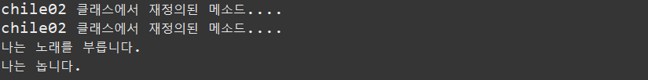


###### <kr.ac.kopo.day11.CastMain02>

- 그러면 print() 매서드에서 info() 말고 child에 있는 메서드를 사용하고 싶다면 명시적 형변환을 하면 된다.
  - 그러나 매개변수의 type이 다르므로 instanceof를 사용한다.

```java
package kr.ac.kopo.day11;

public class CastMain02 {

	public static void main(String[] args) {
		//Child01 c = (Child01) new Parent(); //실행시 예외 발생
		//묵시적 형변환
		Parent p = new Child02() ; //현재 p가 가르키고 있는 공간은 
								//child02에 있는 sing()과 play()는 접근할 수 없다.
		p.info(); //오버라이딩 된 info()를 실행
		
		Child02 c = (Child02) p; //묵시적 형변환
		c.info(); 
		c.sing(); //형 변환 한 후 sing(), play()를 호출할 수 있다.
		c.play();
	}
}
```


- **instanceof**
  - instanceof는 객체 타입을 확인하는데 사용한다.
  - 반환값은 false or true
  - 주로 부모 객체인지 자식 객체인지 확인하는데 사용
  - 사용 형식은 '객체  instanceof  클래스'
  - p가 Child01가 맞는지 확인

```java
package kr.ac.kopo.day11;

public class CastMain02 {

	public static void print(Parent p) {
		p.info();
		
		//p가 가리키는 객체가 Child01형이냐
		System.out.println("p instanceof child01 : " + (p instanceof Child01));
		System.out.println("p instanceof child02 : " + (p instanceof Child02));
		System.out.println("p instanceof Parent : " + (p instanceof Parent));
	}
	public static void main(String[] args) {
		Child01 c01 = new Child01();
		print(c01);
		
		Child02 c02 = new Child02();
		print(c02);
		
		Parent p = new Parent();
		print(p);
		
	}
}
```

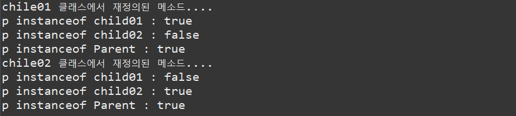


- **instanceof를 이용해서 오버라이딩 된 메서드 이외의 각 Child class에 있는 메서드를 실행시키는 print() 메서드 생성하기**

```java
package kr.ac.kopo.day11;

public class CastMain02 {

	public static void print(Parent p) {
		p.info();
		
		if(p instanceof Child01) {
			Child01 c = (Child01) p;
			c.sleep();
			c.study();
		}else if(p instanceof Child02) {
			Child02 c = (Child02) p;
			c.sing();
			c.play();
		}
		//p가 가리키는 객체가 Child01형이냐
		//System.out.println("p instanceof child01 : " + (p instanceof Child01));
		//System.out.println("p instanceof child02 : " + (p instanceof Child02));
		//System.out.println("p instanceof Parent : " + (p instanceof Parent));
	}
	public static void main(String[] args) {
		Child01 c01 = new Child01();
		print(c01);
		
		Child02 c02 = new Child02();
		print(c02);
		
		Parent p = new Parent();
		print(p);
	}
}
```

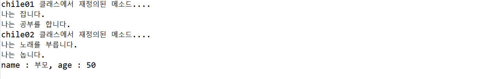