#### day13 과제 풀이

- 2번
  - 프로그램을 종료하는 방법으로 System.exit(0)를 사용하면 된다.
    - public static 메서드 

###### <kr.ac.kopo.day14.homework.CalendarView>

```java
package kr.ac.kopo.day14.homework;

import java.util.Scanner;

//day13 2번 과제 풀이
public class CalendarView {
	
	private Scanner sc;
	
	//객체 생성 시 Scanner class 인스턴스 객체 생성 
	public CalendarView() {
		sc = new Scanner(System.in);
	}
	
	//getInt
	public int getInt(String msg) {
		System.out.println(msg);
		int no = sc.nextInt();
		sc.nextLine();
		return no;
	}
	
	//전체
	public void process() {
		
		CalendarUtil util = new CalendarUtil();
		
		loop : while(true) {
			int command = getInt("항목을 선택하세요.(1. 특정년도, 2. 특정 월 3. 종료)") ;
			int year , month;
			switch (command) {
			case 1:
				year = getInt("년도를 입력하세요~ : ");
				util.showDayByYear(year);
				break;
			case 2:
				year = getInt("년도를 입력하세요~ : ");
				month = getInt("월을 입력하세요~ : ");
				util.showDayByMonth(year, month);
				break;
			case 3:
				System.out.println("프로그램을 종료합니다.");
				System.exit(0); //프로그램 종료하는 메서드
				//break loop;
			default:
				break;
			}//switch
		}//while
	}//process
}//class
```


###### <kr.ac.kopo.day14.homework.CalendarUtil>

```java
package kr.ac.kopo.day14.homework;

import java.util.Calendar;

//달력에 대한 기능을 제공하는 기능 클래스 
//메서드만 모아 놓음
public class CalendarUtil {
	Calendar c;
	
	public CalendarUtil(){
		c = Calendar.getInstance();
	}
	
	//특정 년도에 해당하는 1 - 12월 출력
	public void showDayByYear(int year) {
		for(int month=1;month<=12;month++) {
			showDayByMonth(year,month);
		}
	}
	
	//특정 월에 해당하는 달력 출력
	public void showDayByMonth(int year, int month) {
		c.set(year, month-1,1); //1일의 요일을 알아야하므로 1일을 입력
		int lastDay = c.getActualMaximum(Calendar.DAY_OF_MONTH); //마지막 날짜
		int week = c.get(Calendar.DAY_OF_WEEK); //1일의 요일
		
		System.out.println("<< " + year + "년 " + month + "월 >>");
		showDay(week,lastDay); //실제 달력 출력
	}
	
	
	// 실제 달력 출력
	private void showDay(int week, int lastDay) {
		System.out.println("일\t월\t화\t수\t목\t금\t토");
		int cnt = 0;
		for(int i=1;i<week;i++) {
			System.out.print("\t");
			cnt ++;
		}
		for(int day=1; day<=lastDay;++day) {
			System.out.print(day + "\t");
			if(++cnt % 7 == 0) {
				System.out.println();
			}
			
		}
		if(cnt % 7 != 0)
			System.out.println();
	}
}
```


###### <kr.ac.kopo.day14.homework.CalendarMain>

```java
package kr.ac.kopo.day14.homework;
//day13 2번 과제 풀이
public class CalendarMain {

	public static void main(String[] args) {
		CalendarView view = new CalendarView();
		view.process();
	}
}
```


-------------

#### Generic

- Collections Framework이 기존에는 모든 객체 자료형들을 처리하기 위해서 java.lang.Object 타입을 사용
- 동적으로 타입을 체킹하기 위해서 만들어진 문법
- JDK1.5이후에는 컴파일 시점에 자료구조에서 사용되는 Type을 체크하는 Generic 문법을 사용하는 방식으로 변화
- 타입이 많아서 규정할 수 없어서 모두를 포함할 수 있는 타입인 Object 타입을 이용
  - 오브젝트 타입은 객체형변환을 통해서 모든 타입을 받을 수 있다.
  - 그러나 배열에서 오브젝트 타입을 만들고 데이터를 넣으면 어떤 인덱스에 어떤 타입인지 알 수 없고, 사용하기 위해서 명시적 형변환을 진행해야 해서 불편함 
  - 원래는 오브젝트형의 데이터들의 집합인데 여러 타입이 들어가면 불편해서 제너릭을 이용해서 어떤 타입만 넣을지 정해주는 것이다.


- **예**

```java
package kr.ac.kopo.day14;

import java.util.Random;

class A {
	private Object obj ;
	
	public A(Object obj) {  //생성자
		this.obj = obj;
	}
	
	
	public Object getObj() {
		return obj;
	}

	public void setObj(Object obj) {
		this.obj = obj;
	}
	
	public void info() {
		System.out.println("obj : " + obj);
	}
	
}


public class GenericMain {

	public static void main(String[] args) {
		A a01 = new A(new String("Hello"));
		A a02 = new A(new Random());
		a01.info(); //toString이 찍힘
		//원래는 주소값이 찍히는데 String toString을 override해서 
		//값이 나올 수 있도록 한 것이다.
		a02.info();
		
		//System.out.println("길이 : " + a01.getObj().length());
		//에러 발생
		//왜냐하면 getObj의 return type이 Object이기 때문이다.
		//그래서 명시적 형변환을 진행해야함
		System.out.println("길이 : " + ((String)a01.getObj()).length());
		
		//a02
		System.out.println("난수 : " + ((Random)a02.getObj()).nextInt());
		
	}
}
```

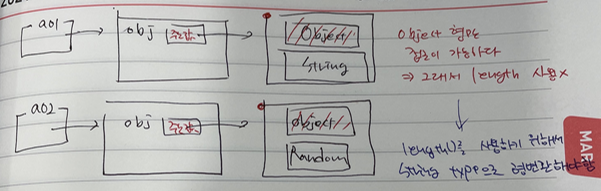


- 이런 식으로 형변환을 매번 사용하는 것은 불편하다. 그래서 이 문제를 해결하기 위해서 Generic 사용
  - 모든 타입을 쓸 수 있으면서 직접 명시적 형변환을 작업하지 않아도 된다.
  - 제너릭이 알아서 형변환을 진행해줌(묵시적, 명시적)

```java
package kr.ac.kopo.day14;

import java.util.Random;

//제너릭 사용
//자동으로 타입을 체크
class B<T>{ //B에 어떤 타입을 넣을지 정해줌 
	private T obj;
	
	public B(T obj) {  //생성자
		this.obj = obj;
	}
	
	
	public T getObj() {
		return obj;
	}

	public void setObj(T obj) {
		this.obj = obj;
	}
	
	public void info() {
		System.out.println("obj : " + obj);
	}
	
}


public class GenericMain {

	public static void main(String[] args) {
		B<String> b01 ; //위의 B 클래스에서 T에 String으로 들어간다.
		b01 = new B<String> (new String("Hello"));
		B<Random> b02 = new B<Random>(new Random());
		
		b01.info();
		b02.info();
		
		System.out.println(b01.getObj().length());
		System.out.println(b02.getObj().nextInt());
		
	}
}
```

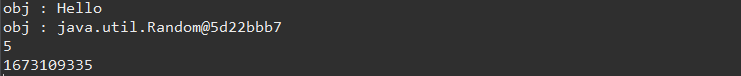


- 묵시적 형변환이 일어나는 것이 아니고 String인 것이다. 위에 a는 타입이 Object로 묵시적 형변환이 일어났던 것임

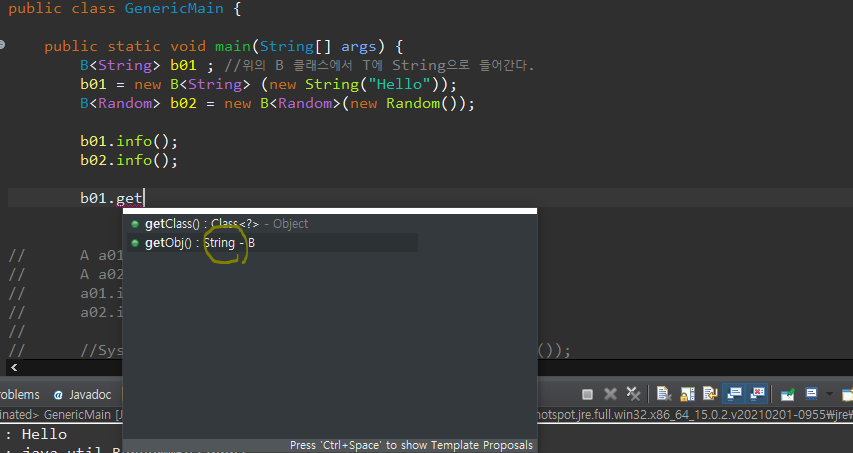


- 제너릭으로 원래 정해놓은 타입을 넣지 않으면 컴파일 시점의 에러가 발생한다.

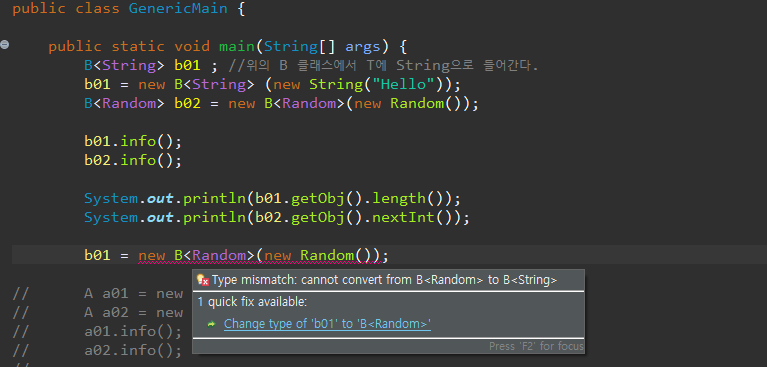


- ArrayList는 Object 타입으로 생성된다. 그래서 Generic을 사용해서 ArrayList가 어떤 타입으로 생성할건지 정해준다.

  - ArrayList< String > list = new ArrayList< String >();

  - 이렇게 되면 ArrayList class에서  아래와 같이 바뀐다. (원래는 String 타입이 Object 타입이었던 것이다.)

    ```java
    class ArrayList { 
    	String[] arr = new String[10];
    }
    ```

  - Generic 안에 들어가는 타입은 참조자료형만 들어갈 수 있다. 기본자료형 못들어감.
  - 그렇다면 int의 리스트를 만들고 싶을 땐????


------------

#### List

- 특징 : 순서가 있고, 중복을 허용(배열과 유사)
  - 배열은 고정이고 list는 가변인 차이
- list는 인터페이스이다. 그래서 구현 클래스가 필요함
- 장점 : 가변적인 배열
- 단점 : 원하는 데이터가 뒤쪽에 위치하는 경우 속도의 문제(단점)
- 구현 클래스 : ArrayList, LinkedList
  - ArrayList : 배열처럼 만드는 방식(arrayList 같은 경우는 내부적으로 배열이 들어감. 처음에 길이가 5인 배열을 만들다가 자리가 없으면 또 5개를 늘리는식으로 진행하여 동적으로 공간을 할당받는 것처럼 보인다. )
  - LinkedList : 필요한 순간 공간을 넓혀가는 방식
    - 공간이 필요한 순간 만들어져서 서로 공간이 연속적이지 않고 떨어져있다. 그래서 주소값을 연결해서 사용


---------------

#### ArrayList


- ArrayList와 Generic

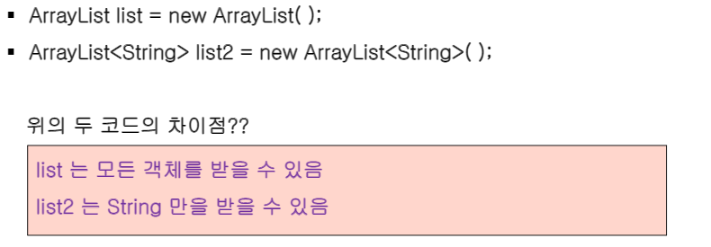


- ArrayList - 메소드

  - add(E e) : 데이터 입력
    - 알아서 마지막 데이터 뒤에 순서대로 들어감
    - list.add("봄"); list.add("여름")

  

  - get(int index) : 데이터 추출
    - String val = list.get(0);  // 봄이 반환

  

  - size() : 크기 반환
    - int size = list.size(); //2가 반환

  

  - remove(int i) : 인덱스 위치의 데이터를 삭제
    - list.remove(0);
    - 0번째 데이터를 지웠으면 0번지가 비었으므로 1번지에 있는 것이 0번지로 바뀜 (동적)

  

  - remove(Object o) : 동일한 데이터를 삭제
    - list.remove("봄");
    - 만약 0번지와 2번지 모두 봄이 있는 경우 무조건 앞에부터 검색해서 앞에 있는 것을 지운다. 

  

  - clear() : 모든 데이터를 삭제
    - list.clear();

  

  - contains(Object o) : 특정 데이터가 있는지 체크
    - boolean b = list.contains("봄");

  

  - isEmpty() : 데이터가 존재하는지 체크
    - boolean b = list.isEmpty();

  

  - addAll(Collection c) : 기존 등록된 콜렉션 데이터 추가

    - list.addAll(sub);

    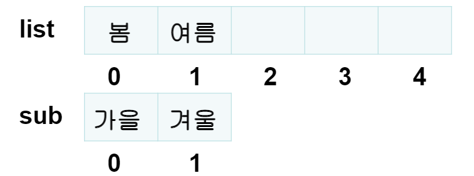

    가을, 겨울이 list 2, 3번지에 복사된다. 

    

  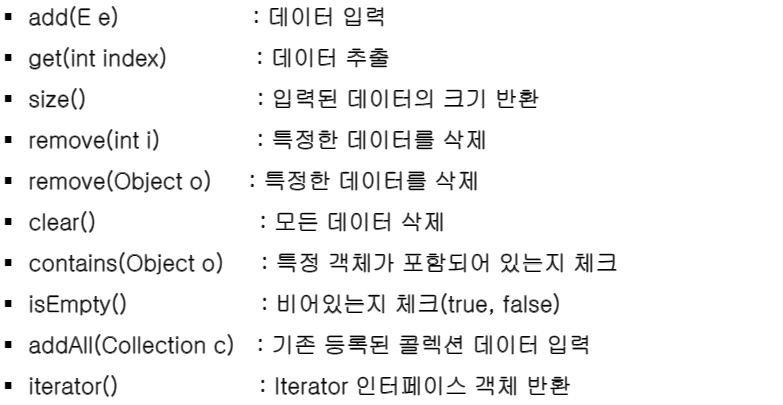


- **예**

```java
package kr.ac.kopo.day14;

import java.util.ArrayList;
import java.util.Arrays;
import java.util.Iterator;
import java.util.LinkedList;
import java.util.List;

/*
 	List : 순서 o, 중복 o
 	구현 클래스 : ArrayList, LinkedList
 	
 	주요 메서드
 	- add() : 데이터 입력
 	- get() : 해당 인덱스에 있는 데이터 추출
 	- remove() : 데이터를 삭제
 	- size() : 리스트의 전체 데이터 개수
 	- clear() : 리스트의 전체 데이터를 삭제
 	- isEmpty() : 리스트가 비어있는지 체크
 	- contains() : 특정 데이터의 존재 여부 판단
 	- iterator() : iterator 객체를 반환
 */
public class ListMain {

	public static void main(String[] args) {
		//List list = new ArrayList(); //1.5미만의 방식 
		//List<String> list = new ArrayList<String>() ; //1.5버전의 Generic을 사용, 묵시적 형변환
		List<String> list = new ArrayList<>() ; //1.7버전 이후, 뒤의 타입을 생략할 수 있다. 알아서 String이라고 인식
		list.add("one");
		//list.add(10); //The method add(int, String) in the type List<String> is not applicable for the arguments (int)
		System.out.println("리스트의 원소 총 개수 : " + list.size());
		
		//순차적으로 list에 들어감 add()
		list.add("two");
		list.add("three");
		list.add("four");
		list.add("five");
		System.out.println("리스트의 원소 총 개수 : " + list.size());
		
		//리스트는 중복 허용
		list.add("one"); //리턴타입 boolean
		System.out.println("리스트의 원소 총 개수(중복된 string 추가 후) : " + list.size());
		
		/* list의 전체 데이터 출력
			1. index를 이용한 get 메서드를 이용
			2. 1.5 버전의 for문 이용
			3. toArray
			4. iterator() 메서드를 이용
		*/
		System.out.println("\n****get(), for문을 이용한 출력****");
		for(int i=0; i<list.size();i++) {
			System.out.print(list.get(i) + "  ");; //입력된 순서 그대로 출력
		}
		
		System.out.println("\n\n****1.5버전의 for문 이용한 출력****");
		for(String str : list) {
			System.out.print(str + "  ");
		}
		
		//리스트가 있는 요소를 배열에 저장
		System.out.println("\n\n****리스트가 있는 요소를 배열에 저장(toArray())****");
		Object[] strArr = list.toArray(); //toArray의 return type은 Object
		System.out.println(Arrays.toString(strArr)); //Arrays.toString은 배열에만
		
		//iterator() 메서드를 이용
		System.out.println("\n****iterator() 메서드를 이용****");
		//리스트의 맨처음부터 마지막까지 접근할 수 있는 기능(순환자)
		/*
			Iterator(순환자) 주요 메서드
			- next() : 다음 데이터를 계속 얻어 오는 기능, 데이터 추출
			- hasNext() : 추출한 다음 데이터의 존재 여부를 판단
		 */
		Iterator<String> iter = list.iterator();
		while(iter.hasNext()) {
			System.out.print(iter.next() + "  ");
		}
		
		System.out.println();
		
		String searchStr = "two";
		list.remove("two");
		if(list.contains(searchStr)) {
			System.out.println(searchStr + "은 존재합니다.");
		}else {
			System.out.println(searchStr + "은 존재하지 않습니다.");
		}
		System.out.println(list.remove("two")); //two가 없는데 지우라고 하면 return값이 false가 나온다.
		//문자로 지우면 return 값이 boolean 형이다.
		
		System.out.println();
		
		System.out.println("첫 번째 문자열 : " + list.get(0));
		String removeStr = list.remove(0);
		System.out.println("삭제된 문자열 : " + removeStr); //인덱스로 지우면 지운 문자열이 return
		System.out.println("첫 번째 문자열 : " + list.get(0));
		
		System.out.println("원소 총 개수 : " + list.size());
		//list.clear();
		System.out.println("clear()실행 후 원소 총 개수 : " + list.size());
		
		List<String> sub = new LinkedList<String>();
		sub.add("봄");
		sub.add("여름");
		
		list.addAll(sub); //list 합치기
		//서로 호환이 가능함 linked와 arraylist가 (다형성)
		
		System.out.println("addAll() 후 원소의 개 수 :" + list.size());
		
		//set도 HashSet, TreeSet끼리 호환이 가능하다(다형성)
		
	}
}
```

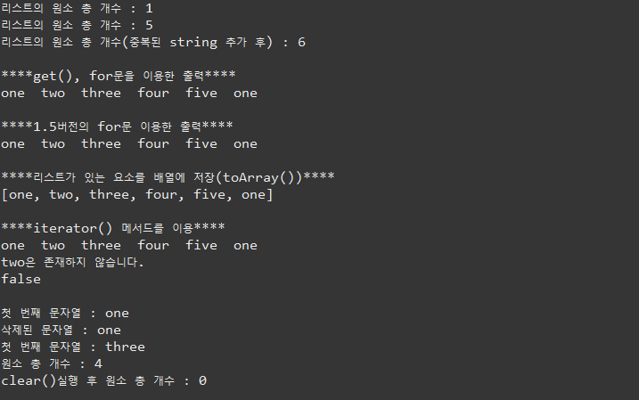


---------

#### Set

- 특징: 순서가 없고, 중복을 허용하지 않음
- 장점 : 빠른 속도
  - list는 인덱스에 가까운 것만 빠르게 검색되고 뒤에 있는 값은 느리게 검색된다는 단점이 있었다. 
- 단점 : 단순 집합의 개념으로 정렬하려면 별도의 처리가 필요하다.
- 구현 클래스 : HashSet, TreeSet


- Set 메소드

  - collection을 상속받아서 쓴다.

  - add(E e) : 데이터 입력 

    - set.add("봄")
    - set은 순서를 가지고 있지 않으므로 바구니에 데이터를 넣고 있는 것과 같다. 

    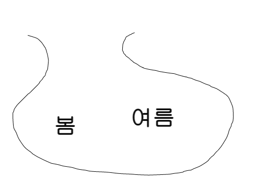

  - size() 

  - remove()

    - 인덱스로 지우기는 할 수 없음(순서가 없어서 그래서 get 메소드도 없다, 리스트와의 차이)
    - 데이터 값으로 지우기만 가능하다

  - clear()

  - contains(Object o)

  - isEmpty()

  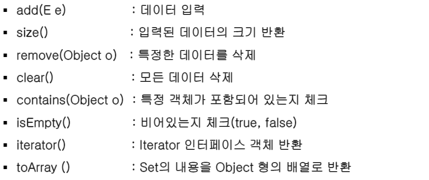

  - collection을 상속받은 class의 메서드는 비슷함
    - list와 다른 점은 중복을 허용하지 않고 순서가 없음
    - 전체데이터를 접근할 메서드는 없다. 그래서 toArray()로 데이터 확인


- linked와 arraylist가 서로 호환이 가능하다. 그리고 set도 HashSet과 TreeSet끼리 호환이 가능하다.


- 예

```java
package kr.ac.kopo.day14;

import java.util.Arrays;
import java.util.HashSet;
import java.util.Iterator;
import java.util.Set;


public class SetMain {

/*
 * Set : 순서x, 중복x
 * 장점 : 검색속도 빠르다.
 * 구현 클래스 : HashSet, TreeSet
 */
	
	public static void main(String[] args) {
		Set<String> set = new HashSet<>();
		//add의 리턴형은 boolean이다.
		System.out.println("one data 삽입 여부" + set.add("one"));
		//set.add("one");
		set.add("two");
		set.add("three");
		set.add("four");
		set.add("five");
		System.out.println("one data 삽입 여부" + set.add("one"));
		
		//set 전체 데이터 출력하기 위한 방식
		//1. 1.5버전의 for문
		//2. iterator
		
		System.out.println("< 1.5버전의 for문 이용 출력 >");
		for(String str : set) {
			System.out.print(str + "  ");
		} //입력 순서대로 나오지 않음
		//문자인 경우는 사전 순으로 나옴 a - z
		
		System.out.println("\niterator을 이용한 출력");
		Iterator<String> iter = set.iterator();
		while(iter.hasNext()) {
			System.out.print(iter.next() + "  ");
		}
		
		System.out.println("\ntoArray() 이용");
		Object[] arr = set.toArray();
		System.out.println(Arrays.toString(arr));
		
	}
}

```

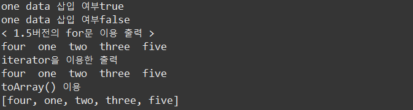


--------------

#### Map

- 특징 : Key(키)와 Value(값)으로 나누어 데이터 관리한다. 순서는 없으며 키에 대한 중복은 없음

- 장점 : 빠른 속도

- 구현 클래스 : HashMap, TreeMap

- 메소드

  - V put(K key, V value) : 데이터 입력

    - map.put( “name”, “길동”);
    - map.put( “addr”, “인천”);

    

  - get(Object Key) : 데이터 추출

    - String  val = map.get(“name”);  //“길동”이반환

    

  - remove  (Object Key)  :  데이터삭제

    - 삭제된 값을 리턴, Key 에 해당하는 값이 없을 경우 null  반환
    - String  val = map.remove(“addr”);  //“인천”이반환

    

  - containsKey(Object Key)  :  특정키확인

    - 리턴 값 : boolean(Key 가존재할경우true 반환)
    - boolean flag = map.containsKey(“addr”);  //true 반환

  

  - putAll(Map<K Key, V value> m)  :  콜렉션추가

    - 리스트의 addAll과 같은 역할, 기존 콜렉션에 구성된 데이터를 추가할 경우

    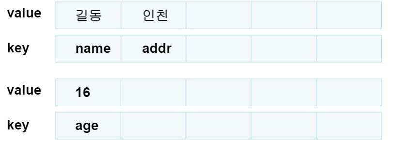

    

    - map.putAll(sub);

    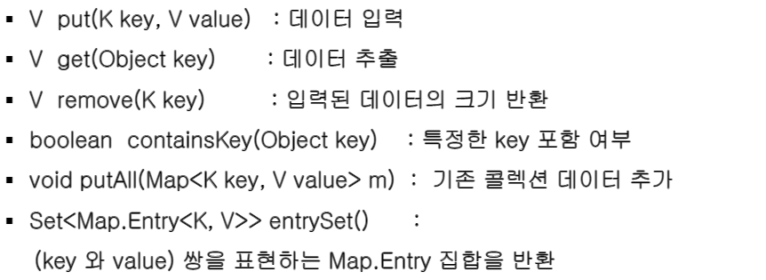

    

- **예**

```java
package kr.ac.kopo.day14;

import java.util.HashMap;
import java.util.Map;
import java.util.Scanner;
import java.util.Set;

/*
 	Map : key, value의 쌍으로 구성된 데이터의 집합, 키에대한 중복(x), 순서(x)
 	구현 클래스 : HashMap, TreeMap
 */

public class MapMain01 {

	public static void main(String[] args) {
		//key : id, value : password
		Map<String, String> map = new HashMap<>();
		map.put("aaa", "1111");
		map.put("bbb", "2222");
		map.put("ccc", "3333");
		map.put("ddd", "4444");
		
		System.out.println("패스워드 변경 서비스입니다.");
		System.out.println("변경할 아이디를 입력하세요.");
		Scanner sc = new Scanner(System.in);
		String id = sc.nextLine();
		if(! map.containsKey(id)) {
			System.out.println("입력하신 아이디 " + id + "가 존재하지 않습니다.");
			System.out.println("서비스를 종료합니다.");
			System.exit(0);
		}else {
			System.out.println("\n현재 패스워드를 입력해봐~ : ");
			String pw = sc.nextLine();
			if(map.get(id).equals(pw)) {
				System.out.println("\n변경할 패스워드를 입력해봐 ~ : ");
				String newPw = sc.nextLine();
				map.put(id, newPw); //key에 대한 중복된 데이터가 있으면 update
				System.out.println("\n변경 완료 ~ ");
			}else {
				System.out.println("\n패스워드가 틀렸어...");
				System.out.println("\n종료할게..");
				System.exit(0);
			}
		}
		
		//전체 데이터 출력
		//인덱스, for문 toArray, iterator를 사용하지 못한다.
		//그래서 나온 메서드가 entrySet()이다.
		
		System.out.println("<< 전체 회원 정보 출력 >>");
		Set<Map.Entry<String, String>> entrySet = map.entrySet();
		//set형이므로 for문 사용 가능
		for(Map.Entry<String, String> e : entrySet) {
			System.out.println(e);
			System.out.println("ID : " + e.getKey() + " PW : " + e.getValue());
		}
		
		//키들을 모아서 set에다가 넣기(set이 검색속도를 빠르게 해주므로)
		System.out.println("\n****keySet****");
		Set<String> keys = map.keySet();
		for(String key : keys) {
			System.out.println("ID " + key + "이고, PW : " + map.get(key));
		}
	}
}
```

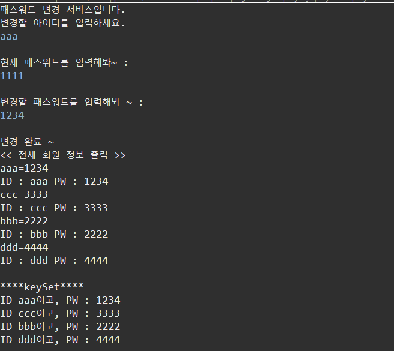


- Map class 안에 Entry라는 클래스가 있다 그 Entry가 Object key; Object value;를 가지고 있다. Entry를 inner class라고 부른다. 외부에서 Entry만을 가지고 인스턴스 객체를 만들지 못한다. Map 안에 있으므로 이때 Entry를 표현하는 방법이 Map.Entry 이다. 

  

   set으로 가져올 데이터 타입이 Entry 타입이고 Entry는 Map안에 들어있어서 Map.Entry이다. 그리고 Entry가 가지고 있는 제너릭이 key, value이다.  그래서 key와 value 쌍을 ㅍ현하는 Map.Entry 집합을 반환한다.

  
