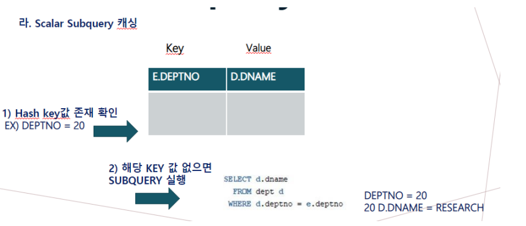
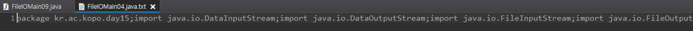

## 과제 

- **Scalar Subquery Caching**

  - Scalar Subquery Caching란? 오라클은 스칼라 서브 쿼리의 입력 값과 출력 값을 내부 캐시 (Query Execution Cache)에 저장 입력 값을 캐시에서 찾아보고 거기 있으면 저장된 출력 값을 리턴 -> 존재하지 않다면, 결과 값은 캐시에 저장

  

  - 동작 순서에 Hash 알고리즘 적용
    - 스칼라 서브쿼리는 매번 실행되지 않음
    - 실행 결과를 hash table에 저장해두고 그 테이블에서 꺼내오는 방식으로 실행됨

  

  

  

  

  

  

  

  

  

  


- **CPU & Core**

  - CPU란?
    - Central Processing Unit ( 중앙처리장치)
    - 기억, 해석, 연산, 제어의 4대기능을종합하는장치, 가장 중요한 부분
    - 일꾼 집합소(사람의 뇌)
  - Core란?
    - 각종연산을 하는CPU의 핵심요소
    - CPU안에서 일하는 부품
    - 사용자가 사용할 일꾼 수 
  - 하나의 CPU에 4개의 Core가 있으면 연산을 동시에 4개를 할 수 있다.

  

  

- **Multi CPU & Multi Core**
  - Single CPU vs Dual CPU?
    - Single CPU(CPU가1개), Dual CPU(CPU가2개)
    - 당연히 여러개의 CPU를 사용하면 성능이 좋은거 아니야 ?
    - 하드한 작업 또는 다중작업을 하는 경우에는 맞다.
    - 일반적인 작업을 하는 용도에는 오히려 배터리성능 문제
  - Multi Core
    - Single Core는 1개의 CPU에 1개의 Core로 구성
    - Multi Core는1개의CPU에 여러 개의Core로구성
    - 당연히 여러 개의 Core를 사용하면 성능이 좋은 거 아니야 ?
    - 보통은 맞지만, 모든 소프트웨어가 멀티 코어에 최적화 되어있지 않다.
  - 그럼 56Core이면 56Thread를 수행할 수 있나?


- **Process**

  - 프로그램(Program)이란? 
    
- 어떤 작업을 위해실행할 수 있는 파일
    
- 프로세스(Process) ?
  
    - 컴퓨터에서 실행되고 있는 프로그램 
  - 메모리에 적재되어 실행되고 있는 프로그램
  
- 할당받는 시스템 자원
  
    - STACK : 함수에서 다른 함수를 실행하는 등의 서브루틴들 정보 저장
    - CODE : 프로그래밍코드 텍스트가 들어가는메모리 영역( 컴파일결과물)
    - DATA : BSS ( 초기화되지않은 전역변수) , DATA ( 초기 값이있는 전역변수)
  - HEAP : 동적 메모리할당, 코드에서 동적으로 만들어지는 데이터
  
- Process 특징
  
    - 기본적으로 프로세스당 최소 1개의 스레드를 가지고 있음
    - **각 프로세스는 별도의 주소 공간에서 실행, 다른 프로세스 접근X**
  - 다른 프로세스 자원에 접근하려면 IPC(파이프, 파일소켓등)을 사용
  
     


- **Thread**

  - Thread란?

    - 프로세스 내에서 실행되는 여러 흐름의 실행 단위
    - 프로세스가 할당 받은 자원을 이용하는 실행 흐름의 단위
    - 사용자가 사용할 일꾼의 손 갯수
    - 메모리를 서로 공유 가능
    - 하나의 실행중인 프로세스 안에 여러 개의 태스킹을 동시에 사용하고 싶을 때, 사용
    - Stack을 독립적으로 가지는 이유
      - 스택은 함수 호출 시 전달되는 인자, 작업 후 되돌아갈 주소값 및 함수 내에서 선언
      - 독립적은 함수를 호출이 가능 -> 독립적인 실행 흐름

    - process 2개를 돌리는 것보다 thread 2개 돌리는 것이 더 가볍다. 즉, resource를 덜 쓴다. 
    - 그래서 대부분 thread 방식으로 사용이 된다.


- **Web 캐시 구조**

  - Browser Cache
    - 클라이언트 내부 저장소에 웹페이지를 탐색할 때 다운로드 한 데이터 저장 
    - 브라우저 속도를 높임
  - Response Cache
    - 웹 서버는 Application Host로 동일한 요청이 전송되지 않도록 제어 
    - 비용이 높은 DB쿼리나 자주 요청되는 파일들을 캐시 처리

  - DATABASE Cache
    - 처음 쿼리를 전송할 때는 데이터베이스에서 직접 가져옴
    - 두 번째 쿼리부터는 캐시에 저장된 데이터를 가져와 직접 쿼리 전송 X

  - DISK Cache
    - 요청에 의해서 하드 디스크 파일 시스템에 있는 정적 리소스 제공 
    - 하드 디스크는 캐시 처리를 통해 성능 개선
  - Application Cache
    - 모든 사용자들이 자주 요청할만한 웹페이지나 파일 등을 저장 
    - 클라이언트가 해당 데이터를 요청할 때 빠르게 응답 
    - 서버에서 많이 쓰일 것이라고 예상되는 데이터들을 캐시 처리


## FileReader / FileWriter

- **Reader**

- **Writer**
  - flush() 
    - 스트림 데이터 통로에 데이터가 남아있을 경우(아직 버퍼에서 적용되지 않은)  데이터를 밀어주는 역할
    - 출력 버퍼에 저장된 모든 데이터를 출력 장치로 전송(입력에서는 사용하지 않음)
    - **출력 스트림과 버퍼된 출력 바이트를 강제로 쓰게 한다.**
    - **사용자가 원할 때 버퍼를 비워주는 것으로 버퍼를 비우는 것은 IO에서는 출력하는 것 이고,** **네트워크에서는 버퍼의 내용을 클라이언트나 서버로 보내는 것**

- **FileReader**

  - 문자 데이터를 파일로부터 읽는 클래스. 
  - 파일 이름을 생성자 파라미터로 사용해서 FileReader 객체를 생성한다.
  - **read 메소드** : 파라미터를 받지 않는 가장 간단한 메소드. 파일로부터 한 개의 문자를 읽어서 리턴한다.

  - **reder.close();** 파일을 닫는 메소드

- **FileWriter**

  - 문자 데이터를 파일에 쓰는 클래스. 
  - **writer 메소드** : 하나의 문자를 파라미터로 받아 출력하는 가장 간단한 메소드. 
  - **writer.close();** 파일을 닫는 메소드


- **실습(iodata/FileIOMain04.java -> iodata/FileIOMain04.java.txt복사)**

  - FileIOMain07

  ```java
  public class FileIOMain07 {
  	public static void main(String[] args) {
  		FileReader fr = null;
  		FileWriter fw = null;
  		try {
  			fr = new FileReader("iodata/FileIOMain04.java");
  			fw = new FileWriter("iodata/FileIOMain04.java.txt");
  		} catch (Exception e) {
  			e.printStackTrace();
  		} finally {
  			FileClose.close(fr,fw);
  			
  		}
  	}
  }
  ```

  

  - **close 문 생성**

  ```java
  package kr.ac.kopo.util;
  
  import java.io.FileWriter;
  import java.io.InputStream;
  import java.io.OutputStream;
  import java.io.Reader;
  import java.io.Writer;
  
  public class FileClose {
  //	public static void close(FileInputStream fis) {
  //		
  //	}
  //	public static void close(BufferedInputStream fis) {
  //		
  //	}
  	//FileInputStream과 BufferedInputStream 모두 
  	//InputStream을 상속 받아서 사용해서 묵시적 형변환
  	public static void close(InputStream is) {
  		if(is != null) {
  			try {
  				is.close();
  			}catch (Exception e) {
  				e.printStackTrace();
  			}
  		}
  	}
  	
  	public static void close(OutputStream os) {
  		if(os != null) {
  			try {
  				os.close();
  			}catch (Exception e) {
  				e.printStackTrace();
  			}
  		}
  	}
  	
  	public static void close(InputStream bis, InputStream fis) {
  		FileClose.close(bis);
  		FileClose.close(fis);
  	}
  	
  	public static void close(OutputStream bos, OutputStream fos) {
  		FileClose.close(bos);
  		FileClose.close(fos);
  	}
  	
  	//*********여기에 생성*********
  	public static void close(Reader r) {
  		if(r != null) {
  			try {
  				r.close();
  			} catch (Exception e) {
  				e.printStackTrace();
  			}
  		}
  	}
  	public static void close(Writer w) {
  		if(w != null) {
  			try {
  				w.close();
  			} catch (Exception e) {
  				e.printStackTrace();
  			}
  		}
  	}
  	public static void close(Reader r, Writer w) {
  		close(r);
  		close(w);
  	}
  }
  ```

  

  - **파일 읽고 쓰기**

  ```java
  package kr.ac.kopo.day16;
  
  import java.io.FileReader;
  import java.io.FileWriter;
  
  import kr.ac.kopo.util.FileClose;
  
  //iodata/FileIOMain04.java -> iodata/FileIOMain04.java.txt복사
  public class FileIOMain07 {
  	public static void main(String[] args) {
  		FileReader fr = null;
  		FileWriter fw = null;
  		try {
  			fr = new FileReader("iodata/FileIOMain04.java");
  			fw = new FileWriter("iodata/FileIOMain04.java.txt");
  			
  			while(true) {
  				int c = fr.read();
  				if(c == -1) {
  					break;
  				}
  				fw.write(c);
  			}
  			fw.flush();
  			System.out.println("파일 복사를 완료하였습니다.");
  		} catch (Exception e) {
  			e.printStackTrace();
  		} finally {
  			FileClose.close(fr,fw);
  		}
  	}
  }
  ```

  

  

- **실습(FileIOMain08 원본파일명 복사파일명)**

  - FileIOMain08는 원본파일명 복사파일명으로 매개변수를 받아야함

    

  ```java
  package kr.ac.kopo.day16;
  
  import java.io.FileReader;
  import java.io.FileWriter;
  
  import kr.ac.kopo.util.FileClose;
  /*
   * FileIOMain08 원본파일명 복사파일명 
   * 이런식으로 메소드를 생성
   * FileIOMain08 FileIOMain04.java FileIOMain04.java.txt
   */
  
  public class FileIOMain08 {
  	//args가 2개의 파일(원본파일명, 복사파일명)을 가져옴
  	public static void main(String[] args) {
  		if(args.length != 2) {
  			System.out.println("============================================================");
  			System.out.println("\t 사용법 : FileIOMain06 원본파일명 복사할파일명");
  			System.out.println("============================================================");
  			System.exit(0);
  		}
  	}
  }
  ```

  

  

  - **매개변수를 넣어서 실행하는 방법**
    - run configurations

  

  

  - **Arguments > Run**

  

  

  - **run configurations로 실행되는지 확인**

  ```java
  package kr.ac.kopo.day16;
  
  import java.io.FileReader;
  import java.io.FileWriter;
  
  import kr.ac.kopo.util.FileClose;
  /*
   * FileIOMain08 원본파일명 복사파일명 
   * 이런식으로 메소드를 생성
   * FileIOMain08 FileIOMain04.java FileIOMain04.java.txt
   */
  
  public class FileIOMain08 {
  	//args가 2개의 파일(원본파일명, 복사파일명)을 가져옴
  	public static void main(String[] args) {
  		if(args.length != 2) {
  			System.out.println("============================================================");
  			System.out.println("\t 사용법 : FileIOMain06 원본파일명 복사할파일명");
  			System.out.println("============================================================");
  			System.exit(0);
  		}
  		System.out.println(args[0]);
  		System.out.println(args[1]);
  	}
  }
  
  ```

  

  

  - **파일 읽고 쓰기**

  ```java
  package kr.ac.kopo.day16;
  
  import java.io.FileReader;
  import java.io.FileWriter;
  
  import kr.ac.kopo.util.FileClose;
  /*
   * FileIOMain08 원본파일명 복사파일명 
   * 이런식으로 메소드를 생성
   * FileIOMain08 FileIOMain04.java FileIOMain04.java.txt
   */
  
  public class FileIOMain08 {
  	//args가 2개의 파일(원본파일명, 복사파일명)을 가져옴
  	public static void main(String[] args) {
  		if(args.length != 2) {
  			System.out.println("============================================================");
  			System.out.println("\t 사용법 : FileIOMain06 원본파일명 복사할파일명");
  			System.out.println("============================================================");
  			System.exit(0);
  		}
  		FileReader fr = null;
  		FileWriter fw = null;
  		try {
  			fr = new FileReader("iodata/" + args[0]);
  			fw = new FileWriter("iodata/" + args[1]);
  			
  			while(true) {
  				int c = fr.read();
  				if(c == -1) {
  					break;
  				}
  				fw.write(c);
  			}
  			fw.flush();
  			System.out.println("파일 복사를 완료하였습니다.");
  		} catch (Exception e) {
  			e.printStackTrace();
  		} finally {
  			FileClose.close(fr,fw);			
  		}
  	}
  }
  ```

  


## BufferedReader / BufferedWriter

- **BufferedReader에서는 라인 단위로 읽어올 수 있는 기능이 있다.**
  - readLine()


- **실습(FileReader와 FileWriter를 BufferedReader와 BufferedWriter를 사용하여 실습)**

  - 파일 읽고 쓰기

  ```java
  package kr.ac.kopo.day16;
  
  import java.io.BufferedReader;
  import java.io.BufferedWriter;
  import java.io.FileReader;
  import java.io.FileWriter;
  
  import kr.ac.kopo.util.FileClose;
  
  //iodata/FileIOMain04.java -> iodata/FileIOMain04.java.txt복사
  public class FileIOMain09 {
  	public static void main(String[] args) {
  		FileReader fr = null;
  		FileWriter fw = null;
  		
  		BufferedReader br = null;
  		BufferedWriter bw = null;
  		
  		try {
  			fr = new FileReader("iodata/FileIOMain04.java");
  			fw = new FileWriter("iodata/FileIOMain04.java.txt");
  			
  			br = new BufferedReader(fr);
  			bw = new BufferedWriter(fw);
  			
  			while(true) {
  				String data = br.readLine(); //한 라인씩 읽기
  				if(data == null) {
  					break;
  				}
  				bw.write(data);
  			}
  			
  			
  			System.out.println("파일 복사를 완료하였습니다.");
  		} catch (Exception e) {
  			e.printStackTrace();
  		} finally {
  			FileClose.close(br,bw); //순서 중요
  			FileClose.close(fr,fw);
  			
  		}
  	}
  }
  
  ```

  

  

  - 결과를 확인하면 enter가 저장되지 않은 것을 확인할 수 있음 
    - 운영체제에 따라서 엔터의 의미가 달라진다. 그래서 newLine()을 사용한다.

  ```java
  package kr.ac.kopo.day16;
  
  import java.io.BufferedReader;
  import java.io.BufferedWriter;
  import java.io.FileReader;
  import java.io.FileWriter;
  
  import kr.ac.kopo.util.FileClose;
  
  //iodata/FileIOMain04.java -> iodata/FileIOMain04.java.txt복사
  public class FileIOMain09 {
  	public static void main(String[] args) {
  		FileReader fr = null;
  		FileWriter fw = null;
  		
  		BufferedReader br = null;
  		BufferedWriter bw = null;
  		
  		try {
  			fr = new FileReader("iodata/FileIOMain04.java");
  			fw = new FileWriter("iodata/FileIOMain04.java.txt");
  			
  			br = new BufferedReader(fr);
  			bw = new BufferedWriter(fw);
  			
  			while(true) {
  				String data = br.readLine(); //한 라인씩 읽기
  				if(data == null) {
  					break;
  				}
  				bw.write(data);
  				bw.newLine();
  			}
  			System.out.println("파일 복사를 완료하였습니다.");
  		} catch (Exception e) {
  			e.printStackTrace();
  		} finally {
  			FileClose.close(br,bw); //순서 중요
  			FileClose.close(fr,fw);
  		}
  	}
  }
  ```

  

  

  - 위에서 readLine()을 사용하면 엔터가 저장되지 않고 그냥 read()를 사용하면 엔터가 저장된다. 
    - 기본적으로 BufferedReader는 한 줄을 통째로 입력받는 방법으로 주로 쓰인다.
    - readLine() 메서드는 값을 읽어올 때, String 값으로 개행문자(엔터값)를 포함해 한 줄을 전부 읽어오는 방식이다.
    - 즉, 엔터값도 String으로 인식한다.
    - read() 메서드는 값을 읽어올 때, int값으로 변형하여 읽어오는 방식이다.
    - 즉, 입력받은 문자의 ASCII코드 값으로 저장하는 것이다. 그래서 엔터를 인식하는 것임


- **단축키**

  - alt + shift + s 누른 후 c를 선택 : 기본 생성자가 생성
  - alt + shift + s 누른 후 o를 선택 : 매개변수를 가지는 생성자가 생성
  - Ctrl + Shift + O : 사용하지 않는 import 삭제
  - alt + shift + s 누른 후 r를 선택 : getter, setter 
  - alt + shift + s 누른 후 v를 선택 : override 

  - alt + shift + s 누른 후 s를 선택 : toString
  - ctrl + n : class or project 생성


## PrintWriter

- PrintWriter
  - PrintWriter 는 Reader가 없는 오직 출력을 위한 객체
  - Writer 클래스를 부모클래스로 하면서, 문자열을 출력하는 스트림인 Writer의 속성을 갖고있다.


- **실습**

  - UserInfo

  ```java
  package kr.ac.kopo.day16;
  
  /*
  	alt + shift + s 누른 후 c를 선택 : 기본 생성자가 생성
  	alt + shift + s 누른 후 o를 선택 : 매개변수를 가지는 생성자가 생성
  	alt + shift + s 누른 후 r를 선택 : getter, setter 
  	alt + shift + s 누른 후 v를 선택 : override 
  	alt + shift + s 누른 후 s를 선택 : toString
   */
  
  
  public class UserInfo {
  	private String name;
  	private int age;
  	private String addr;
  	
  	public UserInfo() {
  		super();
  	}
  	
  	public UserInfo(String name, int age, String addr) {
  		super();
  		this.name = name;
  		this.age = age;
  		this.addr = addr;
  	}
  
  	public String getName() {
  		return name;
  	}
  	public void setName(String name) {
  		this.name = name;
  	}
  	public int getAge() {
  		return age;
  	}
  	public void setAge(int age) {
  		this.age = age;
  	}
  	public String getAddr() {
  		return addr;
  	}
  	public void setAddr(String addr) {
  		this.addr = addr;
  	}
  
  	@Override
  	public String toString() {
  		return "UserInfo [name=" + name + ", age=" + age + ", addr=" + addr + "]";
  	}
  	
  }
  
  ```

  - printWriter를 사용하여 저장

  ```java
  package kr.ac.kopo.day16;
  
  import java.io.BufferedReader;
  import java.io.BufferedWriter;
  import java.io.FileReader;
  import java.io.FileWriter;
  import java.io.PrintWriter;
  
  import kr.ac.kopo.util.FileClose;
  
  //iodata/FileIOMain04.java -> iodata/FileIOMain04.java.txt복사
  public class FileIOMain10 {
  	
  	public static void write() throws Exception {
  		UserInfo user = new UserInfo("홍길동", 25, "서울시 금천구");
  		FileWriter fw = new FileWriter("ioData/userInfo.txt");
  //		BufferedWriter bw = new BufferedWriter(fw);
  		PrintWriter pw = new PrintWriter(fw); //pw에 buffered의 기능이 들어가 있음
  		pw.println(user.getName());
  		pw.println(user.getAge());
  		pw.println(user.getAddr());
  		
  		pw.flush();
  		FileClose.close(pw);
  		FileClose.close(fw);
  		
  		System.out.println("userInfo.txt에 저장을 완료하였습니다.");
  	}
  	
  	public static void read() throws Exception{
  		FileReader fr = new FileReader("ioData/userInfo.txt");
  		BufferedReader br = new BufferedReader(fr);
  		
  		String name = br.readLine();
  		int age = Integer.parseInt(br.readLine());
  		String addr = br.readLine();
  		
  		UserInfo user = new UserInfo(name, age, addr);
  		FileClose.close(br);
  		FileClose.close(fr);
  	}
  	public static void main(String[] args) {
  		try {
  			write();
  			//read();
  		} catch (Exception e) {
  			e.printStackTrace();
  		}
  	}
  }
  ```

  


## ObjectInputStream / ObjectOutputStream

- **객체 직렬화란?**

  - 객체의 직렬화는 객체의 내용을 바이트 단위로 변환하여 파일 또는 네트워크를 통해서 스트림(송수신)이 가능하도록 하는 것을 의미한다. 

  - 자바의 I/O 처리는, 정수, 문자열 바이트 단위의 처리만 지원했었다. 따라서 복잡한 내용을 저장/복원 하거나, 네트워크로 전송하기 위해서는 객체의 멤버변수의 각 내용을 일정한 형식으로 만들어(이것을 패킷이라고 한다) 전송해야 했다.

  - 객체직렬화는 객체의 내용(구체적으로는 멤버변수의 내용)을 자바 I/O가 자동적으로 바이트 단위로 변환하여, 저장/복원하거나 네트워크로 전송할 수 있도록 기능을 제공해준다. 즉 개발자 입장에서는 객체가 아무리 복잡하더라도, 객체직렬화를 이용하면 객체의 내용을 자바 I/O가 자동으로 바이트 단위로 변환하여 저장이나 전송을 해주게 된다. 

  - 자바에서 직렬화는 자동으로 처리해주는 것이기 때문에, 운영체제가 달라도 전혀 문제되지 않는다. 객체를 직렬화할때 객체의 맴버변수가 다른 객체(Serializable 인터페이스를 구현한)의 레퍼런스 변수인 경우에는 레퍼런스 변수가 가리키는 해당 객체까지도 같이 객체직렬화를 해버린다.

    

- **실습(objectInputStream, ObjectOutputStream)**

  - ObjectOutputStream

  ```java
  package kr.ac.kopo.day16;
  
  import java.io.BufferedReader;
  import java.io.BufferedWriter;
  import java.io.FileOutputStream;
  import java.io.FileReader;
  import java.io.FileWriter;
  import java.io.ObjectOutputStream;
  import java.io.PrintWriter;
  
  import kr.ac.kopo.util.FileClose;
  
  //iodata/FileIOMain04.java -> iodata/FileIOMain04.java.txt복사
  public class FileIOMain11 {
  	
  	public static void write() throws Exception {
  		UserInfo user = new UserInfo("홍길동", 25, "서울시 금천구");
  		FileOutputStream fos = new FileOutputStream("ioData/objectData.txt");
  		ObjectOutputStream oos = new ObjectOutputStream(fos);
  		
  		oos.writeObject(user);
  		oos.flush();
  		
  		System.out.println("objectData.txt 저장 완료");
  	}
  	public static void main(String[] args) {
  		try {
  			write();
  			//read();
  		} catch (Exception e) {
  			e.printStackTrace();
  		}
  	}
  }
  
  ```

  - **에러발생**

  

  

  - **원인**

    - 저장되어 있는 공간이 다 다르다.

    

    - 그래서 ram에 있는 메모리를 파일에 저장하기 위해서 통로를 만들어 준 것이다. 객체가 다 따로따로 가지고 있는 것들을 쭉 이어서 넣는 것(객체 직렬화)
    - 직렬화 하기 위해서 UserInfo class에 Serializable 인터페이스 상속

    

    

  - **objectInputStream**

  ```java
  package kr.ac.kopo.day16;
  
  import java.io.FileInputStream;
  import java.io.FileOutputStream;
  import java.io.ObjectInputStream;
  import java.io.ObjectOutputStream;
  
  //iodata/FileIOMain04.java -> iodata/FileIOMain04.java.txt복사
  public class FileIOMain11 {
  	
  	public static void write() throws Exception {
  		UserInfo user = new UserInfo("홍길동", 25, "서울시 금천구");
  		FileOutputStream fos = new FileOutputStream("ioData/objectData.txt");
  		ObjectOutputStream oos = new ObjectOutputStream(fos);
  		
  		oos.writeObject(user);
  		oos.flush();
  		
  		System.out.println("objectData.txt 저장 완료");
  	}
  	
  	public static void read() throws Exception{
  		FileInputStream fis = new FileInputStream("ioData/objectData.txt");
  		ObjectInputStream ois = new ObjectInputStream(fis);
  		UserInfo user = (UserInfo) ois.readObject();
  		
  		System.out.println("파일 로드 완료....");
  		System.out.println(user);
  		
  	}
  	public static void main(String[] args) {
  		try {
  			//write();
  			read();
  		} catch (Exception e) {
  			e.printStackTrace();
  		}
  	}
  }
  ```

  

  

  - **만약에 객체 직렬화를 시킬 때 정보를 선택적으로 직렬화 시키고 싶다면 ?**
    - transient

  


- **실습(ObjectInputStream, ObjectOutputStream)**

  - ArrayList도 Serializeable을 상속받고 있다. 그래서 List도 직렬화가 가능하다.

  

  

  - **UserVO** 

  ```java
  package kr.ac.kopo.day16;
  
  import java.io.Serializable;
  
  //VO : Value Object
  public class UserVO  implements Serializable{
  	private String name;
  	private int age;
  	private String phone;
  	private String addr;
  	public UserVO() {
  		super();
  	}
  	
  	public UserVO(String name, int age, String phone, String addr) {
  		super();
  		this.name = name;
  		this.age = age;
  		this.phone = phone;
  		this.addr = addr;
  	}
  	
  	public String getName() {
  		return name;
  	}
  	public void setName(String name) {
  		this.name = name;
  	}
  	public int getAge() {
  		return age;
  	}
  	public void setAge(int age) {
  		this.age = age;
  	}
  	public String getPhone() {
  		return phone;
  	}
  	public void setPhone(String phone) {
  		this.phone = phone;
  	}
  	public String getAddr() {
  		return addr;
  	}
  	public void setAddr(String addr) {
  		this.addr = addr;
  	}
  	
  	@Override
  	public String toString() {
  		return "UserVO [name=" + name + ", age=" + age + ", phone=" + phone + ", addr=" + addr + "]";
  	}	
  }
  ```

  

  - **read, writer**

  ```java
  package kr.ac.kopo.day16;
  
  import java.io.FileInputStream;
  import java.io.FileOutputStream;
  import java.io.ObjectInputStream;
  import java.io.ObjectOutputStream;
  import java.util.ArrayList;
  import java.util.List;
  
  import kr.ac.kopo.util.FileClose;
  
  //iodata/FileIOMain04.java -> iodata/FileIOMain04.java.txt복사
  public class FileIOMain12 {
  	
  	public static void write() {
  		
  		UserVO user1 = new UserVO("홍길동", 26, "010-1111-2222", "서울시 서초구");
  		UserVO user2 = new UserVO("구길동", 26, "010-3333-5555", "경기도 광명시");
  		UserVO user3 = new UserVO("윤길동", 26, "010-4444-2233", "서울시 송파구");
  		
  		List<UserVO> userList = new ArrayList<UserVO>();
  		userList.add(user1);
  		userList.add(user2);
  		userList.add(user3);
  		
  		
  		FileOutputStream fos = null;
  		ObjectOutputStream oos = null;
  		try {
  			fos = new FileOutputStream("ioData/userList.txt");
  			oos = new ObjectOutputStream(fos);
  			oos.writeObject(userList);
  			
  		} catch (Exception e) {
  			e.printStackTrace();
  		} finally {
  			FileClose.close(oos);
  			FileClose.close(fos);
  		}
  	}
  	
  	public static void read() throws Exception{
  		FileInputStream fis = null;
  		ObjectInputStream ois = null;
  		
  		try {
  			fis = new FileInputStream("ioData/userList.txt");
  			ois = new ObjectInputStream(fis);
  			List<UserVO> userList = (List<UserVO>) ois.readObject();
  			
  			for(UserVO user : userList) {
  				System.out.println(user);
  			}
  			
  		} catch (Exception e) {
  			e.printStackTrace();
  		} finally {
  			
  		}		
  	}
  	public static void main(String[] args) {
  		try {
  			//write();
  			read();
  		} catch (Exception e) {
  			e.printStackTrace();
  		}
  	}
  }
  ```

  


## JDBC(Java DataBase Connectivity)

- **JDBC 구조**

  - 자바에서 데이터베이스를 표준화 된 방법으로 접속할 
  - jdbc 드라이버 관리자를 이용해서 오라클이나 mysql 등에 접속한다. 
  - 각각 오라클 jdbc 드라이버, mysql 드라이버가 있는데(jdbc 드라이버는 사용하고자 하는 데이터베이스 벤더 별로 제공 됨) jdbc 드라이버 관리자에 묵시적 형변환이 되어 jdbc를 가질 수 있다.

  

- **JDBC API**

  - import java.sql.*;
    - jdbc 클래스는 java.sql 패키지, javax.sql 패키지 안에 포함되어 있음
  - DriverManager 
    - JDBC 드라이버를 선택하고 연결객체를 얻어오는 역할을 한다.
  - Connection
    - 실제의 데이터베이스와 연결하는 동작을 한다.
  - Statement
    - SQL문을 실행시키는 역할을 한다.
  - ResultSet(select)
    - SQL문의 실행결과인 레코드셋을 담는 클래스이다.
    - select 하고만 관련이 있다.


- **JDBC 프로그램 순서** 
  - JDBC 드라이버를 로드한다.
    - Class.forName("oracle.jdbc.driver.OracleDriver")
    - 내가 원하는 class(사용하려는 DB정보가 있는)를 동적으로 jvm이 인식하게 해주는 것이다.
  - SQL 데이터베이스와 연결한다.
    - DriverManager Connection
    - Connection conn = DriverManager.getConnection(JDBC_url, "아이디", "비밀번호");
    - JDBC_URL 구성 = jdbc:oracle:thin:@IP주소:포트:SID
    - IP 주소: 오라클이 설치된 컴퓨터의 IP주소 혹은 도메인 이름
    - 포트 : 리스너의 사용 포트 기본값은 1521
    - SID : 인스턴스 이름으로 (서비스 이름)
  - SQL 쿼리를 실행한다.
    - Statement <- PreparedStatement <- CallableStatement
    - 객체 생성 시 sql 문장을 미리 생성하고 변수 부는 별도의 메서드로 대입하는 방식으로 성능과 관리 면에서 모두 권장되는 방식임
  - 결과를 얻어낸다.
    - ResultSet
  - 닫는다.
    - close


- **DB 연결**

  - lib 폴더에 ojdbc8.jar 넣기

  

  

  - 빌드패스 설정

  

  

  - add JARs...

  

  

  - OK

  

  

  - DB 접속

  ```java
  package kr.ac.kopo.jdbc;
  
  import java.sql.Connection;
  import java.sql.DriverManager;
  
  public class DBTestMain {
  	public static void main(String[] args) {
  		
  		try {
  			//1단계 : JDBC 드라이버 로딩
  			Class.forName("oracle.jdbc.driver.OracleDriver");
  			System.out.println("드라이버 로딩 성공...");
  			
  			//2단계 : DB접속 및 연결객체 얻기
  			Connection conn = DriverManager.getConnection("jdbc:oracle:thin:@192.168.119.119:1521:dink","scott","tiger");
  			System.out.println("DB 접속 성공 : " + conn);
  			
  		} catch (Exception e) {
  			e.printStackTrace();
  		}
  		
  	}
  }
  
  ```

  

  

  - test 테이블 생성

  ```sql
  create table t_test(
      id varchar2(30) primary key,
      name varchar2(30) not null
  );
  ```

  - Insert를 위한 class파일

  ```sql
  package kr.ac.kopo.jdbc;
  
  import java.sql.Connection;
  import java.sql.DriverManager;
  import java.sql.SQLException;
  import java.sql.Statement;
  
  /*
  	<JDBC 작업 순서>
  	1. 드라이버 로딩
  	2. DB접속 후 연결객체 얻기
  	3. SQL문을 실행할 객체를 얻기
  	4. SQL문 실행 및 결과
  	5. DB접속 해제
   */
  
  public class InsertMain01 {
  
  	public static void main(String[] args) {
  		
  		Connection conn = null;
  		Statement stmt = null;
  
  		try {
  			//1. 드라이버 로딩
  			Class.forName("oracle.jdbc.driver.OracleDriver");
  			System.out.println("드라이버 로딩 성공...");
  			
  			//2. DB접속 후 연결객체 얻기
  			String url = "jdbc:oracle:thin:@192.168.119.119:1521:dink";
  			String user = "scott";
  			String pw = "tiger";
  			conn = DriverManager.getConnection(url,user,pw);
  			System.out.println("DB 접속 성공 : " + conn);
  			
  			//3. SQL문을 실행할 객체를 얻기
  			stmt = conn.createStatement(); //statement라는 객체를 return 한다.
  			
  			String sql = "insert into t_test(id, name) ";
  			sql += "values('hong', '홍길동') " ; //쿼리문에는 ;을 붙이지 않음
  			
  			//4. SQL문 실행 및 결과
  			//쿼리를 실행할 때는 stmt 객체를 사용하여 실행
  			int cnt = stmt.executeUpdate(sql); //리턴 타입은 update한 행의 개수
  			System.out.println("총 " + cnt + "개 행 삽입");
  			
  		} catch (Exception e) {
  			e.printStackTrace();
  		} finally {
  			//5. DB접속 해제
  			if(stmt != null) {
  				try {
  					stmt.close();
  				} catch (SQLException e) {
  					e.printStackTrace();
  				}
  			}
  			if(conn != null) {
  				try {
  					conn.close();
  				} catch (SQLException e) {
  					e.printStackTrace();
  				}
  			}
  		}
  	}
  }
  ```

  

  

  

  - cf. 자동 import

  

  


- **실습(id와 name을 입력받아서 insert)**

  - InsertMain02 Class

  ```sql
  package kr.ac.kopo.jdbc;
  
  import java.sql.Connection;
  import java.sql.DriverManager;
  import java.sql.SQLException;
  import java.sql.Statement;
  import java.util.Scanner;
  
  /*
  	<JDBC 작업 순서>
  	1. 드라이버 로딩
  	2. DB접속 후 연결객체 얻기
  	3. SQL문을 실행할 객체를 얻기
  	4. SQL문 실행 및 결과
  	5. DB접속 해제
   */
  
  public class InsertMain02 {
  
  	public static void main(String[] args) {
  		Scanner sc = new Scanner(System.in);
  
  		Connection conn = null;
  		Statement stmt = null;
  
  		try {
  			//1. 드라이버 로딩
  			Class.forName("oracle.jdbc.driver.OracleDriver");
  			System.out.println("드라이버 로딩 성공...");
  			
  			//2. DB접속 후 연결객체 얻기
  			String url = "jdbc:oracle:thin:@192.168.119.119:1521:dink";
  			String user = "scott";
  			String pw = "tiger";
  			conn = DriverManager.getConnection(url,user,pw);
  			System.out.println("DB 접속 성공 : " + conn);
  			
  			System.out.println("아이디를 입력해봐 : ");
  			String id = sc.nextLine();
  			
  			System.out.println("이름을 입력해봐 : ");
  			String name = sc.nextLine();
  			
  			
  			//3. SQL문을 실행할 객체를 얻기
  			stmt = conn.createStatement(); //statement라는 객체를 return 한다.
  			
  			String sql = "insert into t_test(id, name) ";
  			sql += "values('" + id +"', '" + name + "') " ; //쿼리문에는 ;을 붙이지 않음
  			
  			//4. SQL문 실행 및 결과
  			//쿼리를 실행할 때는 stmt 객체를 사용하여 실행
  			int cnt = stmt.executeUpdate(sql); //리턴 타입은 update한 행의 개수
  			System.out.println("총 " + cnt + "개 행 삽입");
  			
  		} catch (Exception e) {
  			e.printStackTrace();
  		} finally {
  			//5. DB접속 해제
  			if(stmt != null) {
  				try {
  					stmt.close();
  				} catch (SQLException e) {
  					e.printStackTrace();
  				}
  			}
  			if(conn != null) {
  				try {
  					conn.close();
  				} catch (SQLException e) {
  					e.printStackTrace();
  				}
  			}
  		}
  	}
  }
  ```

  

  - 에러 발생

  

  

  - 원인
    - 문자열에는 ' ' 가 붙여야 한다. 그래서 코드를 수정해야한다.

  ```java
  String sql = "insert into t_test(id, name) ";
  			sql += "values('" + id +"', '" + name + "') " ; //쿼리문에는 ;을 붙이지 않음
  ```

  

  

  - DB 확인

  


- **실습(위의 코드처럼 ' '를 매번 붙이는 것은 번거로워서 prepared statement class가 나옴)**

  - execute update하기전에 쿼리를 먼저 넣어주고 그에 알맞게 data를 나중에 삽입
  - 2번째 코드처럼 변수를 사용해서 쿼리문을 만들 때 사용한다. 

  - InsertMain03.class

  ```java
  package kr.ac.kopo.jdbc;
  
  import java.sql.Connection;
  import java.sql.DriverManager;
  import java.sql.PreparedStatement;
  import java.sql.SQLException;
  import java.sql.Statement;
  import java.util.Scanner;
  
  /*
  	<JDBC 작업 순서>
  	1. 드라이버 로딩
  	2. DB접속 후 연결객체 얻기
  	3. SQL문을 실행할 객체를 얻기
  	4. SQL문 실행 및 결과
  	5. DB접속 해제
   */
  
  public class InsertMain03 {
  
  	public static void main(String[] args) {
  		Scanner sc = new Scanner(System.in);
  
  		Connection conn = null;
  		Statement stmt = null;
  		PreparedStatement pstmt = null;
  		
  		try {
  			//1. 드라이버 로딩
  			Class.forName("oracle.jdbc.driver.OracleDriver");
  			System.out.println("드라이버 로딩 성공...");
  			
  			//2. DB접속 후 연결객체 얻기
  			String url = "jdbc:oracle:thin:@192.168.119.119:1521:dink";
  			String user = "scott";
  			String pw = "tiger";
  			conn = DriverManager.getConnection(url,user,pw);
  			System.out.println("DB 접속 성공 : " + conn);
  			
  			System.out.println("아이디를 입력해봐 : ");
  			String id = sc.nextLine();
  			
  			System.out.println("이름을 입력해봐 : ");
  			String name = sc.nextLine();
  			
  			
  			//3. SQL문을 실행할 객체를 얻기
  			
  			//쿼리를 먼저 작성
  			//pstmt를 사용하여 쿼리를 먼저 준비
  			String sql = "insert into t_test(id, name) values(?, ?)";
  //			stmt = conn.prepareStatement(sql); //묵시적 형변환이 가능해서 사용 가능하지만 pstmt를 사용해보겠음
  			pstmt = conn.prepareStatement(sql);
  			
  			//?에 변수 넣기(문자형밖에 없으므로 setString)
  			//만약 정수형이면 setInt
  			pstmt.setString(1, id);
  			pstmt.setString(2, name);
  			
  			//4. SQL문 실행 및 결과
  			int cnt = pstmt.executeUpdate();
  			System.out.println(cnt + "개 행 삽입 완료");
  			
  		} catch (Exception e) {
  			e.printStackTrace();
  		} finally {
  			//5. DB접속 해제
  			if(pstmt != null) {
  				try {
  					pstmt.close();
  				} catch (SQLException e) {
  					e.printStackTrace();
  				}
  			}
  			if(conn != null) {
  				try {
  					conn.close();
  				} catch (SQLException e) {
  					e.printStackTrace();
  				}
  			}
  		}
  	}
  }
  ```

  

- update 실습

  - UpdateMain01.java

  ```java
  package kr.ac.kopo.jdbc;
  
  import java.sql.Connection;
  import java.sql.DriverManager;
  import java.sql.PreparedStatement;
  import java.sql.SQLException;
  import java.util.Scanner;
  
  /*
  	수정할 아이디를 입력 : 
  	수정할 이름 입력 : 
  	입력된 hong가 새로운 이름으로 update
  	
   */
  
  public class UpdateMain01 {
  
  	public static void main(String[] args) {
  		Scanner sc = new Scanner(System.in);
  		Connection conn = null;
  		PreparedStatement pstmt = null;
  		
  		try {
  			Class.forName("oracle.jdbc.driver.OracleDriver");
  			
  			String url = "jdbc:oracle:thin:@192.168.119.119:1521:dink";
  			String user = "scott";
  			String pw = "tiger";
  			conn = DriverManager.getConnection(url,user,pw);
  
  			System.out.println("이름을 변경할 아이디 입력 : ");
  			String id = sc.nextLine();
  			
  			System.out.println("변경할 이름을 입력 : ");
  			String name = sc.nextLine();
  			
  			String sql = "update t_test set name = ? where id = ?";
  			pstmt = conn.prepareStatement(sql);
  			
  			pstmt.setString(1, name);
  			pstmt.setString(2, id);
  			
  			int cnt = pstmt.executeUpdate();
  			System.out.println(cnt + "개 행 update 완료");
  			
  		} catch (Exception e) {
  			e.printStackTrace();
  		} finally {
  			if(pstmt != null) {
  				try {
  					pstmt.close();
  				} catch (SQLException e) {
  					e.printStackTrace();
  				}
  			}
  			
  			if(conn != null) {
  				try {
  					conn.close();
  				} catch (SQLException e) {
  					e.printStackTrace();
  				}
  			}
  		}
  	}
  }
  ```

  

