## 05/24 복습

- 내부적으로 움직일때는 inputStream, OutputStream으로 움직인다. 무조건 유니코드가 아니기 때문이다.
- 문자를 바이트로 바이트를 문자 형태로 바꿔주는 필터 클래스가 존재한다.
- 객체들을 주고받을 수 있는 ObjectInputStream, ObjectOutputStream
  - 직렬화를 시켜야 한다.
- 실행객체를 저장하는 객체는 statement인데 이건 기본적인 문자 데이터이다. 작은 따옴표를 붙여줘야 하는데 속도 개선과 성능을 개선하기 위해서 Prepare statement 객체를 사용한다. 
- Prepare statement 먼저 쿼리를 만들어서 필요한 변수들의 위치에 ?를 넣고 나중에 ? 자리에 setInt, setString을 이용해서 문자나 정수형을 넣는 것이다.


## JDBC

- **JDBC 프로그램 단계 중 SQL 실행 객체 얻기 및 실행**
  - Statement <- PrepareStatement <- CallableStatement
  - 객체 생성 시 SQL 문장을 미리 생성하고 변수 부는 별도의 메서드로 대입 하는 방식으로 성능과 관리 면에서 모두 권장 되는 방식임
  - ex) PreparedStatement pstmt = conn.prepareStatement( “insert into test(name, title) values(?,?)”);


- **결과 받기(select)**

  - 테이블에서 특정 값을 가져오는 것이 목적인 것이 executeQuery 
  - 즉, select에서 결과를 받아올 때는 executeUpdate를 사용하는 것이 아님
  - select에서 가져온 레코드의 값을 보기위에서 ResultSet Class를 사용
    -  executeQuery의 return type이 ResultSet이다.
  - 이차원 배열에 있는 레코드를 하나씩 접근한다.
  - 기본적으로 next() 메서드를 통해서 로우 이동
    - rs.next()의 return type은 boolean이다. 다음 레코드가 있으면 true, 없으면 false
  - 만약 2행 3열을 가져온다면 앞쪽을 rs가 가리킨다. 처음부터 첫 번째 레코드를 가리키는 것이 아님
  - rs.next()를 호출하면 첫 번째 레코드로 이ㄴ동하는 식으로 접근한다.
  - 컬럼 값이 int일 때는 rs.getInt("컬럼명") or rs.getInt(컬럼번호), 컬럼 값이 String인 경우 getString("컬럼명") or rs.getString(컬럼번호)
  - 즉, resultSet은 select할 때만 의미가 있다.

  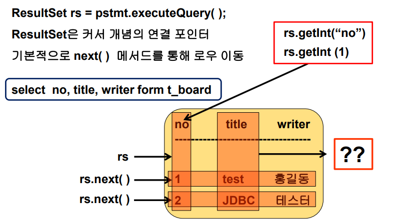


## JDBC Select문 

- **실습(select)**

  - SelectMain01.java

  ```java
  package kr.ac.kopo.jdbc;
  
  import java.sql.Connection;
  import java.sql.DriverManager;
  import java.sql.PreparedStatement;
  import java.sql.ResultSet;
  import java.sql.SQLException;
  
  public class SelectMain01 {
  
  	public static void main(String[] args) {
  		
  		Connection conn = null;
  		PreparedStatement pstmt = null;
  		
  		try {
  			//1.
  			Class.forName("oracle.jdbc.driver.OracleDriver");
  			
  			//2.
  			String url = "jdbc:oracle:thin:@192.168.119.119:1521:dink";
  			String user = "scott";
  			String pw = "tiger";
  			conn = DriverManager.getConnection(url,user,pw);
  			
  			//3.
  			String sql = "select * from t_test";
  			pstmt = conn.prepareStatement(sql);
  			
  			//4.
  			ResultSet rs = pstmt.executeQuery();
  			while(rs.next()) {
  				String id = rs.getString("id");
  				String name = rs.getString("name");
  				System.out.println("id : " + id + ", name : " + name);
  			}
  			
  		} catch (Exception e) {
  			e.printStackTrace();
  		} finally {
  			if(pstmt != null) {
  				try {
  					pstmt.close();
  				} catch (SQLException e) {
  					// TODO Auto-generated catch block
  					e.printStackTrace();
  				}
  			}
  			if(conn != null) {
  				try {
  					conn.close();
  				} catch (SQLException e) {
  					// TODO Auto-generated catch block
  					e.printStackTrace();
  				}
  			}
  		}
  	}
  }
  ```

  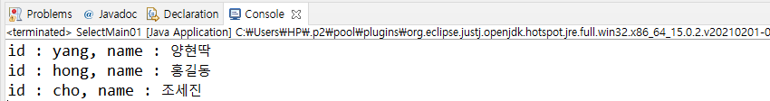


- **편의를 위해서 Close Class를 따로 생성**

  - JDBCClose.java

  ```java
  package kr.ac.kopo.util;
  
  import java.sql.Connection;
  import java.sql.SQLException;
  import java.sql.Statement;
  
  public class JDBCClose {
  	
  	public static void close(Connection conn, Statement pstmt) {
  		//일반적으로 Prepared Statement 객체를 더 많이 쓴다. 
  		//그러나 때에 따라서 Statement를 사용할 수 있다.
  		//그래서 Statement를 상속받는 Prepared Statement는 묵시적 형변환이 가능하므로
  		//Statement를 사용
  		if(pstmt != null) {
  			try {
  				pstmt.close();
  			} catch (SQLException e) {
  				e.printStackTrace();
  			}
  		}
  		
  		if(conn != null) {
  			try {
  				conn.close();
  			} catch (SQLException e) {
  				e.printStackTrace();
  			}
  		}
  	}
  }
  ```

  

- **driver 로딩하고 db 접속하고 연결 객체를 알려주는 것이 목적인 class를 생성**

  - ConnectionFactory.java
  - (목적) 하나의 class로 만들어서 나중에 db가 변경되는 경우 수정 작업 시간을 줄일 수 있음
  - 연결 객체 타입이 Connection이므로 return type이 Connection

  ```java
  package kr.ac.kopo.util;
  
  import java.sql.Connection;
  import java.sql.DriverManager;
  
  public class ConnectionFactory {
  	
  	public Connection getConnection() {
  		Connection conn = null;
  		
  		try {
  			//1.
  			Class.forName("oracle.jdbc.driver.OracleDriver");
  			//2.
  			String url = "jdbc:oracle:thin:@192.168.119.119:1521:dink";
  			String user = "scott";
  			String pw = "tiger";
  			conn = DriverManager.getConnection(url,user,pw);
  		} catch (Exception e) {
  			e.printStackTrace();
  		}
  		return conn;
  		
  	}
  }
  ```

  

- **실습 (class를 나눈 후 select문을 사용)**

  - close class, connectionFactory class
  - SelectMain02.java

  ```java
  package kr.ac.kopo.jdbc;
  
  import java.sql.Connection;
  import java.sql.PreparedStatement;
  import java.sql.ResultSet;
  
  import kr.ac.kopo.util.ConnectionFactory;
  import kr.ac.kopo.util.JDBCClose;
  
  public class SelectMain02 {
  
  	public static void main(String[] args) {
  		
  		Connection conn = null;
  		PreparedStatement pstmt = null;
  		
  		try {
  			//ConnectionFactory cf = new ConnectionFactory();
  			//conn = cf.getConnection();
  			
  			conn = new ConnectionFactory().getConnection(); //일회성으로 사용 
  			//3.
  			String sql = "select * from t_test";
  			pstmt = conn.prepareStatement(sql);
  			
  			//4.
  			ResultSet rs = pstmt.executeQuery();
  			while(rs.next()) {
  				String id = rs.getString("id");
  				String name = rs.getString("name");
  				System.out.println("id : " + id + ", name : " + name);
  			}
  			
  		} catch (Exception e) {
  			e.printStackTrace();
  		} finally {
  			JDBCClose.close(conn, pstmt);
  		}
  	}
  }
  ```


- **jar 파일 만드는 방법**

  - export 선택

  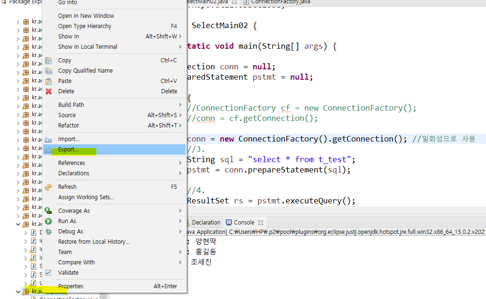

  

  - jar file 선택

  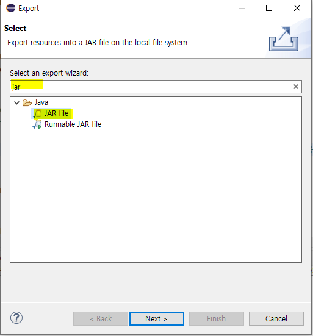

  - 원하는 class 선택

  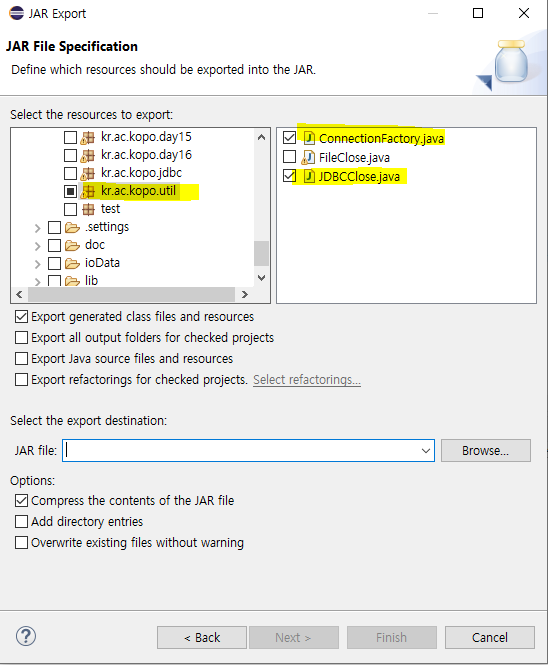

  

  - 저장위치와 파일명 입력 후 저장

  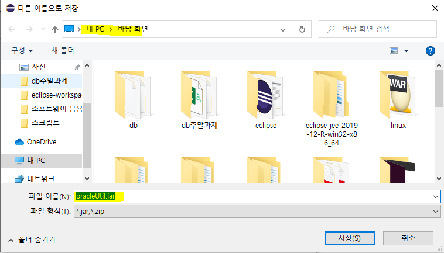

  

  - Finish

  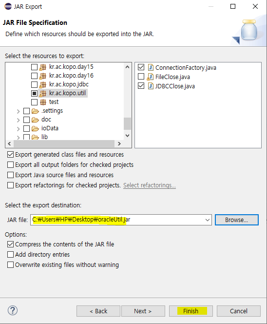


- **자원을 연결 해제시킬 수 있는 새로운 방법을 자바1.7 버전에서 추가했음**

  - 1.7버전 이후(추가된 try)
  - try 괄호 안에서 만들어진 객체는 try문 or catch문을 실행했으면 자동으로 close() 메소드를 호출한다. 
    - **AutoCloseable 인터페이스를 상속받은 객체만 사용할 수 있다.** 
    - 즉, 자동으로 close 메소드를 호출할 수 있는 객체만 사용할 수 있다.

  ```java
  package kr.ac.kopo.jdbc;
  
  import java.io.Closeable;
  import java.io.IOException;
  
  class Test implements Closeable{
  	@Override
  	public void close() throws IOException {
  		System.out.println("close()...");
  
  	}
  }
  
  public class SelectMain03 {
  	public static void main(String[] args) {
  		
  		try (
  			Test t = new Test();
  		){
  			
  		} catch (Exception e) {
  			e.printStackTrace();
  		}
  	}
  }
  ```

  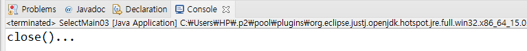


- **Connection, Statement는 AutoCloseable 인터페이스를 상속받고 있다.** 

  - IO는 모두 AutoCloseable  인터페이스를 상속받고 있어서 모두 1.7 버전의 try를 사용할 수 있다. 
    - ex. FileInputStream, OutputInputStream ...
  - **!!!!!!!!!!!!!!!!1.7버전의 try를 사용한 예!!!!!!!!!!!!!!!!**

  ```java
  package kr.ac.kopo.jdbc;
  
  import java.sql.Connection;
  import java.sql.PreparedStatement;
  import java.sql.ResultSet;
  
  import kr.ac.kopo.util.ConnectionFactory;
  
  public class SelectMain03 {
  
  	public static void main(String[] args) {
  		String sql = "select * from t_test";
  		
  		try (
  			Connection conn = new ConnectionFactory().getConnection();
  			PreparedStatement pstmt = conn.prepareStatement(sql);
  		){
  			ResultSet rs = pstmt.executeQuery();
  			while(rs.next()) {
  				String id = rs.getString("id");
  				String name = rs.getString("name");
  				
  				System.out.println("id : " + id + ", name : " + name);
  			}
  		} catch (Exception e) {
  			e.printStackTrace();
  		}		
  	}
  }
  ```

  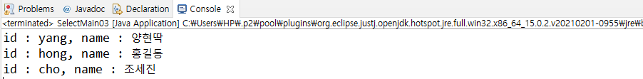


- **String보다 String builder class를 사용하는 것이 더 성능이 좋다.**

  - UpdateMain01Modify.java

  ```java
  package kr.ac.kopo.jdbc;
  
  import java.sql.Connection;
  import java.sql.DriverManager;
  import java.sql.PreparedStatement;
  import java.sql.SQLException;
  import java.util.Scanner;
  
  /*
  	수정할 아이디를 입력 : 
  	수정할 이름 입력 : 
  	입력된 hong가 새로운 이름으로 update
   */
  
  public class UpdateMain01Modify {
  
  	public static void main(String[] args) {
  		Scanner sc = new Scanner(System.in);
  		Connection conn = null;
  		PreparedStatement pstmt = null;
  		
  		try {
  			Class.forName("oracle.jdbc.driver.OracleDriver");
  			
  			String url = "jdbc:oracle:thin:@192.168.119.119:1521:dink";
  			String user = "scott";
  			String pw = "tiger";
  			conn = DriverManager.getConnection(url,user,pw);
  
  			System.out.println("이름을 변경할 아이디 입력 : ");
  			String id = sc.nextLine();
  			
  			System.out.println("변경할 이름을 입력 : ");
  			String name = sc.nextLine();
  			
  			
  			StringBuilder sql = new StringBuilder();
  			sql.append("update t_test set name = ? where id = ?");
  			//String sql = "update t_test set name = ? where id = ?";
  			
  			//prepareStatement에는 String type만 올 수 있어서 toString()을 사용한다.
  			pstmt = conn.prepareStatement(sql.toString());
  			
  			pstmt.setString(1, name);
  			pstmt.setString(2, id);
  			
  			int cnt = pstmt.executeUpdate();
  			System.out.println(cnt + "개 행 update 완료");
  			
  		} catch (Exception e) {
  			e.printStackTrace();
  		} finally {
  			if(pstmt != null) {
  				try {
  					pstmt.close();
  				} catch (SQLException e) {
  					e.printStackTrace();
  				}
  			}
  			
  			if(conn != null) {
  				try {
  					conn.close();
  				} catch (SQLException e) {
  					e.printStackTrace();
  				}
  			}
  		}
  	}
  }
  ```

  ```java
  StringBuilder sql = new StringBuilder();
  sql.append("update t_test set name = ? where id = ?");
  //String sql = "update t_test set name = ? where id = ?";
  
  //prepareStatement에는 String type만 올 수 있어서 toString()을 사용한다.
  pstmt = conn.prepareStatement(sql.toString());
  ```

  

## File Class

- **File class란?**

  - 자바에서는 File 클래스를 통해서 파일과 디렉터리를 다룰 수 있도록 하고 있다. 그래서 File 인스턴스는 파일 일 수도 있고 디렉터리 일 수도 있다.

  

- **File 메소드**

  ```java
  package kr.ac.kopo.day17;
  
  import java.io.File;
  
  public class FileMain {
  	
  	public static void main(String[] args) {
  //		//a.txt의 정보를 확인
  //		File fileObj = new File("iodata/a.txt");
  //		
  //		String name = fileObj.getName();
  //		System.out.println("파일명 : " + name);
  //		
  //		String parent = fileObj.getParent();
  //		System.out.println("부모 이름 : " + parent);
  //		
  //		String path = fileObj.getPath();
  //		System.out.println("경로 : " + path);
  //		
  //		String abPath = fileObj.getAbsolutePath();
  //		System.out.println("절대경로 : " + abPath);
  //		
  //		boolean bool = fileObj.isFile();
  //		System.out.println(bool ? "파일입니다." : "파일이 아닙니다.");
  //		
  //		bool = fileObj.isDirectory();
  //		System.out.println(bool ? "디렉토리입니다." : "디렉토리가 아닙니다.");
  //		
  //		bool = fileObj.exists();
  //		System.out.println(bool ? "파일이 존재합니다." : "파일이 존재하지 않습니다.");
  //		
  //		long length = fileObj.length();
  //		System.out.println("파일 크기 : " + length + "byte");
  //		
  //		//밀리세컨드로 나온다.(lastModified)
  //		long time = fileObj.lastModified();
  //		String format = "yyyy-MM-dd hh:mm:ss";
  //		SimpleDateFormat sdf = new SimpleDateFormat(format);
  //		System.out.println("마지막으로 수정한 날짜는 : " + sdf.format(new Date(time)));
  //		
  //		bool = fileObj.canWrite();//쓰기 가능하니?
  //		System.out.println(bool ? "쓰기 가능" : "쓰기 불가능");
  //		
  //		bool = fileObj.canRead(); //읽기 가능하니?
  //		System.out.println(bool ? "읽기 가능" : "읽기 불가능");
  		
  		File dirObj = new File("iodata");
  		System.out.println(dirObj.exists() ? "유효한 디렉토리입니다." : "유효하지 않는 디렉토리입니다.");
  		
  		System.out.println(dirObj.isDirectory() ? "디렉토리입니다." : "디렉토리가 아닙니다.");
  		
  		String [] list = dirObj.list();
  		System.out.println("==========================================================");
  		System.out.println("\t"+dirObj.getName() + " 정보");
  		System.out.println("==========================================================");
  		for(String str : list) {
  			System.out.println(str);
  		}
  		
  		
  		File newDirObj = new File("iodata/새폴더");
  		if(! newDirObj.exists()) {
  			boolean bool = newDirObj.mkdir(); //디렉토리 생성
  			System.out.println(bool ? "생성 성공" : "생성 실패" );
  		}
  		
  		newDirObj = new File("iodata/새새폴더/오리"); //상위 디렉토리까지 없으면 생성 실패
  		if(! newDirObj.exists()) {
  			boolean bool = newDirObj.mkdir(); //디렉토리 생성
  			System.out.println(bool ? "생성 성공" : "생성 실패" );
  		}
  		
  		//상위 디렉토리까지 만들고 싶을 땐 mkdirs() 사용
  		newDirObj = new File("iodata/새새폴더/오리"); //상위 디렉토리까지 없으면 생성 실패
  		if(! newDirObj.exists()) {
  			boolean bool = newDirObj.mkdirs(); //디렉토리 생성
  			System.out.println(bool ? "생성 성공" : "생성 실패" );
  		}
  		
  		//삭제
  		boolean bool = newDirObj.delete();
  		System.out.println(bool ? "삭제 성공" : "삭제 실패"); //맨 하위 폴더만 삭제 
  	}
  }
  ```

  

## Thread API

- **Process vs Thread**

  > https://gmlwjd9405.github.io/2018/09/14/process-vs-thread.html


- **Thread 생성 방법(2가지)**

  - 직접 상속 받아 스레드 생성(extends Thread)

  - Runnable 인터페이스를 구현해서 생성

    - 현재 클래스가 이미 다른 클래스로부터 상속받고 있다면 Runnable 인터페이스를 이용하여 스레드를 생성

    - Runnable 인터페이스는 JDK 라이브러리 인터페이스이고 run() 메소드만 정의되어 있다.


- **thread 메소드**

  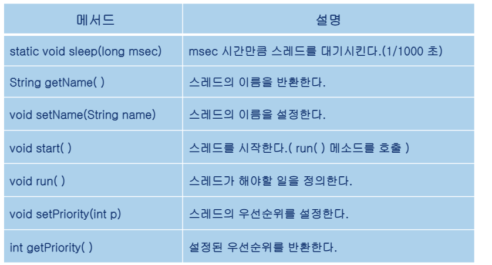


- **실습(thread)**

  - thread 실습
    - 이런식으로 작업을 하면 go!!! 만 계속 출력된다.
    - 컴퓨터는 동시에 여러개의 작업이 수행되는 것이 아니고 한번에 하나만 수행한다. 그러나 엄청 짧은 시간 내에 두 작업이 번갈아가며 수행되므로 동시에 수행되는 것처럼 보인다.

  ```java
  package kr.ac.kopo.day17;
  
  class AAA extends Thread {
  	@Override
  	public void run() {
  		super.run();
  		while(true) {
  			System.out.println("go!!!!");
  		}
  	}
  }
  
  class BBB extends Thread {
  	@Override
  	public void run() {
  		super.run();
  		while(true) {
  			System.out.println("stop!!!");
  		}
  	}
  }
  
  public class ThreadMain01 {
  	
  	public static void main(String[] args) {
  		AAA ta = new AAA();
  		BBB tb = new BBB();
  		
  		ta.run();
  		tb.run();
  	}
  }
  ```

  - 이 작업을 동시작업이 하는 것처럼 보이게 만들기 위해서는 JVM이 알아서 run 메소드를 수행하게 해야한다.
    - 개발자가 run 메소드를 수행하면 안된다. JVM이 이 작업을 해야한다.
    - 그래서 run()을 수행하는 것이 아니고 start() 메소드를 수행해서 이 작업을 시작할 것이라는 것을 알리기만 하면 된다.

  ```java
  package kr.ac.kopo.day17;
  
  class AAA extends Thread {
  	@Override
  	public void run() {
  		super.run();
  		while(true) {
  			System.out.println("go!!!!");
  		}
  	}
  }
  
  class BBB extends Thread {
  	@Override
  	public void run() {
  		super.run();
  		while(true) {
  			System.out.println("stop!!!");
  		}
  	}
  }
  
  public class ThreadMain01 {
  	
  	public static void main(String[] args) {
  		AAA ta = new AAA();
  		BBB tb = new BBB();
  		
  		ta.start();
  		tb.start();
  	}
  }
  ```

  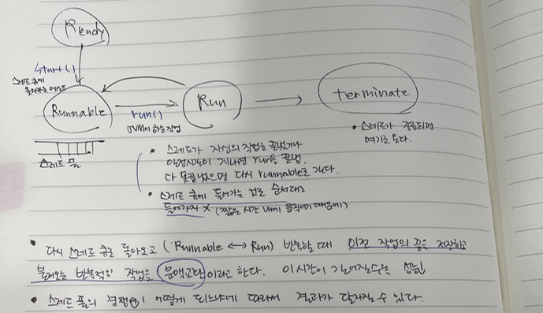

  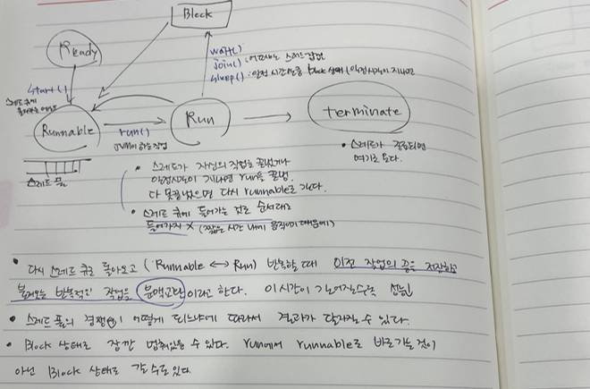

  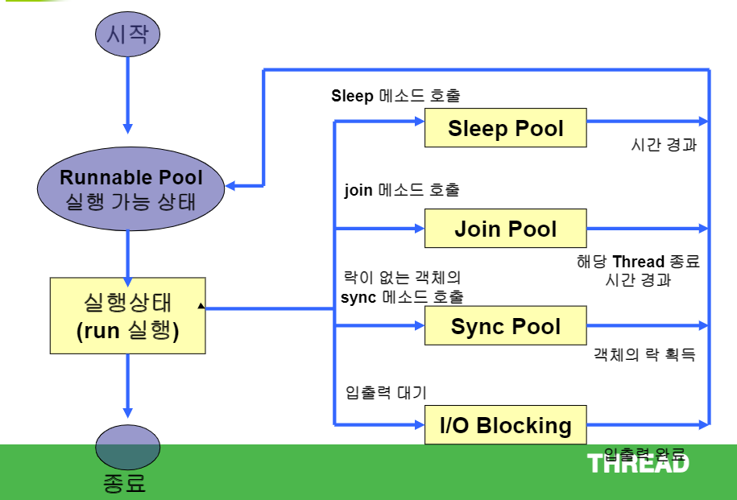


- **실습(스레드 구현 2가지 방법)**

  - 돌릴 때마다 결과가 다르게 나오는 것을 확인할 수 있다.

  ```java
  package kr.ac.kopo.day17;
  
  /*
   	Thread 구성 2가지
   	1. Thread 클래스를 상속 구현
   	2. Runnable 인터페이스를 상속 구현
   */
  
  class ExtendThread extends Thread {
  	
  	@Override
  	public void run() {
  		for(int i=0; i<100; ++i) {
  			System.out.println(i+1 + "번째 인형 눈 붙이기....");
  		}
  	}
  }
  
  class ImplementThread implements Runnable {
  	@Override
  	public void run() {
  		for(int i=0; i<100; i++) {
  			System.out.println(i+1 + "번째 인형 코 만들기....");
  		}
  	}
  }
  
  public class ThreadMain02 {
  	public static void main(String[] args) {
  		ExtendThread et = new ExtendThread();
  		ImplementThread it = new ImplementThread();
  		
  		et.start();
  		Thread t = new Thread(it); //묵시적 형변환
  		t.start();
  		
  	}
  }
  ```

  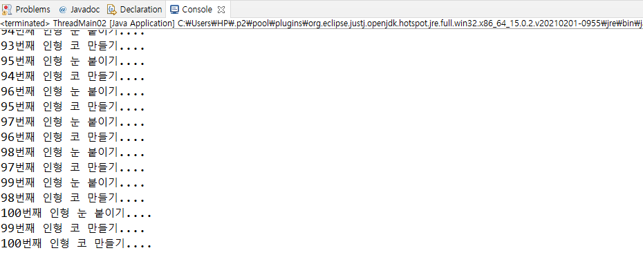

  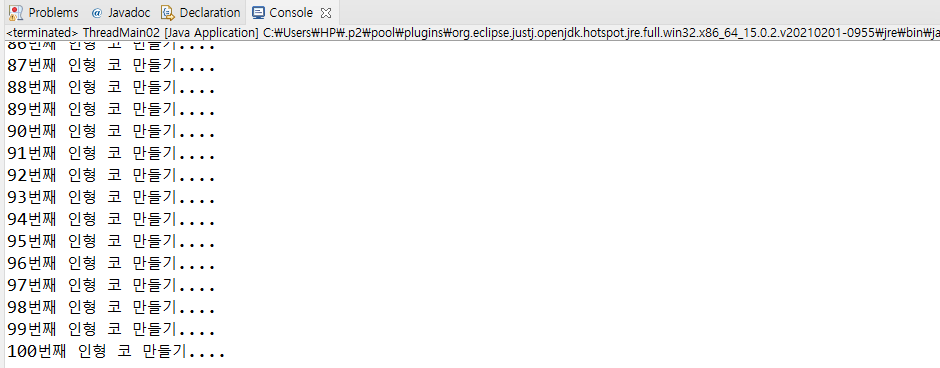

  - main에 for문을 넣을 때 다른 스레드들과 같이 움직인다.
    - 메인 메소드에 스레드 하나가 있고 ExtendThread, ImplementThread가 있는 것이다
    - 그래서 총 3개의 스레드가 경쟁을 하면서 돌고있는 것이다.
    - 그래서 결과도 계속 다르게 나옴
    - 어떤 스레드가 먼저 수행될지는 다 다르다.
    - 즉, 메인도 스레드이다.
    - System.out.println(Thread.activeCount()); 하면 스레드의 개수를 알 수 있다.

  ```java
  package kr.ac.kopo.day17;
  
  /*
   	Thread 구성 2가지
   	1. Thread 클래스를 상속 구현
   	2. Runnable 인터페이스를 상속 구현
   */
  
  class ExtendThread extends Thread {
  	
  	@Override
  	public void run() {
  		for(int i=0; i<100; ++i) {
  			System.out.println(i+1 + "번째 인형 눈 붙이기....");
  		}
  	}
  }
  
  class ImplementThread implements Runnable {
  	@Override
  	public void run() {
  		for(int i=0; i<100; i++) {
  			System.out.println(i+1 + "번째 인형 코 만들기....");
  		}
  	}
  }
  
  public class ThreadMain02 {
  	public static void main(String[] args) {
  		ExtendThread et = new ExtendThread();
  		ImplementThread it = new ImplementThread();
  		
  		et.start();
  		Thread t = new Thread(it); //묵시적 형변환
  		t.start();
  		
  		for(int i=0; i<100; i++) {
  			System.out.println(i+1 + "번째 감독중...");
  		}		
  	}
  }
  ```

  

- **Thread의 우선순위**
  - 스레드에 우선순위를 설정하지 않으면 기본적으로 5이다.
    - 클수록 우선순위가 높은 것임 
  - 스레드에 우선 순위를 부여하여 우선순위가 높은 스레드에게 실행의 우선권을 부여할 수 있다.(JVM마다다를수있다)
    - setPriority(int priority) 메소드를 이용하여 우선순위 부여
    - getPriority() 메소드를 이용하여 설정된 우선순위를 가져온다.
    - 우선 순위를 지정하기 위한 상수 제공
      - static final int MAX_PRIORITY            우선순위10
      - static final int MIN_PRIORITY             우선순위1
      - static final int NORM_PRIORITY          우선순위5
  - 그러나 우선순위가 클수록 무조건 먼저 실행되는 것이 아니다. 
    - 선택할 확률이 높은 것임


- **sleep** 

  - thread가 잠시 block으로 빠졌다가 다시 Runnable로 가는 것이다.
  - block 상태에 빠지지 않으면 무조건 runnable 상태로 간다.

  ```java
  package kr.ac.kopo.day17;
  
  public class SleepMain {
  	public static void main(String[] args) {
  		
  		System.out.println("Thread가 2초동안 잠이 들겠습니다.");
  		
  		try {
  			//sleep의 메소드는 throws Exception을 가지고 있다.
  			//이렇게 문법적인 오류가 발생하는 경우를 checked exception
  			Thread.sleep(2000); //sleep의 단위는 밀리세컨드
  		} catch (InterruptedException e) {
  			e.printStackTrace();
  		} 
  		System.out.println("Thread가 깨어났습니다.");
  	}
  }
  ```


- **예**

  - sleep에 들어갔다가 다시 나올때는 시간이 걸려서 go!!!만 출력이 됨
  - 그래서 go도 잠깐 멈춰야 현재시간이 나온다.

  ```java
  package kr.ac.kopo.day17;
  
  import java.util.Date;
  
  class TimeThread extends Thread {
  	
  	//1초에 한번씩 현재시간 출력하는 스레드
  	@Override
  	public void run() {
  		while(true) {
  			try {
  				Thread.sleep(1000);
  			} catch (InterruptedException e) {
  				e.printStackTrace();
  			}
  			System.out.println("현재시간: " + new Date().toLocaleString());
  		}
  	}
  }
  
  public class SleepMain {
  	public static void main(String[] args) {
  		
  		
  		TimeThread tt = new TimeThread();
  		tt.start();
  		
  		while(true) {
  			System.out.println("go!!!!");
  		}
  	}
  }
  ```

  - go 에도 sleep을 준다.

  ```java
  package kr.ac.kopo.day17;
  
  import java.util.Date;
  
  class TimeThread extends Thread {
  	
  	//1초에 한번씩 현재시간 출력하는 스레드
  	@Override
  	public void run() {
  		while(true) {
  			try {
  				Thread.sleep(1000);
  			} catch (InterruptedException e) {
  				e.printStackTrace();
  			}
  			System.out.println("현재시간: " + new Date().toLocaleString());
  		}
  	}
  }
  
  public class SleepMain {
  	public static void main(String[] args) {
  		
  		
  		TimeThread tt = new TimeThread();
  		tt.start();
  		
  		while(true) {
  			System.out.println("go!!!!");
  			try {
  				Thread.sleep(100);
  			} catch (InterruptedException e) {
  				// TODO Auto-generated catch block
  				e.printStackTrace();
  			}
  		}
  	}
  }
  ```

  

- **Join**

  - 다른쪽 스레드가 종료하기 전까지 자신은 일을 실행시키지 못함(즉, 대기상태에 빠진다. 이것을 조인이라고 한다.)
  - 메인이 끝나면 모든게 종료되는걸로 알고있는데 쓰레드는 그렇지 않다. 메인이 종료되어도 백그라운드에서 돌아가기 때문이다.
  - 하지만 이런 쓰레드도 join(조인)을 이용하여 제어를 할 수 있다.
  - 즉, 이와같이 join을 사용한다면 해당 쓰레드가 종료되기까지 기다렸다가 다음으로 넘어간다.
  - 예

  ```java
  package kr.ac.kopo.day17;
  
  /*
   	Thread 구성 2가지
   	1. Thread 클래스를 상속 구현
   	2. Runnable 인터페이스를 상속 구현
   */
  
  public class ThreadMain02Modify {
  	public static void main(String[] args) {
  		ExtendThread et = new ExtendThread();
  		ImplementThread it = new ImplementThread();
  		
  		System.out.println("감독을 시작합니다.");
  		et.start();
  		Thread t = new Thread(it); //묵시적 형변환
  		t.start();
  		
  		try {
  			et.join();
  		} catch (InterruptedException e) {
  			// TODO Auto-generated catch block
  			e.printStackTrace();
  		}
  		
  		
  		try {
  			t.join();
  		} catch (InterruptedException e) {
  			// TODO Auto-generated catch block
  			e.printStackTrace();
  		}
  		
  		//즉, et 스레드와 t 스레드가 종료되어야 감독을 종료합니다. 스레드가 block에서 빠져나온다.
  		//만약 et와 t의 스레드가 무한루프이면 감독을 종료합니다 스레드가 출력되지 않는다.
  		//그래서 join에 시간을 설정하면 그 시간이 지난 후에 block에서 runnable로 온다.
  		System.out.println("감독을 종료합니다.");
  	}
  }
  ```

  


- **synchronized**

  - 멀티스레드 환경에서 반드시 고려해야할 점인 스레드간 동기화라는 문제는 꼭 해결해야 한다.
  - 예를 들어 스레드간 서로 공유하고 수정할 수 있는 data가 있는데 스레드간 동기화가 되지 않은 상태에서 멀티스레드 프로그램을 돌리면, data의 안정성과 신뢰성을 보장할 수 없습니다.
  - 따라서 data의 thread-safe를 하기 위해 자바에서는 synchronized 키워드를 제공해 스레드간 동기화를 시켜 data의 thread-safe를 가능케합니다
  - ex. 같은 계좌로 인터넷뱅킹과 직접 atm기에서 동시에 작업을 할 때 이중으로 돈을 뽑을 수 없게 해야한다. 그래서 중간에 runnable 상태로 빠져나갔을 때 다른 스레드가 와서 그 돈을 건들 수 없어야 한다.
  - 이러한 것을 막기위해 동기화가 사용된다.
  - 본인만 쓸 수 있도록 lock을 걸고 자원을 선점한다. 그래서 자신이 쓰고있는 스레드가 runnable로 갔을 때 다른 스레드가 접근하려고 하면 이미 선점된 자원이므로 스레드가 수행되지 않고 바로 runnable로 들어간다. lock이 풀어지면 그때 다른 스레드가 해당 자원에 접근할 수 있다.  

  - **실습**
    - 스레드의 특성상 abc 순서대로 나오지 않는다.
    - 그래서 synchronized로 lock을 걸어줘야 한다.

  ```java
  package kr.ac.kopo.day17;
  
  class Sync {
  	public void a() {
  		for(int i=0; i<10; i++) {
  			System.out.print("a");
  		}
  	}
  	public void b() {
  		for(int i=0; i<10; i++) {
  			System.out.print("b");
  		}
  	}
  	public void c() {
  		for(int i=0; i<10; i++) {
  			System.out.print("c");
  		}
  	}
  }
  
  class SyncThread extends Thread {
  	
  	private Sync sync;
  	private int type;
  	
  	public SyncThread(Sync sync, int type) {
  		this.sync = sync;
  		this.type = type;
  	}
  	
  	@Override
  	public void run() {
  		switch (type) {
  		case 1:
  			sync.a();
  			break;
  		case 2:
  			sync.b();
  			break;
  		case 3:
  			sync.c();
  			break;
  		}
  	}
  	
  }
  
  
  public class SyncThreadMain {
  	public static void main(String[] args) {
  		Sync sync = new Sync();
  		
  		//하나의 인스턴스 객체를 3개의 스레드가 공유
  		SyncThread st1 = new SyncThread(sync,1);
  		SyncThread st2 = new SyncThread(sync,2);
  		SyncThread st3 = new SyncThread(sync,3);
  		
  		st1.start();
  		st2.start();
  		st3.start();
  		
  	}
  }
  ```

  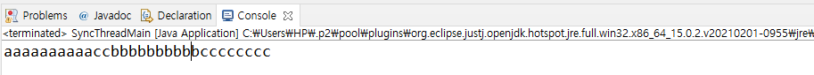


- **lock을 걸어주는 방식**

  - a가 수행되는 동안 해당 클래스에 있는 다른 메소드가 실행되면 안된다. 그래서 메소드 앞에 synchronized를 붙여준다.
  - 작업의 순서를 바뀔 수 있지만 각 메소드가 다 끝나고 다른 메소드가 수행된다.
  - println을 사용하면 저절로 하나의 메소드가 끝나고 다른 메소드가 실행된다. 그래서 실습에서는 print를 사용해서 한 것임
    - **println의 경우는 동기화 블록을 사용하고 있음**

  ```java
  package kr.ac.kopo.day17;
  
  class Sync {
  	public synchronized void a() {
  		for(int i=0; i<10; i++) {
  			System.out.print("a");
  		}
  	}
  	public synchronized void b() {
  		for(int i=0; i<10; i++) {
  			System.out.print("b");
  		}
  	}
  	public synchronized void c() {
  		for(int i=0; i<10; i++) {
  			System.out.print("c");
  		}
  	}
  }
  
  class SyncThread extends Thread {
  	
  	private Sync sync;
  	private int type;
  	
  	public SyncThread(Sync sync, int type) {
  		this.sync = sync;
  		this.type = type;
  	}
  	
  	@Override
  	public void run() {
  		switch (type) {
  		case 1:
  			sync.a();
  			break;
  		case 2:
  			sync.b();
  			break;
  		case 3:
  			sync.c();
  			break;
  		}
  	}
  	
  }
  
  public class SyncThreadMain {
  	public static void main(String[] args) {
  		Sync sync = new Sync();
  		
  		//하나의 인스턴스 객체를 3개의 스레드가 공유
  		SyncThread st1 = new SyncThread(sync,1);
  		SyncThread st2 = new SyncThread(sync,2);
  		SyncThread st3 = new SyncThread(sync,3);
  		
  		st1.start();
  		st2.start();
  		st3.start();
  		
  	}
  }
  ```

  - 동기화 블록 예
    - 3,4,5는 순서대로 수행되도록 설정

  ```java
  public void d() {
      System.out.print(1);
      System.out.print(2);
      synchronized (this) {
          System.out.print(3);
          System.out.print(4);
          System.out.print(5);
      }
  }
  ```

  

- wait, notify 메소드
  - wait : 얼음
  - notify : 땡
  - run에서 일을 수행하다가 wait가 나오면 무조건 block 상태로 빠진다.
  - 땡을 해주는 명령어가 notify
  - 여러개의 스레드가 wait가 되어있을 경우 notify를 만나면 그 여러개의 스레드 중에 랜덤으로 하나만 땡(runnable로 이동)이 된다.
    - notify all은 모든 스레드가 runnable로 감


## Network API

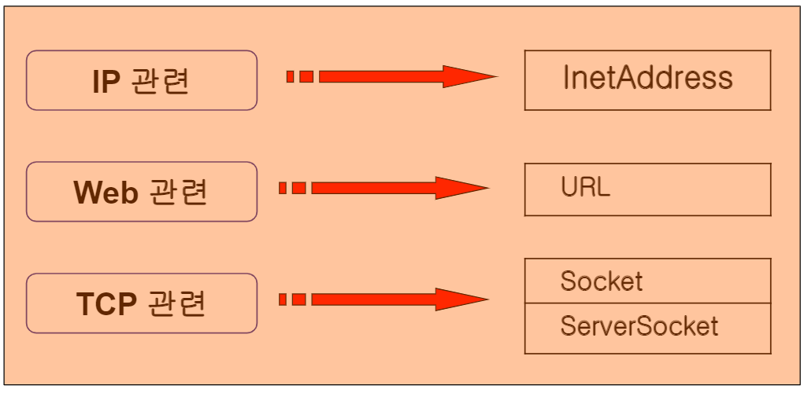


- **API - InetAddress**

  - ip 정보를 알아올 때 사용하는 class
  - method
  
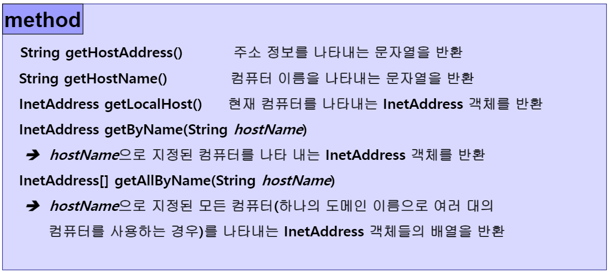
  
  - **실습**
  
  ```java
  package kr.ac.kopo.day17;
  
  import java.net.InetAddress;
  import java.net.UnknownHostException;
  
  public class InetAddressMain {
  	public static void main(String[] args) {
  		InetAddress localhost;
  		try {
  			localhost = InetAddress.getLocalHost();
  			System.out.println("내 컴퓨터의 네트워크 이름 : " + localhost.getHostName());
  			System.out.println("내 컴퓨터의 IP 주소 : " + localhost.getHostAddress());
  			System.out.println(localhost);
  		} catch (UnknownHostException e) {
  			// TODO Auto-generated catch block
  			e.printStackTrace();
  		}
  	}
}
  
```
  
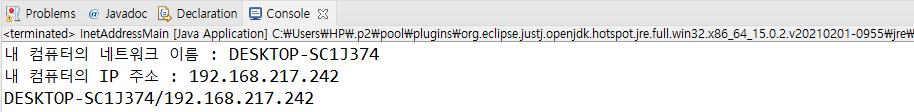
  
- localhost를 찍으면 둘 다 같이 나오는 이유는 toString()
  
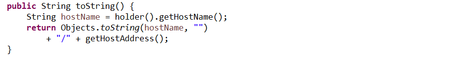
  

  
  - **실습(다른 사이트의 ip 주소 가져오기)**
  
  ```java
  package kr.ac.kopo.day17;
  
  import java.net.InetAddress;
  import java.net.UnknownHostException;
  
  public class InetAddressMain {
  	public static void main(String[] args) {
  		InetAddress localhost;
  		try {
  			
  			//다른 ip주소
  			InetAddress addr = InetAddress.getByName("www.hanati.co.kr");
  			System.out.println("하나금융티아이 네트워크 이름 : " + addr.getHostName());
  			System.out.println("하나금융티아이 ip 주소 : " + addr.getHostAddress());
  						
  		} catch (UnknownHostException e) {
  			// TODO Auto-generated catch block
  			e.printStackTrace();
  		}
	}
  }
```
  
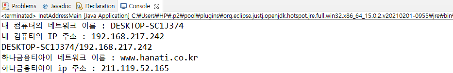
  

  
  - **서버가 여러대인 ip 주소를 모두 가져오기**
  
  ```java
  package kr.ac.kopo.day17;
  
  import java.net.InetAddress;
  import java.net.UnknownHostException;
  
  public class InetAddressMain {
  	public static void main(String[] args) {
  		InetAddress localhost;
  		try {
  			//서버들의 ip주소를 모두 가져옴
  			System.out.println("=============================================");
  			System.out.println("                naver ip 주소               ");
  			System.out.println("=============================================");
  			InetAddress[] addrs = InetAddress.getAllByName("www.naver.com");
  			for(InetAddress a : addrs) {
  				System.out.println(a.getHostAddress());
  			}
  			
  		} catch (UnknownHostException e) {
  			// TODO Auto-generated catch block
  			e.printStackTrace();
  		}
  	}
}
  
  ```
  
  


