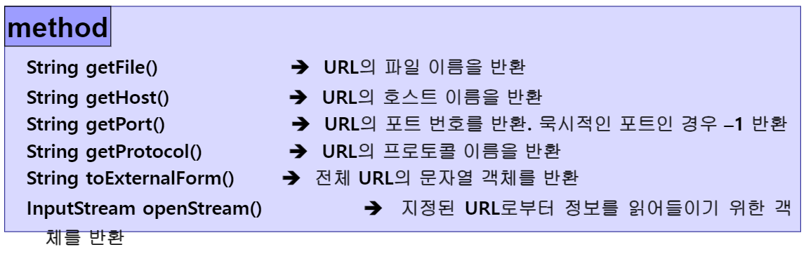
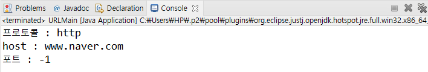
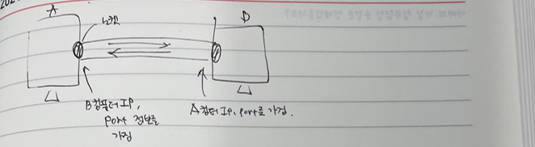
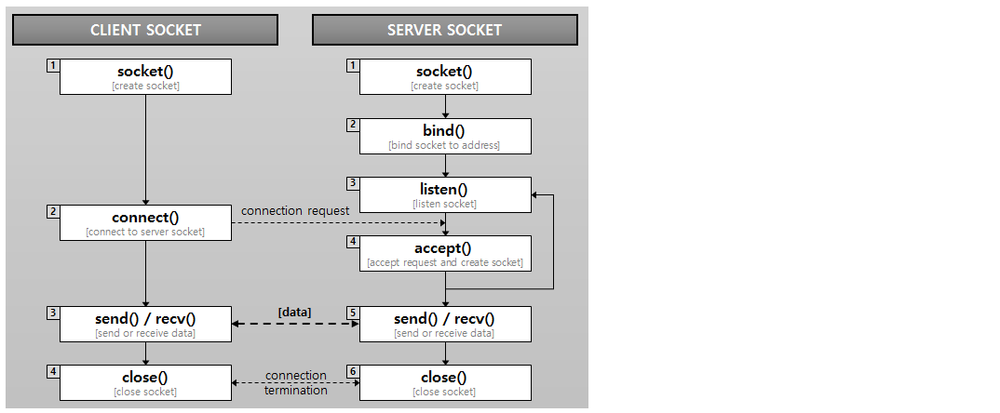
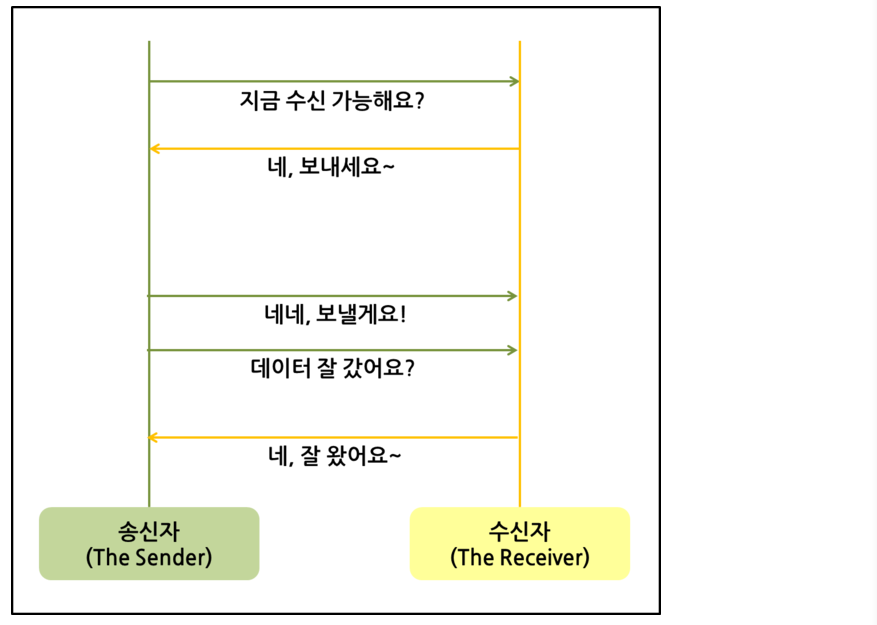
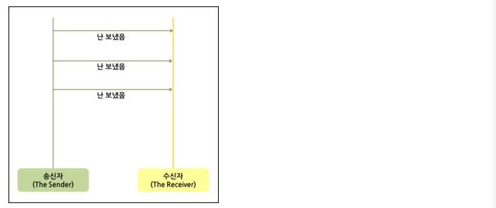
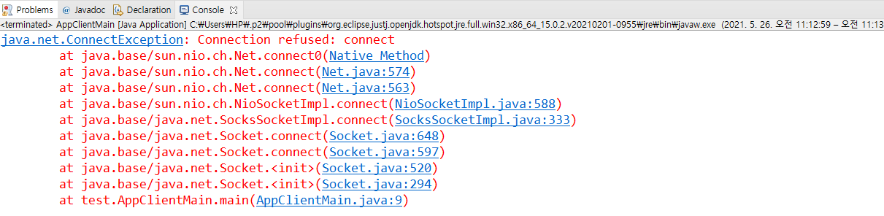
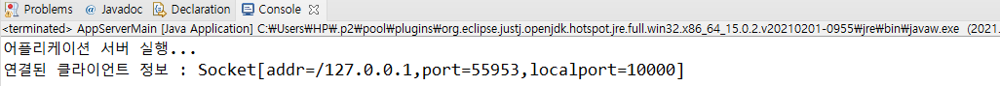
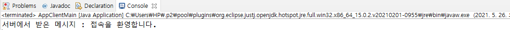
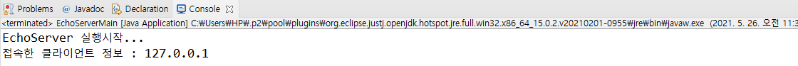

## API - URL [protocol://host:port/filename(경로포함)]

- construnct

  - URL(String protocol, String host, int port, String file)
  - URL(String protocol, String host, String file)
  - URL(String urlString)
  - URL은 어떤 컴퓨터에 어떤 작업을 할건지 명시하는 작업
  - protocol : smtp, ftp, http, https ...
  - host : ip , port : port 번호 
    - 하나의 컴퓨터가 여러개의 서비스를 제공할 수 있어서 이를 구분할 수 있는 host와 port를 지정해줘야 한다.

- method

  - openStream() : 자바에서 기본적으로 제공하는 URL 객체에는 openStream이라는 하위 메소드를 가지고 있다. 이 메소드를 호출하게 되면, 매우 쉽게 사이트의 정보를 읽어들일 수 있다.

  


- **실습**

  - 포트번호를 지정해주지 않아서 -1이 나오는 것임
  - 자동으로 포트번호를 가져오진 않음
  - 지정해진 값에서 분석만 해주는 것

  ```java
  package kr.ac.kopo.day18;
  
  import java.net.MalformedURLException;
  import java.net.URL;
  
  public class URLMain {
  	public static void main(String[] args) {
  		try {
  			URL urlObj = new URL("http://www.naver.com");
  			
  			System.out.println("프로토콜 : " + urlObj.getProtocol());
  			System.out.println("host : "+ urlObj.getHost());
  			System.out.println("포트 : " + urlObj.getPort());
  		} catch (MalformedURLException e) {
  			e.printStackTrace();
  		}
  	}
  }
  ```

  

  

  - **네이버에서 java로 검색한 URL을 입력한 실습**
    - url에 ? 뒤에 붙은 내용을 쿼리라고 한다.

  ```java
  package kr.ac.kopo.day18;
  
  import java.net.MalformedURLException;
  import java.net.URL;
  
  public class URLMain {
  	public static void main(String[] args) {
  		try {
  			//URL urlObj = new URL("http://www.naver.com");
  			URL urlObj = new URL("https://search.naver.com/search.naver?where=nexearch&sm=top_hty&fbm=1&ie=utf8&query=java");
  			
  			System.out.println("프로토콜 : " + urlObj.getProtocol());
  			System.out.println("host : "+ urlObj.getHost());
  			System.out.println("포트 : " + urlObj.getPort());
  			System.out.println("경로 : " + urlObj.getPath());
  			System.out.println("쿼리 : " + urlObj.getQuery());
  			
  		} catch (MalformedURLException e) {
  			e.printStackTrace();
  		}
  	}
  }
  ```

  

  

  - **openStream(); 실습**
    - InputStreamReader : 바이트 단위로 읽어 들이는 InputStream을 통해 데이터를 읽어 들여 문자 단위로 읽어 들이는 방식으로 변형한다는 의미
    - euc-kr : 한글 한 글자를 2byte로 인식 
    - utf-8 : 한글 한 글자를 3byte로 인식
    - url에 무언가를 전송하려면 outputStream이 필요하다. 그러나 URL API에는 리턴타입이outputStream이 없다.
    - 만약 OutputStream을 사용하고 싶다면 openConnection()을 사용하면 inputStream과 OutputStream을 모두 사용할 수 있다. 

  ```java
  package kr.ac.kopo.day18;
  
  import java.io.InputStream;
  import java.io.InputStreamReader;
  import java.net.URL;
  
  public class URLMain {
  	public static void main(String[] args) {
  		try {
  			URL urlObj = new URL("https://www.naver.com");
  			//URL urlObj = new URL("https://search.naver.com/search.naver?where=nexearch&sm=top_hty&fbm=1&ie=utf8&query=java");
  			
  			System.out.println("프로토콜 : " + urlObj.getProtocol());
  			System.out.println("host : "+ urlObj.getHost());
  			System.out.println("포트 : " + urlObj.getPort());
  			System.out.println("경로 : " + urlObj.getPath());
  			System.out.println("쿼리 : " + urlObj.getQuery());
  			
  			System.out.println("=======================================");
  			InputStream is = urlObj.openStream(); //url과 통신할 수 있는 통로가 만들어짐
  			//읽을 수 있는 권한만 줌
  			
  			//이 뒤에 인코딩 방식을 정해줄 수 있다. 
  			InputStreamReader isr = new InputStreamReader(is, "utf-8");
  			
  			while(true) {
  				int c = isr.read();
  				if(c == -1) break;
  				System.out.print((char)c);
  			}
  			
  		} catch (Exception e) {
  			e.printStackTrace();
  		}
  	}
  }
  ```

  

  - **openConnection();**
    - URL 클래스만을 이용하기에는 뭔가 사용할수 있는 메소드의 개수에 한계가있다. 그래서 우리는 처음 선언한 URL 객체를 다른 클래스의 객체로 바꾸어서 더 다양한 메소드를 사용할 필요가 있다.
    - 그렇게 객체를 바꾸는데 이용되는것이 바로 openConnection() 메소드이다.

  ```java
  package kr.ac.kopo.day18;
  
  import java.io.InputStream;
  import java.io.InputStreamReader;
  import java.io.OutputStream;
  import java.net.URL;
  import java.net.URLConnection;
  
  public class URLMain {
  	public static void main(String[] args) {
  		try {
  			URL urlObj = new URL("https://www.naver.com");
  			//URL urlObj = new URL("https://search.naver.com/search.naver?where=nexearch&sm=top_hty&fbm=1&ie=utf8&query=java");
  			
  			System.out.println("프로토콜 : " + urlObj.getProtocol());
  			System.out.println("host : "+ urlObj.getHost());
  			System.out.println("포트 : " + urlObj.getPort());
  			System.out.println("경로 : " + urlObj.getPath());
  			System.out.println("쿼리 : " + urlObj.getQuery());
  			
  			System.out.println("=======================================");
  			URLConnection uc = urlObj.openConnection();
  			InputStream is = uc.getInputStream();
  			OutputStream os = uc.getOutputStream();
  			
  			//이 뒤에 인코딩 방식을 정해줄 수 있다. 
  			InputStreamReader isr = new InputStreamReader(is, "utf-8");
  			
  			while(true) {
  				int c = isr.read();
  				if(c == -1) break;
  				System.out.print((char)c);
  			}
  			
  		} catch (Exception e) {
  			e.printStackTrace();
  		}
  	}
  }
  ```

  

## API -ServerSocket

- **소켓이란?**

  - 소켓은 각 포트를 사용하여 통신을 수행하는 도구

  - 각각 프로그램에 포트를 세팅하면 알아서 통신되는 것이 아니고 이 소켓으로 데이터를 주고 받는 것이다.

  - 네트워크상에서 동작하는 프로그램 간 통신의 종착점(Endpoint)이다(접속의 끝 부분). 즉, 프로그램이 네트워크에서 데이터를 통신할 수 있도록 연결해주는 연결부라고 할 수 있다.

    

  - 데이터를 통신할 수 있도록 해주는 연결부이기 때문에 통신할 두 프로그램(Client, Server) 모두에 소켓이 생성되야 한다.

  - Server는 특정 포트와 연결된 소켓(Server 소켓)을 가지고 컴퓨터 위에서 동작하게 되는데 이 Server는 소켓을 통해 Cilent측 소켓의 연결 요청이 있을 때까지 기다리고 있다(listening 한다 라고도 표현한다).

  - Client 소켓에서 연결요청을 하면(올바른 port로 들어왔을 때) Server 소켓이 허락을 하여 통신을 할 수 있도록 연결(connection)되는 것이다.

  - 소켓은 신뢰가 중요해서 프로토콜이 TCP이다.

  - **소켓 통신의 흐름**

  

  - **서버 (Server)**
    - 클라이언트 소켓의 연결 요청을 대기하고, 연결 요청이 오면 클라이언트 소켓을 생성하여 통신이 가능하게 한다
    - 1) socket() 함수를 이용하여 소켓을 생성
    - 2) bind() 함수로 ip와 port 번호를 설정하게 된다.
    - 3) listen() 함수로 클라이언트의 접근 요청에 수신 대기열을 만들어 몇 개의 클라이언트를 대기 시킬지 결정
    - 4) accept() 함수를 사용하여 클라이언트와의 연결을 기다림

  - **클라이언트 (Client)**
    - 실제로 데이터 송수신이 일어나는 것은 클라이언트 소켓이다.
    - 1) socket() 함수로 가장먼저 소켓을 연다.
    - 2) connect() 함수를 이용하여 통신 할 서버의 설정된 ip와 port 번호에 통신을 시도
    - 3) 통신을 시도 시, 서버가 accept() 함수를 이용하여 클라이언트의 socket descriptor를 반환
    - 4) 이를 통해 클라이언트와 서버가 서로 read(), write() 를 하며 통신 (이 과정이 반복)


- 처음 클라이언트가 서버에 소켓을 연결할 때는 서버의 포트 번호는 하나의 포트 번호(대표번호)를 사용하지만 소켓이 대화를 할 때는 다른 포트를 사용한다. 그래서 일대다의 서비스를 사용할 수 있다.
  - 대화할 때는 다른 포트를 사용하므로 내부적으로 안에서 대화를 할 수 있는 다른 포트 번호를 사용해서 다른 클라이언트가 서버에 연결할 수 있다. 


- **TCP와 UDP 차이**

  - TCP

    - 데이터 송신 과정

    

  - UDP 

    - 데이터 송신 과정

    

  - 즉, 신뢰성이 요구되는 애플리케이션에는 TCP를 사용하고 간단한 데이터를 빠른 속도로 전송하고자 하는 애플리케이션에는 UDP를 사용한다.


- **관련 용어 - 호스트, 포트**
  - 호스트(Host)
    - 호스트 주소 : 하나의 컴퓨터에 할당된 고유 이름
    - 인터넷 상에서 IP 주소나 도메인명으로 나타난다.
  - 포트(Port)
    - 포트번호 : 한 컴퓨터에서 여러 서비스의 제공을 가능하게 함
    - 한 호스트에 있는 여러 개의 서비스를 구분하기 위해서 사용
    - 하나의 호스트는 여러 개의 포트를 가질 수 있다.
    - 서버 어플리케이션은 클라이언트의 요청으 루이해 대기할 때 미리 정해진 포트를 감시한다.
    - 호스트는 전화번호에 포트는 내선번호에 비교할 수 있다.


- **실습(일대일)**

  - 서버 먼저 생성

  ```java
  package test;
  
  import java.net.ServerSocket;
  
  public class AppServerMain {
  	public static void main(String[] args) {
  		try {
  			ServerSocket server = new ServerSocket(10000); //포트번호 설정(항상 10000번대로)
  			System.out.println("어플리케이션 서버 실행...");
  			
  			//클라이언트의 요청을 기다리는 명령어
  			//accept()를 쓰지 않으면 서버가 꺼짐
  			server.accept();
  		} catch (Exception e) {
  			e.printStackTrace();
  		} 
  	}
  }
  ```

  

  - 클라이언트 생성

    - 서버를 실행하지 않고 클라이언트의 class를 먼저 실행하면 에러 발생

    

    - 만약 서버를 먼저 실행하고 running 상태에서 클라이어트를 실행하면 accept()가 된 순간  끝나는 코드 

  ```java
  package test;
  
  import java.net.Socket;
  
  public class AppClientMain {
  	public static void main(String[] args) {
  		try {
  			//연결을 요청하기 위한 서버의 ip와 port를 알아야 한다.
  			Socket socket = new Socket("localhost", 10000);
  		} catch (Exception e) {
  			e.printStackTrace();
  		}
  	}
  }
  ```

  

  - 연결 수용
    - accept()가 호출되면 프로그램은 여기서 실행을 멈추고 클라이언트 포트가 10000번으로 연결할 때까지 무한 대기 한다.
    - 클라이언트가 연결되면 accept() 메소드는 Socket 객체를 반환한다.
      - Socket connection = server.accept(); 

  ```java
  package test;
  
  import java.net.ServerSocket;
  import java.net.Socket;
  
  public class AppServerMain {
  	public static void main(String[] args) {
  		try {
  			ServerSocket server = new ServerSocket(10000); //포트번호 설정(항상 10000번대로)
  			System.out.println("어플리케이션 서버 실행...");
  			
  			//클라이언트의 요청을 기다리는 명령어
  			//accept()를 쓰지 않으면 서버가 꺼짐
  			Socket client = server.accept();
  			System.out.println("연결된 클라이언트 정보 : " + client);
  		} catch (Exception e) {
  			e.printStackTrace();
  		} 
  	}
  }
  ```

  

  

  - 연결이 되면 서버에서 접속을 환영합니다 라는 메시지를 보냄

  ```java
  package test;
  
  import java.io.DataOutputStream;
  import java.io.OutputStream;
  import java.net.ServerSocket;
  import java.net.Socket;
  
  public class AppServerMain {
  	public static void main(String[] args) {
  		try {
  			ServerSocket server = new ServerSocket(10000); //포트번호 설정(항상 10000번대로)
  			System.out.println("어플리케이션 서버 실행...");
  			
  			//클라이언트의 요청을 기다리는 명령어
  			//accept()를 쓰지 않으면 서버가 꺼짐
  			Socket client = server.accept();
  			System.out.println("연결된 클라이언트 정보 : " + client);
  			
  			//클라이언트에서 접속을 환영합니다 라고 전송
  			String msg = "접속을 환영합니다.";
  			OutputStream os = client.getOutputStream(); // 데이터를 출력하기 위해 outputStream
  			DataOutputStream dos = new DataOutputStream(os); 
  			dos.writeUTF(msg); //utf 방식으로 전송 //new OutputStreamWriter(os, "utf-8");
  			dos.flush(); //버퍼 비우기
  			
  		} catch (Exception e) {
  			e.printStackTrace();
  		} 
  	}
  }
  ```

  

  - 클라이언트에서 서버가 전송한 메시지를 받기

  ```java
  package test;
  
  import java.io.DataInputStream;
  import java.io.InputStream;
  import java.net.Socket;
  
  public class AppClientMain {
  	public static void main(String[] args) {
  		try {
  			//연결을 요청하기 위한 서버의 ip와 port를 알아야 한다.
  			Socket socket = new Socket("localhost", 10000);
  			
  			InputStream is = socket.getInputStream();
  			DataInputStream dis = new DataInputStream(is); //필터 class(문자가 들어올 수 있으므로)
  			String msg = dis.readUTF(); //UTF로 받기 
  			System.out.println("서버에서 받은 메시지 : " + msg);
  			
  			socket.close();
  		} catch (Exception e) {
  			e.printStackTrace();
  		}
  	}
  }
  ```

  


- **에코 서버란?**
  - 클라이언트가 전송해 주는 데이터를 그대로 되돌려 전송해주는 기능의 서버를 의미
  - 클라이언트가 서버로 데이터를 전송하면 서버는 그 데이터를 받았다가 그대로 다시 되돌려 준다.
  - 따라서 에코 클라이언트와 서버 모델의 특징은 클라이언트가 서버로부터 몇 바이트의 데이터를 수신할 것인지 예상할 수 있다는 것이다.
  - 왜냐하면 전송한 데이터만큼 되돌려 받기 때문이다.


- **에코서버 실습**

  - 서버 생성

  ```java
  package kr.ac.kopo.day18;
  
  import java.net.ServerSocket;
  import java.net.Socket;
  
  public class EchoServerMain {
  	public static void main(String[] args) {
  		try {
  			ServerSocket server = new ServerSocket(10001);
  			System.out.println("EchoServer 실행시작...");
  			
  			//클라이언트의 접속을 기다리고 접속되면 정보 받기
  			Socket client = server.accept();
  			System.out.println("접속한 클라이언트 정보 : " + client.getInetAddress().getHostAddress());
  			
  		} catch (Exception e) {
  			// TODO Auto-generated catch block
  			e.printStackTrace();
  		}
  	}
  }
  ```

  

  - 클라이언트 생성

  ```java
  package kr.ac.kopo.day18;
  
  import java.net.Socket;
  
  public class EchoClientMain {
  	public static void main(String[] args) {
  		try {
  			Socket client = new Socket("localhost", 10001);
  		} catch (Exception e) {
  			e.printStackTrace();
  		} 
  	}
  }
  ```

  

  - 서버 실행 후 클라이언트 실행

  

  

  - 클라이언트에 키보드로 입력받은 데이터를 전송할 객체 생성

  ```java
  package kr.ac.kopo.day18;
  
  import java.io.BufferedReader;
  import java.io.DataInputStream;
  import java.io.InputStream;
  import java.io.InputStreamReader;
  import java.io.OutputStream;
  import java.io.OutputStreamWriter;
  import java.io.PrintWriter;
  import java.net.Socket;
  
  public class EchoClientMain {
  	public static void main(String[] args) {
  		try {
  			
  			Socket client = new Socket("localhost", 10001);
  			
  			//키보드로 입력받을 객체
  			//만약 스캐너가 없는 경우(스캐너는 1.5버전)
  			BufferedReader keyboard = new BufferedReader(new InputStreamReader(System.in));
  			
  			
  			// 클라이언트가 키보드로 입력받은 데이터를 서버에게 데이터를 전달
  			OutputStream os = client.getOutputStream();
  			OutputStreamWriter osw = new OutputStreamWriter(os);
  			PrintWriter pw = new PrintWriter(osw); //writer로 날아감
  			
  			
  		} catch (Exception e) {
  			e.printStackTrace();
  		} 
  	}
  }
  
  ```

  

  - 서버에서 데이터를 받을 객체 생성하고 재전송할 객체 생성

  ```java
  package kr.ac.kopo.day18;
  
  import java.io.BufferedReader;
  import java.io.DataOutputStream;
  import java.io.InputStream;
  import java.io.InputStreamReader;
  import java.io.OutputStream;
  import java.net.ServerSocket;
  import java.net.Socket;
  
  public class EchoServerMain {
  	public static void main(String[] args) {
  		try {
  			ServerSocket server = new ServerSocket(10001);
  			System.out.println("EchoServer 실행시작...");
  			
  			//클라이언트의 접속을 기다리고 접속되면 정보 받기
  			Socket client = server.accept();
  			System.out.println("접속한 클라이언트 정보 : " + client.getInetAddress().getHostAddress());
  			
  			//클라이언트에서 전송한 데이터를 수신 객체
  			InputStream is = client.getInputStream();
  			InputStreamReader isr = new InputStreamReader(is);
  			BufferedReader br = new BufferedReader(isr);
  			
  			
  			//수신한 데이터를 클라이언트에 재전송할 객체
  			OutputStream os = client.getOutputStream();
  			DataOutputStream dos = new DataOutputStream(os);
  			
  		} catch (Exception e) {
  			// TODO Auto-generated catch block
  			e.printStackTrace();
  		}
  	}
  }
  
  ```

  

  - 서버에서 재전송한 데이터 클라이언트에서 받기 설정

  ```java
  package kr.ac.kopo.day18;
  
  import java.io.BufferedReader;
  import java.io.InputStream;
  import java.io.InputStreamReader;
  import java.io.OutputStream;
  import java.io.OutputStreamWriter;
  import java.io.PrintWriter;
  import java.net.Socket;
  
  public class EchoClientMain {
  	public static void main(String[] args) {
  		try {
  			
  			Socket client = new Socket("localhost", 10001);
  			
  			//키보드로 입력받을 객체
  			//만약 스캐너가 없는 경우(스캐너는 1.5버전)
  			BufferedReader keyboard = new BufferedReader(new InputStreamReader(System.in));
  			
  			
  			// 클라이언트가 키보드로 입력받은 데이터를 서버에게 데이터를 전달
  			OutputStream os = client.getOutputStream();
  			OutputStreamWriter osw = new OutputStreamWriter(os);
  			PrintWriter pw = new PrintWriter(osw); //writer로 날아감
  			
  			// 서버에서 재전송한 데이터 수신 객체
  			InputStream is = client.getInputStream();
  			InputStreamReader isr = new InputStreamReader(is);
  			BufferedReader br = new BufferedReader(isr);
  			
  			
  		} catch (Exception e) {
  			e.printStackTrace();
  		} 
  	}
  }
  
  ```

  

  - 키보드로 입력받은 데이터 서버에 전송

  ```java
  package kr.ac.kopo.day18;
  
  import java.io.BufferedReader;
  import java.io.InputStream;
  import java.io.InputStreamReader;
  import java.io.OutputStream;
  import java.io.OutputStreamWriter;
  import java.io.PrintWriter;
  import java.net.Socket;
  
  public class EchoClientMain {
  	public static void main(String[] args) {
  		try {
  			
  			Socket client = new Socket("localhost", 10001);
  			
  			//키보드로 입력받을 객체
  			//만약 스캐너가 없는 경우(스캐너는 1.5버전)
  			BufferedReader keyboard = new BufferedReader(new InputStreamReader(System.in));
  			
  			
  			// 클라이언트가 키보드로 입력받은 데이터를 서버에게 데이터를 전달
  			OutputStream os = client.getOutputStream();
  			OutputStreamWriter osw = new OutputStreamWriter(os);
  			PrintWriter pw = new PrintWriter(osw); //writer로 날아감
  			
  			// 서버에서 재전송한 데이터 수신 객체
  			InputStream is = client.getInputStream();
  			InputStreamReader isr = new InputStreamReader(is);
  			BufferedReader br = new BufferedReader(isr);
  			
  			System.out.print("메시지 입력 : ");
  			String msg = keyboard.readLine();
  			
  			pw.println(msg);
  			pw.flush();
  		
  			
  			
  		} catch (Exception e) {
  			e.printStackTrace();
  		} 
  	}
  }
  ```

  

  - 서버에서 클라이언트의 데이터를 받고 다시 보내기

  ```java
  package kr.ac.kopo.day18;
  
  import java.io.BufferedReader;
  import java.io.InputStream;
  import java.io.InputStreamReader;
  import java.io.OutputStream;
  import java.io.OutputStreamWriter;
  import java.io.PrintWriter;
  import java.net.ServerSocket;
  import java.net.Socket;
  
  public class EchoServerMain {
  	public static void main(String[] args) {
  		try {
  			ServerSocket server = new ServerSocket(10001);
  			System.out.println("EchoServer 실행시작...");
  			
  			//클라이언트의 접속을 기다리고 접속되면 정보 받기
  			Socket client = server.accept();
  			System.out.println("접속한 클라이언트 정보 : " + client.getInetAddress().getHostAddress());
  			
  			//클라이언트에서 전송한 데이터를 수신 객체
  			InputStream is = client.getInputStream();
  			InputStreamReader isr = new InputStreamReader(is);
  			BufferedReader br = new BufferedReader(isr);
  			
  			//수신한 데이터를 클라이언트에 재전송할 객체
  			OutputStream os = client.getOutputStream();
  			OutputStreamWriter osw = new OutputStreamWriter(os);
  			PrintWriter pw = new PrintWriter(osw);
  			
  			String msg = br.readLine();
  			System.out.println("클라이언트에서 전달된 메시지 : " + msg);
  			
  			pw.println(msg);
  			pw.flush();
  		} catch (Exception e) {
  			// TODO Auto-generated catch block
  			e.printStackTrace();
  		}
  	}
  }
  
  ```

  

  - 클라이언트에서 데이터 받기

  ```java
  package kr.ac.kopo.day18;
  
  import java.io.BufferedReader;
  import java.io.InputStream;
  import java.io.InputStreamReader;
  import java.io.OutputStream;
  import java.io.OutputStreamWriter;
  import java.io.PrintWriter;
  import java.net.Socket;
  
  public class EchoClientMain {
  	public static void main(String[] args) {
  		try {
  			
  			Socket client = new Socket("localhost", 10001);
  			
  			//키보드로 입력받을 객체
  			//만약 스캐너가 없는 경우(스캐너는 1.5버전)
  			BufferedReader keyboard = new BufferedReader(new InputStreamReader(System.in));
  			
  			
  			// 클라이언트가 키보드로 입력받은 데이터를 서버에게 데이터를 전달
  			OutputStream os = client.getOutputStream();
  			OutputStreamWriter osw = new OutputStreamWriter(os);
  			PrintWriter pw = new PrintWriter(osw); //writer로 날아감
  			
  			// 서버에서 재전송한 데이터 수신 객체
  			InputStream is = client.getInputStream();
  			InputStreamReader isr = new InputStreamReader(is);
  			BufferedReader br = new BufferedReader(isr);
  			
  			System.out.print("메시지 입력 : ");
  			String msg = keyboard.readLine();
  			
  			pw.println(msg);
  			pw.flush();
  		
  			//서버가 전달한 메시지 받기
  			String echoMsg = br.readLine();
  			System.out.println("서버에서 전송한 에코 메시지는 : " + echoMsg);
  			
  		} catch (Exception e) {
  			e.printStackTrace();
  		} 
  	}
  }
  ```

  - 반복적으로 메시지를 보내고 받을 수 있도록 설정(최종)

  ```java
  package kr.ac.kopo.day18;
  
  import java.io.BufferedReader;
  import java.io.InputStream;
  import java.io.InputStreamReader;
  import java.io.OutputStream;
  import java.io.OutputStreamWriter;
  import java.io.PrintWriter;
  import java.net.ServerSocket;
  import java.net.Socket;
  
  public class EchoServerMain {
  	public static void main(String[] args) {
  		try {
  			ServerSocket server = new ServerSocket(10001);
  			System.out.println("EchoServer 실행시작...");
  			
  			//클라이언트의 접속을 기다리고 접속되면 정보 받기
  			Socket client = server.accept();
  			System.out.println("접속한 클라이언트 정보 : " + client.getInetAddress().getHostAddress());
  			
  			//클라이언트에서 전송한 데이터를 수신 객체
  			InputStream is = client.getInputStream();
  			InputStreamReader isr = new InputStreamReader(is);
  			BufferedReader br = new BufferedReader(isr);
  			
  			
  			//수신한 데이터를 클라이언트에 재전송할 객체
  			OutputStream os = client.getOutputStream();
  			OutputStreamWriter osw = new OutputStreamWriter(os);
  			PrintWriter pw = new PrintWriter(osw);
  			
  			while(true) {
  				String msg = br.readLine();
  				if(msg == null) {
  					System.out.println("클라이언트와의 접속을 종료합니다.");
  					client.close();
  					break;
  				}
  				System.out.println("클라이언트에서 전달된 메시지 : " + msg);
  				
  				pw.println(msg);
  				pw.flush();
  			}
  		} catch (Exception e) {
  			// TODO Auto-generated catch block
  			e.printStackTrace();
  		}
  	}
  }
  
  ```

  ```java
  package kr.ac.kopo.day18;
  
  import java.io.BufferedReader;
  import java.io.InputStream;
  import java.io.InputStreamReader;
  import java.io.OutputStream;
  import java.io.OutputStreamWriter;
  import java.io.PrintWriter;
  import java.net.Socket;
  
  public class EchoClientMain {
  	public static void main(String[] args) {
  		try {
  			
  			Socket socket = new Socket("localhost", 10001);
  			
  			//키보드로 입력받을 객체
  			//만약 스캐너가 없는 경우(스캐너는 1.5버전)
  			BufferedReader keyboard = new BufferedReader(new InputStreamReader(System.in));
  			
  			
  			// 클라이언트가 키보드로 입력받은 데이터를 서버에게 데이터를 전달
  			OutputStream os = socket.getOutputStream();
  			OutputStreamWriter osw = new OutputStreamWriter(os);
  			PrintWriter pw = new PrintWriter(osw); //writer로 날아감
  			
  			// 서버에서 재전송한 데이터 수신 객체
  			InputStream is = socket.getInputStream();
  			InputStreamReader isr = new InputStreamReader(is);
  			BufferedReader br = new BufferedReader(isr);
  			
  			while(true) {
  				System.out.print("메시지 입력(quit입력 시 종료) : ");
  				String msg = keyboard.readLine();
  				
  				if(msg.equalsIgnoreCase("quit")) {
  					System.out.println("서버 연결을 종료합니다.");
  					socket.close();
  					break;
  				}
  				
  				pw.println(msg);
  				pw.flush();
  			
  				
  				//서버가 전달한 메시지 받기
  				String echoMsg = br.readLine();
  				System.out.println("서버에서 전송한 에코 메시지는 : " + echoMsg);
  			}
  
  			
  		} catch (Exception e) {
  			e.printStackTrace();
  		} 
  	}
  }
  
  ```

  

- **일대다 통신**

  - EchoThreadServer.Class
    - client의 정보를 thread에게 넘겨준다. 

  ```java
  package kr.ac.kopo.day18;
  
  import java.io.BufferedReader;
  import java.io.InputStream;
  import java.io.InputStreamReader;
  import java.io.OutputStream;
  import java.io.OutputStreamWriter;
  import java.io.PrintWriter;
  import java.net.InetAddress;
  import java.net.ServerSocket;
  import java.net.Socket;
  
  public class EchoThreadServer {
  	public static void main(String[] args) {
  		try {
  			ServerSocket server = new ServerSocket(10001);
  			System.out.println("EchoThread 서버를 시작...");
  			
  			
  			while(true) {
  				Socket client = server.accept();
  				EchoThread et = new EchoThread(client);
  				et.start();
  			}
  			
  		} catch (Exception e) {
  			e.printStackTrace();
  		}
  	}
  }
  
  class EchoThread extends Thread {
  	private Socket socket ;
  	
  	public EchoThread(Socket socket) {
  		this.socket = socket;
  	}
  	
  	@Override
  	public void run() {
  		InetAddress client = socket.getInetAddress();
  		System.out.println("client : " + client);
  		
  		try {
  			InputStream is = socket.getInputStream();
  			InputStreamReader isr = new InputStreamReader(is);
  			BufferedReader br = new BufferedReader(isr);
  			
  			
  			OutputStream os = socket.getOutputStream();
  			OutputStreamWriter osw = new OutputStreamWriter(os);
  			PrintWriter pw = new PrintWriter(osw);
  			
  			while(true) {
  				String msg = br.readLine();
  				
  				if(msg == null) {
  					System.out.println("[" + client.getHostAddress() + "] 와의 접속을 종료합니다.");
  					socket.close();
  					break;
  				}
  				System.out.println("[" + client.getHostAddress() + "] 에서 전달된 메시지 : " + msg);
  				
  				pw.println(msg);
  				pw.flush();
  			}
  			
  			
  		} catch (Exception e) {
  			e.printStackTrace();
  		}
  	}
  }
  ```


- **FileRead, FileWriter**
  - 파일에 저장된 문자를 유니코드로 변환하여 읽어들이거나, 출력할 유니코드 문자를 디폴트 인코딩으로 바꾸어 출력하는 데에 사용
  - 유니코드로 인코딩하여 출력하는 기능은 없는 것 같음. (OutputStreamWriter 사용해야 함.)
- **BufferedReader / BufferedWriter**
  - BufferedInputStream, BufferedOutputStream 과 유사하게 입출력 스트림에 버퍼 기능을 추가한 2차 문자 스트림이다.
  - 버퍼를 이용하여 효율적인 입출력이 가능함.
- **InputStreamReader, OutputStreamWriter**
  - 문자로 변환하는 경우 특정 인코딩 기법을 적용할 수도 있으며 , 경우에 따라서 플랫폼의 기본 인코딩을 사용할 수도 있다.
  - InputStreamRdaer(InputStream)을 인자로 넘겨받는다는 것에 유의!

- **PrintStream / PrintWriter**

  - 데이터의 표준출력을 위해 존재하는 클래스
  - 예외처리를 내부적으로 구현하였기 때문에 throws Exception을 하지 않는다.
  - System.out.prinln의 out 변수가 PrintStream 타입이다.
  - PrintWriter는 로컬 컴퓨터의 문자 인코딩 방법과 유니코드 간의 변환을 처리해준다.
  - 유니코드를 표현하는 데에 있어서는 PrintStream보다 PrintWriter가 낫다.

  - 굳이 PrintWriter 안쓰고 BufferedWriter 써도 동일한 기능을 수행할 수 있다.

  - 바이트 단위의 입출력 스트림을 문자 단위의 입출력 스트림으로 바꾸는 모습에만 초점을 맞추면 좋을 것 같다.

  


