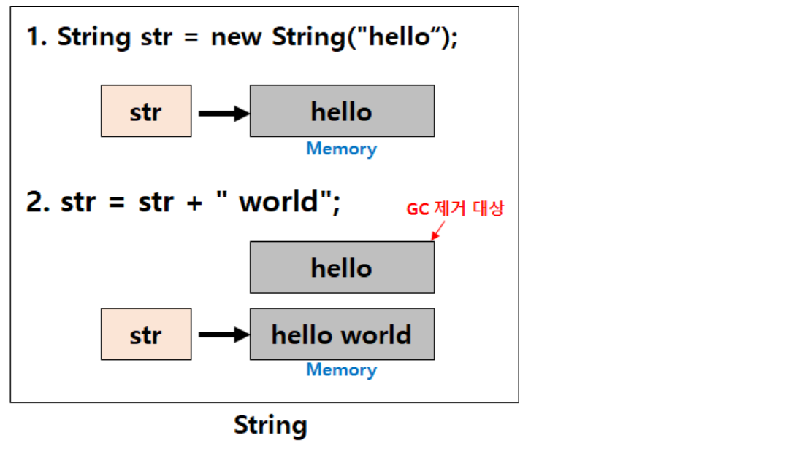
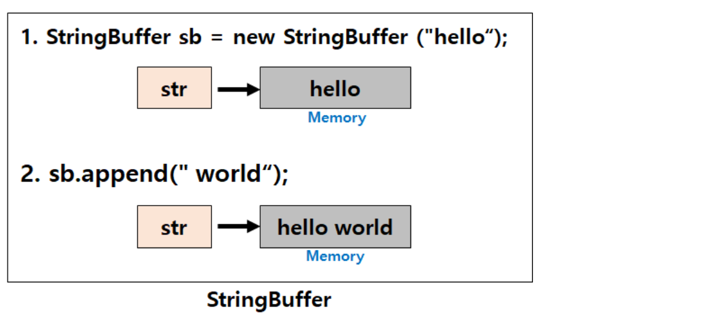

## String vs StringBuffer/StringBuilder

- String과 StringBuffer/StringBuilder 클래스의 가장 큰 차이점은 **String**은 **불변(immutable)**의 속성을 갖는다는 점이다.

- String

  - 하지만 기존에 "hello" 값이 들어가있던 String 클래스의 참조변수 str이 "hello world"라는 값을 가지고 있는 새로운 메모리영역을 가리키게 변경되고 
  - 처음 선언했던 "hello"로 값이 할당되어 있던 메모리 영역은 Garbage로 남아있다가 GC(garbage collection)에 의해 사라지게 되는 것이다. 
  - String 클래스는 불변하기 때문에 문자열을 수정하는 시점에 새로운 String 인스턴스가 생성된 것

  ```java
  String str = "hello"; // String str = new String("hello"); 
  str = str + " world"; // [ hello world ]
  ```

  

  - 위와 같이 String은 불변성을 가지기 때문에 변하지 않는 문자열을 자주 읽어들이는 경우 String을 사용해 주시면 좋은 성능을 기대할 수 있다. 
  - 그러나 문자열 추가,수정,삭제 등의 연산이 빈번하게 발생하는 알고리즘에 String 클래스를 사용하면 힙 메모리(Heap)에 많은 임시 가비지(Garbage)가 생성되어 힙메모리가 부족으로 어플리케이션 성능에 치명적인 영향을 끼치게 된다.
  - 이를 해결하기 위해 Java에서는 가변(mutable)성을 가지는 StringBuffer / StringBuilder 클래스를 도입했습니다.
    String 과는 반대로 StringBuffer/StringBuilder 는 가변성 가지기 때문에 .append() .delete() 등의 API를 이용하여 동일 객체내에서 문자열을 변경하는 것이 가능하다. 
  - 따라서 문자열의 추가,수정,삭제가 빈번하게 발생할 경우라면 String 클래스가 아닌StringBuffer/StringBuilder를 사용해야 한다.

  ```java
  StringBuffer sb= new StringBuffer("hello"); 
  sb.append(" world");
  ```

  

  

  