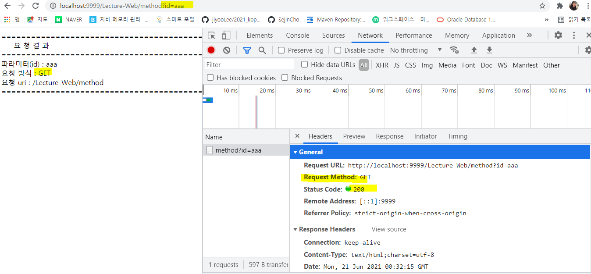

## 복습

- servlet 앞 부분 Front-end 프로그래밍 폴더 0618

- form 태그에서만 post방식으로 올라가고 나머지는 get방식이다.


## servlet

- **post 방식**

  - method.html

    - post 방식의 경우 url에 넘긴 데이터가 보이지 않음

    

    - get 방식은 쿼리 스트링으로 넘긴 데이터가 보인다.

    

    - 그래서 form 태그는 post 방식을 사용하는 것이 더 안전하다.

  ```html
  <!DOCTYPE html>
  <html>
  <head>
  <meta charset="UTF-8">
  <title>Insert title here</title>
  </head>
  <body>
  	<form action="/Lecture-Web/method" method="get"> <!-- '/'는 http://localhost:9999 -->
  		아이디 : <input type="text" name="id">
  		<input type="submit" value="get()방식 호출"> 
  	</form>
  	<form action="/Lecture-Web/method" method="post"> <!-- '/'는 http://localhost:9999 -->
  		아이디 : <input type="text" name="id">
  		<input type="submit" value="post()방식 호출"> 
  	</form>
  </body>
  </html>
  ```

  - MethodServlet.java
    - 웹(클라이언트)에서 파라미터를 인코딩할때(전송하기 위해서) 사용한 케릭터 셋으로 charset을 설정해야 자료를 정상적으로 받을 수 있음

  ```html
  package kr.ac.kopo.servlet;
  
  import java.io.IOException;
  import java.io.PrintWriter;
  
  import javax.servlet.ServletException;
  import javax.servlet.http.HttpServlet;
  import javax.servlet.http.HttpServletRequest;
  import javax.servlet.http.HttpServletResponse;
  
  public class MethodServlet extends HttpServlet{
  	
  	// GET http://localhost:9999/Lecture-Web/method?id=aaa
  	@Override
  	public void doGet(HttpServletRequest request, HttpServletResponse response) 
  			throws ServletException, IOException {
  		
  		System.out.println("doGet() 호출....");
  		
  		String method = request.getMethod();
  		StringBuffer url = request.getRequestURL(); //url 값 가져오기
  		String uri = request.getRequestURI(); //uri 
  		
  		System.out.println("url : " + url.toString());  //http://localhost:9999/Lecture-Web/method
  		System.out.println("uri : " + uri); ///Lecture-Web/method
  		System.out.println("method : " + method); //GET
  		
  		
  		String id = request.getParameter("id"); //return값은 무조건 String
  		System.out.println("id : " + id);
  		
  		//client에게 응답
  		response.setContentType("text/html; charset=utf-8"); //text 중에서 html 문서를 넘긴다는 정보를 담음
  		PrintWriter out = response.getWriter();
  		out.println("<html>");
  		out.println("	<head>");
  		out.println("		<title> 메소드 호출방식 </title>");
  		out.println("	</head>");
  		out.println("	<body>");
  		out.println("======================================================<br>");
  		out.println("&nbsp;&nbsp;&nbsp;&nbsp;&nbsp;요 청 결 과 <br>");
  		out.println("======================================================<br>");
  		out.println("파라미터(id) : " + id + "<br>");
  		out.println("요청 방식 : " + method + "<br>");
  		out.println("요청 uri : " + uri);
  		out.println("======================================================<br>");
  		out.println("	</body>");
  		out.println("<html>");
  		
  		
  		out.flush();
  		out.close();
  		
  	}
  	
  	@Override
  	public void doPost(HttpServletRequest request, HttpServletResponse response) 
  			throws ServletException, IOException {
  		//자식의 접근제한자는 부모의 접근제한자보다 크거나 같을 수 있다. 
  		
  		//post 방식에서는 인코딩을 한 번 더 해줘야 한다. (get 방식에서는 사용하지 않음)
  		request.setCharacterEncoding("utf-8");
  		
  		String method = request.getMethod();
  		String uri = request.getRequestURI();
  		String id = request.getParameter("id");
  		
  		response.setContentType("text/html; charset=utf-8");
  		PrintWriter out = response.getWriter();
  		out.println("<html>");
  		out.println("	<head>");
  		out.println("		<title> 메소드 호출방식 </title>");
  		out.println("	</head>");
  		out.println("	<body>");
  		out.println("======================================================<br>");
  		out.println("&nbsp;&nbsp;&nbsp;&nbsp;&nbsp;요 청 결 과 <br>");
  		out.println("======================================================<br>");
  		out.println("파라미터(id) : " + id + "<br>");
  		out.println("요청 방식 : " + method + "<br>");
  		out.println("요청 uri : " + uri);
  		out.println("======================================================<br>");
  		out.println("	</body>");
  		out.println("<html>");
  		
  	}
  }
  ```

  

- **get, post header, body 확인**

  - **get의 Header**

    

    - get방식에서는 Query String parameter에서 넘긴 데이터의 값이 보인다.
      - 즉, 쿼리스트링을 통해서 데이터를 넘기는 방식이다. 

    

    - status code : 200은 요청에 대해 올바르게 응답이 되었다는 의미이다. 

  - **post header**

    

    - post는 Form Data로 보임
      - 즉, post의 경우 데이터를 body로 넘긴다. 

    

    

- web.xml에 하나하나 url을 설정하는 것은 코드가 길어져서 어노테이션으로 사용 가능
  - @WebServlet("/servlet/tableExam")
    - /는 localhost:9999/Lecture-Web까지를 의미한다. 


## JSP 기본요소

- **구성요소**
  - 디렉티브(지시문) : <%@ %>
  - 스크립트릿 : <% %>
  - 표현식 : <%= %>
  - 선언문 : <%! %>
  - 주석문 : <%-- --%>
  - 기본객체 : request, response, page, application, out, pageContext, exception, session, config
  - 표현 언어(EL) : ${}, JSTL, <c: />, <fmt: />, <xml: />, <sql: />
  - 표준 액션 태그
  - 커스텀 태그


- **JSP**
  - html하고 기본 문법은 같음
  - jsp가 내부적으로 서블릿 코드로 바뀐다.(서버쪽) 
  - 실제 톰캣 와스 서버에 jsp를 서블릿으로 바꿔주는 엔진도 있다. 
  - .jsp가 서블릿 코드로 바뀔 때 jsp 주석은 변환되지 않는다.(jsp 주석은 제외하고 변환이 된다.)
    - 즉, jsp 주석문은 jsp 엔진이 해석하지 않는다.
  - 컨텐트 주석문은 웹브라우저가 해석하므로 화면에 보인다. 
    - 즉, jsp가 서블릿 코드로 바뀔 때 주석도 함께 변환이 된다.
    - 컨텐트 주석문은 jsp 엔진이 해석하여 사용자에게 주석내용을 응답하지만 브라우저에서 해석하지 않아 화면에 보이지 않는다.
  - 그래서 jsp 주석을 사용하는 것이 더 좋다. 
  - .jsp가 서블릿으로 변환되고 .class로 바뀌는데 한 번 바꾸면 .class 파일을 사용하면 된다. 그래서 다음부터는 시간이 오래 걸리지 않는다.


- **실습**

  - 서블릿은 직접적인 접근이 불가하지만 JSP는 직접적인 접근이 가능하다.

  - 컨텐츠 주석은 보인다.

  - .jsp 파일은 있지만 이것이 실행되는 것이 아니고 서블릿 코드로 변환된 것이 실행된다.(work 폴더에 저장되어 있다.) D:\workspace\eclipse-work\wtpwebapps\Lecture-Web\jsp\basic

    

    

    

    

    - 서블릿 코드로 바뀐 파일이 .java이고 이 자바파일을 컴파일 시킨 파일이 .class 파일(D:\workspace\eclipse-work\work\Catalina\localhost\Lecture-Web\org\apache\jsp\jsp\basic)

    

  ```jsp
  <%@ page language="java" contentType="text/html; charset=UTF-8"
      pageEncoding="UTF-8"%>
  <!DOCTYPE html>
  <html>
  <head>
  <meta charset="UTF-8">
  <title>Insert title here</title>
  </head>
  <body>
  	<%--
  		JSP 주석: 서블릿으로 변환되지 않으므로 웹 브라우저에 전송되지 않음
  	 --%>
  	<!-- 
  		컨텐츠 주석 : 서블릿으로 변환되어 웹 브라우저에 전송이 되지만,
  					  웹 브라우저에서 해석되지 않아 화면에 보이지 않는다.
  	 --> 
  	
  	주석문이 화면에 보이니?
  	
  </body>
  </html>
  ```

  

  - 서블릿으로 변환된 코드(.java)
    - 이전에 서블릿을 사용할 때는 class 파일에서 화면에 페이지를 구성해서 해당 화면을 리턴했었는데 jsp를 사용하면 html의 문법을 사용하여 화면을 만들고 서블릿으로 바꿔주는 엔진이 서블릿 코드로 변환시켜 주는 것이다. 

  ```html
    public void _jspService(final javax.servlet.http.HttpServletRequest request, final javax.servlet.http.HttpServletResponse response)
        throws java.io.IOException, javax.servlet.ServletException {
  
      if (!javax.servlet.DispatcherType.ERROR.equals(request.getDispatcherType())) {
        final java.lang.String _jspx_method = request.getMethod();
        if ("OPTIONS".equals(_jspx_method)) {
          response.setHeader("Allow","GET, HEAD, POST, OPTIONS");
          return;
        }
        if (!"GET".equals(_jspx_method) && !"POST".equals(_jspx_method) && !"HEAD".equals(_jspx_method)) {
          response.setHeader("Allow","GET, HEAD, POST, OPTIONS");
          response.sendError(HttpServletResponse.SC_METHOD_NOT_ALLOWED, "JSP들은 오직 GET, POST 또는 HEAD 메소드만을 허용합니다. Jasper는 OPTIONS 메소드 또한 허용합니다.");
          return;
        }
      }
  
      final javax.servlet.jsp.PageContext pageContext;
      javax.servlet.http.HttpSession session = null;
      final javax.servlet.ServletContext application;
      final javax.servlet.ServletConfig config;
      javax.servlet.jsp.JspWriter out = null;
      final java.lang.Object page = this;
      javax.servlet.jsp.JspWriter _jspx_out = null;
      javax.servlet.jsp.PageContext _jspx_page_context = null;
  
  
      try {
        response.setContentType("text/html; charset=UTF-8");
        pageContext = _jspxFactory.getPageContext(this, request, response,
        			null, true, 8192, true);
        _jspx_page_context = pageContext;
        application = pageContext.getServletContext();
        config = pageContext.getServletConfig();
        session = pageContext.getSession();
        out = pageContext.getOut();
        _jspx_out = out;
  
        out.write("\r\n");
        out.write("<!DOCTYPE html>\r\n");
        out.write("<html>\r\n");
        out.write("<head>\r\n");
        out.write("<meta charset=\"UTF-8\">\r\n");
        out.write("<title>Insert title here</title>\r\n");
        out.write("</head>\r\n");
        out.write("<body>\r\n");
        out.write("	");
        out.write("\r\n");
        out.write("	<!-- \r\n");
        out.write("		컨텐츠 주석 : 서블릿으로 변환되어 웹 브라우저에 전송이 되지만,\r\n");
        out.write("					  웹 브라우저에서 해석되지 않아 화면에 보이지 않는다.\r\n");
        out.write("	 --> \r\n");
        out.write("	\r\n");
        out.write("	주석문이 화면에 보이니?\r\n");
        out.write("	\r\n");
        out.write("</body>\r\n");
        out.write("</html>");
      } catch (java.lang.Throwable t) {
        if (!(t instanceof javax.servlet.jsp.SkipPageException)){
          out = _jspx_out;
          if (out != null && out.getBufferSize() != 0)
            try {
              if (response.isCommitted()) {
                out.flush();
              } else {
                out.clearBuffer();
              }
            } catch (java.io.IOException e) {}
          if (_jspx_page_context != null) _jspx_page_context.handlePageException(t);
          else throw new ServletException(t);
        }
      } finally {
        _jspxFactory.releasePageContext(_jspx_page_context);
      }
    }
  }
  ```


- 실습

  - jsp는 내부적으로 자바이기 때문에 for문은 그냥 작성한 것임
  - 그리고 html은 out.write() 안에 작성되어 있는 것임
  - i를 출력하기 위해서 out.print(i) 를 사용

  ```jsp
  <%@ page language="java" contentType="text/html; charset=UTF-8"
      pageEncoding="UTF-8"%>
  <!DOCTYPE html>
  <html>
  <head>
  <meta charset="UTF-8">
  <title>Insert title here</title>
  </head>
  <body>
  	<h2>1 ~ 10 사이의 정수 출력</h2>
  	<%
  		for(int i = 1; i <= 10; ++i) {
  			%> <%= i %> <br> <%
  		}
  	
  		for(int i = 1; i<=10; ++i) {
  			out.write(i + "<br>");
  		}
  	%>
  </body>
  </html>
  ```

  


- **실습(import)**

  - 지시문을 활용 가능

  ```jsp
  <%@ page language="java" contentType="text/html; charset=UTF-8"
      pageEncoding="UTF-8"%>
  <!DOCTYPE html>
  <html>
  <head>
  <meta charset="UTF-8">
  <title>Insert title here</title>
  </head>
  <body>
  	<h2>1 ~ 10 사이의 임의의 정수 출력</h2>
  	<%
  		java.util.Random r = new java.util.Random();
  	
  		int ran = r.nextInt(10) + 1;
  	%>
  	
  	추출된 정수 : <%= ran %>
  </body>
  </html>
  ```

  ```jsp
  <%@ page language="java" contentType="text/html; charset=UTF-8"
      pageEncoding="UTF-8"%>
  <%@ page import="java.util.Random" %>
  <!DOCTYPE html>
  <html>
  <head>
  <meta charset="UTF-8">
  <title>Insert title here</title>
  </head>
  <body>
  	<h2>1 ~ 10 사이의 임의의 정수 출력</h2>
  	<%
  		Random r = new Random();
  	
  		int ran = r.nextInt(10) + 1;
  	%>
  	
  	추출된 정수 : <%= ran %>
  </body>
  </html>
  ```


- **자바 Iterator, Enumeration 인터페이스**

  > https://kutar37.tistory.com/entry/%EC%9E%90%EB%B0%94-Iterator-Enumeration-%EC%9D%B8%ED%84%B0%ED%8E%98%EC%9D%B4%EC%8A%A4


- **실습**

  ```jsp
  <%@page import="java.util.Enumeration"%>
  <%@ page language="java" contentType="text/html; charset=UTF-8"
      pageEncoding="UTF-8"%>
  <!DOCTYPE html>
  <html>
  <head>
  <meta charset="UTF-8">
  <title>Insert title here</title>
  </head>
  <body>
  	<%
  		Enumeration<String> headerNames = request.getHeaderNames();
  		while(headerNames.hasMoreElements()) {
  			String headerName = headerNames.nextElement();
  			String headerValue = request.getHeader(headerName);
  	%>
  			<%= headerName %> : <%= headerValue %> <br>
  	<%		
  		}
  	%>
  </body>
  </html>
  ```

  

- 시퀀스에서 캐시를 가지고 있어서 순서를 건너뛸 때

  ```sql
  alter sequence seq_t_board_no NOCACHE;
  ```

  