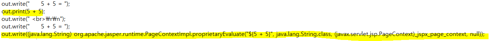
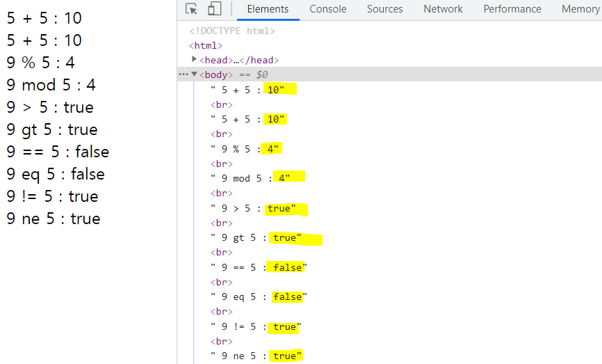
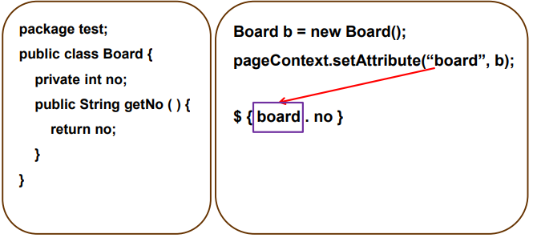
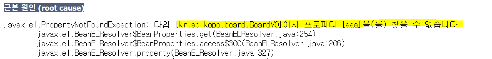
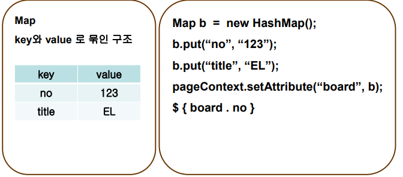
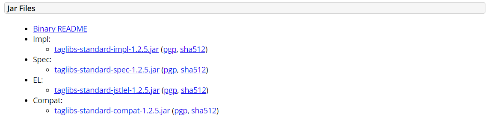
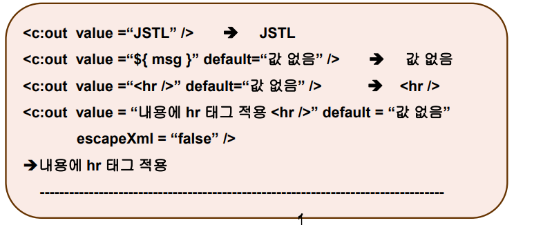
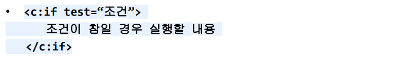
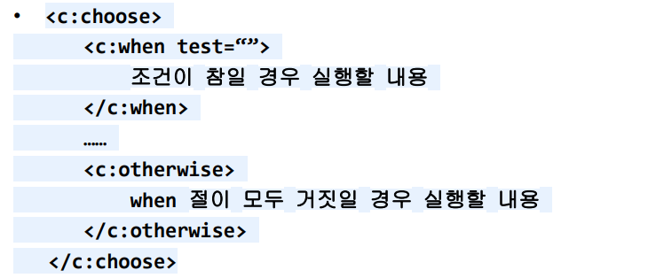

## EL

- **EL(Expression Language)이란?**

  - 표현식(<%= %>) 대신 사용
  - 자바의 클래스 메소드 호출 및 집합 객체에 대한 접근 방법을 제공
  - JSP에서 제공하는 내장객체 중 4가지 기본 영역에 대한 속성 사용
  - 구문 : ${expr} 
    - **표현식(expr)은 자바 변수가 아님**
    - ex) 당신의 이름은 ${name} 입니다.
    - **name은 자바 변수가 아니다.**
    - el에서는 name을 객체라고 부른다.
    - 만약 name이라는 객체가 없는 경우도 empty이다. 
  - JSP를 자바로 컴파일 된 문서를 확인해보면 자바 코드와는 다른 것을 확인할 수 있다.

  ```jsp
  <%@ page language="java" contentType="text/html; charset=UTF-8"
      pageEncoding="UTF-8"%>
  <!DOCTYPE html>
  <html>
  <head>
  <meta charset="UTF-8">
  <title>EL 연산자</title>
  </head>
  <body>
  	5 + 5 = <%=5 + 5%> <br>
  	5 + 5 = ${5 + 5} <br>
  </body>
  </html>
  ```

  


- **연산자**
  - 객체를 정의하지 않은 경우도 empty이다. 

| 연산자       | 종류                                                         |
| ------------ | ------------------------------------------------------------ |
| 산술 연산자  | +, -, *, /, div, %, mod                                      |
| 비교 연산자  | ==, eq, !=, ne, <, lt, <=, le, >, gt, >=, ge                 |
| 논리 연산자  | &&, and, \|\|, or, !, not                                    |
| empty 연산자 | empty<br />값이 null이면 true<br />비어있는 문자열이면 true<br />배열이나 콜렉션일 경우 길이가 0이면 true |
| 삼항 연산자  | (조건식) ? 값1 : 값2<br />조건식이 참이면 값1 선택 거짓이면 값2 선택 |


- **실습**

  - JSP는 서버에서 해석한다. 그래서 클라이언트에서는 표현식이 보이지 않음

  ```jsp
  <%@ page language="java" contentType="text/html; charset=UTF-8"
      pageEncoding="UTF-8"%>
  <!DOCTYPE html>
  <html>
  <head>
  <meta charset="UTF-8">
  <title>EL 연산자</title>
  </head>
  <body>
  	5 + 5 : <%= 5 + 5 %><br>
  	5 + 5 : ${ 5 + 5 }<br>
  	9 % 5 : ${ 9 % 5 }<br>
  	9 mod 5 : ${ 9 mod 5 }<br>
  	9 > 5 : ${ 9 > 5 }<br>
  	9 gt 5 : ${ 9 gt 5 }<br>
  	9 == 5 : ${ 9 == 5 }<br>
  	9 eq 5 : ${ 9 eq 5 }<br>
  	9 != 5 : ${ 9 != 5 }<br>
  	9 ne 5 : ${ 9 ne 5 }<br> 
  	<!-- JSP는 서버에서 해석한다. 그래서 클라이언트에서는 표현식이 보이지 않음 -->
  </body>
  </html>
  ```

  


- **4가지 Scope 설명**

  > https://0ver-grow.tistory.com/183


- **el에서 객체 찾는 순서**

  1. **EL에서 기본적으로 제공하는 객체에서 동일한 객체 이름을 찾는다.**
     - JSP 내부 객체에 접근하기 위해서 EL에서 제공하는 객체

  | 기본 객체        | 설명                                                      |
  | ---------------- | --------------------------------------------------------- |
  | pageContext      | JSP의 page 기본 객체와 동일하다.                          |
  | pageScope(el)    | JSP 내장 객체인 pageContext 기본 객체 영역 접근           |
  | requestScope     | request 기본 객체 영역 접근                               |
  | sessionScope     | session 기본객체 영역 접근                                |
  | applicationScope | application 기본객체 영역 접근                            |
  | param            | 파마리터 매핑 객체, request.getParameter("id") 대체       |
  | paramValues      | 파마리터 매핑 객체, request.getParameterValues("id") 대체 |
  | cookie           | Cookie 접근 객체                                          |

  2. **el에서 기본적으로 제공하는 객체를 찾지 못했다면 4가지 공유영역에서 객체를 찾는다.**
     - pageScope, requestScope, sessionScope, applicationScope
       - pageContext는 해당 페이지 안에서만 변수를 사용할 수 있다. 
       - request는 하나의 응답에 여러 페이지가 연결되어 있으면 연결되어 있는 파일끼리 값을 공유할 수 있다. 
         - 요청에 응답이 끝나면 request 영역의 객체가 사라진다.
         - 즉, 요청 하나 당 response를 한 뒤 해당 객체가 사라진다. 
       - session 
         - 웹 브라우저 닫기 전까지 하나의 객체를 계속 공유하고 싶은 경우 사용 
       - application
         - 여러 클라이언트에게 서버의 하나의 변수를 같이 공유하고 싶은 경우에 사용
         - 생명주기가 길다.
         - 그래서 계속 application에 값을 가지고 있으면 성능이 떨어진다.
  3. **만약 공유 영역에 차는 객체이름이 중복되어 있다면,**
     - pageContext -> request ->  session -> application순으로 찾는다. 
     - 만약 request객체에 있는 name을 가져오고 싶다면 ? requestScope.name 
  4. **공유 영역에 객체 등록, 조회, 삭제하기**
     - 객체등록 : 공유객체명.setAttribute("이름", "값");
       - pageContext.setAttribute("name", "홍길동")
     - 객체 조회 : String name = (String) pageContext.getAttribute("name")
     - 객체 삭제 : 공유객체명.removeAttribute("이름")
       - pageContext.removeAttribute("name")


- **실습**

  - el을 사용했을 때 객체가 없으면 empty로 나온다. null이 나오지 않음
  - 그러나 쿼리스트링이 아무 것도 없을 때 배열은 null을 갖는다. 
    - 그래서 String hobbies[] = request.getParameterValues("hobby")에서 예외가 발생함
    - el에서는 empty로 나옴

  ```jsp
  <%@ page language="java" contentType="text/html; charset=UTF-8"
      pageEncoding="UTF-8"%>
  <!DOCTYPE html>
  <html>
  <head>
  <meta charset="UTF-8">
  <title>Insert title here</title>
  </head>
  <body>
  	<%--
  		http://localhost:9999//Lecture-Web/jsp/el/exam02.jsp?id=aaa&name=sejin 로
  		요청했을 때 id의 값을 추출
  	 --%>
  	 <%
  	 	String id = request.getParameter("id");
  	 	String hobbies[] = request.getParameterValues("hobby");
  	 	if(hobbies == null) {
  	 		hobbies = new String[]{"파라미터 없음"};
  	 	}
  	 %>
  	 
  	 id : <%= id %> <br>
  	 id : <%= request.getParameter("id") %> <br>
  	 id : ${param.id} <br>
  	 name : ${param.name} <br>
  	 
  	 <%--
  		http://localhost:9999//Lecture-Web/jsp/el/exam02.jsp?id=aaa&name=sejin&hobby=movie&hobby=music 로
  		요청했을 때 id의 값을 추출
  	 --%>
  	 
  	 hobby : ${paramValues.hobby[0]} <br>
  	 hobby : <%= hobbies[0] %>
  </body>
  </html>
  ```


- 실습

  ```jsp
  <%@ page language="java" contentType="text/html; charset=UTF-8"
      pageEncoding="UTF-8"%>
  <!DOCTYPE html>
  <html>
  <head>
  <meta charset="UTF-8">
  <title>Insert title here</title>
  </head>
  <body>
  	<%
  		//객체 등록 : 공유영역명.setAttribute(name, value)
  		//공유영역 4가지 : pageContext, request, session, application
  		
  		pageContext.setAttribute("msg","pageContext 영역에 등록했다.");
  		String message = (String) pageContext.getAttribute("msg");
  		
  		//request 영역에 id라는 이름으로 hong이라는 값을 등록
  		request.setAttribute("id", "hong");
  		request.setAttribute("msg", "request 영역에 등록했다.");
  		
  		
  	 %>
  	empty msg : ${empty msg} <br>
  	msg1 : ${msg} <br>
  	msg2 : <%= message %><br>
  	msg3 : <%=pageContext.getAttribute("msg") %> <br>
  	msg4 : ${requestScope.msg} <br>
  	
  	id : ${id} <br>
  </body>
  </html>
  ```

  

- **el에서의 객체 표현 이해**

  1. ${객체, 이름}

     - 객체 자리에 올 수 있는 타입은 2가지만 가능
     - **자바빈즈 클래스, 맵 객체**
     - 자바빈즈 클래스 형태
       - 패키지로 선언
       - 클래스는 public 선언
       - 매개변수 없는 생성자 선언
       - 멤버변수는 private 선언
       - 멤버변수에 대한 setter, getter 메소드 선언
     - **${객체, 이름}이 객체 타입이 자바빈즈인 경우** ${board, no} -> no는 board의 get 메소드를 의미한다.

     

     - **객체 타입이 자바빈즈인 경우 예**
       - 자바빈즈인 경우에는 .뒤에오는 것을 불러올 때 getter 메소드를 사용한다. 그래서 만약 getter 메소드가 없는 경우 500 error가 발생한다.

     ```java
     package kr.ac.kopo.board;
     
     /*
      * 자바빈즈 클래스
      * 1. package 포함
      * 2. 클래스의 접근제한자 public
      * 3. 멤버변수의 접근제한자 private
      * 4. getter / setter 포함
      * 5. 디폴트 생성자 선언
      */
     
     public class BoardVO {
     	private int no;
     	private String title;
     	private String writer;
     	private String content;
     	private int view_cnt;
     	private String reg_date;
     	
     	public BoardVO() {
     		super();
     	}
     	
     	public int getNo() {
     		return no;
     	}
     	public void setNo(int no) {
     		this.no = no;
     	}
     	public String getTitle() {
     		return title;
     	}
     	public void setTitle(String title) {
     		this.title = title;
     	}
     	public String getWriter() {
     		return writer;
     	}
     	public void setWriter(String writer) {
     		this.writer = writer;
     	}
     	public String getContent() {
     		return content;
     	}
     	public void setContent(String content) {
     		this.content = content;
     	}
     	public int getView_cnt() {
     		return view_cnt;
     	}
     	public void setView_cnt(int view_cnt) {
     		this.view_cnt = view_cnt;
     	}
     	public String getReg_date() {
     		return reg_date;
     	}
     	public void setReg_date(String reg_date) {
     		this.reg_date = reg_date;
     	}
     
     	@Override
     	public String toString() {
     		return "BoardVO [no=" + no + ", title=" + title + ", writer=" + writer + ", content=" + content + ", view_cnt="
     				+ view_cnt + ", reg_date=" + reg_date + "]";
     	}
     }
     ```

     ```jsp
     <%@page import="kr.ac.kopo.board.BoardVO"%>
     <%@ page language="java" contentType="text/html; charset=UTF-8"
         pageEncoding="UTF-8"%>
     <%
     	BoardVO board = new BoardVO();
     	board.setNo(1);
     	board.setTitle("test");
     	
     	//pageContext영역에 boardVO라는 이름으로 값은 생성된 BoardVO 객체
     	pageContext.setAttribute("boardVO", board);
     %>
     <!DOCTYPE html>
     <html>
     <head>
     <meta charset="UTF-8">
     <title>Insert title here</title>
     </head>
     <body>
     	no : <%=board.getNo() %> <br>
     	no : <%= ((BoardVO) pageContext.getAttribute("boardVO")).getNo() %> <br>
     	title : <%=board.getTitle() %> <br>
     	title : <%=((BoardVO)pageContext.getAttribute("boardVO")).getTitle() %> <br>
     	
     	<br><br>
     	*el* <br>
     	no : ${boardVO.no} <br> <!-- no의 getter method를 호출하는 것임 --> 
     	title : ${boardVO.title} <br>
     	
     	<!-- 자바빈즈에서는 getter 메소드를 호출하기 때문에 aaa라는 메소드가 없어서 에러가 발생된다. -->
     	aaa : ${boardVO.aaa}
     	
     </body>
     </html>
     ```

     

     - **객체 타입이 맵인 경우**

       - ${board.no} -> no는 맵의 key가 no를 의미

       

     - **실습**

     ```jsp
     <%@page import="kr.ac.kopo.board.BoardVO"%>
     <%@page import="java.util.HashMap"%>
     <%@page import="java.util.Map"%>
     <%@ page language="java" contentType="text/html; charset=UTF-8"
         pageEncoding="UTF-8"%>
     <%
     	Map<String, String> board = new HashMap<>();
     	board.put("no","1");
     	board.put("title","test");
     	
     	pageContext.setAttribute("boardVO", board);
     	
     %>
     <!DOCTYPE html>
     <html>
     <head>
     <meta charset="UTF-8">
     <title>Insert title here</title>
     </head>
     <body>
     	no : <%= board.get("no") %> <br>
     	no : <%= ((Map) pageContext.getAttribute("boardVO")).get("no") %> <br>
     	no : ${boardVO.no} <br>
     	<br>
     	title : <%=board.get("title") %> <br>
     	title : ${boardVO.title} <br>
     	aaa : ${boardVO.aaa } <br> 
     	
     </body>
     </html>
     ```

     

  2. **${객체[이름]}**

     - 객체 자리에 올 수 있는 타입은 4가지만 가능
       - 자바빈즈 클래스, 맵 객체, 배열, 콜렉션
     - 배열 예 

     ```jsp
     <%@ page language="java" contentType="text/html; charset=UTF-8"
         pageEncoding="UTF-8"%>
     <%
     	String[] names = {"홍길동", "강길동", "고길동", "조길동"};
     	pageContext.setAttribute("names", names);
     	
     %>
     <!DOCTYPE html>
     <html>
     <head>
     <meta charset="UTF-8">
     <title>Insert title here</title>
     </head>
     <body>
     	이름 : <%=names[0] %> <br>
     	이름 : <%=names[1] %> <br>
     	이름 : <%=names[2] %> <br>
     	이름 : <%=names[3] %> <br>
     	이름 : <%=names[4] %> <br> 에러 발생 
     	
     	<br><br>
     	이름 : ${names[0]} <br>
     	이름 : ${names[1]} <br>
     	이름 : ${names[2]} <br>
     	이름 : ${names[3]} <br>
     	다섯번 째 이름 : %{names[4]} <br>
     	<!-- empty로 나온다. 실제 배열처럼 나오는 것이 아니다. -->
     </body>
     </html>
     ```

     - 콜렉션 예

     ```jsp
     <%@page import="java.util.ArrayList"%>
     <%@page import="java.util.List"%>
     <%@ page language="java" contentType="text/html; charset=UTF-8"
         pageEncoding="UTF-8"%>
     <%
     	List<String> names = new ArrayList<>();
     	names.add("강길동");
     	names.add("고길동");
     	names.add("조길동");
     	names.add("양길동");
     	
     	pageContext.setAttribute("names", names);
     	
     %>
     <!DOCTYPE html>
     <html>
     <head>
     <meta charset="UTF-8">
     <title>Insert title here</title>
     </head>
     <body>
     	이름 : <%=names.get(0) %> <br>
     	이름 : <%=names.get(1) %> <br>
     	이름 : <%=names.get(2) %> <br>
     	이름 : <%=names.get(3) %> <br>
     	
     	<br><br>
     	
     	이름 : ${names[0]} <br> <!-- 만약 객체가 등록되어 있지 않으면 empty가 나온다. -->
     	이름 : ${names[1]} <br>
     	이름 : ${names[2]} <br>
     	이름 : ${names[3]} <br>
     </body>
     </html>
     ```


- 실습

  ```jsp
  <%@page import="kr.ac.kopo.board.BoardVO"%>
  <%@page import="java.util.HashMap"%>
  <%@page import="java.util.Map"%>
  <%@page import="java.util.ArrayList"%>
  <%@page import="java.util.List"%>
  <%@ page language="java" contentType="text/html; charset=UTF-8"
      pageEncoding="UTF-8"%>
  <%
  	//1. 자바빈즈 클래스 + 콜렉션
  	/*
  	BoardVO board = new BoardVO();
  	board.setTitle("성공");
  	List<BoardVO> boardList = new ArrayList<>();
  	boardList.add(board);
  	*/
  	
  	/*
  	//2. 자바빈즈 클래스 + 배열
  	BoardVO board = new BoardVO();
  	board.setTitle("성공");
  	BoardVO[] boardList = new BoardVO[]{board};
  	*/
  	
  	//3. 맵객체 + 배열
  	/*
  	Map<String, String> board = new HashMap<>();
  	board.put("title", "성공");
  	Map[] boardList = {board};
  	*/
  	
  	//4. 맵객체 + 콜렉션
  	Map<String, String> board = new HashMap<>();
  	board.put("title", "성공");
  	List<Map<String, String>> boardList = new ArrayList<>();
  	boardList.add(board);
  	
  	pageContext.setAttribute("boardList", boardList);
  %>
  <!DOCTYPE html>
  <html>
  <head>
  <meta charset="UTF-8">
  <title>Insert title here</title>
  </head>
  <body>	
  	<%-- 성공/실패? 성공이라 나오는 코드 작성 --%>
  	성공/실패 ? ${boardList[0].title} <br>
  </body>
  </html>
  ```

  

## JSTL

- **jstl의 4가지 종류**
  - 개발자들이 개별적으로 만들어 쓰던 태그 중 자주 사용되는 태그를 표준으로 만들어서 제공
  - core 태그 : 프로그램에서 많이 사용되는 기본 태그 제공
  - fmt태그 : 다국어 지원, 로케일 제공, 메시지 처리, 숫자, 날짜 포멧팅
  - 함수
  - sql 태그
  - xml 태그


- **jstl 사용**

  - 다운로드 

    - https://tomcat.apache.org/download-taglibs.cgi

    

  - jsp 페이지 작성 시 jstl 관련 정보를 talib 지시자를 이용해서 알린다.

    - ex) <%@ taglib prefix=“c” uri=“http://java.sun.com/jsp/jstl/core” %> 
    - <%@ %> 에 사용하는 것 - 페이지, 태그 라이브러리, include 


- **core - set 태그**

  - 형식
    - <c:set var="" value="" [scope=""] />
  - 공유 영역에 변수 설정 시 사용
  - 속성 설명
    - var : 설정할 변수명
    - value : 설정할 값
    - scope : 변수의 사용 영역(page, request, session, application)  - js에서의 영역
      - 기본설정 영역 : page
  - 사용 예

  ```jsp
  <c:set var="cnt" value="1" scope="page" />
  ```

  

- **core - remove 태그**

  - 형식
    - <c:remove var=“cnt” [scope=“page”] />
  - 공유영역에 설정된 변수 삭제 시 사용
  - 속성 설명
    - var : 삭제할 변수명
    - scope : 삭제할 변수가 설정되어 있는 영역(page, request, session, application)

  - 사용 예
    - **scope 미 설정시 모든 영역이 삭제 대상(set태그와 다름!!!!!!!!!!!!!!!)**
    - 즉, 4가지 공유영역에 있는 cnt를 모두 지운다.

  ```jsp
  <c:remove var =“cnt” scope = “page” />
  ```

  ```jsp
  <%@ page language="java" contentType="text/html; charset=UTF-8"
      pageEncoding="UTF-8"%>
  <%@ taglib prefix="c" uri="http://java.sun.com/jsp/jstl/core" %>
  <!DOCTYPE html>
  <html>
  <head>
  <meta charset="UTF-8">
  <title>Insert title here</title>
  </head>
  <body>
  	* 1값을 가지고 변수 cnt를 공유영역에 등록(page 영역에)<br>
  	jstl은 반드시 종료태그를 붙여줘야 한다. <br>
  	scope의 기본 설정 영역이 page이므로 설정하지 않아도 된다. <br>
  	<c:set var="cnt" value="1" scope="page" /> 
  	
  	<br><br>
  	**공유영역에 등록된 변수 cnt 출력** <br>
  	공유영역에 등록되어서 el 사용 가능 <br>
  	cnt : ${cnt} <br>
  	
  	<br><br>
  	cnt 변수에 1을 더한 후 cnt 값을 출력 <br>
  	<c:set var="cnt" value="${cnt +1}" scope="request"/> <br>
  	cnt : ${cnt} <br>
  	request cnt : ${requestScope.cnt} <br>
  	
  	<br><br>
  	request 공유 영역에 등록된 cnt 변수 삭제<br>
  	<c:remove var="cnt" scope="request" />
  	cnt : ${cnt} <br>
  	request :${request.cnt} <br> <!-- 지워져서 empty -->
  	
  	
  </body>
  </html>
  <%--
    --------------------------------------------------------
  	jSP공유영역			EL공유영역			JSTL공유영역
    --------------------------------------------------------
  	pageContext			pageScope			page
  	request				requestScope		request
  	session				sessionScope		session
  	application			applicationScope	application
    --------------------------------------------------------
  --%>
  ```

  

- **core - out 태그** 

  - 형식
    - <c:out value=“” [escapeXml=“true/false”] [default=“”] />
  - 출력 전용 태그
  - 속성 설명
    - value : 출력할 내용을 지정
    - escapeXml : 
      - true일 경우 : true 일 경우 : 출력내용에 태그가 있을 경우 문자값으로 변경처리
      - 단순 문자열이 아닌 html tag로 인식하라고 하기 위해서 excapeXml을 false로 만든다.
    - default
      - value 속성의 값이 없을 경우 디폴트로 출력할 내용 지정
      - 붙이지 않으면 empty
  - 예

  


- **core - if 태그**

  - 형식

  

  - 조건에 따라 내용을 실행
  - 속성 설명
    - test : 참과 거짓을 판단하는 조건을 명시


- core - choose 태그

  - 형식

  

  - 다중 조건 처리 태그
  - 속성 설명
    - test : 참과 거짓을 판단하는 조건을 명시 


