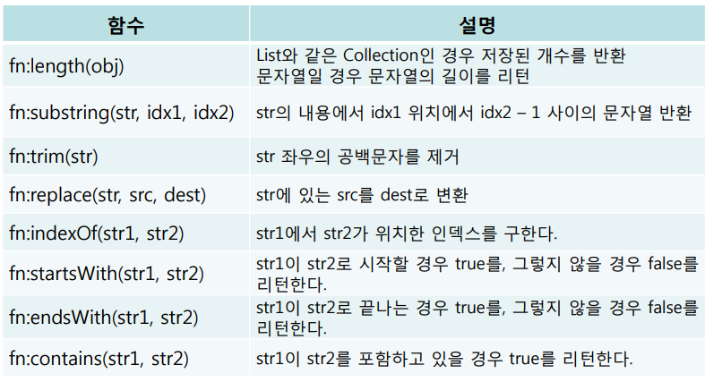

## JSTL

- **core - forEach 태그**

  - **형식**

  

  

  - **속성 설명**
    - var : 반복문에서 사용 할 변수명 지정
    - items : 반복시킬 대상 객체 지정 (배열 또는 콜렉션)
    - varStatus : 변수명, 반복과 관련된 기본 정보를 담고 있는 객체 
      - first : 반복문의 처음인지 판단, 참과 거짓을 반환
      - last : 반복문의 마지막인지 판단, 참과 거짓을 반환 
      - index : 반복의 처음에 0을 반환, 반복이 진행될때마다 1씩 증가
      - count : 반복의 처음에 1을 반환, 반복이 진행될때마다 1씩 증가
    - begin : 반복문 범위의 초기 값 설정
    - end : 반복문 범위의 마지막 값 설정

  - 실습

  ```jsp
  <%@ page language="java" contentType="text/html; charset=UTF-8"
      pageEncoding="UTF-8"%>
  <%@ taglib prefix="c" uri="http://java.sun.com/jsp/jstl/core" %>    
  <%
  	String[] names = {"홍길동","조길동","강길동","김길동"};
  	pageContext.setAttribute("names", names);
  	pageContext.setAttribute("namesLength", names.length);
  %>
  <!DOCTYPE html>
  <html>
  <head>
  <meta charset="UTF-8">
  <title>Insert title here</title>
  </head>
  <body>
  	1번) <br>
  	<c:forEach var="name" items="${names}" varStatus="status">
  		<c:choose>
  			<c:when test="${! status.last}">
  				${name} , 
  			</c:when>
  			<c:otherwise>
  				${name}
  			</c:otherwise>
  		</c:choose>
  	</c:forEach>
  	
  	<br><br>
  	2번) <br>
  	<c:forEach begin="0" end="${namesLength -1}" var="i">
  		<c:if test="${i == 0 }">
  			${names[i]}
  		</c:if>
  		<c:if test="${i != 0 }">
  			, ${names[i]}
  		</c:if>
  	</c:forEach>
  	
  	<br><br>
  	3번) <br>
  	<c:forEach items="${names}" var="name">
  		<c:if test="${names[namesLength - 1] == name  }">
  			${name}
  		</c:if>
  		<c:if test="${names[namesLength - 1] != name}">
  			${name} ,
  		</c:if>
  	</c:forEach>
  	
  	<br><br>
  	4번) <br>
  	<c:set var="cnt" value="0"></c:set>
  	<c:forEach items="${names}" var="name">
  		<c:if test="${cnt != 0}">
  			, ${name}
  		</c:if>
  		<c:if test="${cnt == 0}">
  			${name}
  		</c:if>
  		<c:set var="cnt" value="${cnt + 1}"></c:set>
  	</c:forEach>
  	<c:remove var="cnt" scope="page"/>
  	
  	<h2>1 ~ 10사이의 정수 출력</h2>
  	<!-- 공유 영역에 객체가 올라간 것이다. 
  		그리고 for문이 끝났을 경우 객체를 삭제한다.
  		즉, 라이프사이클이 forEach에서만 적용되는 것이다.
  		그래서 for문이 끝난 후 ${i}를 찍으면 empty가 나온다.
  	-->
  	<c:forEach begin="1" end="10" var="i"> 
  		${ i }<br>
  	</c:forEach>
  	${i} <br>
  	
  	년도선택 : 
  	<select>
  		<c:forEach begin="1910" end="2010" step="5" var="year">
  			<option>${year}</option>
  		</c:forEach>
  	</select> <br>
  	
  	
  </body>
  </html>
  ```

  

- **fn** 

  - 자주 사용되는 함수

  

  - 사용 예

  


- 데이터베이스에서 가져온 데이터를 el태그를 사용할 때 안전을 위해서 out 태그를 사용해야 한다. 

  ```jsp
  <th><a href="detail.jsp?no=${board.no}"><c:out value = ${board.title} /></a></th>
  ```

  

## Include

- **페이지 내용을 포함하는 3가지 방식**
  - directive(지시자) - include
  - action(액션) - include
  - jstl - import 


- **지시자 - include(file)**

  - 다른 페이지의 코드를 내 페이지로 포함 

  - 구문 : <%@ include file = "파일경로" %>

  - 시점 :  jsp가 java로 변환될 때 같이 포함

  - 활용

    - JSP 페이지에서 사용되는 공통 변수 지정
    - 각 페이지에 고정적으로 사용되는 내용 처리
      - 사이트 하단 부분

  - 실습
    - includeTest.jsp

    ```jsp
    <%@ page language="java" contentType="text/html; charset=UTF-8"
        pageEncoding="UTF-8"%>
    <!DOCTYPE html>
    <html>
    <head>
    <meta charset="UTF-8">
    <title>Insert title here</title>
    </head>
    <body>
    	<h2>인클루드전</h2>
    	<%@ include file="one.jsp" %>
    	<h2>인클루드후</h2>
    </body>
    </html>
    ```

    - one.jsp

    ```jsp
    <%@ page language="java" contentType="text/html; charset=UTF-8"
        pageEncoding="UTF-8"%>
    
    <hr>
    <h3>인클루드된 내용</h3>
    <h3>인클루드된 내용</h3>
    <h3>인클루드된 내용</h3>
    <h3>인클루드된 내용</h3>
    <h3>인클루드된 내용</h3>
    <hr>
    ```

    - **!!!!!jsp가 서블릿 코드로 변환될 때 공통된 부분이 복사 붙여넣기 된 것처럼 변환이 된다. 그래서 모든 서블릿 코드의 길이가 늘어난다.!!!!!**
      - **즉, 공통부분을 다른 jsp 파일에 적어서 인클루드 한다고 해도 서블릿 코드로 변환될 때는 하나의 파일처럼 공통 부분도 코드에 합쳐서 들어가는 것이다.** 

    

    

  

  

  


- **지시자 - include 동작방식**

  - 2개의 jsp 파일이 있어도 실제 요청을 처리하는 파일은 1개만 만들어짐 

  

  - 실습

    - common.jsp

    ```jsp
    <%@ page language="java" contentType="text/html; charset=UTF-8"
        pageEncoding="UTF-8"%>
    <%
    	String msg = "공통선언";
    %>
    ```

    - includeTest.jsp

      - 즉, 인클루드로 msg의 지역변수가 각 jsp에 하나씩 만들어지는 것이다. 그래서 하나의 변수를 공유하는 것처럼 보이는 것이다. 

      

    ```jsp
    <%@ page language="java" contentType="text/html; charset=UTF-8"
        pageEncoding="UTF-8"%>
    <%@ include file="common.jsp" %>    
    <!DOCTYPE html>
    <html>
    <head>
    <meta charset="UTF-8">
    <title>Insert title here</title>
    </head>
    <body>
    	msg : <%= msg %><br>
    	<h2>인클루드전</h2>
    	<%@ include file="one.jsp" %>
    	<h2>인클루드후</h2>
    </body>
    </html>
    ```

    

- **액션 - include(Page)**

  - 다른 페이지의 실행 결과를 내 페이지로 포함시킴

  - 파라미터와 공유영역(request) 이용하여 데이터를 공유

  - 구문

    

  - 시점 : 실행 시 (실행된 결과값이 포함)

  - 활용

    - JSP 페이지내의 중복적인 부분을 처리(예> 메뉴)

  - 지시자 include는 jsp코드를 서블릿 코드로 바뀔 때 include된 내용을 파일 안에 집어넣어서 하나의 파일로 인식이 되는 것이고 액션 include는 실제 서블릭 코드를 실행하면서 메소드의 호출 방식을 사용하는 것이다.

    - 즉, 내 코드가 복붙되는 것이 아니고 include한 파일에게 직접 outputstream하게 만드는 것이다.

    - 그래서 지시자 include와는 다르게 코드가 길어지지 않는다. 


- **액션 - include 동작방식**

  - request를 사용하여 test의 name의 변수를 in.jsp에서도 사용할 수 있다. 
  - 응답하면서 공간이 사라진다.

  

  - 실습

    - 파일이 따로 생성됨

    

    - out객체를 넘겨줘서 out을 공유한다. 그래서 one.jsp에서 out.write()를 쓰는데 여기서 out은 includeTest.jsp 의 out이다. 
    - 즉, 응답하는 통로 하나를 공유하고 있다. 

    

    - includeTest.jsp

    ```jsp
    <%@ page language="java" contentType="text/html; charset=UTF-8"
        pageEncoding="UTF-8"%>
    <%@ include file="common.jsp" %>    
    <!DOCTYPE html>
    <html>
    <head>
    <meta charset="UTF-8">
    <title>Insert title here</title>
    </head>
    <body>
    	msg : <%= msg %><br>
    	<h2>인클루드전</h2>
    	<jsp:include page="one.jsp" />
    	<h2>인클루드후</h2>
    </body>
    </html>
    ```

    - one.jsp

    ```jsp
    <%@ page language="java" contentType="text/html; charset=UTF-8"
        pageEncoding="UTF-8"%>
    <hr>
    <h3>인클루드된 내용</h3>
    <h3>인클루드된 내용</h3>
    <h3>인클루드된 내용</h3>
    <h3>인클루드된 내용</h3>
    <h3>인클루드된 내용</h3>
    <hr>
    
    ```

  - **실습**

    - includeTest.jsp
      - 파라미터를 설정해서 include를 할 수 있음(파라미터를 설정할 때는 시작태그와 종료태그를 따로 설정해야 한다.)

    ```jsp
    <%@ page language="java" contentType="text/html; charset=UTF-8"
        pageEncoding="UTF-8"%>
    <%@ include file="common.jsp" %>    
    <%
    	request.setAttribute("id", "hong");
    %>
    <!DOCTYPE html>
    <html>
    <head>
    <meta charset="UTF-8">
    <title>Insert title here</title>
    </head>
    <body>
    	msg : <%= msg %><br>
    	id : ${ id }<br>
    	phone: ${ phone }<br> <!-- 여기는 찍히지 않음 -->
    	<h2>인클루드전</h2>
    	<jsp:include page="one.jsp" />
    	<h2>인클루드후</h2>
    	phone: ${ phone }<br> <!-- 여기는 찍힘 -->
    </body>
    </html>
    ```

    - one.jsp

    ```jsp
    <%@ page language="java" contentType="text/html; charset=UTF-8"
        pageEncoding="UTF-8"%>
    <%
    	request.setAttribute("phone", "010-1111-2222");
    %>    
    <hr>
    request공유영역 id : ${ id }<br>
    <h3>인클루드된 내용</h3>
    <h3>인클루드된 내용</h3>
    <h3>인클루드된 내용</h3>
    <h3>인클루드된 내용</h3>
    <h3>인클루드된 내용</h3>
    <hr>
    ```

    - 코드 실행 결과

    

    

    - 파라미터를 넘기기

    ```jsp
    <%@ page language="java" contentType="text/html; charset=UTF-8"
        pageEncoding="UTF-8"%>
    <%@ include file="common.jsp" %>    
    <%
    	request.setAttribute("id", "hong");
    %>
    <!DOCTYPE html>
    <html>
    <head>
    <meta charset="UTF-8">
    <title>Insert title here</title>
    </head>
    <body>
    	msg : <%= msg %><br>
    	id : ${ id }<br>
    	phone: ${ phone }<br> <!-- 여기는 찍히지 않음 -->
    	<h2>인클루드전</h2>
    	<jsp:include page="one.jsp" />
    	<strong>파라미터 설정</strong>
    	<jsp:include page="one.jsp">
    		<jsp:param name="name" value="hong gil-dong"/>
    	</jsp:include>
    	<h2>인클루드후</h2>
    	phone: ${ phone }<br> <!-- 여기는 찍힘 -->
    </body>
    </html>
    ```

    - one.jsp

    ```jsp
    <%@ page language="java" contentType="text/html; charset=UTF-8"
        pageEncoding="UTF-8"%>
    <%
    	request.setAttribute("phone", "010-1111-2222");
    %>    
    <hr>
    request공유영역 id : ${ id }<br>
    <strong>날라온 파라미터 정보</strong>
    name : ${ param.name }<br>
    <h3>인클루드된 내용</h3>
    <h3>인클루드된 내용</h3>
    <h3>인클루드된 내용</h3>
    <h3>인클루드된 내용</h3>
    <h3>인클루드된 내용</h3>
    <hr>
    ```

    
    - **!!!위의 실습 내용처럼 2가지 방식으로 파라미터를 넘길 수 있다.!!** 
    - 파라미터 2개 넘기기 

    ```jsp
    <%@ page language="java" contentType="text/html; charset=UTF-8"
        pageEncoding="UTF-8"%>
    <%@ include file="common.jsp" %>    
    <%
    	request.setAttribute("id", "hong");
    %>
    <!DOCTYPE html>
    <html>
    <head>
    <meta charset="UTF-8">
    <title>Insert title here</title>
    </head>
    <body>
    	msg : <%= msg %><br>
    	id : ${ id }<br>
    	phone: ${ phone }<br> <!-- 여기는 찍히지 않음 -->
    	<h2>인클루드전</h2>
    	<jsp:include page="one.jsp" />
    	<strong>파라미터 설정</strong>
    	<jsp:include page="one.jsp">
    		<jsp:param name="name" value="hong gil-dong"/>
    		<jsp:param name="age" value="30" />
    	</jsp:include>
    	<h2>인클루드후</h2>
    	phone: ${ phone }<br> <!-- 여기는 찍힘 -->
    </body>
    </html>
    
    ```

    - one.jsp

    ```jsp
    <%@ page language="java" contentType="text/html; charset=UTF-8"
        pageEncoding="UTF-8"%>
    <%
    	request.setAttribute("phone", "010-1111-2222");
    %>    
    <hr>
    request공유영역 id : ${ id }<br>
    <strong>날라온 파라미터 정보</strong>
    name : ${ param.name }<br>
    age : ${param.age } <br>
    <h3>인클루드된 내용</h3>
    <h3>인클루드된 내용</h3>
    <h3>인클루드된 내용</h3>
    <h3>인클루드된 내용</h3>
    <h3>인클루드된 내용</h3>
    <hr>
    ```


- **지시자와 액션 방식의 차이점**

  - 코드가 짧을 때 지시자 include 길 때는 액션 include를 많이 사용한다.

  


- **JSTL - import(URL)**

  - 액션 include와 같이 데이터를 공유하거나 파라미터를 쓰거나 request 영역을 쓸 수 있다.
  - 차이점은 다른 페이지의 다른 페이지의 실행 결과를 내 페이지로 포함시킴
  - 구문

  

  - 예

    - includeTest.jsp
      - 우리가 보기엔 액션 include처럼 동작한다.

    ```jsp
    <%@ page language="java" contentType="text/html; charset=UTF-8"
        pageEncoding="UTF-8"%>
    <%@ taglib prefix="c" uri="http://java.sun.com/jsp/jstl/core" %>
    <%@ include file="common.jsp" %>    
    <!DOCTYPE html>
    <html>
    <head>
    <meta charset="UTF-8">
    <title>Insert title here</title>
    </head>
    <body>
    	<c:set var="id" value="hong" scope="request" /> <!-- scope를 적지 않으면 pageContext가 default -->
    	msg : <%= msg %><br>
    	<h2>인클루드전</h2>
    	<c:import url="one.jsp"/>
    	<h3>파라미터 설정</h3>
    	<c:import url="one.jsp">
    		<c:param name="name" value="sejinCho"/>
    	</c:import>
    	<h2>인클루드후</h2>
    </body>
    </html>
    ```

    - one.jsp

    ```jsp
    <%@ page language="java" contentType="text/html; charset=UTF-8"
        pageEncoding="UTF-8"%>
    
    <hr>
    id : ${ id } <br>
    날아오는 파라미터 정보 <br>
    name : ${param.name} <br>
    <h3>인클루드된 내용</h3>
    <h3>인클루드된 내용</h3>
    <h3>인클루드된 내용</h3>
    <h3>인클루드된 내용</h3>
    <h3>인클루드된 내용</h3>
    <hr>
    
    ```

    - test.jsp

    ```jsp
    <%@ page language="java" contentType="text/html; charset=UTF-8"
        pageEncoding="UTF-8"%>
    <%@ taglib prefix="c" uri="http://java.sun.com/jsp/jstl/core" %>
    <!DOCTYPE html>
    <html>
    <head>
    <meta charset="UTF-8">
    <title>Insert title here</title>
    </head>
    <body>
    	<!-- <c:import url="https://www.daum.net"/> -->
    	
    </body>
    </html>
    ```

    

- include의 경로 /의 의미 : http://localhost:9999/ProjectName 까지를 의미 

  - include, forward, .xml은 프로젝트네임까지 포함


