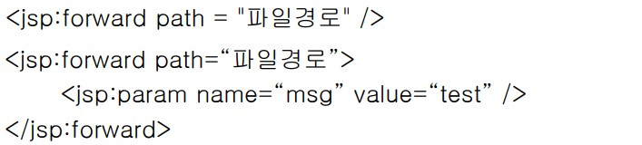
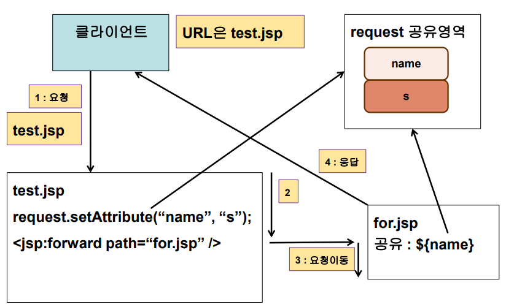
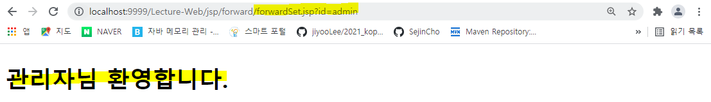
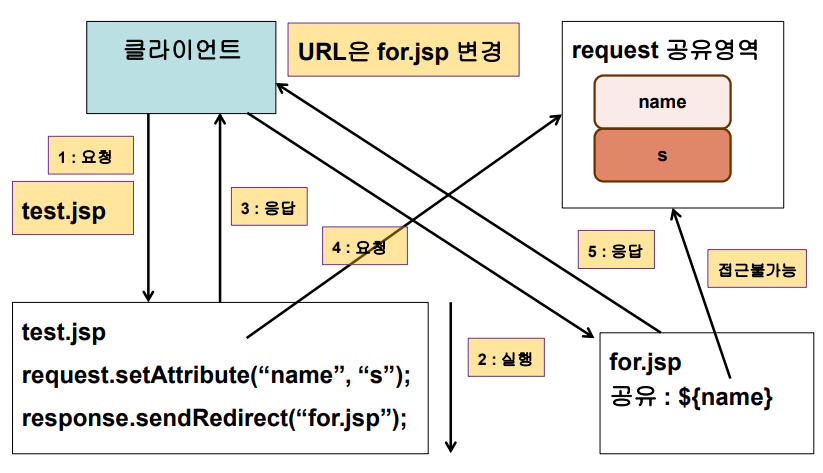

## 페이지 이동

- **액션 - forward**

  - 호출된 페이지에서 다른 페이지로 요청 처리가 이동
    - 즉, 요청받은 jsp와 응답하는 jsp가 다르다. 그러나 외부에서는 다른지 모른다. 
    - 그래서 연결된 jsp들은 request에 있는 공유영역을 함께 공유한다는 특징이 있다.
- 파라미터와 공유영역(request) 이용하여 데이터를 공유
    - 내부적으로 include 액션과 비슷해서 param을 사용할 수 있다.   
- 구문
  
  
  
  - 활용
    - JSP 페이지에서 조건에 따른 페이지 이동


- **액션 - forward 동작방식**

  - test.jsp를 요청하면 공유영역에 name을 저장 그리고 forward가 나오면 요청을 이동시킨다.(for.jsp로)  
  - 그리고 for.jsp가 클라이언트에게 응답해준다. 
    - include는 for.jsp와 text.jsp가 합쳐서 함께 응답을 했지만 forward같은 경우는 for.jsp에게 요청을 떠넘기는 것이므로 for.jsp에서 아무 응답을 하지 않음
  - **응답을 for.jsp가 했다고 하더라도 url은 계속 test.jsp이다.** 
  
  
  


- **forward 실습** 

  - forwardTest.jsp
    -  form 태그를 사용하여 forwardSet.jsp로 id 파라미터를 전송

  ```jsp
  <%@ page language="java" contentType="text/html; charset=UTF-8"
      pageEncoding="UTF-8"%>
  <!DOCTYPE html>
  <html>
  <head>
  <meta charset="UTF-8">
  <title>Insert title here</title>
  </head>
  <body>
  	<form action="forwardSet.jsp">
  		id : <input type="text" name="id">
  		<input type="submit" value="전송이요">
  	</form>
  </body>
  </html>
  ```

  - forwardSet.jsp
    - id를 받아와서 id 값에 따라서 맞는 jsp 페이지로 응답을 떠넘김

  ```jsp
  <%@ page language="java" contentType="text/html; charset=UTF-8"
      pageEncoding="UTF-8"%>
  <%@ taglib prefix="c"  uri="http://java.sun.com/jsp/jstl/core"%>
  <!DOCTYPE html>
  <html>
  <head>
  <meta charset="UTF-8">
  <title>Insert title here</title>
  </head>
  <body>
  	<h2>결과화면</h2>
  	<c:if test="${param.id eq 'admin'}">
  		<jsp:forward page="admin.jsp"/>
  	</c:if>
  	
  	<c:if test="${param.id ne 'admin' }">
  		<c:set value="${param.id}" var="id2" scope="request"/>
  		<jsp:forward page="user.jsp" >
  			<jsp:param value="${param.id}" name="id3"/>
  		</jsp:forward>
  	</c:if>
  </body>
  </html>
  ```

  - admin.jsp

  ```jsp
  <%@ page language="java" contentType="text/html; charset=UTF-8"
      pageEncoding="UTF-8"%>
  <!DOCTYPE html>
  <html>
  <head>
  <meta charset="UTF-8">
  <title>Insert title here</title>
  </head>
  <body>
  	<h2>관리자님 환영합니다.</h2>
  </body>
  </html>
  ```

  - 결과 
    - 응답은 admin.jsp에서 했지만 url은 forwardSet

  

  - user.jsp

  ```jsp
  <%@ page language="java" contentType="text/html; charset=UTF-8"
      pageEncoding="UTF-8"%>
  <!DOCTYPE html>
  <html>
  <head>
  <meta charset="UTF-8">
  <title>Insert title here</title>
  </head>
  <body>
  	<h2>아무 설정 안 함 : [ ${param.id} ] 사용자 ㅎㅇ</h2>
  	<h2>set 태그 : [ ${id2} ] 사용자 ㅎㅇ</h2>
  	<h2>jsp:param : [ ${param.id3} ] 사용자 ㅎㅇ</h2>
  </body>
  </html>
  ```

  - 파라미터를 전송하는 코드를 작성하지 않아도 request 객체가 공유가 되고 있다. 그래서 파라미터도 함께 공유된다. 그래서 파라미터를 request 영역에  공유하지 않아도 사용할 수 있다. 


- **response.sendRedirect(url)**
  - sendRedirect만 jsp의 문법으로만 구성할 수 없다. 서블릿의 문법이다. 그래서 response.sendRedirect를 사용하게 된다. 
  - 호출된 페이지에서 다른 페이지로 요청 처리가 이동
    - 즉, 요청을 재발생 시키는 것이다. 
    - forward같은 경우에는 사용자가 요청한 곳의 url이 사용자에게 보이지만 sendRedirect는 사용자가 요청하고 요청받은 jsp가 다른 곳으로 요청이 넘어가는데 사용자가 다른 곳으로 요청이 넘어간 것을 알 수 있다. 
    - 즉, 사용자가 a.jsp로 요청을 보냈을 때 a.jsp가 b.jsp로 다시 요청을 보내라고 하는 것이다. 그래서 요청이 재발생되는 것임 
    - 서버가 클라이언트에게 일을 시키는 것이기 때문에 response.인 것이다. 
  - 요청이 재 발생되어 데이터 공유가 되지 않음
  - 구문 : response.sendRedirect(url);
  - 예 
    - response.sendRedirect(“/WebApplication/jsp/for/a.jsp”);
    - response.sendRedirect(“http://www.naver.com”);


- **sendRedirect 동작방식**

  - test.jsp로 클라이언트가 요청을 하면 for.jsp로 요청하라고 사용자에게 응답을 한다. 그래서 클라이언트가 for.jsp로 요청이 재발생된다. 
  - 그래서 test.jsp의 응답은 끝난 것이기 때문에 request의 영역이 끝난 것이다. 그래서 request 공유영역을 접근할 수 없다.
  - 사용자가 보는 url은 for.jsp로 변경되어 있다.   
  
  


- **sendRedirect 실습**

  - sendRedirectTest.jsp

  ```jsp
  <%@ page language="java" contentType="text/html; charset=UTF-8"
      pageEncoding="UTF-8"%>
  <!DOCTYPE html>
  <html>
  <head>
  <meta charset="UTF-8">
  <title>Insert title here</title>
  </head>
  <body>
  	<form action="sendRedirectSet.jsp">
  		id : <input type="text" name="id">
  		<input type="submit" value="전송이요">
  	</form>
  </body>
  </html>
  ```

  - sendRedirectSet.jsp
    - 사용자의 경우는 request 공유 영역을 공유하지 않으므로 쿼리스트링을 사용해서 파라미터를 넘겨줘야 한다. 

  ```jsp
  <%@ page language="java" contentType="text/html; charset=UTF-8"
      pageEncoding="UTF-8"%>
  <%@ taglib prefix="c"  uri="http://java.sun.com/jsp/jstl/core"%>
  <!DOCTYPE html>
  <html>
  <head>
  <meta charset="UTF-8">
  <title>Insert title here</title>
  </head>
  <body>
  	<h2>결과화면</h2>
  	<c:if test="${param.id eq 'admin'}">
  		<%response.sendRedirect("admin.jsp"); %>
  	</c:if>
  	
  	<c:if test="${param.id ne 'admin' }">
  		<%
  			String id = request.getParameter("id");
  			response.sendRedirect("user.jsp?id=" + id); 
  		%>
  	</c:if>
  </body>
  </html>
  ```

  - admin.jsp

  ```jsp
  <%@ page language="java" contentType="text/html; charset=UTF-8"
      pageEncoding="UTF-8"%>
  <!DOCTYPE html>
  <html>
  <head>
  <meta charset="UTF-8">
  <title>Insert title here</title>
  </head>
  <body>
  	<h2>관리자님 환영합니다.</h2>
  </body>
  </html>
  ```

  - user.jsp
    - 쿼리스트링으로 넘긴 파라미터를 받아서 사용하면 된다. 

  ```jsp
  <%@ page language="java" contentType="text/html; charset=UTF-8"
      pageEncoding="UTF-8"%>
  <!DOCTYPE html>
  <html>
  <head>
  <meta charset="UTF-8">
  <title>Insert title here</title>
  </head>
  <body>
  	<h2>param.id : [ ${param.id} ] 사용자 ㅎㅇ</h2>
  </body>
  </html>
  ```

  

## 상태정보 유지기술

- **쿠키(Cookie)**
  - 특성
    - 정보 저장 위치 : 사용자 컴퓨터 
    - 서버의 부하가 분산된다. 
    - 보안 상의 문제가 발생할 수 있다.
    - 정보 저장 유효기간을 사용자가 설정한다(브라우저가 닫힌 이후에도 유지)
    - 한 사이트에서 저장할 수 있는 쿠키 객체는 한정되어 있음(20개)
      - 많으면 부하가 발생할 수 있음
    - 하나의 쿠키에 저장할 수 있는 데이터는 브라우저별 한계가 있음(4k)
    - 컴퓨터에 쿠키 한계치(300개)가 오게 되면 랜덤하게 저장되어 있는 쿠키가 삭제
    - 만약 쿠키가 다 찬 경우 쿠키 중에 하나가 삭제되고 새로운 쿠키로 update 된다.
    - 쿠키는 문자열만 저장이 가능하다. 
    - 한글 저장 시에는 인코딩을 반드시 해야 가능 
    - 쿠키는 서버가 만든다. 서버에서 쿠키를 만든 다음에 서버가 저장할 컴퓨터에게 쿠키를 넘긴다. 응답객체(response)로 넘긴다. 
    - 웹사이트를 요청할 때 해당 웹사이트와 관련된 쿠키를 함께 보낸다. 
    - 즉, 쿠키는 웹 브라우저가 보관하고 있는 데이터로서 웹 서버에 요청을 보낼 때 함께 전송


- **쿠키의 구성**

  | 명칭             | 설명                          |
  | ---------------- | ----------------------------- |
  | 이름(name)       | 각각의 쿠키를 구별하는데 사용 |
  | 값(value)        | 쿠키의 이름과 관련된 값       |
  | 유효시간(maxAge) | 쿠키의 유지 시간              |
  | 도메인(domain)   | 쿠키를 전송할 도메인          |
  | 경로(path)       | 쿠키를 전송할 요청 경로       |


- **쿠키 이름 제약**
  - 아스키 코드의 알파벳과 숫자만을 포함할 수 있다.
  - 콤마, 세미콜론, 공백 등의 문자는 포함할 수 없다.
  - '$'로 시작할 수 없다.


- **쿠키의 인코딩/디코딩**

  - 쿠키는 값으로 한글과 같은 문자를 가질 수 없음
  - 그래서 인코딩과 디코딩을 해줘야 한다. 

  


