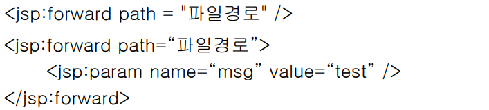
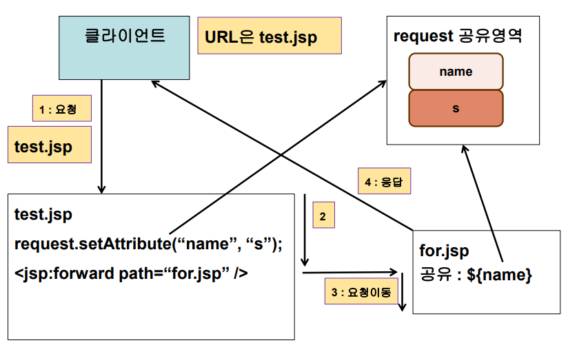
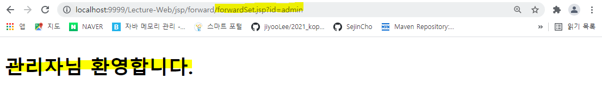
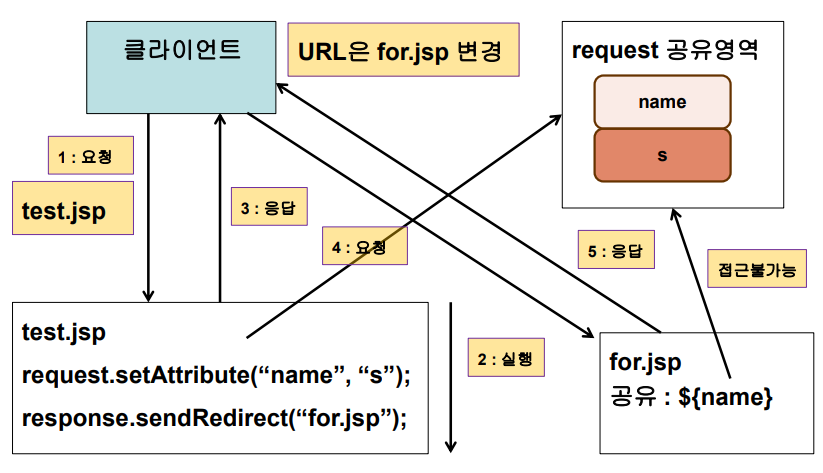

## 페이지 이동

- **액션 - forward**

  - 호출된 페이지에서 다른 페이지로 요청 처리가 이동
    - 즉, 요청받은 jsp와 응답하는 jsp가 다르다. 그러나 외부에서는 다른지 모른다. 
    - 그래서 연결된 jsp들은 request에 있는 공유영역을 함께 공유한다는 특징이 있다.
- 파라미터와 공유영역(request) 이용하여 데이터를 공유
    - 내부적으로 include 액션과 비슷해서 param을 사용할 수 있다.   
- 구문
  
  
  
  - 활용
    - JSP 페이지에서 조건에 따른 페이지 이동


- **액션 - forward 동작방식**

  - test.jsp를 요청하면 공유영역에 name을 저장 그리고 forward가 나오면 요청을 이동시킨다.(for.jsp로)  
  - 그리고 for.jsp가 클라이언트에게 응답해준다. 
    - include는 for.jsp와 text.jsp가 합쳐서 함께 응답을 했지만 forward같은 경우는 for.jsp에게 요청을 떠넘기는 것이므로 for.jsp에서 아무 응답을 하지 않음
  - **응답을 for.jsp가 했다고 하더라도 url은 계속 test.jsp이다.** 
  
  
  


- **forward 실습** 

  - forwardTest.jsp
    -  form 태그를 사용하여 forwardSet.jsp로 id 파라미터를 전송

  ```jsp
  <%@ page language="java" contentType="text/html; charset=UTF-8"
      pageEncoding="UTF-8"%>
  <!DOCTYPE html>
  <html>
  <head>
  <meta charset="UTF-8">
  <title>Insert title here</title>
  </head>
  <body>
  	<form action="forwardSet.jsp">
  		id : <input type="text" name="id">
  		<input type="submit" value="전송이요">
  	</form>
  </body>
  </html>
  ```

  - forwardSet.jsp
    - id를 받아와서 id 값에 따라서 맞는 jsp 페이지로 응답을 떠넘김

  ```jsp
  <%@ page language="java" contentType="text/html; charset=UTF-8"
      pageEncoding="UTF-8"%>
  <%@ taglib prefix="c"  uri="http://java.sun.com/jsp/jstl/core"%>
  <!DOCTYPE html>
  <html>
  <head>
  <meta charset="UTF-8">
  <title>Insert title here</title>
  </head>
  <body>
  	<h2>결과화면</h2>
  	<c:if test="${param.id eq 'admin'}">
  		<jsp:forward page="admin.jsp"/>
  	</c:if>
  	
  	<c:if test="${param.id ne 'admin' }">
  		<c:set value="${param.id}" var="id2" scope="request"/>
  		<jsp:forward page="user.jsp" >
  			<jsp:param value="${param.id}" name="id3"/>
  		</jsp:forward>
  	</c:if>
  </body>
  </html>
  ```

  - admin.jsp

  ```jsp
  <%@ page language="java" contentType="text/html; charset=UTF-8"
      pageEncoding="UTF-8"%>
  <!DOCTYPE html>
  <html>
  <head>
  <meta charset="UTF-8">
  <title>Insert title here</title>
  </head>
  <body>
  	<h2>관리자님 환영합니다.</h2>
  </body>
  </html>
  ```

  - 결과 
    - 응답은 admin.jsp에서 했지만 url은 forwardSet

  

  - user.jsp

  ```jsp
  <%@ page language="java" contentType="text/html; charset=UTF-8"
      pageEncoding="UTF-8"%>
  <!DOCTYPE html>
  <html>
  <head>
  <meta charset="UTF-8">
  <title>Insert title here</title>
  </head>
  <body>
  	<h2>아무 설정 안 함 : [ ${param.id} ] 사용자 ㅎㅇ</h2>
  	<h2>set 태그 : [ ${id2} ] 사용자 ㅎㅇ</h2>
  	<h2>jsp:param : [ ${param.id3} ] 사용자 ㅎㅇ</h2>
  </body>
  </html>
  ```

  - 파라미터를 전송하는 코드를 작성하지 않아도 request 객체가 공유가 되고 있다. 그래서 파라미터도 함께 공유된다. 그래서 파라미터를 request 영역에  공유하지 않아도 사용할 수 있다. 


- **response.sendRedirect(url)**
  - sendRedirect만 jsp의 문법으로만 구성할 수 없다. 서블릿의 문법이다. 그래서 response.sendRedirect를 사용하게 된다. 
  - 호출된 페이지에서 다른 페이지로 요청 처리가 이동
    - 즉, 요청을 재발생 시키는 것이다. 
    - forward같은 경우에는 사용자가 요청한 곳의 url이 사용자에게 보이지만 sendRedirect는 사용자가 요청하고 요청받은 jsp가 다른 곳으로 요청이 넘어가는데 사용자가 다른 곳으로 요청이 넘어간 것을 알 수 있다. 
    - 즉, 사용자가 a.jsp로 요청을 보냈을 때 a.jsp가 b.jsp로 다시 요청을 보내라고 하는 것이다. 그래서 요청이 재발생되는 것임 
    - 서버가 클라이언트에게 일을 시키는 것이기 때문에 response.인 것이다. 
  - 요청이 재 발생되어 데이터 공유가 되지 않음
  - 구문 : response.sendRedirect(url);
  - 예 
    - response.sendRedirect(“/WebApplication/jsp/for/a.jsp”);
    - response.sendRedirect(“http://www.naver.com”);


- **sendRedirect 동작방식**

  - test.jsp로 클라이언트가 요청을 하면 for.jsp로 요청하라고 사용자에게 응답을 한다. 그래서 클라이언트가 for.jsp로 요청이 재발생된다. 
  - 그래서 test.jsp의 응답은 끝난 것이기 때문에 request의 영역이 끝난 것이다. 그래서 request 공유영역을 접근할 수 없다.
  - 사용자가 보는 url은 for.jsp로 변경되어 있다.   
  
  


- **sendRedirect 실습**

  - sendRedirectTest.jsp

  ```jsp
  <%@ page language="java" contentType="text/html; charset=UTF-8"
      pageEncoding="UTF-8"%>
  <!DOCTYPE html>
  <html>
  <head>
  <meta charset="UTF-8">
  <title>Insert title here</title>
  </head>
  <body>
  	<form action="sendRedirectSet.jsp">
  		id : <input type="text" name="id">
  		<input type="submit" value="전송이요">
  	</form>
  </body>
  </html>
  ```

  - sendRedirectSet.jsp
    - 사용자의 경우는 request 공유 영역을 공유하지 않으므로 쿼리스트링을 사용해서 파라미터를 넘겨줘야 한다. 

  ```jsp
  <%@ page language="java" contentType="text/html; charset=UTF-8"
      pageEncoding="UTF-8"%>
  <%@ taglib prefix="c"  uri="http://java.sun.com/jsp/jstl/core"%>
  <!DOCTYPE html>
  <html>
  <head>
  <meta charset="UTF-8">
  <title>Insert title here</title>
  </head>
  <body>
  	<h2>결과화면</h2>
  	<c:if test="${param.id eq 'admin'}">
  		<%response.sendRedirect("admin.jsp"); %>
  	</c:if>
  	
  	<c:if test="${param.id ne 'admin' }">
  		<%
  			String id = request.getParameter("id");
  			response.sendRedirect("user.jsp?id=" + id); 
  		%>
  	</c:if>
  </body>
  </html>
  ```

  - admin.jsp

  ```jsp
  <%@ page language="java" contentType="text/html; charset=UTF-8"
      pageEncoding="UTF-8"%>
  <!DOCTYPE html>
  <html>
  <head>
  <meta charset="UTF-8">
  <title>Insert title here</title>
  </head>
  <body>
  	<h2>관리자님 환영합니다.</h2>
  </body>
  </html>
  ```

  - user.jsp
    - 쿼리스트링으로 넘긴 파라미터를 받아서 사용하면 된다. 

  ```jsp
  <%@ page language="java" contentType="text/html; charset=UTF-8"
      pageEncoding="UTF-8"%>
  <!DOCTYPE html>
  <html>
  <head>
  <meta charset="UTF-8">
  <title>Insert title here</title>
  </head>
  <body>
  	<h2>param.id : [ ${param.id} ] 사용자 ㅎㅇ</h2>
  </body>
  </html>
  ```

  

## 상태정보 유지기술

- **쿠키(Cookie)**
  - 특성
    - 정보 저장 위치 : 사용자 컴퓨터 
    - 서버의 부하가 분산된다. 
    - 보안 상의 문제가 발생할 수 있다.
    - 정보 저장 유효기간을 사용자가 설정한다(브라우저가 닫힌 이후에도 유지)
    - 한 사이트에서 저장할 수 있는 쿠키 객체는 한정되어 있음(20개)
      - 많으면 부하가 발생할 수 있음
    - 하나의 쿠키에 저장할 수 있는 데이터는 브라우저별 한계가 있음(4k)
    - 컴퓨터에 쿠키 한계치(300개)가 오게 되면 랜덤하게 저장되어 있는 쿠키가 삭제
    - 만약 쿠키가 다 찬 경우 쿠키 중에 하나가 삭제되고 새로운 쿠키로 update 된다.
    - 쿠키는 문자열만 저장이 가능하다. 
    - 한글 저장 시에는 인코딩을 반드시 해야 가능 
    - 쿠키는 서버가 만든다. 서버에서 쿠키를 만든 다음에 서버가 저장할 컴퓨터에게 쿠키를 넘긴다. 응답객체(response)로 넘긴다. 
    - 웹사이트를 요청할 때 해당 웹사이트와 관련된 쿠키를 함께 보낸다. 
    - 즉, 쿠키는 웹 브라우저가 보관하고 있는 데이터로서 웹 서버에 요청을 보낼 때 함께 전송


- **쿠키의 구성**

  | 명칭             | 설명                          |
  | ---------------- | ----------------------------- |
  | 이름(name)       | 각각의 쿠키를 구별하는데 사용 |
  | 값(value)        | 쿠키의 이름과 관련된 값       |
  | 유효시간(maxAge) | 쿠키의 유지 시간              |
  | 도메인(domain)   | 쿠키를 전송할 도메인          |
  | 경로(path)       | 쿠키를 전송할 요청 경로       |


- **쿠키 이름 제약**
  - 아스키 코드의 알파벳과 숫자만을 포함할 수 있다.
  - 콤마, 세미콜론, 공백 등의 문자는 포함할 수 없다.
  - '$'로 시작할 수 없다.


- **쿠키의 인코딩/디코딩**

  - 쿠키는 값으로 한글과 같은 문자를 가질 수 없음
  - 그래서 인코딩과 디코딩을 해줘야 한다. 

  ```java
  //인코딩
  cName = URLEncoder.encode(cName, "utf-8");
  cValue = URLEncoder.encode(cValue, "utf-8");
  
  //디코딩
  name = URLDecoder.decode(name, "utf-8");
  value = URLDecoder.decode(value, "utf-8");
  ```


- **쿠키 유효시간 설정**

  - 유효시간 지정 시, 유효시간이 지나지 않으면 웹 브라우저 닫아도 쿠키가 삭제되지 않는다.
  - **makeForm.jsp**

  ```jsp
  <%@ page language="java" contentType="text/html; charset=UTF-8"
      pageEncoding="UTF-8"%>
  <!DOCTYPE html>
  <html>
  <head>
  <meta charset="UTF-8">
  <title>Insert title here</title>
  </head>
  <body>
  	<form action="set.jsp">
  	쿠키 이름 : <input type="text" name="cName">  <br>
  	쿠키 값 : <input type="text" name="cValue"> <br>
  	유효시간(분) : <input type="text" name="cAge"> <br>
  	<input type="submit" value="쿠키 설정"> 
  	</form>
  </body>
  </html>
  ```

  - set.jsp

  ```jsp
  <%@page import="java.net.URLEncoder"%>
  <%@ page language="java" contentType="text/html; charset=UTF-8"
      pageEncoding="UTF-8"%>
  <%
  	request.setCharacterEncoding("utf-8");
  
  	String cName = request.getParameter("cName");
  	cName = URLEncoder.encode(cName, "utf-8");
  	
  	String cValue = request.getParameter("cValue");
  	cValue = URLEncoder.encode(cValue, "utf-8");
  	
  	String cAge = request.getParameter("cAge");
  	cAge = URLEncoder.encode(cAge, "utf-8");
  	
  	//쿠키 생성
  	Cookie cookie = new Cookie(cName,cValue);
  
  	//유효시간 설정(setMaxAge는 단위가 초)
  	if(cAge != null) {
  		cookie.setMaxAge(Integer.parseInt(cAge) * 60);
  	}
  	
  	//생성된 쿠키 전송
  	response.addCookie(cookie);
  	
  	
  %>
  <!DOCTYPE html>
  <html>
  <head>
  <meta charset="UTF-8">
  <title>Insert title here</title>
  </head>
  <body>
  	<h2>쿠키 설정 완료</h2>
  	<a href="get.jsp">쿠키 보러가기</a>
  </body>
  </html>
  ```

  

- **쿠키의 도메인**

  - 쿠키 도메인 지정 시 해당 도메인에 쿠키 전달

  

- **쿠키 경로**
  - 설정된 경로를 기준으로 쿠키 전달
  - 경로 미 설정 시, 요청 URL의 경로에대해서만 쿠키 전달
  - 경로 설정 시, 설정한 경로 및 그 하위 경로에 대해서 쿠키 전송


- **쿠키 경로 실습**

  - set.jsp

  ```jsp
  <%@page import="java.net.URLEncoder"%>
  <%@ page language="java" contentType="text/html; charset=UTF-8"
      pageEncoding="UTF-8"%>
  <%
  	Cookie c = new Cookie("type01", URLEncoder.encode("/ 루트설정", "utf-8"));
  	c.setPath("/");
  	
  	Cookie c2 = new Cookie("type02", URLEncoder.encode("/Lecture-Web/jsp/cookie 루트설정", "utf-8"));
  	c2.setPath("/Lecture-Web/jsp/cookie");
  	
  	Cookie c3 = new Cookie("type03", 
  							URLEncoder.encode("/Lecture-Web/jsp/cookie/type03 루트설정", "utf-8"));
  	c3.setPath("/Lecture-Web/jsp/cookie/type03");
  	
  	Cookie c4 = new Cookie("type04", 
  							URLEncoder.encode("/Lecture-Web/jsp/cookie/type04 루트설정", "utf-8"));
  	c4.setPath("/Lecture-Web/jsp/cookie/type04");
  	
  	Cookie cookie = new Cookie("cookieName", "cookieValue");
  	
  	response.addCookie(c);
  	response.addCookie(c2);
  	response.addCookie(c3);
  	response.addCookie(c4);
  	
  	response.addCookie(cookie);
  %>    
  <!DOCTYPE html>
  <html>
  <head>
  <meta charset="UTF-8">
  <title>Insert title here</title>
  </head>
  <body>
  	<h2>쿠키설정 완료</h2>
  	<a href="get.jsp">설정된 쿠키조회</a>
  </body>
  </html>
  ```

  - get.jsp

  ```jsp
  <%@page import="java.net.URLDecoder"%>
  <%@ page language="java" contentType="text/html; charset=UTF-8"
      pageEncoding="UTF-8"%>
  <%
  	Cookie[] cookies = request.getCookies();
  
  	StringBuilder sb = new StringBuilder();
  	for(Cookie c : cookies) {
  		String cName  = c.getName();
  		String cValue = c.getValue();
  		
  		// decoding
  		cName  = URLDecoder.decode(cName, "utf-8");
  		cValue = URLDecoder.decode(cValue, "utf-8");
  		
  		sb.append("쿠키이름 : " + cName + ", ");
  		sb.append("쿠키값 : " + cValue + "<br>");
  		
  		pageContext.setAttribute("cookieData", sb.toString());
  	}
  %>    
  <!DOCTYPE html>
  <html>
  <head>
  <meta charset="UTF-8">
  <title>Insert title here</title>
  </head>
  <body>
  	<h2>설정된 쿠키정보</h2>
  	<%-- <%= sb.toString() %> --%>
  	${ cookieData }<br>
  	쿠키명 : ${ cookie.cookieName.name }<br>
  	쿠키값 : ${ cookie.cookieName.value }<br>
  	
  	<a href="remove.jsp">쿠키삭제</a>
  </body>
  </html>
  ```

  - remove.jsp
    - setMaxAge를 0으로 둔다.

  ```jsp
  <%@page import="java.net.URLEncoder"%>
  <%@ page language="java" contentType="text/html; charset=UTF-8"
      pageEncoding="UTF-8"%>
  <%
  	Cookie cookie = new Cookie("type01", URLEncoder.encode("/ 루트설정", "utf-8"));
  	cookie.setPath("/");
  	cookie.setMaxAge(0);
  	
  	Cookie cookie2 = new Cookie("type02", URLEncoder.encode("/Lecture-Web/jsp/cookie 루트설정", "utf-8"));
  	cookie2.setPath("/Lecture-Web/jsp/cookie");
  	cookie2.setMaxAge(0);
  	
  	Cookie cookie3 = new Cookie("type03", URLEncoder.encode("/Lecture-Web/jsp/cookie/type03 루트설정", "utf-8"));
  	cookie3.setPath("/Lecture-Web/jsp/cookie/type03");
  	cookie3.setMaxAge(0);
  			
  	Cookie cookie4 = new Cookie("type04", URLEncoder.encode("/Lecture-Web/jsp/cookie/type04 루트설정", "utf-8"));
  	cookie4.setPath("/Lecture-Web/jsp/cookie/type04");
  	cookie4.setMaxAge(0);
  	
  	response.addCookie(cookie);
  	response.addCookie(cookie2);
  	response.addCookie(cookie3);
  	response.addCookie(cookie4);
  %>
  <!DOCTYPE html>
  <html>
  <head>
  <meta charset="UTF-8">
  <title>Insert title here</title>
  </head>
  <body>
  	<h2>쿠키 삭제 완료</h2>
  </body>
  </html>
  ```

  


## 세션

- 세션의 특성

  - 정보 저장 위치 : 서버

  - 서버에 저장이 됭서 서버의 부하가 가중된다.

  - 보안상의 문제 발생 소지를 줄인다.

  - 정보저장 최대 유효시간이 브라우저가 닫힐 때까지 이다. 

  - 정보 저장 시 객체 타입이 가능하다.

  - 웹 컨테이너에서 클라이언트의 정보를 보관할 때 사용

  - 오직 서버에서만 생성

  - 클라이언트마다 세션이 생성

  - page 지시자의 session 속성 값을 true로 지정

  - 세션이 존재하지 않은 경우 세션이 생성되고, 세션이 존재할 경우 이미 생성된 세션을 사용

    - 별도의 session 속성을 사용하지 않은 경우 기본설정이 true로 설정 

    ```jsp
    <%@ page session = "true" %>
    ```

  - 세션 타임아웃 시간 설정

    - web.xml에 설정(분 단위)
    - 자바에서는 단위가 초 
    - 디폴트가 30분
      - 즉, 가만히 있으면 30분 후에 session 정보가 사라진다. 

    ```xml
    <session-config>
    	<session-timeout>
        	30
        </session-timeout>
    </session-config>
    ```

    ```java
    session.setMaxInactiveInterval(int interval);
    //초 단위임 여기는
    ```


- **JSESSIONID**

  - 톰캣 컨테이너에서 세션을 유지하기 위해 발급하는 키

  - HTTP 프로토콜은 stateless하다. 요청시마다 새로운 연결이 생성되고 응답후 연결은 끊기게 되므로 상태를 유지할 수 없다.

  - 따라서, 상태를 저장하기 위해서 톰캣은 JSESSIONID 쿠키를 클라이언트에게 발급해주고 이 값을 통해 세션을 유지할 수 있도록 한다.

    

- 세션 실습 - id와 password 각각 세션에 저장

  - makeForm.jsp

  ```jsp
  <%@ page language="java" contentType="text/html; charset=UTF-8"
      pageEncoding="UTF-8"%>
  <!DOCTYPE html>
  <html>
  <head>
  <meta charset="UTF-8">
  <title>Insert title here</title>
  </head>
  <body>
  	<form action="set.jsp" method="post">
  		아이디 : <input type="text" name="id"><br>
  		패스워드 : <input type="password" name="password"><br>
  		<input type="submit" value="세션설정">
  	</form>
  </body>
  </html>
  ```

  - set.jsp

  ```jsp
  <%@ page language="java" contentType="text/html; charset=UTF-8"
      pageEncoding="UTF-8"%>
  <%
  	request.setCharacterEncoding("utf-8");
  
  	String id = request.getParameter("id");
  	String password = request.getParameter("password");
  	
  	// 세션 등록
  	session.setAttribute("id", id);
  	session.setAttribute("password", password);
  %>    
  <!DOCTYPE html>
  <html>
  <head>
  <meta charset="UTF-8">
  <title>Insert title here</title>
  </head>
  <body>
  	<h2>세션 설정 완료</h2>
  	<a href="get.jsp">설정된 세션정보 조회</a>
  </body>
  </html>
  ```

  - get.jsp

  ```jsp
  <%@ page language="java" contentType="text/html; charset=UTF-8"
      pageEncoding="UTF-8"%>
  <%
  	String id = (String)session.getAttribute("id");
  	String password = (String)session.getAttribute("password");
  %>    
  <!DOCTYPE html>
  <html>
  <head>
  <meta charset="UTF-8">
  <title>Insert title here</title>
  </head>
  <body>
  	1. <br> 
  	설정된 세션 ID : <%= id %><br>
  	설정된 세션 PASSWORD : <%= password %><br>
  	<br>
  	2. <br>
  	설정된 세션 ID : ${sessionScope.id}<br>
  	설정된 세션 PASSWORD : ${sessionScope.password}<br>
  	<a href="remove.jsp">세션삭제</a>
  </body>
  </html>
  ```

  - remove.jsp

  ```jsp
  <%@ page language="java" contentType="text/html; charset=UTF-8"
      pageEncoding="UTF-8"%>
  <%
  	//세션 삭제
  	//1.
  	//session.removeAttribute("id");
  	//session.removeAttribute("password");
  	//2.
  	session.invalidate(); 
  %>
  <!DOCTYPE html>
  <html>
  <head>
  <meta charset="UTF-8">
  <title>Insert title here</title>
  </head>
  <body>
  	<h2>세션 삭제 완료</h2>
  	<a href="get.jsp">삭제된 세션조회</a>
  </body>
  </html>
  ```

  

- **세션 실습 - id와 password 함께 저장**

  - makeForm.jsp

  ```jsp
  <%@ page language="java" contentType="text/html; charset=UTF-8"
      pageEncoding="UTF-8"%>
  <!DOCTYPE html>
  <html>
  <head>
  <meta charset="UTF-8">
  <title>Insert title here</title>
  </head>
  <body>
  	<form action="set.jsp" method="post">
  		아이디 : <input type="text" name="id"><br>
  		패스워드 : <input type="password" name="password"><br>
  		<input type="submit" value="세션설정">
  	</form>
  </body>
  </html>
  ```

  - set.jsp

  ```jsp
  <%@page import="kr.ac.kopo.member.MemberVO"%>
  <%@ page language="java" contentType="text/html; charset=UTF-8"
      pageEncoding="UTF-8"%>
  <%
  	request.setCharacterEncoding("utf-8");
  	MemberVO member = new MemberVO();
  	String id = request.getParameter("id");
  	String password = request.getParameter("password");
  	member.setId(id);
  	member.setPassword(password);
  	
  	// 세션 등록
  	session.setAttribute("member", member);
  %>    
  <!DOCTYPE html>
  <html>
  <head>
  <meta charset="UTF-8">
  <title>Insert title here</title>
  </head>
  <body>
  	<h2>세션 설정 완료</h2>
  	<a href="get.jsp">설정된 세션정보 조회</a>
  </body>
  </html>
  ```

  - get.jsp

  ```jsp
  <%@page import="kr.ac.kopo.member.MemberVO"%>
  <%@ page language="java" contentType="text/html; charset=UTF-8"
      pageEncoding="UTF-8"%>
  <%@ taglib prefix="c" uri="http://java.sun.com/jsp/jstl/core" %>
  <%
  	MemberVO member = (MemberVO)session.getAttribute("member");
  %>    
  <!DOCTYPE html>
  <html>
  <head>
  <meta charset="UTF-8">
  <title>Insert title here</title>
  </head>
  <body>
  	<c:if test="${sessionScope.member eq null }">
  		설정된 세션이 존재하지 않습니다. <br>
  		<a href="makeForm.jsp">세션 등록</a>
  	</c:if>
  	<c:if test="${not empty sessionScope.member }">
  		1. <br>
  		<!-- 1과 2 둘 다 null이면 error! -->
  		설정된 세션 ID : <%= member.getId() %><br>
  		설정된 세션 PASSWORD : <%= member.getPassword() %><br>
  		<br>
  		2. <br>
  		설정된 세션 ID : ${sessionScope.member.id}<br>
  		설정된 세션 PASSWORD : ${sessionScope.member.password}<br>
  		<a href="remove.jsp">세션삭제</a>
  	</c:if>
  </body>
  </html>
  ```

  - remove.jsp

  ```jsp
  <%@ page language="java" contentType="text/html; charset=UTF-8"
      pageEncoding="UTF-8"%>
  <%
  	//세션 삭제
  	//1.
  	//session.removeAttribute("id");
  	//session.removeAttribute("password");
  	//2.
  	session.invalidate(); 
  %>
  <!DOCTYPE html>
  <html>
  <head>
  <meta charset="UTF-8">
  <title>Insert title here</title>
  </head>
  <body>
  	<h2>세션 삭제 완료</h2>
  	<a href="get.jsp">삭제된 세션조회</a>
  </body>
  </html>
  ```

  


