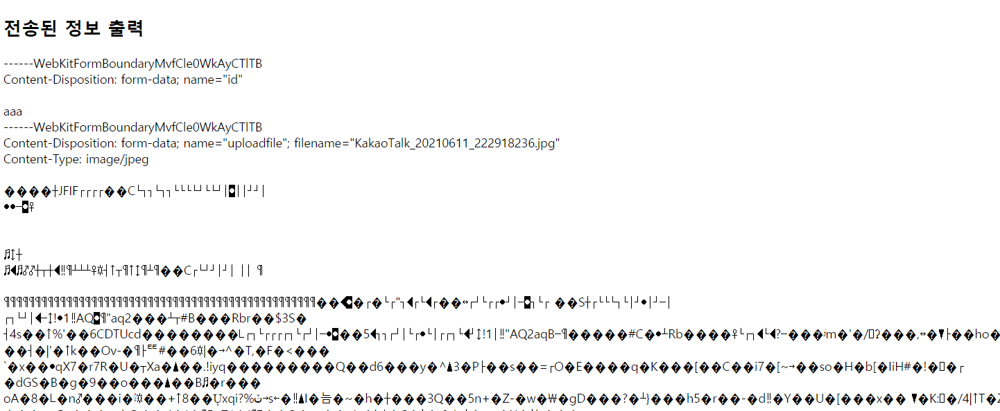

## 파일 업로드

- 실습

  - fileUploadTest.jsp
    - form 태그의 enctype속성은 폼 데이터가 서버로 제출될 때 해당 데이터가 인코딩되는 방법을 명시
    - multipart/form-data는 모든 문자를 인코딩하지 않음을 명시한다. 이 방식은 주로 form 요소가 파일이나 이미지를 서버로 전송할 때 사용한다. 

  ```jsp
  <%@ page language="java" contentType="text/html; charset=UTF-8"
      pageEncoding="UTF-8"%>
  <!DOCTYPE html>
  <html>
  <head>
  <meta charset="UTF-8">
  <title>Insert title here</title>
  </head>
  <body>
  	<h2>파일 업로드 테스트</h2>
  	<form action="uploadInfo.jsp" method="post">
  		id : <input type="text" name="id"><br>
  		파일 : <input type="file" name="uploadfile"><br>
  		<input type="submit" value="전송">
  	</form>
  </body>
  </html>
  ```

  - uploadInfo.jsp
    - 전송된 정보 출력 페이지를 확인하면 
    - cos.jar를 사용해서 multipartRequest.getParameter("title")을 사용해서 filename과 content-type 등의 데이터를 뽑아와준다. 

  ```jsp
  <%@page import="java.io.BufferedReader"%>
  <%@page import="java.io.InputStreamReader"%>
  <%@ page language="java" contentType="text/html; charset=UTF-8"
      pageEncoding="UTF-8"%>
  <!DOCTYPE html>
  <html>
  <head>
  <meta charset="UTF-8">
  <title>Insert title here</title>
  </head>
  <body>
  	<h2>전송된 정보 출력</h2>
  <%
  	InputStreamReader isr = new InputStreamReader(request.getInputStream(), "utf-8");
  	BufferedReader br = new BufferedReader(isr);
  	
  	while(true) {
  		String data = br.readLine();
  		if(data == null) break;
  		out.println(data + "<br>");
  	}
  %>
  </body>
  </html>
  
  ```

  


- 게시판에 파일 업로드 추가

  - writeForm.jsp

  ```jsp
  <%@ page language="java" contentType="text/html; charset=UTF-8"
      pageEncoding="UTF-8"%>
  <%@ taglib prefix="c"  uri="http://java.sun.com/jsp/jstl/core" %>
  <!DOCTYPE html>
  <html>
  <head>
  <meta charset="UTF-8">
  <title>Insert title here</title>
  <link rel="stylesheet" href="/Mission-Web/resources/css/layout.css"></link>
  <link rel="stylesheet" href="/Mission-Web/resources/css/board.css"></link>
  <script src="/Mission-Web/resources/js/jquery-3.6.0.min.js"></script>
  <script src="/Mission-Web/resources/js/jquery-3.6.0.min.js"></script>
  <script type="text/javascript">
  	if('${userVO}' == '') {
  		location.href = "/Mission-Web/index.jsp"
  	}
  	
  	$(document).ready(function(){
  		$('#goListBtn').click(function(){
  			location.href = "list.jsp"
  		})
  	})
  	
  	function doWrite() {
  		
  		let f = document.writeForm
  		if(f.title.value == '') {
  			alert('제목을 입력하세요.')
  			f.title.focus()
  			return false
  		}
  		
  		if(f.writer.value == '') {
  			alert('작성자를 입력하세요.')
  			f.writer.focus()
  			return false
  		}
  		
  		if(f.content.value == '') {
  			alert('내용을 입력하세요')
  			f.content.focus()
  			return false
  		}
  		
  		//파일 확장자 체크
  		if(checkExt(f.attachfile1)){
  			return false
  		}
  		if(checkExt(f.attachfile2)){
  			return false
  		}
  		
  		return true
  	}
  
  	function checkExt(obj) {
  		let forbidName = ['exe','java','jsp','js','class']
  		let fileName = obj.value
  		console.log(fileName)
  		let ext = fileName.substring(fileName.lastIndexOf('.')+1)
  		console.log(ext)
  		
  		for(let i=0; i<forbidName.length ; i++ ) {
  			if(forbidName[i] == ext) {
  				alert(ext + '확장자는 파일 업로드 정책에 위배됩니다.')
  				return true
  			}
  		}
  		return false
  	}
  	
  </script>
  </head>
  <body>
  	<header>
  		<jsp:include page="/jsp/include/topMenu.jsp"></jsp:include>
  	</header>
  	<section>
  		<div align="center">
  			<hr width="80%">
  			<h2>게시글 등록폼</h2>
  			<hr width="80%">
  			<br>
  			<form action="write.jsp" method="post" onsubmit="return doWrite()" name="writeForm" enctype="multipart/form-data">
  				<input type="hidden" name="writer" value="${userVO.id}">
  				<table border="1">
  					<tr>
  						<th width="25%">제목</th>
  						<td><input type="text" size="60" name="title"></td>
  					</tr>
  					<tr>	
  						<th width="25%">작성자</th>
  						<td>
  							<c:out value="${userVO.id}"/>
  						<!-- <input type="text" size="60" name="writer" value="${sessionScope.userVO.id}" readonly> -->
  						</td>
  					</tr>
  					<tr>
  						<th width="25%">내용</th>
  						<td><textarea rows="8" cols="60" name="content"></textarea> </td>
  					</tr>
  					<tr>
  						<th width="25%">첨부파일</th>
  						<td>
  							<input type="file" name="attachfile1"> <br>
  							<input type="file" name="attachfile2">
  						</td>
  					</tr>
  				</table>
  				<input type="submit" value="등록">
  				<input type="button" value="목록" id="goListBtn">
  			</form>
  			
  		</div>
  	</section>
  	<footer>
  		<%@ include file="/jsp/include/bottom.jsp" %>
  	</footer>
  </body>
  </html>
  ```

  

  - KopoFileNamePolicy.java

  ```java
  package kr.ac.kopo.util;
  
  import java.io.File;
  import java.util.UUID;
  
  import com.oreilly.servlet.multipart.FileRenamePolicy;
  
  public class KopoFileNamePolicy implements FileRenamePolicy {
  
  	@Override
  	public File rename(File f) {
  		String name = f.getName();
  		String ext = "";
  		int dot = name.lastIndexOf(".");
  		if (dot != -1) {
  			ext = name.substring(dot); 
  		} else {
  			ext = "";
  		}
  		String str = "kopo" + UUID.randomUUID(); //32비트의 임의의 값을 출력 (파일명을 다르게 해주기 위함)
  		File renameFile = new File(f.getParent(), str + ext);
  		return renameFile;
  	}
  }
  ```

  

  - write.jsp

  ```jsp
  <%@page import="kr.ac.kopo.util.KopoFileNamePolicy"%>
  <%@page import="com.oreilly.servlet.MultipartRequest"%>
  <%@page import="kr.ac.kopo.board.dao.BoardDAO"%>
  <%@page import="kr.ac.kopo.board.vo.BoardVO"%>
  <%@page import="kr.ac.kopo.login.vo.LoginVO"%>
  <%@page import="java.sql.PreparedStatement"%>
  <%@page import="kr.ac.kopo.util.ConnectionFactory"%>
  <%@page import="java.sql.Connection"%>
  <%@ page language="java" contentType="text/html; charset=UTF-8"
      pageEncoding="UTF-8"%>
  <!DOCTYPE html>
  <html>
  <head>
  <meta charset="UTF-8">
  <title>Insert title here</title>
  <%--
  	작업순서
  	1. 파라미터(제목, 작성자, 내용) 추출
  	2. 추출된 데이터를 db(t_board)에 삽입
  	3. 목록페이지 이동
   --%>
  <%
  	request.setCharacterEncoding("utf-8");
  	String saveDirectory = "D:/workspace/web-workspace/Mission-Web/WebContent/upload";
  	MultipartRequest multiRequest = new MultipartRequest(
  															request,
  															saveDirectory,
  															1024*1024*3,
  															"utf-8",
  															new KopoFileNamePolicy()
  	);
  	
  	String title = multiRequest.getParameter("title");
  	String writer = multiRequest.getParameter("writer");
  	String content = multiRequest.getParameter("content");
  	
  	BoardVO board = new BoardVO();
  	board.setTitle(title);
  	board.setWriter(writer);
  	board.setContent(content);
  	boolean result = new BoardDAO().insert(board);
  	
  	pageContext.setAttribute("result", result);
  	//multipart/form-data 이므로 데이터 받는 방식이 다르다. 
  	
  	/*
  	String title = request.getParameter("title");
  	String writer = request.getParameter("writer");
  	String content = request.getParameter("content");
  		*/
  %>
  <script type="text/javascript">
  	${result} ? alert("새글이 등록되었습니다.") : alert("새글 등록 실패")
  	location.href="list.jsp"
  </script>
  ```


