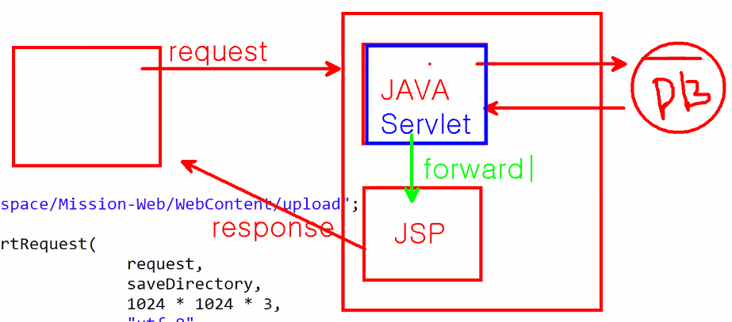
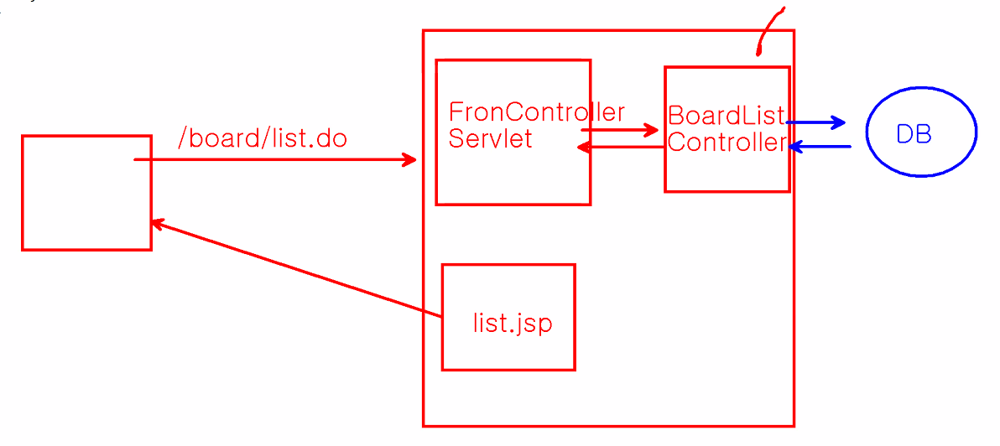
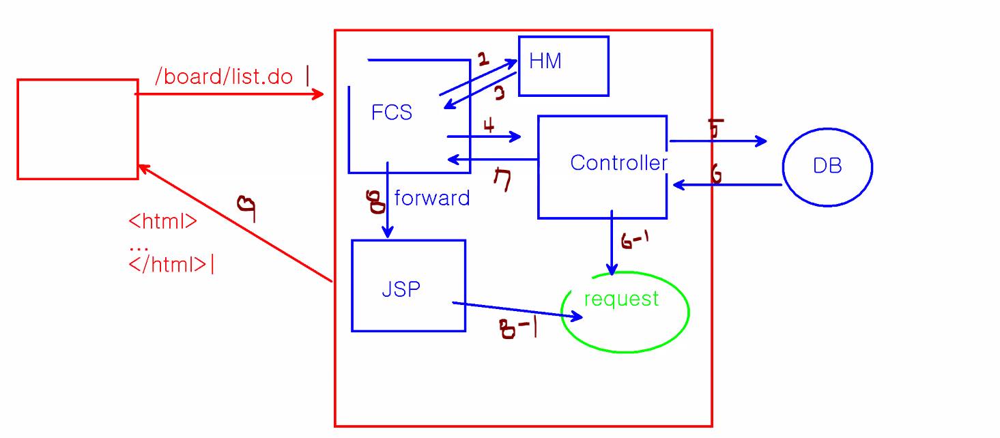

- **구성**

  - 요청은 서블릿이 받아서 db에 다녀오고 응답을 jsp에 넘겨주고 최종 클라이언트에게 jsp가 응답 해줌
  - 서블릿이 받아서 jsp에 넘겨주기 위해서 접근하려는 공유영역은 최소 request영역에 등록을 시켜놔야 한다. 
  - 요청은 서블릿이 받고 응답은 jsp 
  - 이러한 모델을 mvc 패턴이라고 한다. 

  

  - jvm이 class 파일로 변경하면 classes 폴더에 생성된다. 서블릿의 자바코드가 모두 classes에 들어있는데 web-inf는 보안폴더라서 서블릿코드를 직접적으로 처리할 수 없다. 그래서 이 서블릿 코드에 접근하기 위해서는 가상의 url이 필요하다.  


- **프로젝트 생성(다이나믹)**

  - web.xml
    - 모든 .do로 들어오는 것에 대한 가상의 url 설정

  ```xml
  <?xml version="1.0" encoding="UTF-8"?>
  <web-app xmlns:xsi="http://www.w3.org/2001/XMLSchema-instance" xmlns="http://xmlns.jcp.org/xml/ns/javaee" xsi:schemaLocation="http://xmlns.jcp.org/xml/ns/javaee http://xmlns.jcp.org/xml/ns/javaee/web-app_3_1.xsd" id="WebApp_ID" version="3.1">
    <display-name>Mission-Web-MVC01</display-name>
    
    <servlet>
    	<servlet-name>frontController</servlet-name>
    	<servlet-class>kr.ac.kopo.FrontControllerServlet</servlet-class>
    </servlet>
    <servlet-mapping>
    	<servlet-name>frontController</servlet-name>
    	<url-pattern>*.do</url-pattern>
    </servlet-mapping>
    
    <welcome-file-list>
      <welcome-file>index.html</welcome-file>
      <welcome-file>index.htm</welcome-file>
      <welcome-file>index.jsp</welcome-file>
      <welcome-file>default.html</welcome-file>
      <welcome-file>default.htm</welcome-file>
      <welcome-file>default.jsp</welcome-file>
    </welcome-file-list>
  </web-app>
  ```

  

  - FrontControllerServlet.java

  ```java
  package kr.ac.kopo;
  
  import java.io.IOException;
  
  import javax.servlet.ServletException;
  import javax.servlet.http.HttpServlet;
  import javax.servlet.http.HttpServletRequest;
  import javax.servlet.http.HttpServletResponse;
  
  public class FrontControllerServlet extends HttpServlet{
  	public void service(HttpServletRequest request, HttpServletResponse response) throws ServletException, IOException {
  		
  		String context = request.getContextPath(); // /Mission-Web-MVC01
  		//System.out.println("context : " + context);
  		
  		String uri = request.getRequestURI();
  		uri = uri.substring(context.length());
  
  		//System.out.println("요청 URI : " + uri);
  		
  		switch (uri) {
  		case "/index.do":
  			System.out.println("index 페이지");
  			break;
  		case "/board/writeForm.do":
  			System.out.println("게시판 글 등록 처리");
  			break;
  		case "/board/list.do":
  			System.out.println("게시판 목록 처리");
  			break;
  		default:
  			break;
  		}
  	}
  }
  ```

  - boardListController가 전체 게시글 조회 후에 list.jsp로 forward 

  

  - BoardListController.java
    - return 값은 forward된 주소이므로 /board/list.jsp

  ```java
  package kr.ac.kopo;
  
  import javax.servlet.http.HttpServletRequest;
  import javax.servlet.http.HttpServletResponse;
  
  public class BoardListController {
  	public String handleRequest(HttpServletRequest request, HttpServletResponse response) throws Exception {
  		
  		return "list.jsp";
  	}
  }
  
  ```

  - FrontControllerServlet.java
    - list로 들어왔을 때 

  ```java
  package kr.ac.kopo;
  
  import java.io.IOException;
  
  import javax.servlet.RequestDispatcher;
  import javax.servlet.ServletException;
  import javax.servlet.http.HttpServlet;
  import javax.servlet.http.HttpServletRequest;
  import javax.servlet.http.HttpServletResponse;
  
  public class FrontControllerServlet extends HttpServlet{
  	public void service(HttpServletRequest request, HttpServletResponse response) throws ServletException, IOException {
  		
  		String context = request.getContextPath(); // /Mission-Web-MVC01
  		//System.out.println("context : " + context);
  		
  		String uri = request.getRequestURI();
  		uri = uri.substring(context.length());
  		
  		//System.out.println("요청 URI : " + uri);
  		String callPage = "";
  		try {
  			switch (uri) {
  			case "/index.do":
  				System.out.println("index 페이지");
  				break;
  			case "/board/writeForm.do":
  				System.out.println("게시판 글 등록 처리");
  				break;
  			case "/board/list.do":
  				BoardListController list =  new BoardListController();
  				callPage = list.handleRequest(request, response);
  				
  				break;
  			default:
  				break;
  			}
  			
  			//서블릿에서 포워드 시키는 class가 dispatcher
  			RequestDispatcher dispatcher = request.getRequestDispatcher(callPage);
  			dispatcher.forward(request, response); //요청을 떠넘기기 위해서 요청과 응답을 함께 보내주는 것임
  		} catch(Exception e) {
  			e.printStackTrace();
  			throw new ServletException(e);
  			//예외처리를 다시 위의 ServletException에게 던져준다.
  		}
  	}
  }
  
  ```

  - WebContent 바로 밑에 board 폴더 생성한 후 list.jsp 생성

  - writeForm도 같은 방식으로 생성
  - index.jsp
    - 가상의 url로 작성해야 한다. 

  ```jsp
  <%@ page language="java" contentType="text/html; charset=UTF-8"
      pageEncoding="UTF-8"%>
  <!DOCTYPE html>
  <html>
  <head>
  <meta charset="UTF-8">
  <title>Insert title here</title>
  </head>
  <body>
  	<a href="/Mission-Web-MVC01/board/list.do">게시판</a> <br>
  	<a href="/Mission-Web-MVC01/board/writeForm.do">글등록</a> <br>
  </body>
  </html>
  ```

  - 컨트롤러 인터페이스 생성

  ```java
  package kr.ac.kopo.controller;
  
  import javax.servlet.http.HttpServletRequest;
  import javax.servlet.http.HttpServletResponse;
  
  public interface Controller {
  	String handleRequest(HttpServletRequest request, HttpServletResponse response) throws Exception;
  }
  
  ```

  - frontController 수정

  ```java
  package kr.ac.kopo;
  
  import java.io.IOException;
  
  import javax.servlet.RequestDispatcher;
  import javax.servlet.ServletException;
  import javax.servlet.http.HttpServlet;
  import javax.servlet.http.HttpServletRequest;
  import javax.servlet.http.HttpServletResponse;
  
  import kr.ac.kopo.controller.BoardListController;
  import kr.ac.kopo.controller.BoardWriteFormController;
  import kr.ac.kopo.controller.Controller;
  
  public class FrontControllerServlet extends HttpServlet{
  	public void service(HttpServletRequest request, HttpServletResponse response) throws ServletException, IOException {
  		
  		String context = request.getContextPath(); // /Mission-Web-MVC01
  		//System.out.println("context : " + context);
  		
  		String uri = request.getRequestURI();
  		uri = uri.substring(context.length());
  		
  		//System.out.println("요청 URI : " + uri);
  		String callPage = "";
  		Controller control = null;
  		try {
  			switch (uri) {
  			case "/board/writeForm.do":
  				control = new BoardWriteFormController();
  				break;
  			case "/board/list.do":
  				control =  new BoardListController();
  				break;
  			}
  			if(control != null) {
  				callPage = control.handleRequest(request, response);
  				//서블릿에서 포워드 시키는 class가 dispatcher
  				RequestDispatcher dispatcher = request.getRequestDispatcher(callPage);
  				
  				dispatcher.forward(request, response); //요청을 떠넘기기 위해서 요청과 응답을 함께 보내주는 것임
  			}
  			
  		} catch(Exception e) {
  			e.printStackTrace();
  			throw new ServletException(e);
  			//예외처리를 다시 위의 ServletException에게 던져준다.
  		}
  	}
  }
  ```

  - 핸들러
    - frontController에서 switch문의 대체

  ```java
  package kr.ac.kopo.controller;
  
  import java.util.HashMap;
  import java.util.Map;
  
  public class HandlerMapping {
  	
  	private Map<String, Controller> mappings ;
  	
  	public HandlerMapping () {
  		mappings = new HashMap<String, Controller>();
  		mappings.put("/board/writeForm.do", new BoardWriteFormController());
  		mappings.put("/board/list.do", new BoardListController());
  		
  	}
  	
  	public Controller getController(String uri) {
  		return  mappings.get(uri);
  	}
  }
  ```

  - FrontControllerServlet 수정

  ```java
  package kr.ac.kopo;
  
  import java.io.IOException;
  
  import javax.servlet.RequestDispatcher;
  import javax.servlet.ServletException;
  import javax.servlet.http.HttpServlet;
  import javax.servlet.http.HttpServletRequest;
  import javax.servlet.http.HttpServletResponse;
  
  import kr.ac.kopo.controller.BoardListController;
  import kr.ac.kopo.controller.BoardWriteFormController;
  import kr.ac.kopo.controller.Controller;
  import kr.ac.kopo.controller.HandlerMapping;
  
  public class FrontControllerServlet extends HttpServlet{
  	public void service(HttpServletRequest request, HttpServletResponse response) throws ServletException, IOException {
  		
  		String context = request.getContextPath(); // /Mission-Web-MVC01
  		//System.out.println("context : " + context);
  		
  		String uri = request.getRequestURI();
  		uri = uri.substring(context.length());
  		
  		//System.out.println("요청 URI : " + uri);
  		String callPage = "";
  		Controller control = null;
  		try {
  			HandlerMapping mappings = new HandlerMapping();
  			control = mappings.getController(uri);
  			if(control != null) {
  				callPage = control.handleRequest(request, response);
  				//서블릿에서 포워드 시키는 class가 dispatcher
  				RequestDispatcher dispatcher = request.getRequestDispatcher(callPage);
  				
  				dispatcher.forward(request, response); //요청을 떠넘기기 위해서 요청과 응답을 함께 보내주는 것임
  			}
  			
  		} catch(Exception e) {
  			e.printStackTrace();
  			throw new ServletException(e);
  			//예외처리를 다시 위의 ServletException에게 던져준다.
  		}
  	}
  }
  ```

  - 서비스 메소드는 요청이 들어올때마다 일을 처리하는(호출되는) 메소드이다. 그럼 클라이언트가 만명이면 만번 처리한다. 근데 핸들러매핑을 요청이 들어올때마다 만든다. 그럼 HandlerMapping을 가면서 계속 map 객체가 생성이 된다. 그래서 init 메소드에 map 객체를 만들어서 map객체는 한번만 불러주고 서비스 메소드에서는 만들어진 맵객체를 사용. 

  ```java
  package kr.ac.kopo;
  
  import java.io.IOException;
  
  import javax.servlet.RequestDispatcher;
  import javax.servlet.ServletConfig;
  import javax.servlet.ServletException;
  import javax.servlet.http.HttpServlet;
  import javax.servlet.http.HttpServletRequest;
  import javax.servlet.http.HttpServletResponse;
  
  import kr.ac.kopo.controller.BoardListController;
  import kr.ac.kopo.controller.BoardWriteFormController;
  import kr.ac.kopo.controller.Controller;
  import kr.ac.kopo.controller.HandlerMapping;
  
  public class FrontControllerServlet extends HttpServlet{
  	
  	private HandlerMapping mappings ;
  	
  	@Override
  	public void init(ServletConfig config) throws ServletException {
  		mappings = new HandlerMapping(); //초기화
  	}
  	
  	public void service(HttpServletRequest request, HttpServletResponse response) throws ServletException, IOException {
  		
  		String context = request.getContextPath(); // /Mission-Web-MVC01
  		//System.out.println("context : " + context);
  		
  		String uri = request.getRequestURI();
  		uri = uri.substring(context.length());
  		
  		//System.out.println("요청 URI : " + uri);
  		String callPage = "";
  		Controller control = null;
  		try {
  			
  			control = mappings.getController(uri);
  			if(control != null) {
  				callPage = control.handleRequest(request, response);
  				//서블릿에서 포워드 시키는 class가 dispatcher
  				RequestDispatcher dispatcher = request.getRequestDispatcher(callPage);
  				
  				dispatcher.forward(request, response); //요청을 떠넘기기 위해서 요청과 응답을 함께 보내주는 것임
  			}
  			
  		} catch(Exception e) {
  			e.printStackTrace();
  			throw new ServletException(e);
  			//예외처리를 다시 위의 ServletException에게 던져준다.
  		}
  	}
  }
  ```

  - 전체적인 흐름
    - 1 : list.do 의 요청이 들어옴
    - 2 : frontControllerServlet이 사용자의 요청을 받아서 HandlerMapping에게 요청에 맞는 controller를 달라고 요청함
    - 3 : 해당 컨트롤러를 FCS에 전달
    - 4 : 받은 컨트롤러 정보로 해당 컨트롤러로 이동
    - 6-1 : 필요하면 request 공유영역에 데이터를 저장
    - 8 : 서블릿이 화면구성하는 것은 최악임 그래서 jsp로 forward 해주는 것임
    - 8-1 : 공유영역 request에 저장된 데이터를 사용해야하면 request 영역에서 불러와서 화면을 구성한 뒤 화면을 전달한다. 

  

  