## Ajax

- **ajax(Asynchronous JavaScript and XML)**

  - 비동기 방식의 자바스크립트 XML
  - 직관적이고 자연스러운 사용자 상호액션 방식
    - 기존 클릭이 필요하지 않음
  - 화면 일부분의 변경
    - 기존 : 서버 요청, 대기, 전체화면 새로고침
    - AJAX : 업데이트가 필요한 부분만 변경

  - 흐름
    - 동기식 : 요청을 해서 응답을 할 때 까지 클라이언트는 대기 상태
    - 비동기식
      - 클라이언트가 요청을 하려고 하면 ajax 엔진이 요청 정보를 가로채서 백그라운드로 서버에게 요청을 한다. 실제 클라이언트가 요청 응답을 하면 동기식으로 서버에서 응답이 올 때까지 대기를 해야하는데 ajax가 응답을 채가서 클라이언트는 다른 작업을 계속할 수 있음
      - ajax가 서버에 보낸 요청이 응답되면 화면의 내용을 수정하는 방식

  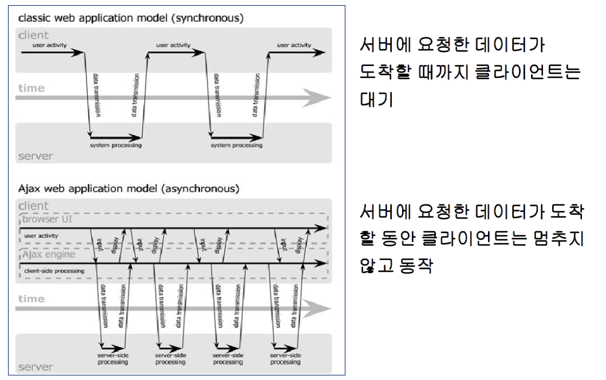

  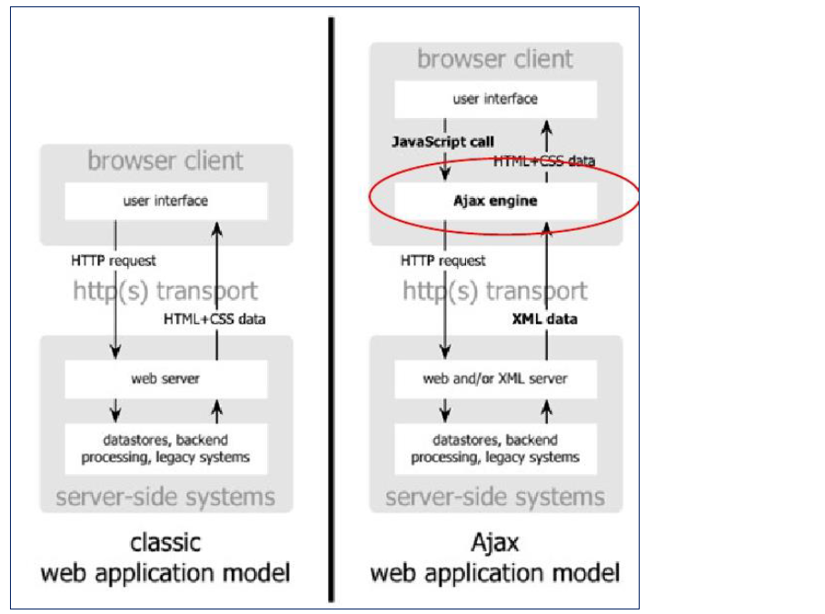

  

- **Ajax 구성요소**

  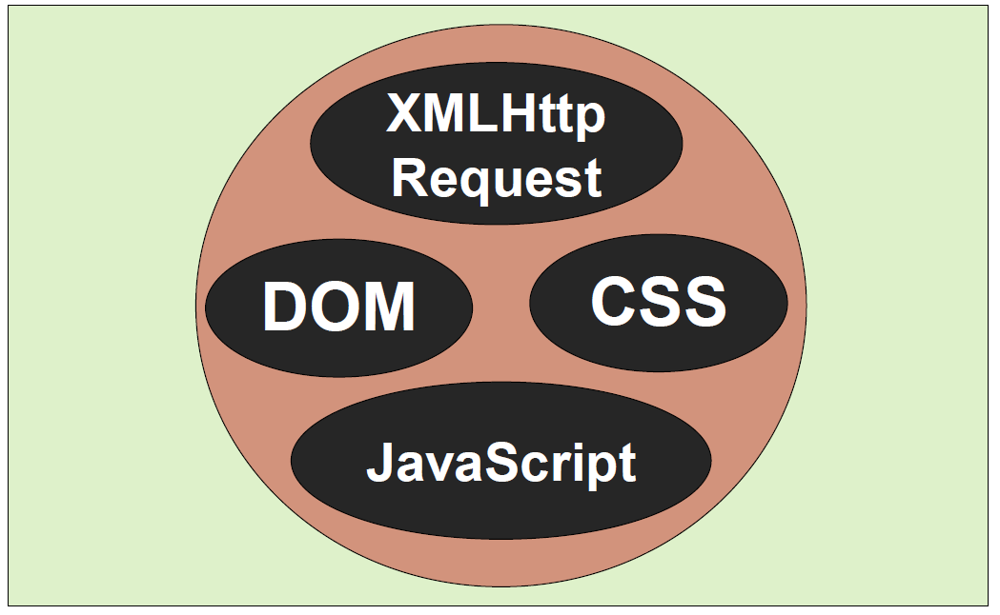

  - XMLHttpRequest
    - 동기식으로 움직일 수도 있고 비동기식으로 움직일 수 있음 
    - 자바스크립트 객체
    - 대부분의 부라우저에서 지원
      - Firefox, Opera, Safari, Mozilla
    - 표준 HTTP 방식(GET/POST)으로 서버와 통신
    - 기본적으로 서버와 통신의 비동기적으로 작업
      - 백그라운드에서 작업


- **Server Processing**

  - 기존 서버 작업 방식 사용
    - Servlet, JSP, ...
  - 응답 문서 타입 
    - 기존 html 외에 **xml, json**, 단순 텍스트 사용

  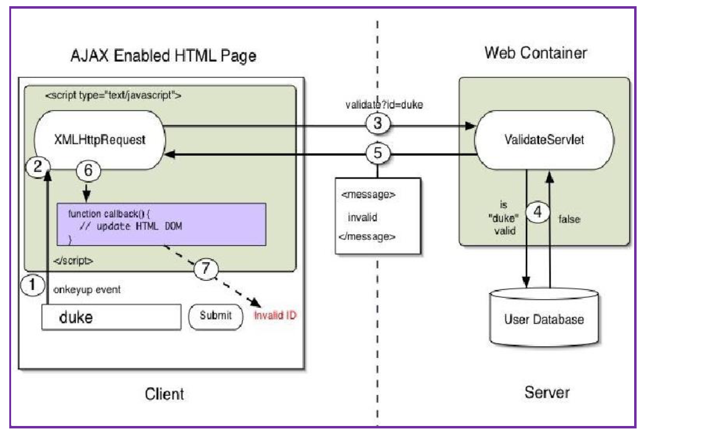


- **Ajax 프로그래밍 순서**

  - 클라이언트 이벤트 발생

    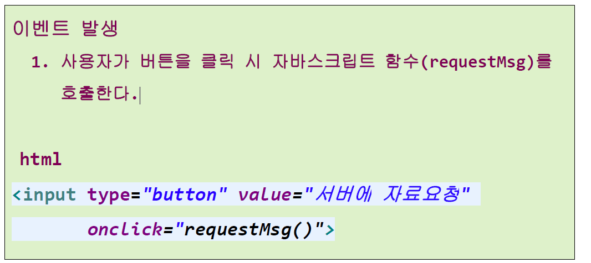

  - XMLHttpRequest 객체 생성

    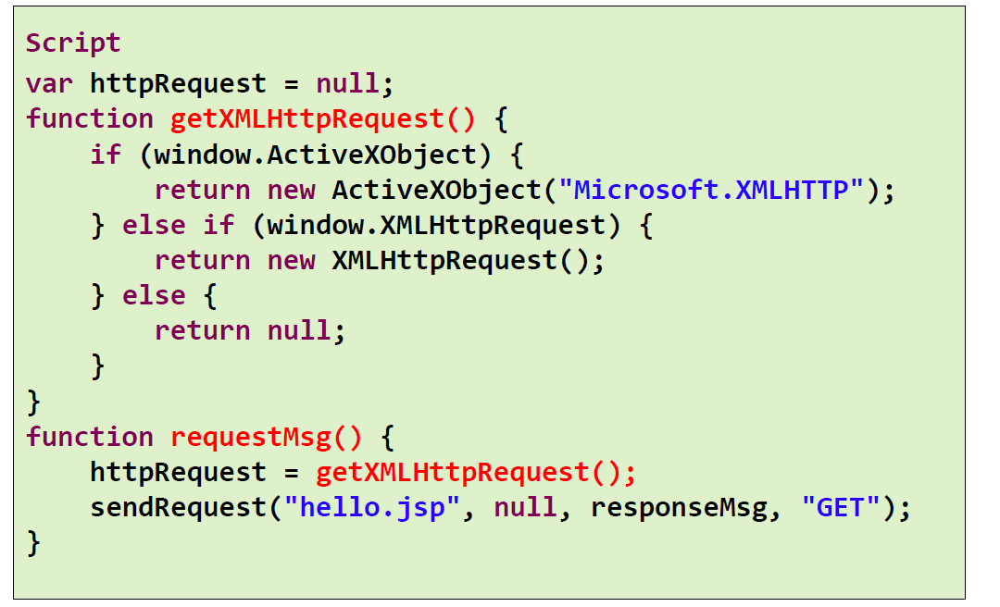

  - XMLHttpRequest 객체 콜백함수 설정

    - 서버의 상태가 바뀔 때마다 호출되는 함수
      - httpRequest.onreadystatechange = callback;

    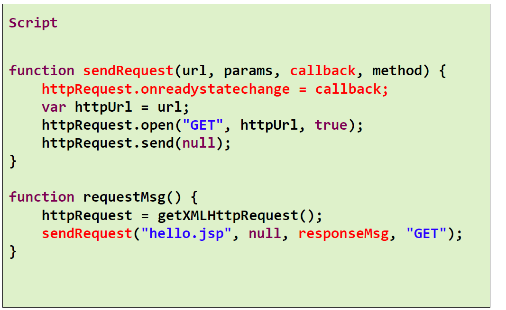

  - XMLHttpRequest 객체를 통한 비동기화 요청

    - open : 비동기 통신 설정
    - send : 실제 요청

    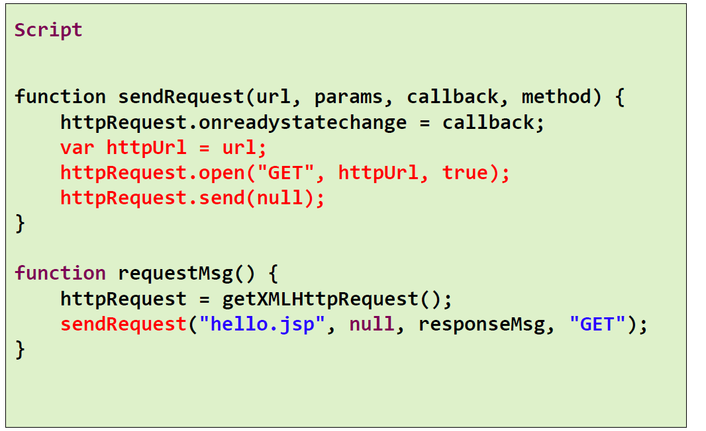

  - 서버 응답결과를 생성하여 클라이언트로 전송

    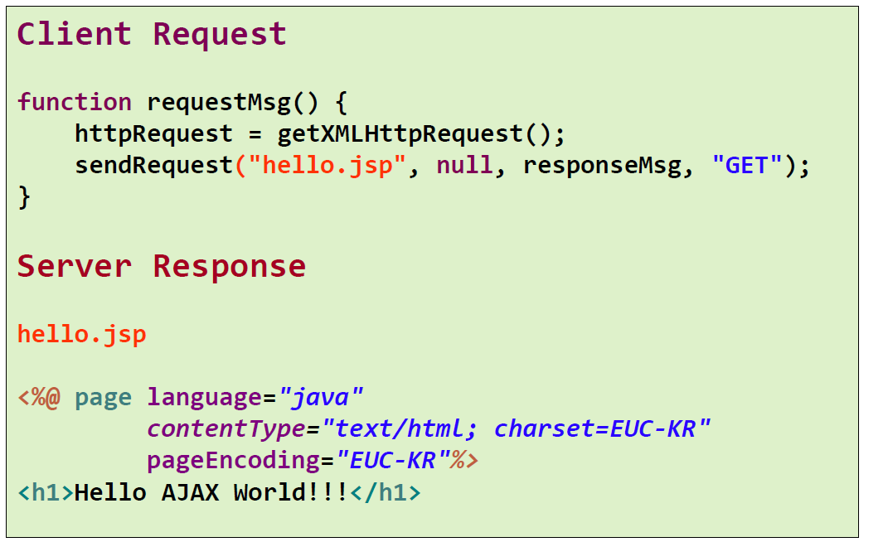

  - XMLHttpRequest 객체는 서버 결과를 처리할 콜백함수 호출

    - 콜백함수가 결과를 처리

    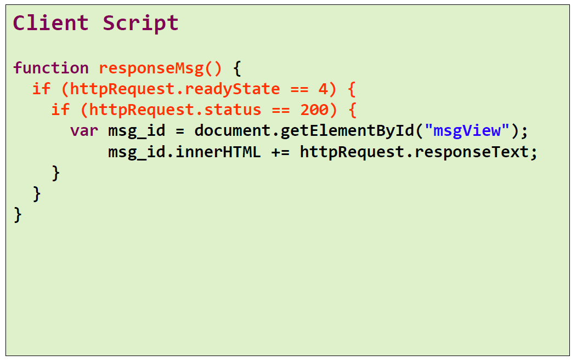

  - 결과를 클라이언트 화면에 반영

    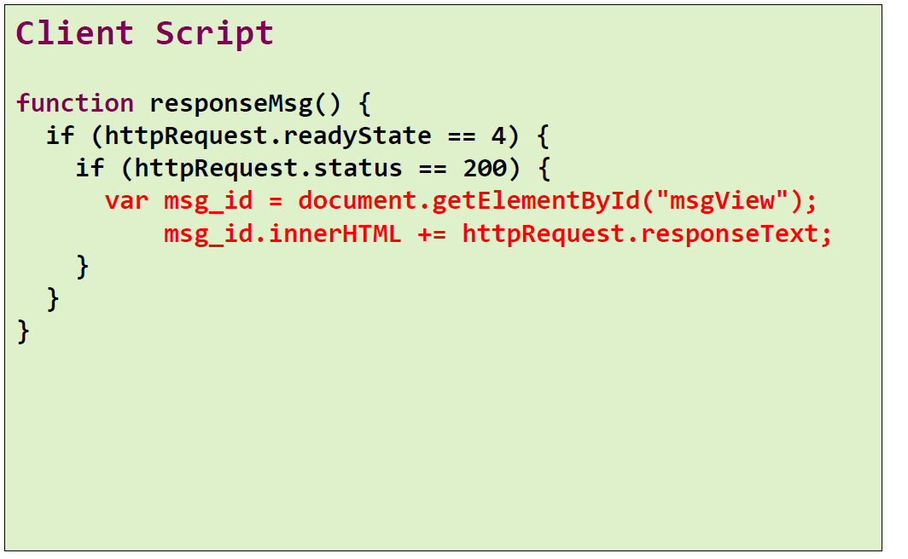


- XMLHttpRequest XMLHttpRequest Methods
  - open (“HTTP method”,method”,“ syn asyn)
    - 요청의 초기화 작업
    - get/post 지정
    - 서버 URL 지정
    - 동기 / 비동기 설정
  - send (content)
    - GET 방식은 URL 에 필요정보 추가 하기 때문에 null
      적용
    - POST 방식에서 파라미터 설정 처리
  - onreadystatechange
    - 서버에서 응답이 도착했을 때 호출될 콜백함수 지정
    - 콜백함수는 상태 readyState 가 변경될 때 마다 호출
  - readyState : 요청의 현재 상태
    - 0 : uninitialized ( 객체 생성 후 open 메서드 호출 전
    - 1 : loading (open 메서드가 호출되고 send 호출 전
    - 2 : loaded (send 메서드가 호출되었지만 서버응답 전
    - 3 : interactive ( 데이터의 일부가 전송된 상태
    - 4 : completed ( 모든 데이터 전송 완료
  - status
    - 서버 처리 결과 상태 코드
    - 200 : OK 요청 성공
    - 404 : Not Found ( 페이지를 못찾을 경우
    - 500 : Server Error ( 서버에서 결과 생성 시 오류 발생 )
  - responseText
    - 서버의 응답결과를 문자열로 받기
  - responseXML
    - 서버의 응답결과를 XML Document 로 받기


- 실습

  - ajaxTest.jsp

  ```jsp
  <%@ page language="java" contentType="text/html; charset=UTF-8"
      pageEncoding="UTF-8"%>
  <!DOCTYPE html>
  <html>
  <head>
  <meta charset="UTF-8">
  <title>Insert title here</title>
  <style type="text/css">
  #msgView {
  	border: 1px solid red;
  	height: 200px;
  	width: 500px;
  }
  </style>
  <script type="text/javascript">
  
  	let httpRequest = null
  	
  	function requestMsg() {
  		//1단계 : XMLHttpRequest 객체 생성
  		
  		if(window.XMLHttpRequest)
  			httpRequest = new XMLHttpRequest()
  		else if(window.ActiveXObject)		
  			httpRequest = new ActiveXObject("Microsoft.XMLHTTP")
  		else
  			httpRequest = null;
  	
  		//2단계 : callback 함수 설정
  		httpRequest.onreadystatechange = responseMsg
  		
  		//3단계 : 서버에 비동기 요청
  		httpRequest.open('GET', 'hello.jsp', true) //비동기 방식이라서 true
  		httpRequest.send(null)
  	}
  	
  	function responseMsg() {
  		
  	}
  </script>
  </head>
  <body>
  	<h2>서버에서 받은 메시지</h2>
  	<div id="msgView"></div>
  	<input type="button" value="서버에서 자료요청" onclick="requestMsg()">
  	
  </body>
  </html>
  ```

  - hello.jsp

  ```jsp
  <%@ page language="java" contentType="text/html; charset=UTF-8"
      pageEncoding="UTF-8"%>
  <h1>Hello Ajax!!</h1>
  ```

  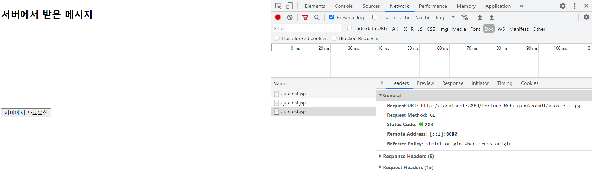

  - ajaxTest.jsp

  ```jsp
  <%@ page language="java" contentType="text/html; charset=UTF-8"
      pageEncoding="UTF-8"%>
  <!DOCTYPE html>
  <html>
  <head>
  <meta charset="UTF-8">
  <title>Insert title here</title>
  
  <style>
     #msgView{
        border:1px solid red;
        height:200px;
        width: 500px;
        margin-bottom:20px;
     }
  </style>
  
  <script>
  
     let httpRequest = null
     
     function requestMsg(){
        // 1단계 : XMLHttpRequest객체 생성
        if(window.XMLHttpRequest)
           httpRequest = new XMLHttpRequest()
        else if(window.ActiveXObject)
           // explore버전때문에 해주는거임. 최소한의 안전장치
           httpRequest = new ActiveXObject("Microsoft.XMLHTTP")
        else
           httpRequest = null
     
        // 2단계 : Callback함수 설정( 서버요청이 바뀔때마다 호출되는 함수 )
        /*
           httpRequest.onreadystatechage = function(){
           
           }아래와 같은 뜻
        */
        httpRequest.onreadystatechange = responseMsg
        
        // 3단계 : 서버에 비동기 요청
        httpRequest.open('GET', 'hello.jsp',true) // 비동기방식 true
        httpRequest.send(null)
        
        
        
     }
     
     
     function responseMsg(){
        if(httpRequest.readyState == 4){
           // 모든 데이터 전송완료(응답완료 4) 했고 결과가 올바르다면(200) responseText한다.
           if(httpRequest.status == 200){
              
              let msgView = document.getElementById("msgView");
              msgView.innerHTML = httpRequest.responseText // +=는 계속 추가됨
              
           }
           
        }
        
     }
     
  </script>
  </head>
  <body>
     <h2>서버에서 받은 메시지</h2>
     <div id="msgView">
        
     </div>
     <input type="button" value="서버에서 자료 요청" onclick="requestMsg()">
  
  </body>
  </html>
  ```

  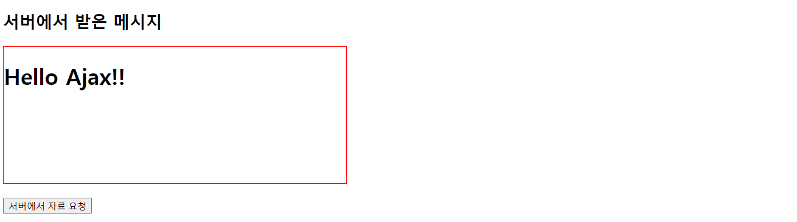


- 실습

  - servlet 파일 생성

  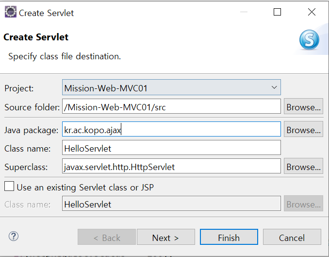

  - /ajax/hello 가상의 url

  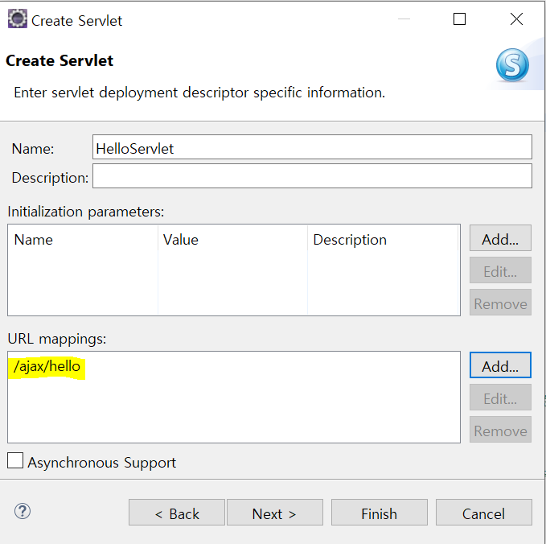

  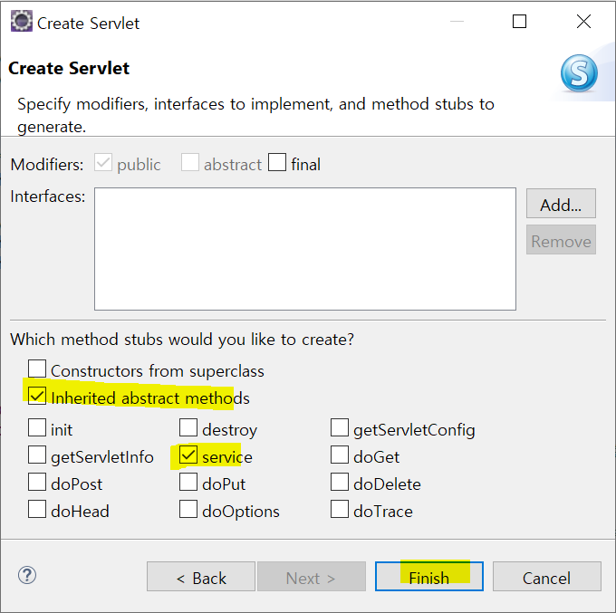

  - ajaxTest02.jsp

  ```jsp
  <%@ page language="java" contentType="text/html; charset=UTF-8"
      pageEncoding="UTF-8"%>
  <!DOCTYPE html>
  <html>
  <head>
  <meta charset="UTF-8">
  <title>Insert title here</title>
  
  <style>
     #msgView{
        border:1px solid red;
        height:200px;
        width: 500px;
        margin-bottom:20px;
     }
  </style>
  
  <script>
  
     let httpRequest = null
     
     function requestMsg(){
        // 1단계 : XMLHttpRequest객체 생성
        if(window.XMLHttpRequest)
           httpRequest = new XMLHttpRequest()
        else if(window.ActiveXObject)
           // explore버전때문에 해주는거임. 최소한의 안전장치
           httpRequest = new ActiveXObject("Microsoft.XMLHTTP")
        else
           httpRequest = null
     
        // 2단계 : Callback함수 설정( 서버요청이 바뀔때마다 호출되는 함수 )
        /*
           httpRequest.onreadystatechage = function(){
           
           }아래와 같은 뜻
        */
        httpRequest.onreadystatechange = responseMsg
        
        // 3단계 : 서버에 비동기 요청
        httpRequest.open('GET', '<%=request.getContextPath()%>/ajax/hello',true) // 비동기방식 true
        httpRequest.send(null)
        
        
        
     }
     
     
     function responseMsg(){
        if(httpRequest.readyState == 4){
           // 모든 데이터 전송완료(응답완료 4) 했고 결과가 올바르다면(200) responseText한다.
           if(httpRequest.status == 200){
              
              let msgView = document.getElementById("msgView");
              msgView.innerHTML = httpRequest.responseText // +=는 계속 추가됨
              
              
           }
           
        }
        
     }
     
  </script>
  
  </head>
  <body>
     <h2>서버에서 받은 메시지</h2>
     <div id="msgView">
        
     </div>
     <input type="button" value="서버에서 자료 요청" onclick="requestMsg()">
  
  </body>
  </html>
  ```

  - HelloServlet

  ```java
  package kr.ac.kopo.ajax;
  
  import java.io.IOException;
  import java.io.PrintWriter;
  
  import javax.servlet.ServletException;
  import javax.servlet.annotation.WebServlet;
  import javax.servlet.http.HttpServlet;
  import javax.servlet.http.HttpServletRequest;
  import javax.servlet.http.HttpServletResponse;
  
  /**
   * Servlet implementation class HelloServlet
   */
  @WebServlet("/ajax/hello")
  public class HelloServlet extends HttpServlet {
  	private static final long serialVersionUID = 1L;
  
  	/**
  	 * @see HttpServlet#service(HttpServletRequest request, HttpServletResponse response)
  	 */
  	protected void service(HttpServletRequest request, HttpServletResponse response) throws ServletException, IOException {
  		response.setContentType("text/html; charset=utf-8");
  		PrintWriter out = response.getWriter();
  		out.write("<h1>hello Ajax !!!</h1>");
  		out.close();
  	}
  
  }
  ```

  

- 파라미터 넘기는 방법

  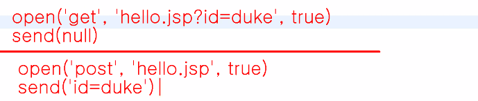


- 실습

  - paramTest.jsp

  ```jsp
  <%@ page language="java" contentType="text/html; charset=UTF-8"
      pageEncoding="UTF-8"%>
  <!DOCTYPE html>
  <html>
  <head>
  <meta charset="UTF-8">
  <title>Insert title here</title>
  <script>
  
     let httpRequest = null
  
     function getXMLHttpRequest(){
        
        let httpRequest=null
        
        if(window.XMLHttpRequest)
           httpRequest = new XMLHttpRequest()
        else if(window.ActiveXObject)
           // explore버전때문에 해주는거임. 최소한의 안전장치
           httpRequest = new ActiveXObject("Microsoft.XMLHTTP")
        
        return httpRequest
     }
     
     
     function sendProcess(param){
        
        httpRequest = getXMLHttpRequest()
        httpRequest.onreadystatechange = callbackFunction
        
        let msg="==================================================\n";
        msg += "/Lecture-Web/eaxm02/param.jsp?name=" + param + "\n";
        debugTrace(msg)
        
        let url = "param.jsp?name=" + param
        httpRequest.open('GET', url, true)
        httpRequest.send(null)
        
     }
     
     function callbackFunction(){
        
        let msg =''
        
        switch(httpRequest.readyState){
        case 1:
           msg += 'Loading...\n'
           break
        case 2:
           msg += 'Loaded...\n'
           break
        case 3:
           msg += 'Interaction...\n'
           break
        case 4:
           msg += 'Completed...\n'
           
           if(httpRequest.status == 200){
              msg += '웹서버에서 정상적으로 수행...\n'
              msg += '실행결과 : ' + httpRequest.responseText + '\n'
           }else{
              msg += '웹서버에서 오류 발생...\n'
              msg += '오류코드 : ' + httpRequest.status + '\n'
           }
           msg += '==================================================\n'
           break
        }
        
        debugTrace(msg)
        
        
     }
     
     function debugTrace(msg){
        let degug = document.getElementById("debug")
        debug.value += msg
     }
     
     
     
  </script>
  </head>
  <body>
  	<textarea rows="10" cols="80" id="debug"></textarea> <br>
  	<button onclick="sendProcess('sejin Cho')">영문인자호출</button>
  	<button onclick="">한글인자호출</button>
  </body>
  </html>
  ```

  - param.jsp

  ```jsp
  <%@ page language="java" contentType="text/html; charset=UTF-8"
      pageEncoding="UTF-8"%>
  name=${param.name}
  ```

  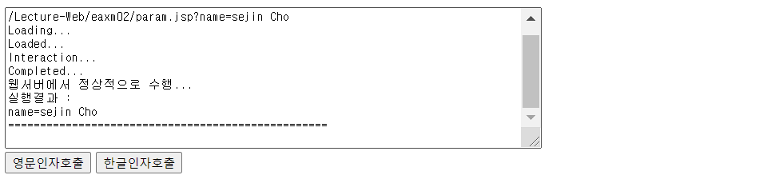

  - 한글인자호출 버튼을 눌렀을 때는 크롬에서는 잘 뜨지만 익스플로어에서는 400에러 발생
  - paramTest.jsp에 다음 코드 추가

  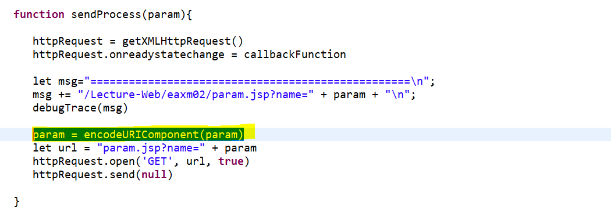

  ```javascript
  param = encodeURIComponent(param)
  ```

  

