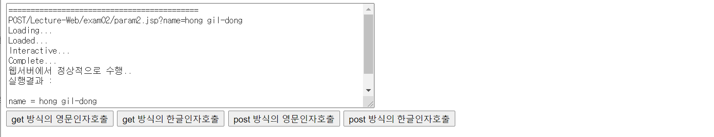
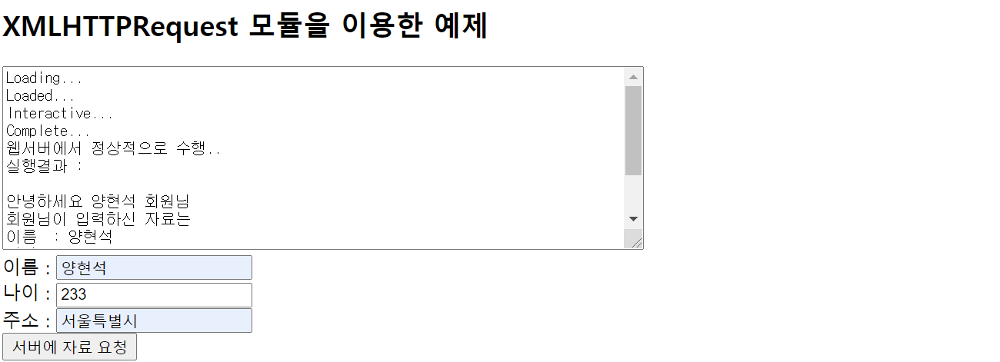

## Ajax

- 실습(post 방식으로 전송)

  - paramTest02.jsp

  ```jsp
  <%@ page language="java" contentType="text/html; charset=EUC-KR"
      pageEncoding="EUC-KR"%>
  <!DOCTYPE html>
  <html>
  <head>
  <meta charset="EUC-KR">
  <title>Insert title here</title>
  <script>
     let httpRequest = null
     
     function getXMLHttpRequest() {
        let httpRequest = null;
        if(window.XMLHttpRequest)
           httpRequest = new XMLHttpRequest()
        else if(window.ActiveXObject)
           httpRequest = new ActiveXObject("Microsoft.XMLHTTP")
  
        return httpRequest
     }
  
     function sendProcess(method, param) {
        
        httpRequest = getXMLHttpRequest()
        
        // 2단계
        httpRequest.onreadystatechange = callbackFunction
        
        let msg = "===========================================\n";
        msg += method + "/Lecture-Web/exam02/param2.jsp?name=" + param + "\n"
        debugTrace(msg)
        
        let url = 'param2.jsp'
        param = encodeURIComponent(param)
        let args = 'name=' + param
        
        if(method == 'GET') {
           httpRequest.open(method, url + '?' + args, true)
           
           httpRequest.send(null)
        } else if(method == 'POST') { 
      	  httpRequest.open(method, url + '?' + args, true)
      	  httpRequest.setRequestHeader('Content-type','application/x-www-form-urlencoded') 
      	  //post는 form태그에서만 사용할 수 있어서 설정을 해줘야 한다.
            httpRequest.send(args)
        }
        
  /*       param = encodeURIComponent(param)
        let url = "param.jsp?name=" + param
        httpRequest.open('GET', url, true)
        httpRequest.send(null) */
        
     }
     
     function callbackFunction() {
        
        let msg = ''
        switch(httpRequest.readyState) {
        case 1 :
           msg += 'Loading...\n'
           break
        case 2 :
           msg += 'Loaded...\n'
           break
        case 3 :
           msg += 'Interactive...\n'
           break
        case 4 :
           msg += 'Complete...\n'
           if(httpRequest.status == 200) {
              msg += '웹서버에서 정상적으로 수행..\n'   
              msg += '실행결과 : ' + httpRequest.responseText + '\n'
           } else {
              msg += '웹서버에서 오류발생..\n'
              msg += '오류코드 : ' + httpRequest.status + '\n'
           }
           msg += "===================================================================\n"
           break
        }
        debugTrace(msg)
     }
     
     function debugTrace(msg) {
        document.getElementById("debug")
        debug.value += msg
     }
     
  </script>
  </head>
  <body>
     <form action="" method="get" enctype="application/x-www-form-urlencoded">
     </form>
     <textarea rows="10" cols="80" id="debug"></textarea><br>
     <button onclick="sendProcess('GET', 'hong gil-dong')">get 방식의 영문인자호출</button>
     <button onclick="sendProcess('GET', '홍길동')">get 방식의 한글인자호출</button>
     <button onclick="sendProcess('POST', 'hong gil-dong')">post 방식의 영문인자호출</button>
     <button onclick="sendProcess('POST', '홍길동')">post 방식의 한글인자호출</button>
  </body>
  </html>
  ```

  - param2

  ```
  <%@ page language="java" contentType="text/html; charset=UTF-8"
      pageEncoding="UTF-8"%>
  <%
  	if(request.getMethod().equalsIgnoreCase("POST")) 
  		request.setCharacterEncoding("utf-8");
  %>
  name = ${ param.name }
  ```

  


- 실습

  - httpRequest.js

  ```javascript
  /*
  	Ajax통신과 관련된 함수의 집합
  */
  
  let httpRequest = null
  
  function getXMLHttpRequest() {
      let httpRequest = null;
      if(window.XMLHttpRequest)
         httpRequest = new XMLHttpRequest()
      else if(window.ActiveXObject)
         httpRequest = new ActiveXObject("Microsoft.XMLHTTP")
  
      return httpRequest
   }
  
  function sendProcess(method, url, params, callback) {
  	httpRequest = getXMLHttpRequest()
  	httpRequest.onreadystatechange = callback
  	
  	let httpMethod = method
  	if(httpMethod != 'GET' && httpMethod != 'POST'){
  		httpMethod = 'GET'
  	}
  	let httpParams = ''
  	
  		
  	if(typeof(params) == 'String') {
  		if(params != '' && params != null) {
  			paramArr = params.split('&')
  			for(let param of paramArr) {
  				pdata = param.split('=')
  				if(httpParams != '')
  					httpParams += '&'
  				httpParams += pdata[0] + '=' + encodeURIComponent(pdata[1])
  			}
  		}
  	} else { // {name : name, age : age, addr : addr}
  		for(let key in params) {
  			if(httpParams != '') {
  				httpParams += '&'
  			}
  			httpParams += key + '=' + encodeURIComponent(params[key])
  		}
  	}
  	
  	
  	/* name=홍길동&age=24
  	
  	
  	
  	*/
  	let httpUrl = url
  	
  	if(httpMethod == 'GET' && httpParams != '')
  		httpUrl = url + '?' + httpParams
  	
  		
  		
  	httpRequest.open(httpMethod, httpUrl, true)
  	if(httpMethod == 'GET')
  		httpRequest.send(null)
  	else if(httpMethod =='POST') {
  		httpRequest.setRequestHeader('Content-type', 'application/x-www-form-urlencoded')
  		httpRequest.sned(httpParams)
  	}
  }
  ```

  - module.jsp

  ```jsp
  <%@ page language="java" contentType="text/html; charset=UTF-8"
      pageEncoding="UTF-8"%>
  <!DOCTYPE html>
  <html>
  <head>
  <meta charset="UTF-8">
  <title>Insert title here</title>
  <script src="httpRequest.js"></script>
  
  <script type="text/javascript">
  	function clickBtn() {
  		let name = document.inputForm.name.value
  		let age = document.inputForm.age.value
  		let addr = document.inputForm.addr.value
  		
  		
  		//비동기 통신 
  		//방법1
  		//let params = 'name=' + name + '&age=' + age + '&addr=' + addr
  		//sendProcess('GET', 'sample.jsp', params, callback)
  		
  		//방법2
  		let params = {name : name, age : age, addr : addr}
  		sendProcess('GET', 'sample.jsp', params, callback)
  		
  	}
  	
  	function callback() {
  		let msg = ''
        switch(httpRequest.readyState) {
        case 1 :
           msg += 'Loading...\n'
           break
        case 2 :
           msg += 'Loaded...\n'
           break
        case 3 :
           msg += 'Interactive...\n'
           break
        case 4 :
           msg += 'Complete...\n'
           if(httpRequest.status == 200) {
              msg += '웹서버에서 정상적으로 수행..\n'   
              msg += '실행결과 : ' + httpRequest.responseText + '\n'
           } else {
              msg += '웹서버에서 오류발생..\n'
              msg += '오류코드 : ' + httpRequest.status + '\n'
           }
           msg += "===================================================================\n"
           break
        }
        debugTrace(msg)
  	}
  	function debugTrace(msg) {
        document.getElementById("debug")
        debug.value += msg
     }
  	   
  </script>
  </head>
  <body>
  	<h2>XMLHTTPRequest 모듈을 이용한 예제</h2>
  	<form name="inputForm">
  		<textarea rows="10" cols="80" id="debug"></textarea> <br>
  		이름 : <input type="text" name="name"> <br>
  		나이 : <input type="text" name="age" > <br>
  		주소 : <input type="text" name="addr"> <br>
  		<button type="button" onclick="clickBtn()">서버에 자료 요청</button>
  	</form>
  </body>
  </html>
  ```

  - sample.jsp

  ```jsp
  <%@ page language="java" contentType="text/html; charset=UTF-8"
      pageEncoding="UTF-8"%>
  <%
  	if(request.getMethod().equals("POST")) {
  		request.setCharacterEncoding("utf-8");
  	}
  %>
  안녕하세요 ${ param.name } 회원님 
  회원님이 입력하신 자료는
  이름  : ${ param.name } 
  나이 : ${ param.age }
  주소 : ${ param.addr }
  ```

  


- **json으로 데이터 추출**

  - sample.jsp

  ```jsp
  <%@ page language="java" contentType="text/html; charset=UTF-8"
      pageEncoding="UTF-8"%>
  <%
  	if(request.getMethod().equals("POST")) {
  		request.setCharacterEncoding("utf-8");
  	}
  %>
  [
  	{
  		id : 'hong',
  		name : '홍길동'
  	},
  	{
  		id : 'park',
  		name : '박길동'
  	},
  	{
  		id : 'kang',
  		name : '강길동'
  	}
  
  ]
  ```

  - module.jsp

  ```jsp
  <%@ page language="java" contentType="text/html; charset=UTF-8"
      pageEncoding="UTF-8"%>
  <!DOCTYPE html>
  <html>
  <head>
  <meta charset="UTF-8">
  <title>Insert title here</title>
  <script src="httpRequest.js"></script>
  
  <script type="text/javascript">
  	function clickBtn() {
  		
  		sendProcess('GET', 'sample.jsp',null,callback)
  	}
  	
  	function callback() {
  		let msg = ''
  		if(httpRequest.readyState == 4) {
  			if(httpRequest.status == 200) {
  				let data = httpRequest.responseText
  				//let memberList = JSON.parse(data)
  				let memberList = eval(data)
  				msg += '회원수 : ' + memberList.length + '명\n'
  				
  				for(let i = 0; i<memberList.length ; ++i) {
  					let mem = memberList[i]
  					let id = mem.id
  					let name = mem.name
  					msg += id + '(' + name + ')\n' 
  				}
  				
  				debugTrace(msg)
  			}
  		}
        
  	}
  	
  	function debugTrace(msg) {
        document.getElementById("debug")
        debug.value += msg
     }
  	   
  </script>
  </head>
  <body>
  	<h2>XMLHTTPRequest 모듈을 이용한 예제</h2>
  	<form name="inputForm">
  		<textarea rows="10" cols="80" id="debug"></textarea> <br>
  		<button type="button" onclick="clickBtn()">서버에 자료 요청</button>
  	</form>
  </body>
  </html>
  ```

  

- **xml 형식 데이터 가져오기**

  - sample.xml

  ```xml
  <?xml version="1.0" encoding="UTF-8"?>
  <members>
  	<member>
  		<id>hone</id>
  		<name>홍길동</name>
  	</member>
  	<member>
  		<id>park</id>
  		<name>박길동</name>
  	</member>
  	<member>
  		<id>cho</id>
  		<name>조길동</name>
  	</member>
  </members>
  ```

  - module.jsp

  ```jsp
  <%@ page language="java" contentType="text/html; charset=UTF-8"
      pageEncoding="UTF-8"%>
  <!DOCTYPE html>
  <html>
  <head>
  <meta charset="UTF-8">
  <title>Insert title here</title>
  <script src="httpRequest.js"></script>
  <script src="<%=request.getContextPath() %>/resources/js/jquery-3.6.0.min.js"></script>
  <script type="text/javascript">
  	function clickBtn() {
  		
  		sendProcess('GET', 'sample.xml',null,callback)
  	}
  	
  	function callback() {
  		let msg = ''
  		if(httpRequest.readyState == 4) {
  			if(httpRequest.status == 200) {
  				let xmlDoc = httpRequest.responseXML
  				let memberList = xmlDoc.getElementsByTagName("member")
  				msg += '회원수 : ' + memberList.length + '명\n'
  				for(let i = 0; i<memberList.length; i++) {
  					let mem = memberList[i]
  					let id = mem.getElementsByTagName('id')[0].innerHTML
  					let name = mem.getElementsByTagName('name')[0].firstChild.nodeValue
  					
  					msg += id + '(' + name + ')\n'
  					
  				}
  				debugTrace(msg)
  			}
  		}
        
  	}
  	
  	function debugTrace(msg) {
        document.getElementById("debug")
        debug.value += msg
     }
  	   
  </script>
  </head>
  <body>
  	<h2>XMLHTTPRequest 모듈을 이용한 예제</h2>
  	<form name="inputForm">
  		<textarea rows="10" cols="80" id="debug"></textarea> <br>
  		<button type="button" onclick="clickBtn()">서버에 자료 요청</button>
  	</form>
  </body>
  </html>
  ```

  - module-jquery.jsp

  ```jsp
  <%@ page language="java" contentType="text/html; charset=UTF-8"
      pageEncoding="UTF-8"%>
  <!DOCTYPE html>
  <html>
  <head>
  <meta charset="UTF-8">
  <title>Insert title here</title>
  <script src="httpRequest.js"></script>
  <script src="<%=request.getContextPath() %>/resources/js/jquery-3.6.0.min.js"></script>
  <script type="text/javascript">
  	function clickBtn() {
  		
  		sendProcess('GET', 'sample.xml',null,callback)
  	}
  	
  	function callback() {
  		let msg = ''
  		if(httpRequest.readyState == 4) {
  			if(httpRequest.status == 200) {
  				let xmlDoc = httpRequest.responseXML
  				let memberList = $(xmlDoc).find("member")
  				msg += '회원수 : ' + memberList.length + '명\n'
  
  				
  				memberList.each(function(){
  					let id = $(this).find('id').text()
  					let name = $(this).find('name').text()
  					msg += id + '(' + name + ')\n'
  				})
  				
  				debugTrace(msg)
  			}
  		}
        
  	}
  	
  	function debugTrace(msg) {
        document.getElementById("debug")
        debug.value += msg
     }
  	   
  </script>
  </head>
  <body>
  	<h2>XMLHTTPRequest 모듈을 이용한 예제</h2>
  	<form name="inputForm">
  		<textarea rows="10" cols="80" id="debug"></textarea> <br>
  		<button type="button" onclick="clickBtn()">서버에 자료 요청</button>
  	</form>
  </body>
  </html>
  ```

  