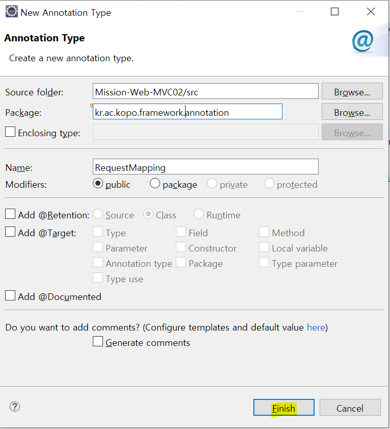

- **Dynamic web project 생성**

  - scr에서 servlet 생성

  

  

  - *.do로 끝나면 service 메소드로 들어감

  

  

  - init과 service 생성

  

  

  - DispatcherServlet.java
    - board라는 컨트롤러에 board에서 수행되는 controller를 모두 넣어둠 
      - 원래는 다 따로따로 두었음 그래서 어떤 요청이 들어왔을 때 어떤 응답을 줄지 찾기 위해서 어노테이션을 사용해서 requestMapping을 만들어줘야함

  ```java
  package kr.ac.kopo.board.controller;
  
  import javax.servlet.http.HttpServletRequest;
  import javax.servlet.http.HttpServletResponse;
  
  
  public class BoardController {
  	
  	
  	public String list(HttpServletRequest request, HttpServletResponse response) throws Exception {
  		return "/board/detail.jsp";
  	}
  	
  	public String detail(HttpServletRequest request, HttpServletResponse response) throws Exception {
  		return "/board/detail.jsp";
  	}
  
  }
  
  ```

  

  - RequestMapping annotation
    - target의 ElementType.METHOD는 메소드에 이 어노테이션을 붙이겠다는 의미 
      - ElementType.TYPE이면 Class에 붙이겠다는 의미 
    - @Retention : 언제까지 얘를 유지시킬지
      - @Retention(RetentionPolicy.RUNTIME) : 어노테이션의 정보를 프로그램이 실행하는 와중에도 계속 실행

  ```java
  package kr.ac.kopo.framework.annotation;
  
  import java.lang.annotation.ElementType;
  import java.lang.annotation.Retention;
  import java.lang.annotation.RetentionPolicy;
  import java.lang.annotation.Target;
  
  @Target(ElementType.METHOD)
  @Retention(RetentionPolicy.RUNTIME)
  public @interface RequestMapping {
  	String value();
  }
  
  ```

  - web.xml

  ```xml
  <?xml version="1.0" encoding="UTF-8"?>
  <web-app xmlns:xsi="http://www.w3.org/2001/XMLSchema-instance" xmlns="http://xmlns.jcp.org/xml/ns/javaee" xsi:schemaLocation="http://xmlns.jcp.org/xml/ns/javaee http://xmlns.jcp.org/xml/ns/javaee/web-app_3_1.xsd" id="WebApp_ID" version="3.1">
    <display-name>Mission-Web-MVC02</display-name>
    <servlet>
    	<servlet-name>dispatcherServlet</servlet-name>
    	<servlet-class>kr.ac.kopo.framework.DispatcherServlet</servlet-class>
    	<init-param>
    		<param-name>controllers</param-name>
    		<param-value>
    			kr.ac.kopo.board.controller.BoardController|
    			kr.ac.kopo.login.controller.LoginController
    		</param-value>
    	</init-param>
    </servlet>
    
    <servlet-mapping>
    	<servlet-name>dispatcherServlet</servlet-name>
    	<url-pattern>*.do</url-pattern>
    </servlet-mapping>
    
    <welcome-file-list>
      <welcome-file>index.html</welcome-file>
      <welcome-file>index.htm</welcome-file>
      <welcome-file>index.jsp</welcome-file>
      <welcome-file>default.html</welcome-file>
      <welcome-file>default.htm</welcome-file>
      <welcome-file>default.jsp</welcome-file>
    </welcome-file-list>
  </web-app>
  ```

  - init 메소드 정의

  ```java
  package kr.ac.kopo.framework;
  
  import java.io.IOException;
  import javax.servlet.ServletConfig;
  import javax.servlet.ServletException;
  import javax.servlet.annotation.WebServlet;
  import javax.servlet.http.HttpServlet;
  import javax.servlet.http.HttpServletRequest;
  import javax.servlet.http.HttpServletResponse;
  
  /**
   * Servlet implementation class DispatcherServlet
   */
  //@WebServlet("*.do")
  public class DispatcherServlet extends HttpServlet {
  	private static final long serialVersionUID = 1L;
     
  	/**
  	 * @see Servlet#init(ServletConfig)
  	 */
  	public void init(ServletConfig config) throws ServletException {
  		String ctrNames = config.getInitParameter("controllers");
  		System.out.println(ctrNames);
  	}
  
  	/**
  	 * @see HttpServlet#service(HttpServletRequest request, HttpServletResponse response)
  	 */
  	protected void service(HttpServletRequest request, HttpServletResponse response) throws ServletException, IOException {
  		String uri = request.getRequestURI();
  		uri = uri.substring(request.getContextPath().length());
  		
  		System.out.println("요청 uri : " + uri);
  	}
  
  }
  
  ```

  


​	

- 필터는 요청이 올떄마다 실행 
  - 리스너는 딱 1번

- 리스너는 서버가 한번 실행될 때 딱 한번 시작됨

  - 자원을 공유할 목적으로 사용
  - 서블릿과 관련된 리스너 
  - 리스너에서 객체를 만들었다고 해도 누구나 사용할 수 있는 것은 아니다.
  - 그래서 서블릿끼리 같이 값을 공유할 수 있는 영역이 있다.(servletContext)

  