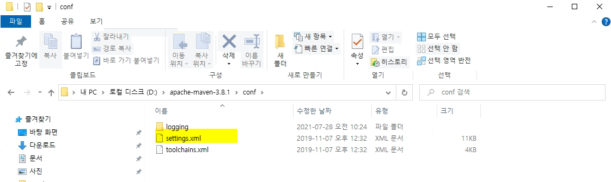
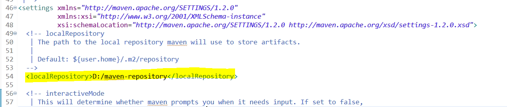
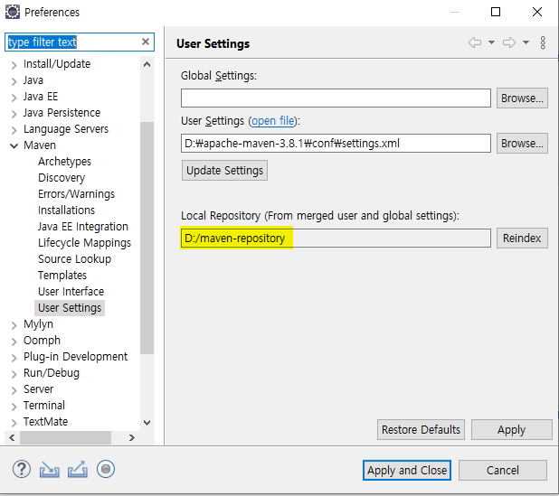
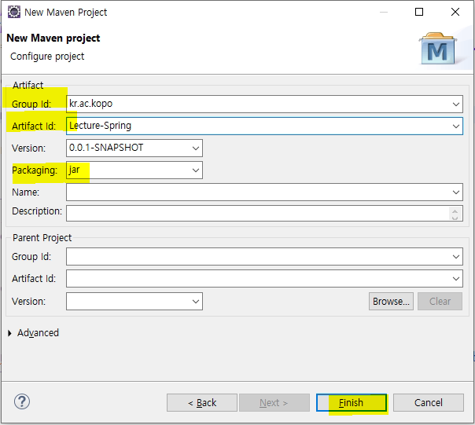

## Maven 설정

## Spring

- **기본세팅**
  - spring-workspace (워크 space 재설정) 실행
  - 이클립스 실행
  - 캐릭터셋 설정

- **maven 다운로드**

  - https://maven.apache.org/download.cgi

  

  

- **환경설정**

  - cmd 창에서
  - M2_HOME
    - 방금 다운받은 maven 위치

  

  

  - JAVA_HOME

  

  

  - PATH

  

  

  - 환경변수 설정 확인

  

- **repository가 저장되는 폴더를 따로 설정하기 위해서 폴더 하나 생성**

  - D:\maven-repository
  - 설정한 폴더에 저장하라고 세팅하는 위치는 D:\apache-maven-3.8.1\conf 에서 settings.xml (아까 다운받은 maven 폴더 안)

  

  - 원래 저장되는 위치 : C:\Users\HP\.m2
  - 이클립스 window - preferences - Maven - User Settings

  

  

  - open file 클릭
    - D:\maven-repository 위치 설정

  

  

  - 설정된 것 확인

  

- **이클립스 메이븐 프로젝트 생성**

  - create

  

  - 정보 입력 후 Finish
    - artifact id : 프로젝트 명
    - 현재 콘솔모드에서 진행할 것이므로 packaging은 jar

  

