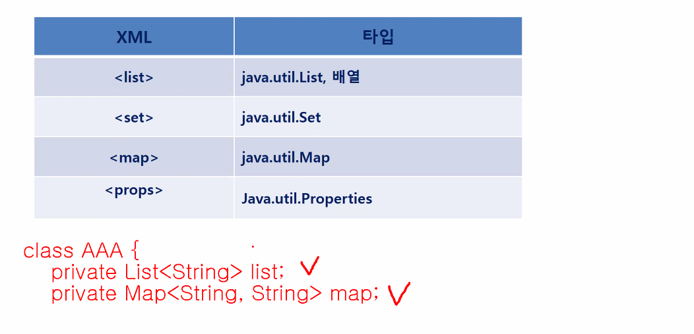
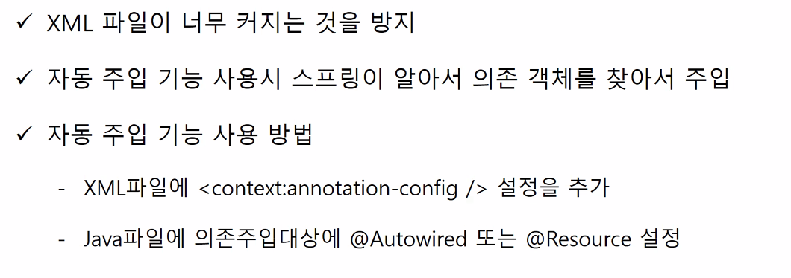
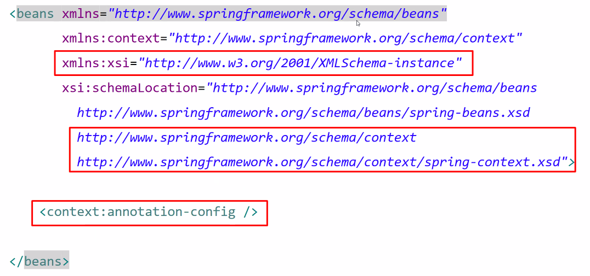
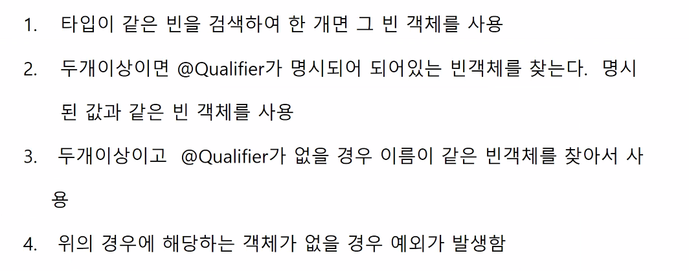
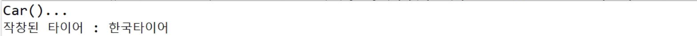
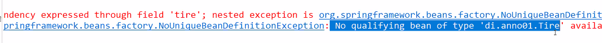
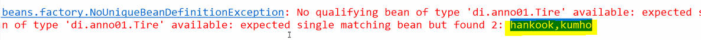
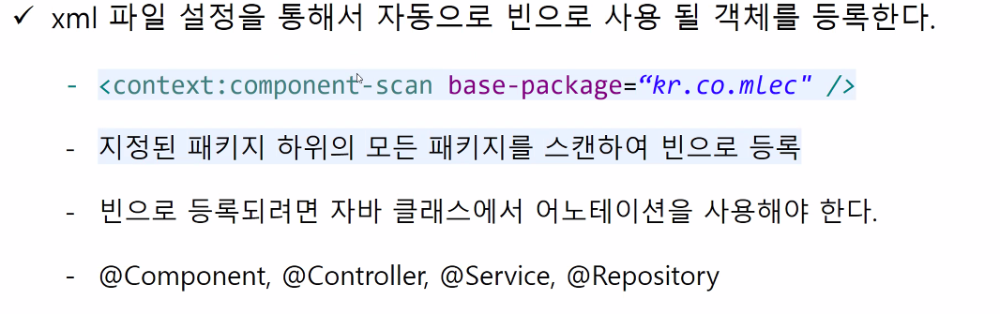
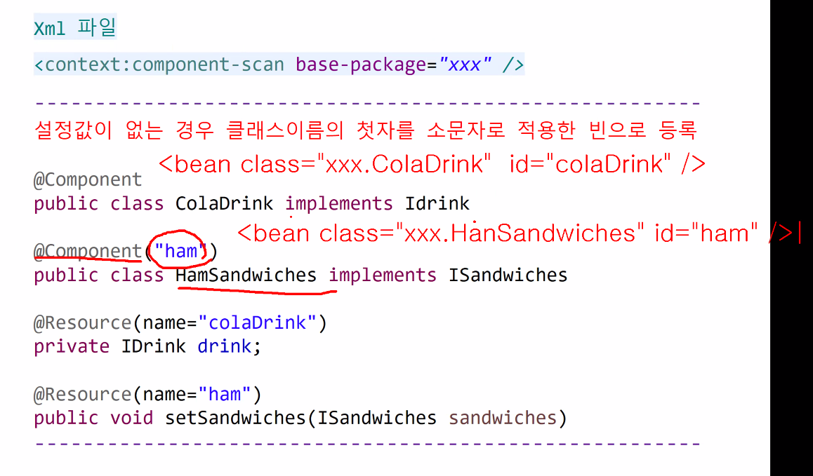
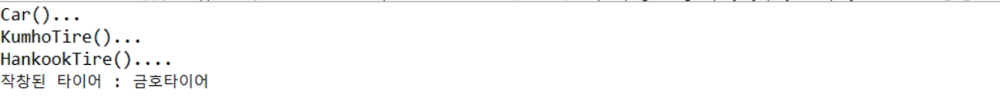

## DI

- constructor Injection 생성자 주입


- 생성자 주입 실습 - 나머지는 setter와 같음

  - DriverMain.java

  ```java
  package di.xml02;
  
  import org.springframework.context.ApplicationContext;
  import org.springframework.context.support.GenericXmlApplicationContext;
  
  public class DriverMain {
  
  	public static void main(String[] args) {
  		//Spring Container 방법 1 
  		ApplicationContext context = new GenericXmlApplicationContext("di-xml02.xml");
  		Car car = context.getBean("car", Car.class);
  		car.printTireBrand();
  	}
  
  }
  
  ```

  - Car.java

  ```java
  package di.xml02;
  
  public class Car {
  	private Tire tire;
  	
  	public Car() {
  		
  	}
  	
  	public Car(Tire tire) {
  		this.tire = tire;
  		System.out.println("tire 생성자 호출....");
  	}
  	
  	public Car(Tire tire1, Tire tire2) {
  		System.out.println("Car(Tire, Tire) 생성자 호출....");
  	}
  	
  	public Car(Tire tire, String str) {
  		System.out.println("Car(Tire, String) 호출");
  		System.out.println("str : " + str);
  	}
  	
  	public void printTireBrand() {
  		System.out.println("타이어 브랜드는 : " + tire.getBrand());
  	}
  }
  
  ```

  - xml
    - `< constructor-arg/ >`를 쓰지 않으면 기본 생성자로 만들어진다. 
    - 그래서 `< constructor-arg/ >`를 사용해서 tire 생성자주입을 하겠다고 정의해줌

  ```xml
  <?xml version="1.0" encoding="UTF-8"?>
  <beans xmlns="http://www.springframework.org/schema/beans"
     xmlns:xsi="http://www.w3.org/2001/XMLSchema-instance"
     xsi:schemaLocation="http://www.springframework.org/schema/beans
                    http://www.springframework.org/schema/beans/spring-beans.xsd">
                    
  	<bean id="hankook" class="di.xml02.HankookTire"/>        
  	<bean id="kumho" class="di.xml02.KumhoTire"/>  
  	
  	<bean class="di.xml02.Car" id="Car">
  		<constructor-arg ref="hankook"/>
  	</bean>      
            
  </beans>
  ```

  - 생성자 주입은 2개 가능
    - new Car( new HankookTire(), new KumhoTire() )

  ```xml
  <?xml version="1.0" encoding="UTF-8"?>
  <beans xmlns="http://www.springframework.org/schema/beans"
     xmlns:xsi="http://www.w3.org/2001/XMLSchema-instance"
     xsi:schemaLocation="http://www.springframework.org/schema/beans
                    http://www.springframework.org/schema/beans/spring-beans.xsd">
                    
  	<bean id="hankook" class="di.xml02.HankookTire"/>        
  	<bean id="kumho" class="di.xml02.KumhoTire"/>  
  	
  	<bean class="di.xml02.Car" id="car">
  		<constructor-arg ref="hankook"/>
  	</bean>      
  	
  	<bean class="di.xml02.Car" id="car2">
  		<constructor-arg ref="hankook"/>
  		<constructor-arg ref="kumho"/>
  	</bean>     
  	
            
  </beans>
  ```

  - xml
    - index를 통해서 매개변수 몇 번째에 넣을지 정할 수 있다.(index는 0부터)

  ```xml
  <?xml version="1.0" encoding="UTF-8"?>
  <beans xmlns="http://www.springframework.org/schema/beans"
     xmlns:xsi="http://www.w3.org/2001/XMLSchema-instance"
     xsi:schemaLocation="http://www.springframework.org/schema/beans
                    http://www.springframework.org/schema/beans/spring-beans.xsd">
                    
  	<bean id="hankook" class="di.xml02.HankookTire"/>        
  	<bean id="kumho" class="di.xml02.KumhoTire"/>  
  	
  	<bean class="di.xml02.Car" id="car">
  		<constructor-arg ref="hankook"/>
  	</bean>      
  	
  	<bean class="di.xml02.Car" id="car2">
  		<constructor-arg ref="hankook"/>
  		<constructor-arg ref="kumho"/>
  	</bean>     
  	
  	<bean class="di.xml02.Car" id="car3">
  		<constructor-arg ref="kumho"/>
  		<constructor-arg value="hello"/>
  	</bean>     
  	
  	<bean class="di.xml02.Car" id="car4">
  		<constructor-arg value="hello" index="1"/>
  		<constructor-arg ref="kumho" index="0"/>
  	</bean>  
            
  </beans>
  ```

  

- **dependency 응용**

  - list 예

  ```xml
  <bean class="di.collection.Test" id="test"> 
      <property name="list"> 
          <list>
          	<value>abc</value>
              <value>bbb</value>
              <value>ccc</value>
          </list>
      </property>
      <property name="map">
      	<map>
          	<entry>
              	<key>hong</key>
                  <value>홍길동</value>
              </entry>
              <entry>
              	<key>cho</key>
                  <value>조길동</value>
              </entry>
          </map>
      </property>
  <bean>
      
      
  ```

  ```java
  package di.collection;
  
  class Test {
  	private List<String> list;
      private Map<String, String> map;
      
      public void setList(List<String> list) {
          this.list = list;
      }
      
      public void setMap(Map<String, String> map) {
          this.map = map;
      }
  }
  ```

  ```java
  //위에 xml 파일 설정과 같은 말임
  List<String> list = new ArrayList<>();
  list.add("abc");
  list.add("bbb");
  list.add("ccc");
  
  Test obj = new Test();
  obj.setList(list);
  
  Map<String, String> map = new Hash<>();
  map.put("hong","홍길동");
  map.put("cho", "조길동");
  ```

  


## Annotation을 이용한 객체 주입(자동주입)

- **어노테이션 사용 목적**

  - xml에 코드가 길어지는 것을 막기 위해서

    

- DI 자동 주입

  


- xml 설정

  - annotation은 context라서 앞에서 context를 붙여준다. 

  


- **@Autowired**

  - Java 설정
    - 변수 설정
    - 생성자 설정
    - set 메소드 설정
  - 객체 찾는 순서 
    - @Qualifier : 특정 이름을 가진 객체를 명시적으로 주입시켜주는 것이다.

  


- **실습(@Autowired)**

  - di-anno01.xml
    - 스프링 컨테이너에 객체를 추가시키고 의존주입 되는 객체를 설정
    - 객체관리이므로 무조건 beans가 들어가야 한다. 
    - 자동주입을 위해서 xmlns:context 추가

  ```xml
  <?xml version="1.0" encoding="UTF-8"?>
  <beans xmlns="http://www.springframework.org/schema/beans"
     xmlns:context="http://www.springframework.org/schema/context"
     xmlns:xsi="http://www.w3.org/2001/XMLSchema-instance"
     xsi:schemaLocation="http://www.springframework.org/schema/beans
                    http://www.springframework.org/schema/beans/spring-beans.xsd
                    http://www.springframework.org/schema/context
                    http://www.springframework.org/schema/context/spring-context.xsd">
                    
  	<context:annotation-config />
  	
  	<bean class="di.anno01.HankookTire" id="tire"/>
  	<bean class="di.anno01.Car" id="car"/>
  </beans>
  ```

  - Car.java
    - @Autowired를 주입하면 매개변수에 들어갈 Tire를 설정하지 않아도 자동으로 찾아서 주입을 시키는 것임 
    - xml에서 hankook을 xml에서 설정해서 알아서 들어가는 것임
    - @Autowired 자동 주입을 하려는 객체를 찾을 때 가장 먼저 type 매칭을 먼저 한다. 
      - 그래서 Tire 타입을 컨테이너를 찾고 타입 매칭이 없으면 다음으로 이름으로 찾음

  ```java
  package di.anno01;
  
  import org.springframework.beans.factory.annotation.Autowired;
  
  public class Car {
  	
  	private Tire tire;
  	
  	public Car() {
  		System.out.println("Car()...");
  	}
  	
  	@Autowired
  	public Car(Tire tire) { 
  		this.tire = tire;
  		System.out.println("Car(Tire) ...");
  	}
  	
  	public void setTire(Tire tire) {
  		this.tire = tire;
  	}
  
  	public void printTireBrand() {
  		System.out.println("작창된 타이어 : " + tire.getBrand());
  	}
  }
  
  ```

  - main.java

  ```java
  package di.anno01;
  
  import org.springframework.context.ApplicationContext;
  import org.springframework.context.support.GenericXmlApplicationContext;
  
  public class DriverMain {
  
  	public static void main(String[] args) {
  		
  		ApplicationContext context = new GenericXmlApplicationContext("di-anno01.xml");
  		Car car = context.getBean("car", Car.class);
  		car.printTireBrand();
  		/*
  		Car car = new Car(han); //외부에서 만들어진 tire 객체를 주입
  		//car class에서 tire 객체가 필요하므로
  		*/
  		
  		
  		/*
  		Car car = new Car();
  		car.printTireBrand();
  		*/
  	}
  }
  ```

  - di-anno01.xml - setter 주입
    - setter 주입을 기본 생성자를 호출하고 setter를 호출하므로 setter 주입은 기본 생성자 없으면 error난다.

  ```java
  package di.anno01;
  
  import org.springframework.beans.factory.annotation.Autowired;
  
  public class Car {
  	
  	private Tire tire;
  	
  	public Car() {
  		System.out.println("Car()...");
  	}
  	
  	//@Autowired
  	public Car(Tire tire) { 
  		this.tire = tire;
  		System.out.println("Car(Tire) ...");
  	}
  	
  	@Autowired
  	public void setTire(Tire tire) { //setter 주입은 기본 생성자 없으면 error난다..
  					//setter 주입을 기본 생성자를 호출하고 setter를 호출하므로
  		this.tire = tire;
  	}
  
  	public void printTireBrand() {
  		System.out.println("작창된 타이어 : " + tire.getBrand());
  	}
  }
  
  ```

  

  - 멤버변수 위에 @Autowired
    - setter 메소드나 매개변수 있는 생성자가 호출되지 않고 기본 생성자가 호출된다. 그래도 자동 주입이 된다.

  ```java
  package di.anno01;
  
  import org.springframework.beans.factory.annotation.Autowired;
  
  public class Car {
  	@Autowired
  	private Tire tire;
  	
  	public Car() {
  		System.out.println("Car()...");
  	}
  	
  	//@Autowired
  	public Car(Tire tire) { 
  		this.tire = tire;
  		System.out.println("Car(Tire) ...");
  	}
  	
  	//@Autowired
  	public void setTire(Tire tire) { //setter 주입은 기본 생성자 없으면 error난다..
  					//setter 주입을 기본 생성자를 호출하고 setter를 호출하므로
  		this.tire = tire;
  		System.out.println("setTire()");
  	}
  
  	public void printTireBrand() {
  		System.out.println("작창된 타이어 : " + tire.getBrand());
  	}
  }
  
  ```

  


- **컨테이너에 여러 개의 객체를 설정했다면?**

  - 위에 실습에서는 컨테이너를 하나만 설정했는데 이번에는 2개를 설정해도 자동으로 주입할까?
    - 에러발생 : hankook, kumho 둘 다 인식되어서 에러
  - xml

  ```xml
  <?xml version="1.0" encoding="UTF-8"?>
  <beans xmlns="http://www.springframework.org/schema/beans"
     xmlns:context="http://www.springframework.org/schema/context"
     xmlns:xsi="http://www.w3.org/2001/XMLSchema-instance"
     xsi:schemaLocation="http://www.springframework.org/schema/beans
                    http://www.springframework.org/schema/beans/spring-beans.xsd
                    http://www.springframework.org/schema/context
                    http://www.springframework.org/schema/context/spring-context.xsd">
                    
  	<context:annotation-config />
  	
  	<bean class="di.anno01.HankookTire" id="hankook"/>
  	<bean class="di.anno01.KumhoTire" id="kumho"/>
  	<bean class="di.anno01.Car" id="car"/>
  </beans>
  ```

  

  

  - 이번에는 금호 타이어의 아이디를 tire로 설정
    - 자동주입할 때 먼저 type을 확인하고 id를 확인하기 때문에 금호타이어가 나옴

  ```xml
  <?xml version="1.0" encoding="UTF-8"?>
  <beans xmlns="http://www.springframework.org/schema/beans"
     xmlns:context="http://www.springframework.org/schema/context"
     xmlns:xsi="http://www.w3.org/2001/XMLSchema-instance"
     xsi:schemaLocation="http://www.springframework.org/schema/beans
                    http://www.springframework.org/schema/beans/spring-beans.xsd
                    http://www.springframework.org/schema/context
                    http://www.springframework.org/schema/context/spring-context.xsd">
                    
  	<context:annotation-config />
  	
  	<bean class="di.anno01.HankookTire" id="hankook"/>
  	<bean class="di.anno01.KumhoTire" id="tire"/>
  	<bean class="di.anno01.Car" id="car"/>
  </beans>
  ```

  

  - 넥센 타이어 class 생성(NexenTire)

  ```java
  package di.anno01;
  
  public class NexenTire {
  	
  	public String getBrand() {
  		return "넥센타이어";
  	}
  }
  
  ```

  - xml

  ```xml
  <?xml version="1.0" encoding="UTF-8"?>
  <beans xmlns="http://www.springframework.org/schema/beans"
     xmlns:context="http://www.springframework.org/schema/context"
     xmlns:xsi="http://www.w3.org/2001/XMLSchema-instance"
     xsi:schemaLocation="http://www.springframework.org/schema/beans
                    http://www.springframework.org/schema/beans/spring-beans.xsd
                    http://www.springframework.org/schema/context
                    http://www.springframework.org/schema/context/spring-context.xsd">
                    
  	<context:annotation-config />
  	
  	<bean class="di.anno01.HankookTire" id="hankook"/>
  	<!-- <bean class="di.anno01.KumhoTire" id="tire"/>  -->
  	<bean class="di.anno01.NexenTire" id="tire"/>
  	<bean class="di.anno01.Car" id="car"/>
  </beans>
  ```

  

  - type매칭을 먼저 하는데 넥센타이어는 Tire를 상속받지 않았다. 그래서 한국타이어가 나옴


- **@Resource** 
  - java 설정
    - 자바에서 제공하는 어노테이션
      - `@Autowired`는 스프링에서 제공
    - 변수 설정
    - **생성자 설정 : 제공되지 않음**
    - set 메서드 설정


- **@Resource 실습** 

  - 의존성 추가(pom.xml)

  ```xml
  <!-- https://mvnrepository.com/artifact/javax.annotation/javax.annotation-api -->
  <dependency>
      <groupId>javax.annotation</groupId>
      <artifactId>javax.annotation-api</artifactId>
      <version>1.3.2</version>
  </dependency>
  
  ```

  - xml

  ```xml
  <?xml version="1.0" encoding="UTF-8"?>
  <beans xmlns="http://www.springframework.org/schema/beans"
     xmlns:context="http://www.springframework.org/schema/context"
     xmlns:xsi="http://www.w3.org/2001/XMLSchema-instance"
     xsi:schemaLocation="http://www.springframework.org/schema/beans
                    http://www.springframework.org/schema/beans/spring-beans.xsd
                    http://www.springframework.org/schema/context
                    http://www.springframework.org/schema/context/spring-context.xsd">
                    
  	<context:annotation-config />
  	
  	<bean class="di.anno02.HankookTire" id="hankook"/>
  	<!-- <bean class="di.anno01.KumhoTire" id="tire"/>  -->
  	<bean class="di.anno02.Car" id="car"/>
  </beans>
  ```

  

  - Car.java

  ```java
  package di.anno02;
  
  import javax.annotation.Resource;
  
  import org.springframework.beans.factory.annotation.Autowired;
  
  public class Car {
  	private Tire tire;
  	
  	public Car() {
  		System.out.println("Car()...");
  	}
  	
  	public Car(Tire tire) { 
  		this.tire = tire;
  		System.out.println("Car(Tire) ...");
  	}
  	
  	@Resource
  	public void setTire(Tire tire) { //setter 주입은 기본 생성자 없으면 error난다..
  					//setter 주입을 기본 생성자를 호출하고 setter를 호출하므로
  		this.tire = tire;
  		System.out.println("setTire()");
  	}
  
  	public void printTireBrand() {
  		System.out.println("작창된 타이어 : " + tire.getBrand());
  	}
  }
  
  ```

  - main

  ```java
  package di.anno02;
  
  import org.springframework.context.ApplicationContext;
  import org.springframework.context.support.GenericXmlApplicationContext;
  
  public class DriverMain {
  
  	public static void main(String[] args) {
  		
  		ApplicationContext context = new GenericXmlApplicationContext("di-anno01.xml");
  		Car car = context.getBean("car", Car.class);
  		car.printTireBrand();
  		/*
  		Car car = new Car(han); //외부에서 만들어진 tire 객체를 주입
  		//car class에서 tire 객체가 필요하므로
  		*/
  		
  		
  		/*
  		Car car = new Car();
  		car.printTireBrand();
  		*/
  	}
  
  }
  
  ```

  


- 컨테이너에 tire를 상속받은 class를 2개 설정했을 때 둘 중에 어떤 것을 자동주입할지 판단할 수 없어서 error 발생

  - xml

  ```xml
  <?xml version="1.0" encoding="UTF-8"?>
  <beans xmlns="http://www.springframework.org/schema/beans"
     xmlns:context="http://www.springframework.org/schema/context"
     xmlns:xsi="http://www.w3.org/2001/XMLSchema-instance"
     xsi:schemaLocation="http://www.springframework.org/schema/beans
                    http://www.springframework.org/schema/beans/spring-beans.xsd
                    http://www.springframework.org/schema/context
                    http://www.springframework.org/schema/context/spring-context.xsd">
                    
  	<context:annotation-config />
  	
  	<bean class="di.anno02.HankookTire" id="hankook"/>
  	<bean class="di.anno01.KumhoTire" id="kumho"/>
  	<bean class="di.anno02.Car" id="car"/>
  </beans>
  ```

  

- 그래서 하나의 id를 tire로 설정하면 tire로 설정된 class가 자동주입 된다. 

  - xml

  ```xml
  <?xml version="1.0" encoding="UTF-8"?>
  <beans xmlns="http://www.springframework.org/schema/beans"
     xmlns:context="http://www.springframework.org/schema/context"
     xmlns:xsi="http://www.w3.org/2001/XMLSchema-instance"
     xsi:schemaLocation="http://www.springframework.org/schema/beans
                    http://www.springframework.org/schema/beans/spring-beans.xsd
                    http://www.springframework.org/schema/context
                    http://www.springframework.org/schema/context/spring-context.xsd">
                    
  	<context:annotation-config />
  	
  	<bean class="di.anno02.HankookTire" id="hankook"/>
  	<bean class="di.anno01.KumhoTire" id="tire"/>
  	<bean class="di.anno02.Car" id="car"/>
  </beans>
  ```

  

- **`@resource`는 이름을 먼저 매칭한다.!!!!!!!!!!!!!!!!!!!!!!!!(Autowired와 다른점!!!!!!!!!)**

  - xml

  ```xml
  <?xml version="1.0" encoding="UTF-8"?>
  <beans xmlns="http://www.springframework.org/schema/beans"
     xmlns:context="http://www.springframework.org/schema/context"
     xmlns:xsi="http://www.w3.org/2001/XMLSchema-instance"
     xsi:schemaLocation="http://www.springframework.org/schema/beans
                    http://www.springframework.org/schema/beans/spring-beans.xsd
                    http://www.springframework.org/schema/context
                    http://www.springframework.org/schema/context/spring-context.xsd">
                    
  	<context:annotation-config />
  	
  	<bean class="di.anno02.HankookTire" id="hankook"/>
  	<!-- <bean class="di.anno02.KumhoTire" id="tire"/>  -->
  	<bean class="di.anno02.NexenTire" id="tire"/>
  	<bean class="di.anno02.Car" id="car"/>
  </beans>
  ```

  - NexenTire	
    - tire를 상속받지 않음 
    - `@resource`는 id를 먼저 매칭하므로 nexenTire가 먼저 매칭이 된 것이다. 근데 넥센은 tire를 상속받지 않아서 에러가 발생

  ```java
  package di.anno02;
  
  public class NexenTire {
  	
  	public String getBrand() {
  		return "넥센타이어";
  	}
  }
  
  ```

  

- **@Inject**

  - @resource와 마찬가지로 순수 자바 어노테이션
  - inject를 사용하기 위해선 의존성 설정을 해줘야함
  - inject는 Autowired와 같이 type을 먼저 매칭하고 이름을 매칭한다.

  ```xml
  <!-- https://mvnrepository.com/artifact/javax.inject/javax.inject -->
  <dependency>
      <groupId>javax.inject</groupId>
      <artifactId>javax.inject</artifactId>
      <version>1</version>
  </dependency>
  ```

  

- **conponent-scan**

  - 패키지를 쭉 검색하고 어노테이션이 붙어있으면 스프링 컨테이너가 하나하나씩 객체를 생성해준다.
  - 객체를 미리 만들지 않고 사용하는 것들도 있어서 4가지 중 하나의 어노테이션이 붙어있어야 자동으로 생성해준다.(component, controller, service, repository)
  - @Repository : db와 access하는 class에 쓰임(ex. DAO)
  - @Controller : 컨트롤러의 특징을 가지고 있는 class(ex. Controller)
  - @Service : 비즈니스 로직을 수행하는 class에 붙임 (ex. Service)

  

  - 예
    - id가 class이름과 같아지는데 맨 앞에가 소문자로 되는 것임 

  ```java
  @Repository
  @Service
  @Contoller
  @Component
  class HankookTire {
  
  }
  //위 아래 같은 말
  ```

  ```xml
  <bean class="di.anno.HankookTire" id="hankookTire" />
  ```

  - 코드 작성

  


- conponent-scan 실습

  - xml

  ```xml
  <?xml version="1.0" encoding="UTF-8"?>
  <beans xmlns="http://www.springframework.org/schema/beans"
     xmlns:context="http://www.springframework.org/schema/context"
     xmlns:xsi="http://www.w3.org/2001/XMLSchema-instance"
     xsi:schemaLocation="http://www.springframework.org/schema/beans
                    http://www.springframework.org/schema/beans/spring-beans.xsd
                    http://www.springframework.org/schema/context
                    http://www.springframework.org/schema/context/spring-context.xsd">
                    
  	<context:annotation-config />
  	<context:component-scan base-package="di.anno03"></context:component-scan>
  </beans>
  ```

  - HankookTire.java

  ```java
  package di.anno03;
  
  import org.springframework.stereotype.Component;
  
  @Component
  public class HankookTire implements Tire {
  
  	public HankookTire() {
  		System.out.println("HankookTire()....");
  	}
  	
  	public String getBrand() {
  		return "한국타이어";
  	}
  
  }
  
  ```

  - Car.java

  ```java
  package di.anno03;
  
  import javax.annotation.Resource;
  
  import org.springframework.beans.factory.annotation.Autowired;
  import org.springframework.stereotype.Component;
  
  @Component
  public class Car {
  	
  	@Autowired
  	private Tire tire;
  	
  	public Car() {
  		System.out.println("Car()...");
  	}
  	
  	public Car(Tire tire) { 
  		this.tire = tire;
  		System.out.println("Car(Tire) ...");
  	}
  	
  	//@Resource
  	public void setTire(Tire tire) { //setter 주입은 기본 생성자 없으면 error난다..
  					//setter 주입을 기본 생성자를 호출하고 setter를 호출하므로
  		this.tire = tire;
  		System.out.println("setTire()");
  	}
  
  	public void printTireBrand() {
  		System.out.println("작창된 타이어 : " + tire.getBrand());
  	}
  }
  ```

  - main.java
    - @Component로 HankookTire와 Car 인스턴스 객체가 생성되었고 @Autowired로 자동주입이 되어서 main에서 printTireBrand를 사용할 수 있는 것임
    - 만약 @Autowired가 매개변수가 있는 생성자에 붙어있으면 생성자 주입이 됨
    - context.getBean에서 "car"는 @Component의 name인데 따로 설정을 하지 않으면 class명의 맨 앞자리가 소문자로 된 것이 name으로 되는 것이다.

  ```java
  package di.anno03;
  
  import org.springframework.context.ApplicationContext;
  import org.springframework.context.support.GenericXmlApplicationContext;
  
  public class DriverMain {
  
  	public static void main(String[] args) {
  		
  		ApplicationContext context = new GenericXmlApplicationContext("di-anno03.xml");
  		Car car = context.getBean("car", Car.class);
  		car.printTireBrand();
  	}
  
  }
  
  ```

  


- **2개의 객체가 있는 경우(금호, 한국)**

  - KumhoTire.java 에도 @Component 설정했을 때 에러발생(둘 중에 어떤 것을 골라야할지 모르겠어서 )
  - 그래서 에러를 발생시키고 싶지 않으면 자동주입하고 싶은 타이어 class에서 name을 tire로 설정하면 된다. @Component("tire")

  ```
  package di.anno03;
  
  import org.springframework.stereotype.Component;
  
  public class KumhoTire implements Tire {
  
  	public String getBrand() {
  		return "금호타이어";
  	}
  
  }
  
  ```

  - Car.java

  ```java
  package di.anno03;
  
  import javax.annotation.Resource;
  
  import org.springframework.beans.factory.annotation.Autowired;
  import org.springframework.stereotype.Component;
  
  @Component
  public class Car {
  	
  	
  	private Tire tire;
  	
  	public Car() {
  		System.out.println("Car()...");
  	}
  	
  	@Autowired
  	public Car(Tire tire) { 
  		this.tire = tire;
  		System.out.println("Car(Tire) ...");
  	}
  	
  	//@Resource
  	public void setTire(Tire tire) { //setter 주입은 기본 생성자 없으면 error난다..
  					//setter 주입을 기본 생성자를 호출하고 setter를 호출하므로
  		this.tire = tire;
  		System.out.println("setTire()");
  	}
  
  	public void printTireBrand() {
  		System.out.println("작창된 타이어 : " + tire.getBrand());
  	}
  }
  
  ```

  

- 위처럼 설정하는 경우에는 선택하고 싶을 때마다 @Component("tire")를 바꿔야 한다. 그건 불편하다. 그래서 @Qualifier를 사용해서 어떤 객체를 주입하고 싶은지 설정해주면 된다.

  - @Qualifier는 생성자에서는 사용이 불가하다.
  - car.java

  ```java
  package di.anno03;
  
  import javax.annotation.Resource;
  
  import org.springframework.beans.factory.annotation.Autowired;
  import org.springframework.beans.factory.annotation.Qualifier;
  import org.springframework.stereotype.Component;
  
  @Component
  public class Car {
  	
  	
  	private Tire tire;
  	
  	public Car() {
  		System.out.println("Car()...");
  	}
  	
  	
  	public Car(Tire tire) { 
  		this.tire = tire;
  		System.out.println("Car(Tire) ...");
  	}
  	
  	@Autowired
  	@Qualifier("kumhoTire")
  	public void setTire(Tire tire) { //setter 주입은 기본 생성자 없으면 error난다..
  					//setter 주입을 기본 생성자를 호출하고 setter를 호출하므로
  		this.tire = tire;
  		System.out.println("setTire()");
  	}
  
  	public void printTireBrand() {
  		System.out.println("작창된 타이어 : " + tire.getBrand());
  	}
  }
  
  ```

  

- @Autowired(required = false) : 만일 의존주입 해야하는 객체가 없으면 null로 비워둬
- autowired같은 경우에는 type이 먼저 진행되고 type이 여러 개이면 qualifier로 어떤 객체를 선택할지 적어둔다. 

- 그런데 @resource(ex.@resource(name="hankookTire")로 사용하면 이름이 먼저 매칭이 되니까 qualifier(@qualifire="kumhoTire")를 사용해도 name이 우선적으로 실행되어서 hankook이 나온다. 


- **객체를 만드는 행동 자체를 XML이 아닌 JAVA로 구성**

  - Tire.java

  ```java
  package di.java;
  
  public interface Tire {
  	String getBrand();
  }
  ```

  - HankookTire.java

  ```java
  package di.java;
  
  import di.basic.Tire;
  
  public class HankookTire implements Tire {
  
  	public String getBrand() {
  		return "한국타이어";
  	}
  }
  ```

  - KumhoTire.java

  ```java
  package di.java;
  
  import di.basic.Tire;
  
  public class KumhoTire implements Tire {
  
  	public String getBrand() {
  		return "금호타이어";
  	}
  }
  ```

  - Config.java
    - 환경설정(xml 대체)
    - @Configuration
    - @Bean을 붙여줘야지 만들어 진다.

  ```java
  package di.java;
  
  import org.springframework.beans.factory.annotation.Qualifier;
  import org.springframework.context.annotation.Bean;
  import org.springframework.context.annotation.Configuration;
  
  @Configuration
  public class Config {
  	
  	@Bean
  	public Car car() {
  		return new Car();
  	}
  	
  	@Bean
  	@Qualifier("hankook")
  	public HankookTire hankookTire() {
  		return new HankookTire();
  	}
  	
  	@Bean
  	@Qualifier("kumho")
  	public KumhoTire kumhoTire() {
  		return new KumhoTire();
  	}
  }
  
  ```

  - Car

  ```java
  package di.java;
  
  import org.springframework.beans.factory.annotation.Autowired;
  import org.springframework.beans.factory.annotation.Qualifier;
  
  public class Car {
  	
  	@Autowired
  	@Qualifier("kumho")
  	private Tire tire;
  	
  	public Car() {
  		System.out.println("Car()...");
  	}
  	
  	public Car(Tire tire) { 
  		this.tire = tire;
  	}
  	
  	public void setTire(Tire tire) {
  		this.tire = tire;
  	}
  
  	public void printTireBrand() {
  		System.out.println("작창된 타이어 : " + tire.getBrand());
  	}
  }
  
  ```

  main.java

  ```java
  package di.java;
  
  import org.springframework.context.ApplicationContext;
  import org.springframework.context.annotation.AnnotationConfigApplicationContext;
  
  public class DriverMain {
  
  	public static void main(String[] args) {
  		ApplicationContext context = new AnnotationConfigApplicationContext(Config.class);
  		Car car = context.getBean(Car.class);
  		car.printTireBrand();
  	}
  
  }
  
  ```

  

  - 그런데 이렇게 하면 bean을 계속 만들어줘야함 그래서 나온게 @ComponentScan
  - config.java

  ```java
  package di.java;
  
  import org.springframework.beans.factory.annotation.Qualifier;
  import org.springframework.context.annotation.Bean;
  import org.springframework.context.annotation.ComponentScan;
  import org.springframework.context.annotation.Configuration;
  
  @ComponentScan(basePackages = {"di.java"})
  @Configuration
  public class Config {
  	/*
  	@Bean
  	public Car car() {
  		return new Car();
  	}
  	
  	@Bean
  	@Qualifier("hankook")
  	public HankookTire hankookTire() {
  		return new HankookTire();
  	}
  	
  	@Bean
  	@Qualifier("kumho")
  	public KumhoTire kumhoTire() {
  		return new KumhoTire();
  	}
  	*/
  }
  
  ```

  - HankookTire.java
    - @Component 추가

  ```java
  package di.java;
  
  import org.springframework.stereotype.Component;
  
  @Component("hankook")
  public class HankookTire implements Tire {
  	
  	public HankookTire() {
  		System.out.println("HankookTire()....");
  	}
  	public String getBrand() {
  		return "한국타이어";
  	}
  
  }
  ```

  - KumhoTire.java
    - @Component 추가

  ```java
  package di.java;
  
  import org.springframework.stereotype.Component;
  
  @Component("kumho")
  public class KumhoTire implements Tire {
  	
  	public KumhoTire() {
  		System.out.println("KumhoTire()...");
  	}
  	
  	public String getBrand() {
  		return "금호타이어";
  	}
  
  }
  ```

  - Car
    - @Component 추가

  ```java
  package di.java;
  
  import org.springframework.beans.factory.annotation.Autowired;
  import org.springframework.beans.factory.annotation.Qualifier;
  import org.springframework.stereotype.Component;
  
  @Component
  public class Car {
  	
  	@Autowired
  	@Qualifier("kumho")
  	private Tire tire;
  	
  	public Car() {
  		System.out.println("Car()...");
  	}
  	
  	public Car(Tire tire) { 
  		this.tire = tire;
  	}
  	
  	public void setTire(Tire tire) {
  		this.tire = tire;
  	}
  
  	public void printTireBrand() {
  		System.out.println("작창된 타이어 : " + tire.getBrand());
  	}
  }
  
  ```

  

- 문제

