## Maven 설정


## Spring

- **기본세팅**
  - spring-workspace (워크 space 재설정) 실행
  - 이클립스 실행
  - 캐릭터셋 설정


- **maven 다운로드**

  - https://maven.apache.org/download.cgi

  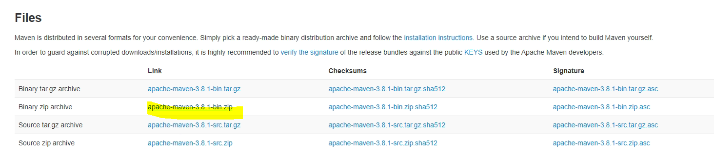

  

- **환경설정**

  - cmd 창에서
  - M2_HOME
    - 방금 다운받은 maven 위치

  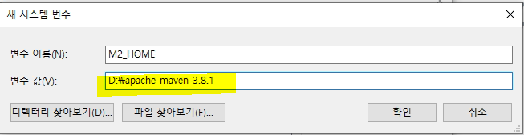

  

  - JAVA_HOME

  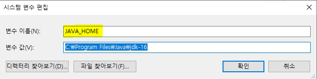

  

  - PATH

  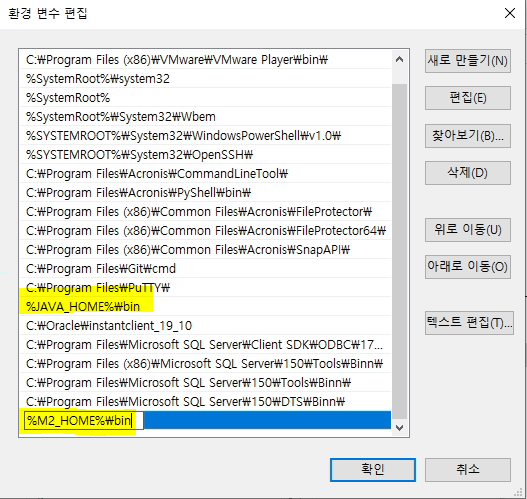

  

  - 환경변수 설정 확인

  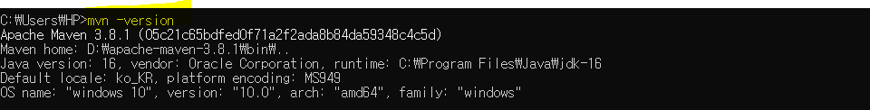


- **repository가 저장되는 폴더를 따로 설정하기 위해서 폴더 하나 생성**

  - D:\maven-repository
  - 설정한 폴더에 저장하라고 세팅하는 위치는 D:\apache-maven-3.8.1\conf 에서 settings.xml (아까 다운받은 maven 폴더 안)

  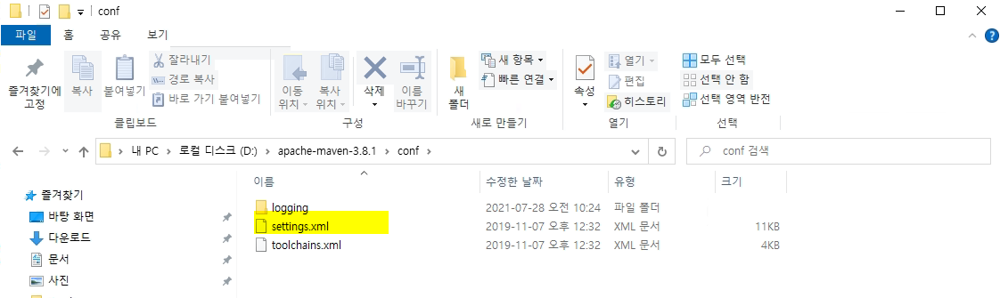

  - 원래 저장되는 위치 : C:\Users\HP\.m2
  - 이클립스 window - preferences - Maven - User Settings

  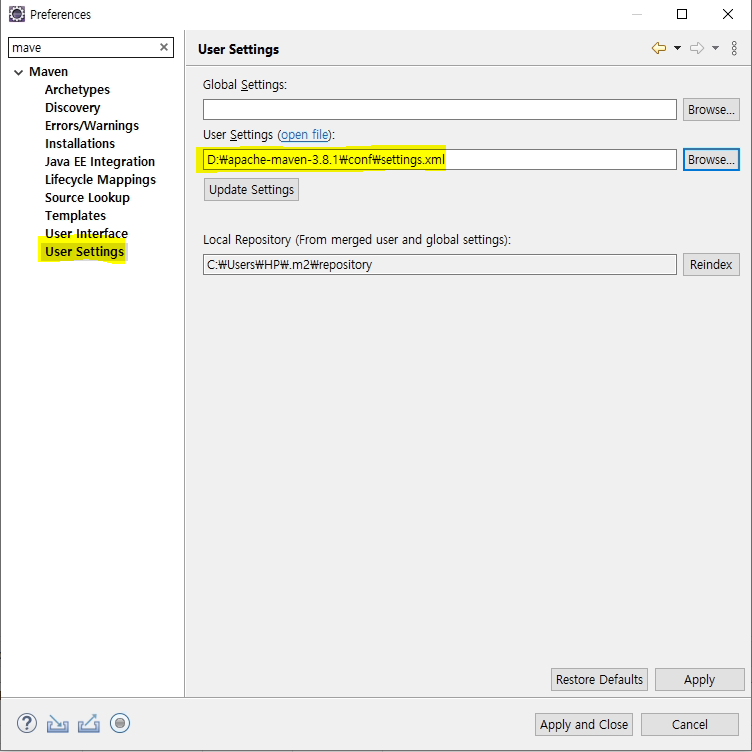

  

  - open file 클릭
    - D:\maven-repository 위치 설정

  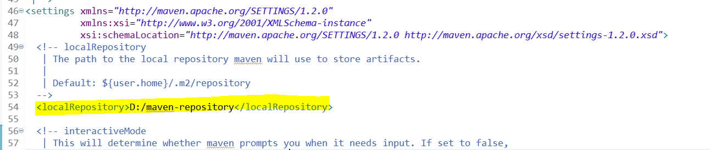

  

  - 설정된 것 확인

  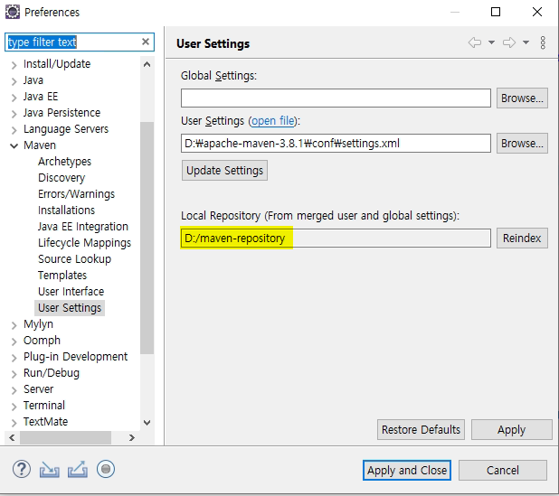


- **이클립스 메이븐 프로젝트 생성**

  - create

  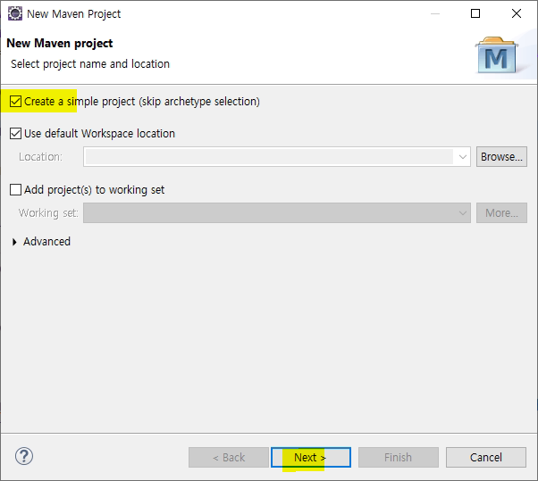

  - 정보 입력 후 Finish
    - artifact id : 프로젝트 명
    - 현재 콘솔모드에서 진행할 것이므로 packaging은 jar

  


- **구성**
  - pom.xml 
    - 메이븐에 대한 환경설정 정보가 들어있음
    - 라이브러리 여기에 추가


- 라이브러리 추가(pom.xml)

  - https://mvnrepository.com/
  - spring-context 검색

  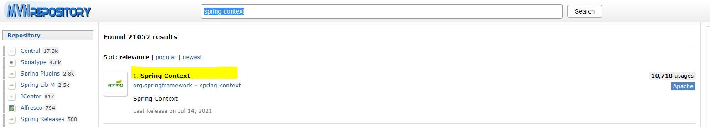

  - 5.2.16

  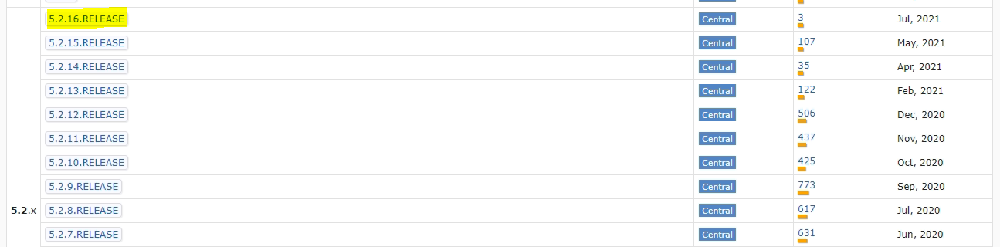

  - 추가

  ```xml
  <project xmlns="http://maven.apache.org/POM/4.0.0" xmlns:xsi="http://www.w3.org/2001/XMLSchema-instance" xsi:schemaLocation="http://maven.apache.org/POM/4.0.0 https://maven.apache.org/xsd/maven-4.0.0.xsd">
    <modelVersion>4.0.0</modelVersion>
    <groupId>kr.ac.kopo</groupId>
    <artifactId>Lecture-Spring</artifactId>
    <version>0.0.1-SNAPSHOT</version>
    
    <dependencies>
    	<!-- spring-context -->
  	<dependency>
  	    <groupId>org.springframework</groupId>
  	    <artifactId>spring-context</artifactId>
  	    <version>5.2.16.RELEASE</version>
  	</dependency>
    </dependencies>
  </project>
  ```

  

  - 저장 경로 D:\maven-repository\org\springframework\spring-context

  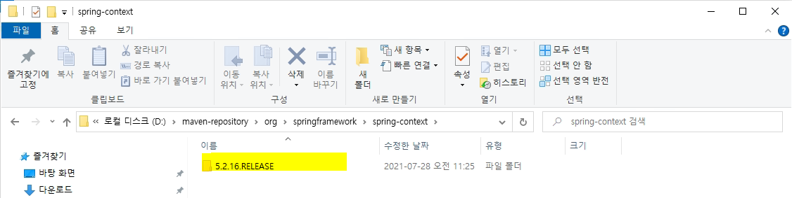


## spring DI

- **spring DI(Dependency Injection)**

  - `DI`란 **스프링이 다른 프레임워크와 차별화되어 제공하는 의존 관계 주입 기능**으로,
    **객체를 직접 생성하는 게 아니라 외부에서 생성한 후 주입 시켜주는 방식**이다.
  - **DI(의존성 주입)를 통해서 모듈 간의 결합도가 낮아지고 유연성이 높아진다.**

  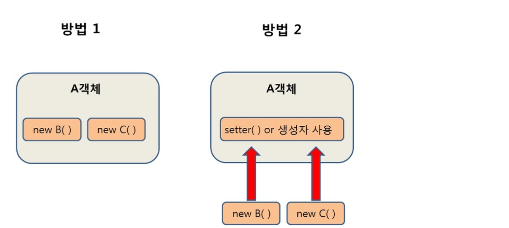

  - 첫번째 방법은 A객체가 B와 C객체를 New 생성자를 통해서 직접 생성하는 방법이고, 두번째 방법은 **외부에서 생성 된 객체를 setter()를 통해 사용하는 방법**이다. 이러한 두번째 방식이 의존성 주입의 예시인데,
    `A 객체`에서 **`B, C객체`를 사용(의존)할 때** `A 객체`에서 **직접 생성 하는 것이 아니라** **`외부(IOC컨테이너)`에서 생성된 `B, C객체`를 조립(주입)시켜 `setter` 혹은 `생성자`를 통해 사용하는 방식**이다.

  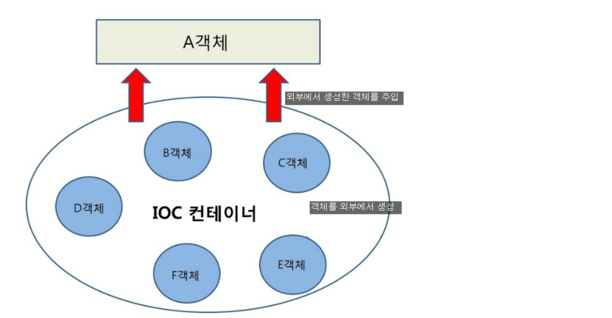

  

  - **스프링에서는 객체를 `Bean`**이라고 부르며, 프로젝트가 실행될때 사용자가 Bean으로 관리하는 객체들의 생성과 소멸에 관련된 작업을 자동적으로 수행해주는데 객체가 생성되는 곳을 스프링에서는 Bean 컨테이너라고 부른다.


- **Ioc(Inversion of Control)**
  - `IoC(Inversion of Control)`란 "제어의 역전" 이라는 의미로, 말 그대로 **메소드나 객체의 호출작업을 개발자가 결정하는 것이 아니라, 외부에서 결정되는 것을 의미**한다.
  - `IoC`는 **제어의 역전이라고 말하며, 간단히 말해 "제어의 흐름을 바꾼다"**라고 한다.
  - 객체의 **의존성을 역전시켜 객체 간의 결합도를 줄이고 유연한 코드를 작성**할 수 있게 하여 **가독성 및 코드 중복, 유지 보수를 편하게** 할 수 있게 한다.
  - 기존에는 다음과 순서로 객체가 만들어지고 실행되었다.
    - 객체 생성
    - 의존성 객체 생성
      *클래스 내부에서 생성*
    - 의존성 객체 메소드 호출
  - 하지만, 스프링에서는 다음과 같은 순서로 객체가 만들어지고 실행된다.
    - 객체 생성
    - 의존성 객체 주입
      *스스로가 만드는것이 아니라 제어권을 **스프링에게 위임하여 스프링이 만들어놓은 객체를 주입**한다.*
    - 의존성 객체 메소드 호출
  - **스프링이 모든 의존성 객체를 스프링이 실행될때 다 만들어주고 필요한곳에 주입**시켜줌으로써 **Bean들은 `싱글턴 패턴`의 특징**을 가지며, **제어의 흐름을 사용자가 컨트롤 하는 것이 아니라 스프링에게 맡겨 작업을 처리**하게 된다.
  - 개발자가 그때마다 필요한 객체를 자신이 만들고 지우고 하는 방식을 사용했는데 스프링에 있는 loc는 객체를 만드는 행위를 개발자가 하는 것이 아니고 미리 spring이 프로그램을 실행할 때 객체를 다 만들고 개발자가 해당 객체를 사용하고 싶으면 new로 만드는 것이 아니고 만들어진 객체를 가져와서 메소드를 실행
  - 즉, 인스턴스의 생명주기 관리를 개발자가 아닌 컨테이너가 처리함 
  - 스프링이 객체를 만들면 컨테이너에 저장하고 개발자가 그 컨테이너에서 가져와 사용하는 것임
  - 유지보수가 편하다. 
  - 컨테이너에서 가져와서 의존성 주입을 하는 것임(DI)


- **Container**

  - Spring Container

    - spring 프레임워크에서 container 기능을 제공해 주는 클래스를 의미
    - Container : Bean 클래스를 관리(생성, 삭제 등) 하는 주체
      - spring에서 관리되는 인스턴스의 개수만큼 bean 클래스를 생성
    - Bean : Spring에서 관리되는 클래스 객체를 나타냄
    - Container초기화 방법 : 설정 정보 xml 파일을 읽고 Container에 로딩

  - Container 종류

    - BeanFactory
      - XmlBeanFactory
    - ApplicationContext
      - ClassPathXmlApplicationContext
        - 클래스 패스를 기준으로 xml을 읽어와서 객체를 관리 
      - FileSystemXmlApplicationContext
        - 파일 경로를 통해서 xml을 읽어서 관리
      - XmlWebApplicationContext

    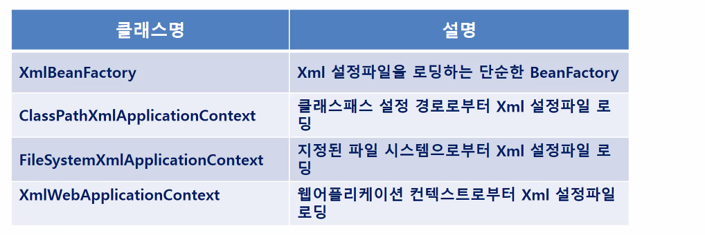


- **Container - XML**
  - Spring XML 파일
    - SPRING은 XML 설정정보를 참조하여 여러가지 Container Service를 제공
    - 유지보수 작업 시 xml 파일을 조정


- **Container - Bean**

  - bean을 이용해서 컨테이너에 객체를 등록
  - 일반적으로 id와 class에 대해서 작성

  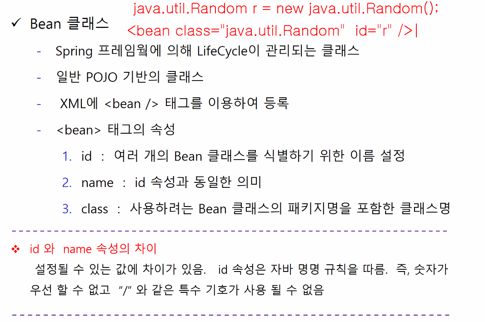


- **Container - ApplicationContext**

  - bean은 필요한 시점에 만들어 지는데 
  - applicationContext는 한 번에 다 만들어 진다.

  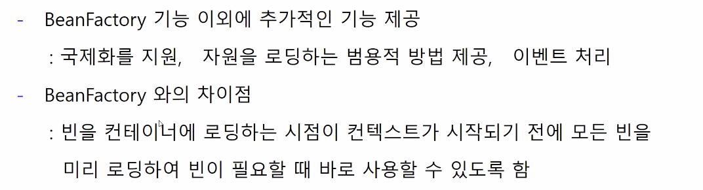


- 실습

  - 파일 생성

  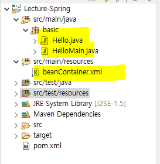 

  - Hello.java

  ```java
  package basic;
  
  public class Hello {
  	public Hello() {
  		System.out.println("셍성완료...");
  	}
  	
  	public void printMsg() {
  		System.out.println("안녕하세요.");
  	}
  }
  
  ```

  

  - beanContainer.xml

  ```xml
  <?xml version="1.0" encoding="UTF-8"?>
  <beans xmlns="http://www.springframework.org/schema/beans"
     xmlns:xsi="http://www.w3.org/2001/XMLSchema-instance"
     xsi:schemaLocation="http://www.springframework.org/schema/beans
                    http://www.springframework.org/schema/beans/spring-beans.xsd">
                    
  	<!-- Hello hello = new Hello() -->
      <bean class="basic.Hello" id="hello"/>       
      <bean class="basic.Hello" id="hello2"/>       
  </beans>
  ```

  

  - 자동완성 설정

  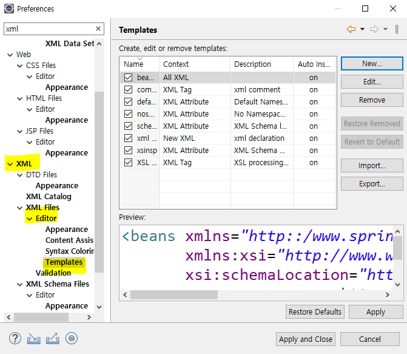

  

  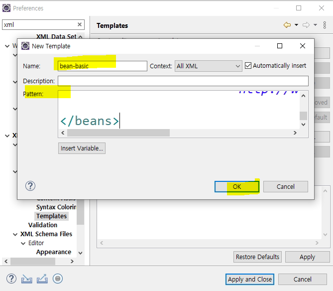

  

  - HelloMain.java

  ```java
  package basic;
  
  import org.springframework.context.ApplicationContext;
  import org.springframework.context.support.ClassPathXmlApplicationContext;
  
  public class HelloMain {
  
  	public static void main(String[] args) {
  		
  		ApplicationContext context = new ClassPathXmlApplicationContext("beanContainer.xml");
  		//src/main/resources가 class path임 
  		//컨테이너(context)
  		
  		//컨테이너를 통해서 객체 하나를 가져옴
  		//리턴값이 object라서 형변환
  		Hello obj = (Hello)context.getBean("hello");
  		obj.printMsg();
  		
  		//또 다른 방법
  		Hello obj2 = context.getBean("hello2",Hello.class);
  		obj2.printMsg();
  		/*
  		Hello obj = new Hello();
  		obj.printMsg();
  		*/
  	}
  
  }
  
  ```

  

  

  - beanContainer.xml
    - lazy-init="true" : 원래는 객체를 모두 읽고 사용했는데 lazy-init="true" 를 사용하면 hello2를 사용하는 순간 객체가 생성 

  ```xml
  <?xml version="1.0" encoding="UTF-8"?>
  <beans xmlns="http://www.springframework.org/schema/beans"
     xmlns:xsi="http://www.w3.org/2001/XMLSchema-instance"
     xsi:schemaLocation="http://www.springframework.org/schema/beans
                    http://www.springframework.org/schema/beans/spring-beans.xsd">
                    
  	<!-- Hello hello = new Hello() -->
      <bean class="basic.Hello" id="hello"/>       
      <bean class="basic.Hello" id="hello2" lazy-init="true"/>       
  </beans>
  ```

  


- 의존주입 예(타이어가 있는 자동차를 만드는 경우(사용자가 직접 타이어를 넣고싶어서)) - 생성자 주입

  - Car.jar

  ```java
  package di.basic;
  
  public class Car {
  	
  	//의존관계 발생
  	private Tire tire;
  	
  	//의존성이 있는 객체를 받아오는데 생성자를 통해서 주입
  	//즉, 의존주입(DI) : 생성자 주입
  	public Car(Tire tire) { //이미 외부에서(main) 만들어진 객체를 주입 받음(생성자 주입)
  		this.tire = tire;
  	}
  	
  	public Car() {
  		//의존관계 설정
  		tire = new HankookTire();
  	}
  	
  	public void printTireBrand() {
  		System.out.println("작창된 타이어 : " + tire.getBrand());
  	}
  }
  
  ```

  

  - Tire.java

  ```java
  package di.basic;
  
  public interface Tire {
  	String getBrand();
  }
  
  ```

  

  - DriverMain.java

  ```java
  package di.basic;
  
  public class DriverMain {
  
  	public static void main(String[] args) {
  		
  		HankookTire han = new HankookTire();
  		KumhoTire kum = new KumhoTire();
  		
  		Car car = new Car(han); //외부에서 만들어진 tire 객체를 주입
  		//car class에서 tire 객체가 필요하므로
  		
  		/*
  		Car car = new Car();
  		car.printTireBrand();
  		*/
  	}
  
  }
  
  ```

  

  - HankookTire.java

  ```java
  package di.basic;
  
  public class HankookTire implements Tire {
  
  	public String getBrand() {
  		return "한국타이어";
  	}
  
  }
  
  ```

  

  - KumhoTire.java

  ```java
  package di.basic;
  
  public class KumhoTire implements Tire {
  
  	public String getBrand() {
  		return "금호타이어";
  	}
  
  }
  
  ```

  

- **타이어가 설치되어 있지 않은 자동차만 만드는 경우**

  - DriverMain.java

  ```java
  package di.basic;
  
  public class DriverMain {
  
  	public static void main(String[] args) {
  		
  		HankookTire han = new HankookTire();
  		KumhoTire kum = new KumhoTire();
  		
  		
  		Car car = new Car();
  		car.setTire(han);
  		
  		/*
  		Car car = new Car(han); //외부에서 만들어진 tire 객체를 주입
  		//car class에서 tire 객체가 필요하므로
  		*/
  		
  		
  		/*
  		Car car = new Car();
  		car.printTireBrand();
  		*/
  	}
  
  }
  
  ```

  - Car.java

  ```java
  package di.basic;
  
  public class Car {
  	
  	//의존관계 발생
  	private Tire tire;
  	
  	//의존성이 있는 객체를 받아오는데 생성자를 통해서 주입
  	//즉, 의존주입(DI) : 생성자 주입
  	public Car(Tire tire) { //이미 외부에서(main) 만들어진 객체를 주입 받음(생성자 주입)
  		this.tire = tire;
  	}
  	
  	public Car() {
  		
  	}
  	
  	//DI 의존주입 : setter 주입
  	public void setTire(Tire tire) {
  		this.tire = tire;
  	}
  
  	/*
  	public Car() {
  		//의존관계 설정
  		tire = new HankookTire();
  	}
  	*/
  	public void printTireBrand() {
  		System.out.println("작창된 타이어 : " + tire.getBrand());
  	}
  }
  
  ```


- DI

  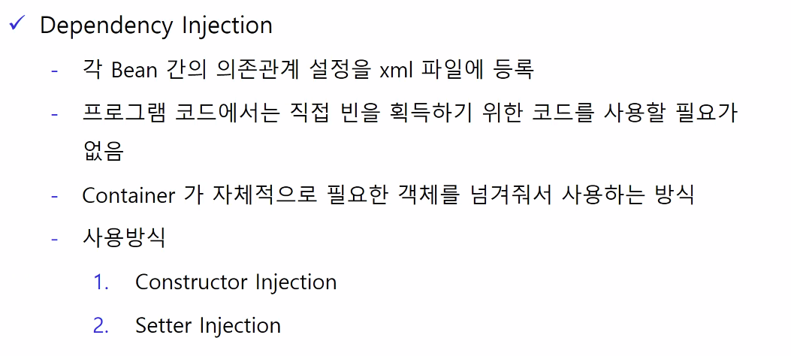

  


- 실습 - xml 파일에 spring container 생성 - setter

  - di-xml01.xml
    - property : setter 주입 설정
      - property의 name은 setter의 이름을 의미한다.(setTire)

  ```xml
  <?xml version="1.0" encoding="UTF-8"?>
  <beans xmlns="http://www.springframework.org/schema/beans"
     xmlns:xsi="http://www.w3.org/2001/XMLSchema-instance"
     xsi:schemaLocation="http://www.springframework.org/schema/beans
                    http://www.springframework.org/schema/beans/spring-beans.xsd">
                    
  	<bean class="di.xml01.Car" id="car"/>                  
  	<bean class="di.xml01.HankookTire" id="tire"/>     
  	   
  	<bean class="di.xml01.HankookTire" id="hankook"/>        
  	<bean class="di.xml01.KumhoTire" id="kumho"/>        
  	
  	<bean class="di.xml01.Car" id="car2"> 
          <!-- name : class에서 사용할 setter이름  -->
  		<property name="tire" ref="kumho"></property>
  	</bean>          
  </beans>
```
  

  
- DriverMain.java
  
  ```java
  package di.xml01;
  
  import org.springframework.context.ApplicationContext;
  import org.springframework.context.support.GenericXmlApplicationContext;
  
  public class DriverMain {
  
  	public static void main(String[] args) {
  		//Spring Container 방법 1 
  		/*
  		ApplicationContext context = new GenericXmlApplicationContext("di-xml01.xml");
  		Car car = context.getBean("car",Car.class);
  		Tire tire = context.getBean("tire", Tire.class);
  		car.setTire(tire);
  		car.printTireBrand();
  		*/
  		
  		//방법 2 property로 setter 주입
  		ApplicationContext context = new GenericXmlApplicationContext("di-xml01.xml");
  		Car car = context.getBean("car2",Car.class);
  		car.printTireBrand();
  		
  		/*
  		Car car = new Car();
  		Tire tire = new HankookTire();
  		car.setTire(tire);
  		car.printTireBrand();
  		*/
  	}
  
  }
```
  
- Car.java
  
  ```java
  package di.xml01;
  
  public class Car {
  	private Tire tire;
  	
  	//setter 주입
  	public void setTire(Tire tire) {
  		this.tire = tire;
  		System.out.println("setTire(Tire) 호출 ...");
  	}
  	
  	public void printTireBrand() {
  		System.out.println("장착된 타이어 : " + tire.getBrand());
  	}
  }
  
```
  
  