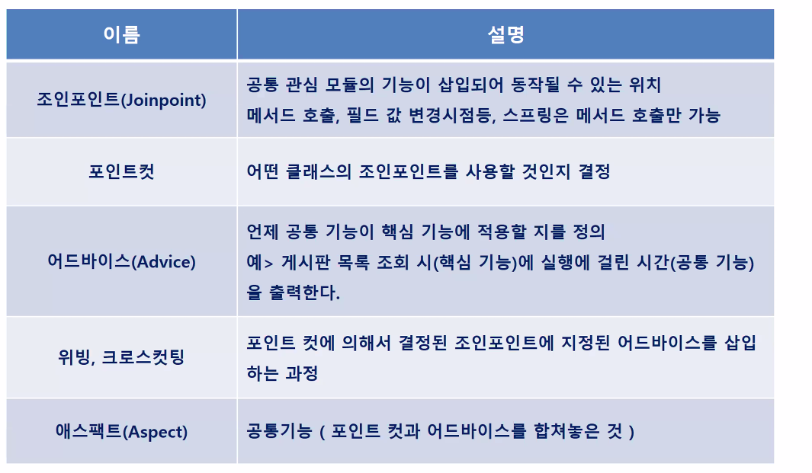

## Spring AOP

- **기존 OOP 방식 한계**

  


- **AOP 목적**

  


- **AOP 기술**

  - 공통의 코드와 핵심 코드를 분리시키는 기술이 중요 
    - 어떤 메소드가 실행하기 전에 코드를 주입

  

  - 프록시가 요청을 훔쳐서 앞의 공통의 코드가 있으면 그곳에서 aaa() 호출하기 전에 bbb() (공통코드)를 수행한 뒤 알아서 aaa()로 가게 만들어 준다. 
    - 외부에서는 중간에 어떤 메소드가 실행되는지 모른다. 

  


- Spring aop 특징
  - Runtime 기반
  - Proxy 기반
  - 인터페이스 기반


- **실습**

  - Employee.java

  ```java
  package aop.pojo;
  
  public interface Employee {
  	void work();
  }
  ```

  - Programmer.java
    - Employee를 상속

  ```java
  package aop.pojo;
  
  public class Programmer implements Employee {
  
  	public void work() {
  		System.out.println("출근을 한다.");
  		System.out.println("시스템 개발을 합니다.");
  		System.out.println("퇴근을 한다.");
  	}
  }
  ```

  - Designer.java
    - Employee를 상속

  ```java
  package aop.pojo;
  
  public class Designer implements Employee{
  	public void work() {
  		System.out.println("출근을 한다.");
  		System.out.println("제품 디자인을 합니다.");
  		System.out.println("퇴근을 한다.");
  	}
  }
  ```

  - EmpMain.java

  ```java
  package aop.pojo;
  
  public class EmpMain {
  
  	public static void main(String[] args) {
  		Employee e1 = new Programmer();
  		e1.work();
  		Employee e2 = new Designer();
  		e2.work();
  	}
  }
  ```

  

  

  - 공통적으로 구현되고 있는 코드가 존재(출근, 퇴근)해서 유지보수가 편하지 않음
    - 그래서 공통의 코드를 핵심코드와 분리
  - Action.java (공통의 코드를 모아놓은 class)

  ```java
  package aop.pojo;
  
  public class Action {
  	public static void gotoOffice() {
  		System.out.println("출근을 합니다.");
  	}
  	
  	public static void getoffOffice() {
  		System.out.println("퇴근을 합니다.");
  	}
  }
  
  ```

  - Programmer.java

  ```java
  package aop.pojo;
  
  public class Programmer implements Employee {
  
  	public void work() {
  		Action.gotoOffice();
  		System.out.println("시스템 개발을 합니다.");
  		Action.getoffOffice();
  	}
  
  }
  
  ```

  - Designer.java

  ```java
  package aop.pojo;
  
  public class Designer implements Employee{
  	public void work() {
  		Action.gotoOffice();
  		System.out.println("제품 디자인을 합니다.");
  		Action.getoffOffice();
  	}
  }
  ```

  

  - Manager.java
    - 단점 : 자바에서 OOP 방식은 공통의 코드를 써주지 않으면 실행이 되지 않음
    - 공통의 코드를 개발자가 넣어야 한다. 

  ```java
  package aop.pojo;
  
  public class Manager implements Employee{
  	public void work() {
  		Action.gotoOffice();
  		System.out.println("팀원들과 회의를 합니다.");
          //공통 퇴근 코드가 없음
  	}
  }
  
  ```

  

  - 그래서 프로그램이 실행하는 도중에 프록시를 사용하여 알아서 코드를 주입하는 AOP가 나온 것이다.

  

- **AOP**

  

  

- **AOP 용어**

  - **어드바이스** : 어느 **시점**에 삽입 시킬지(ex. 수행하는 중간, 수행한 후)
  - **포인트컷** : 어떤 핵심 코드를 수행하려고 할 때 공통코드를 삽입시키는 것이니까 **어떤 코드를** 실행시키려 한다. 이것이 포인트컷 - (ex. a라는 매소드가 실행될 때 공통코드를 넣을 거야) 
  - 그래서 공통의 코드 안에 포인트컷과 어드바이스를 설정해야 한다. 이 설정한 부분이 **애스펙트**이다.
  - 핵심코드에는 공통코드와 관련된 것이 적혀있으면 안된다. 
  - runtime 시에 어떤 클래스가 실행되었고, 매개변수나 리턴 값, 누가 호출했는지 등에 대한 정보를 관리하는 것이 **조인포인트** 

  


- **Advice 용어**

  


- **advice 관련 태그 정보**

  


- **AOP 실습(위의 OOP 수정)**

  - 라이브러리 추가

  

  ```xml
  <!-- https://mvnrepository.com/artifact/org.aspectj/aspectjweaver -->
  <dependency>
      <groupId>org.aspectj</groupId>
      <artifactId>aspectjweaver</artifactId>
      <version>1.9.7</version>
      <scope>runtime</scope>
  </dependency>
  
  <!-- https://mvnrepository.com/artifact/org.aspectj/aspectjrt -->
  <dependency>
      <groupId>org.aspectj</groupId>
      <artifactId>aspectjrt</artifactId>
      <version>1.9.7</version>
      <scope>runtime</scope>
  </dependency>
  
  ```

  - Employee.java

  ```java
  package aop.xml;
  
  ```

public interface Employee {
  	void work();	
}
  ```
  
  - Programmer.java

  ```java
package aop.xml;
  
  public class Programmer implements Employee {
  
	public void work() {
  		System.out.println("시스템 개발을 합니다..");
	}
  }
  ```

- Designer.java
  
```java
  package aop.xml;
  
  public class Designer implements Employee{
	public void work() {
  		System.out.println("제품 디자인을 합니다.");
	}
  }
```

- MyAspect.java
  
```java
  package aop.xml;
  
  public class MyAspect {
	public static void gotoOffice() {
  		System.out.println("출근을 합니다.");
	}
  	
  	/*
  	public static void getoffOffice() {
		System.out.println("퇴근을 합니다.");
  	}
	*/
  }
  
```

  - aop-xml.xml

  ```xml
  <beans xmlns="http://www.springframework.org/schema/beans"
     xmlns:xsi="http://www.w3.org/2001/XMLSchema-instance"
     xmlns:aop="http://www.springframework.org/schema/aop"
     xsi:schemaLocation="http://www.springframework.org/schema/beans
                    http://www.springframework.org/schema/beans/spring-beans.xsd
                    http://www.springframework.org/schema/aop
                    http://www.springframework.org/schema/aop/spring-aop.xsd">
                    
  	<bean class="aop.xml.Programmer" id="programmer"/>
  	<bean class="aop.xml.Designer" id="designer"/>                  
  	<bean class="aop.xml.MyAspect" id="myAspect"/>
  	
  	<aop:config>
  		<aop:aspect ref="myAspect">
  			<aop:before method="gotoOffice" pointcut="execution(public void aop.xml.Programmer.work())"/>
  		</aop:aspect>
  	</aop:config>
  	                
  </beans>
  ```

  - EmpMain

  ```java
  package aop.xml;
  
  import org.springframework.context.ApplicationContext;
  import org.springframework.context.support.GenericXmlApplicationContext;
  
  /*
   * spring aop 특징
   * 1. runtime 기반
   * 2. Proxy 기반
   * 3. 인터페이스 기반
   */
  
  public class EmpMain {
  
  	public static void main(String[] args) {
  		ApplicationContext context = new GenericXmlApplicationContext("aop-xml.xml");
  		Employee e1 = context.getBean("programmer", Employee.class);
  		//Employee e2 = context.getBean("designer", Employee.class);
  		e1.work();
  		//e2.work();
  	}
  
  }
  
  ```

  - 디자이너, 프로그래머 둘 다 사용할 때로 수정하면 

  ```java
  <beans xmlns="http://www.springframework.org/schema/beans"
     xmlns:xsi="http://www.w3.org/2001/XMLSchema-instance"
     xmlns:aop="http://www.springframework.org/schema/aop"
     xsi:schemaLocation="http://www.springframework.org/schema/beans
                    http://www.springframework.org/schema/beans/spring-beans.xsd
                    http://www.springframework.org/schema/aop
                    http://www.springframework.org/schema/aop/spring-aop.xsd">
                    
  	<bean class="aop.xml.Programmer" id="programmer"/>
  	<bean class="aop.xml.Designer" id="designer"/>                  
  	<bean class="aop.xml.MyAspect" id="myAspect"/>
  	
  	<aop:config>
  		<aop:aspect ref="myAspect">
  			<aop:before method="gotoOffice" pointcut="execution(public void aop.xml.*.work())"/>
  		</aop:aspect>
  	</aop:config>
  	                
  </beans>
  ```

  - main

  ```java
  package aop.xml;
  
  import org.springframework.context.ApplicationContext;
  import org.springframework.context.support.GenericXmlApplicationContext;
  
  /*
   * spring aop 특징
   * 1. runtime 기반
   * 2. Proxy 기반
   * 3. 인터페이스 기반
   */
  
  public class EmpMain {
  
  	public static void main(String[] args) {
  		ApplicationContext context = new GenericXmlApplicationContext("aop-xml.xml");
  		Employee e1 = context.getBean("programmer", Employee.class);
  		Employee e2 = context.getBean("designer", Employee.class);
  		e1.work();
  		e2.work();
  	}
  
  }
  
  ```

  


- **pointcut 지시자**

  - 접근제한자, 패키지 생략 가능

  


- **AspectJ 에서의 사용되는 표현식**

  - 와일드 카드 연산자

  

  - 패턴 매칭

  

  - TYPE

  

  - modifier 설정

  

  - ex. execution("* aop.xml.*.*(..)")
    - 반환타입이 뭐든 aop.xml 패키지 밑에 있는 모든 클래스의 메소드들
    - ..은 모든 파라미터라는 의미를 가지고 있다.


- **퇴근까지 추가**

  - MyAspect

  ```java
  package aop.xml;
  
  public class MyAspect {
  	public static void gotoOffice() {
  		System.out.println("출근을 합니다.");
  	}
  	
  	
  	public static void getoffOffice() {
  		System.out.println("퇴근을 합니다.");
  	}
  	
  }
  
  ```

  - xml

  ```xml
  <beans xmlns="http://www.springframework.org/schema/beans"
     xmlns:xsi="http://www.w3.org/2001/XMLSchema-instance"
     xmlns:aop="http://www.springframework.org/schema/aop"
     xsi:schemaLocation="http://www.springframework.org/schema/beans
                    http://www.springframework.org/schema/beans/spring-beans.xsd
                    http://www.springframework.org/schema/aop
                    http://www.springframework.org/schema/aop/spring-aop.xsd">
                    
  	<bean class="aop.xml.Programmer" id="programmer"/>
  	<bean class="aop.xml.Designer" id="designer"/>                  
  	<bean class="aop.xml.MyAspect" id="myAspect"/>
  	
  	<aop:config>
  		<aop:aspect ref="myAspect">
  			<aop:before method="gotoOffice" pointcut="execution(public void aop.xml.*.work())"/>
  			<aop:after method="getoffOffice" pointcut="execution(* aop.xml.*.work())"/>
  		</aop:aspect>
  	</aop:config>
  	                
  </beans>
  ```

  

  - 포인트컷에 이름을 넣어서 만들기 xml

  ```xml
  <beans xmlns="http://www.springframework.org/schema/beans"
     xmlns:xsi="http://www.w3.org/2001/XMLSchema-instance"
     xmlns:aop="http://www.springframework.org/schema/aop"
     xsi:schemaLocation="http://www.springframework.org/schema/beans
                    http://www.springframework.org/schema/beans/spring-beans.xsd
                    http://www.springframework.org/schema/aop
                    http://www.springframework.org/schema/aop/spring-aop.xsd">
                    
  	<bean class="aop.xml.Programmer" id="programmer"/>
  	<bean class="aop.xml.Designer" id="designer"/>                  
  	<bean class="aop.xml.MyAspect" id="myAspect"/>
  	
  	<aop:config>
  		<aop:pointcut expression="execution(* aop.xml.*.work())" id="pointcut01"/>
  		<aop:aspect ref="myAspect">
  			<aop:before method="gotoOffice" pointcut-ref="pointcut01"/>
  			<aop:after method="getoffOffice" pointcut="execution(* aop.xml.*.work())"/>
  		</aop:aspect>
  	</aop:config>
  	                
  </beans>
  ```

  

- **전체적인 그림**

  - 프록시가 전체적으로 감시하고 있어서 먼저 요청을 가로챈다. 공통의 코드가 언제 실행되는지 확인
  - 그래서 MyAspect로 가서 실행시키고 다시 돌아가서 해당 work()로 간다. 

  


- 위처럼 코딩을 진행하면 xml의 파일의 aspect가 점점 늘어날 것이다. 그래서 MyAspect의 메소드가 어떤 시점에 들어갈지만 알면 되니까 어노테이션을 이용한다.


- **어노테이션을 기반 aop **

  

  - 스키마다 관련된 어노테이션
    - after-throwing : 예외 던지기
    - after-returing : try 문을 실행하다가 예외가 없으면 after-returing에 있는 공통코드가 실행
    - after-throwing : try를 실행하다가 예외 발생하면 감(catch)
    - after : finally(무조건 실행)
    - aop 관련된 어노테이션은 Aspect에서만 쓰인다.

  


- **aop 어노테이션 실습**

  - xml

  ```xml
  <?xml version="1.0" encoding="UTF-8"?>
  <beans xmlns="http://www.springframework.org/schema/beans"
     xmlns:context="http://www.springframework.org/schema/context"
     xmlns:aop="http://www.springframework.org/schema/aop"
     xmlns:xsi="http://www.w3.org/2001/XMLSchema-instance"
     xsi:schemaLocation="http://www.springframework.org/schema/beans
                    http://www.springframework.org/schema/beans/spring-beans.xsd
                    http://www.springframework.org/schema/context
                    http://www.springframework.org/schema/context/spring-context.xsd
                    http://www.springframework.org/schema/aop
                    http://www.springframework.org/schema/aop/spring-aop.xsd">
                    
  	<context:annotation-config />
  	<aop:aspectj-autoproxy />
  	<bean class="aop.anno.Programmer" id="programmer" />
  	<bean class="aop.anno.Designer" id="designer" />
  	<bean class="aop.anno.MyAspect" id="myAspect" />
  
  </beans>
  ```

  - MyAspect.java

  ```java
  package aop.anno;
  
  import org.aspectj.lang.annotation.After;
  import org.aspectj.lang.annotation.Aspect;
  import org.aspectj.lang.annotation.Before;
  
  @Aspect
  public class MyAspect {
  	
  	@Before("execution(void aop.anno.*.work())")
  	public static void gotoOffice() {
  		System.out.println("출근을 합니다.");
  	}
  	
  	@After("execution(void aop.anno.*.work())")
  	public static void getoffOffice() {
  		System.out.println("퇴근을 합니다.");
  	}
  	
  }
  
  ```

  - main.java

  ```java
  package aop.anno;
  
  import org.springframework.context.ApplicationContext;
  import org.springframework.context.support.GenericXmlApplicationContext;
  
  /*
   * spring aop 특징
   * 1. runtime 기반
   * 2. Proxy 기반
   * 3. 인터페이스 기반
   */
  
  public class EmpMain {
  
  	public static void main(String[] args) {
  		ApplicationContext context = new GenericXmlApplicationContext("aop-anno.xml");
  		Employee e1 = context.getBean("programmer", Employee.class);
  		Employee e2 = context.getBean("designer", Employee.class);
  		e1.work();
  		e2.work();
  	}
  
  }
  
  ```

  

  - 위에서 만들었던 다른 패키지의 aop.xml.Programmer 불러오기
  - xml

  ```xml
  <?xml version="1.0" encoding="UTF-8"?>
  <beans xmlns="http://www.springframework.org/schema/beans"
     xmlns:context="http://www.springframework.org/schema/context"
     xmlns:aop="http://www.springframework.org/schema/aop"
     xmlns:xsi="http://www.w3.org/2001/XMLSchema-instance"
     xsi:schemaLocation="http://www.springframework.org/schema/beans
                    http://www.springframework.org/schema/beans/spring-beans.xsd
                    http://www.springframework.org/schema/context
                    http://www.springframework.org/schema/context/spring-context.xsd
                    http://www.springframework.org/schema/aop
                    http://www.springframework.org/schema/aop/spring-aop.xsd">
                    
  	<context:annotation-config />
  	<aop:aspectj-autoproxy />
  	<bean class="aop.anno.Programmer" id="programmer" />
  	<bean class="aop.anno.Designer" id="designer" />
  	<bean class="aop.anno.MyAspect" id="myAspect" />
  	<bean class="aop.xml.Programmer" id="programmer2" />
  
  </beans>
  ```

  - EmpMain.java

  ```java
  package aop.anno;
  
  import org.springframework.context.ApplicationContext;
  import org.springframework.context.support.GenericXmlApplicationContext;
  
  /*
   * spring aop 특징
   * 1. runtime 기반
   * 2. Proxy 기반
   * 3. 인터페이스 기반
   */
  
  public class EmpMain {
  
  	public static void main(String[] args) {
  		ApplicationContext context = new GenericXmlApplicationContext("aop-anno.xml");
  		Employee e1 = context.getBean("programmer", Employee.class);
  		Employee e2 = context.getBean("designer", Employee.class);
  		e1.work();
  		e2.work();
  		
  		aop.xml.Employee e3 = context.getBean("programmer2",aop.xml.Employee.class);
  		e3.work();
  	}
  
  }
  
  ```

  

  - MyAspect.java의 gotoOffice를 바꿔주면??

  ```java
  package aop.anno;
  
  import org.aspectj.lang.annotation.After;
  import org.aspectj.lang.annotation.Aspect;
  import org.aspectj.lang.annotation.Before;
  
  @Aspect
  public class MyAspect {
  	
  	@Before("execution(void aop.*.*.work())")
  	public static void gotoOffice() {
  		System.out.println("출근을 합니다.");
  	}
  	
  	@After("execution(void aop.anno.*.work())")
  	public static void getoffOffice() {
  		System.out.println("퇴근을 합니다.");
  	}
  	
  }
  
  ```

  

  

- java를 사용하여 aop 진행

  - Config.java
    - @Configuration 
      - 어노테이션기반 환경구성을 돕는다.
      - 이 어노테이션을 구현함으로써 클래스가 하나 이상의 `@Bean` 메소드를 제공하고 스프링 컨테이가 Bean정의를 생성하고 런타임시 그 Bean들이 요청들을 처리할 것을 선언하게 된다.
    - @ComponentScan
      - scan의 범위를 지정
      - 괄호 안에 직접 패키지 경로를 적어주어 스캔할 위치를 지정

  ```java
  package aop.java;
  
  import org.springframework.context.annotation.ComponentScan;
  import org.springframework.context.annotation.Configuration;
  import org.springframework.context.annotation.EnableAspectJAutoProxy;
  
  @EnableAspectJAutoProxy
  @ComponentScan(basePackages = {"aop.java"})
  @Configuration
  public class Config {
  
  }
  
  ```

  - Programmer.java

  ```java
  package aop.java;
  
  import org.springframework.stereotype.Component;
  
  @Component
  public class Programmer implements Employee {
  
  	public void work() {
  		System.out.println("시스템 개발을 합니다..");
  	}
  
  }
  
  ```

  - Designer.java

  ```java
  package aop.java;
  
  import org.springframework.stereotype.Component;
  
  @Component
  public class Designer implements Employee{
  	public void work() {
  		System.out.println("제품 디자인을 합니다.");
  	}
  }
  
  ```

  - MyAspect.java

  ```java
  package aop.java;
  
  import org.aspectj.lang.annotation.After;
  import org.aspectj.lang.annotation.Aspect;
  import org.aspectj.lang.annotation.Before;
  import org.springframework.stereotype.Service;
  
  @Service
  @Aspect
  public class MyAspect {
  	
  	@Before("execution(void aop.*.*.work())")
  	public static void gotoOffice() {
  		System.out.println("출근을 합니다.");
  	}
  	
  	@After("execution(void aop.java.*.work())")
  	public static void getoffOffice() {
  		System.out.println("퇴근을 합니다.");
  	}
  	
  }
  
  ```

  - main.java

  ```java
  package aop.java;
  
  import org.springframework.context.ApplicationContext;
  import org.springframework.context.annotation.AnnotationConfigApplicationContext;
  
  /*
   * spring aop 특징
   * 1. runtime 기반
   * 2. Proxy 기반
   * 3. 인터페이스 기반
   */
  
  public class EmpMain {
  
  	public static void main(String[] args) {
  		ApplicationContext context = new AnnotationConfigApplicationContext(Config.class);
  		Employee e1 = context.getBean("programmer", Employee.class);
  		Employee e2 = context.getBean("designer", Employee.class);
  		e1.work();
  		e2.work();
  		
  	}
  
  }
  
  ```


- 참고

  