# Spring MVC

- **Front Controller 패턴 적용**
  - FrontController 패턴을 적용하면 하나의 Servlet에서 모든 요청을 받아들여 적절한 Controller로 요청을 위임해준다. 
  - 한곳에서 모든 사용자의 요청을 컨트롤할 수 있는것에 대한 장점은 기본적으로 사용자의 모든 요청에 대해 `인코딩처리`, `에러 페이지 처리`, `공지` 등에 대한 처리를 한곳에서 할 수 있다.

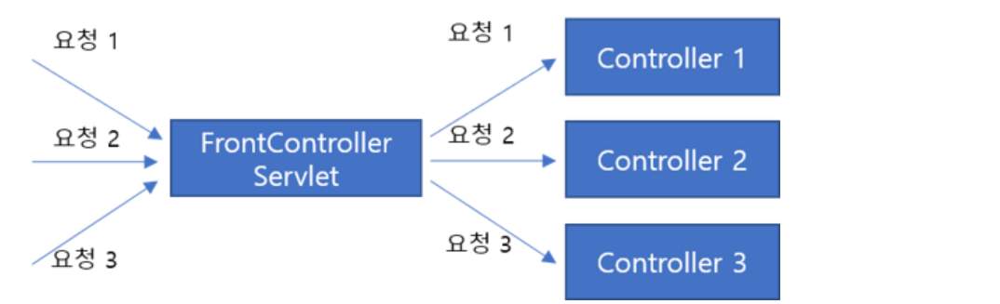


- **Dispatcher Servlet**

  - Spring에서는 위와 같은 Front Controller 패턴을 취하는 Servlet을 미리 만들어 두었다.

  - 그것이 바로 Dispatcher Servlet이다. 즉, 모든 **요청을 한곳에서 받아서 필요한 처리**들을 한 뒤, **요청에 맞는 handler로 요청을 Dispatch**하고, 해당 **Handler의 실행 결과를 Http Response형태로 만드는 역할**을 한다.

  - 구조

    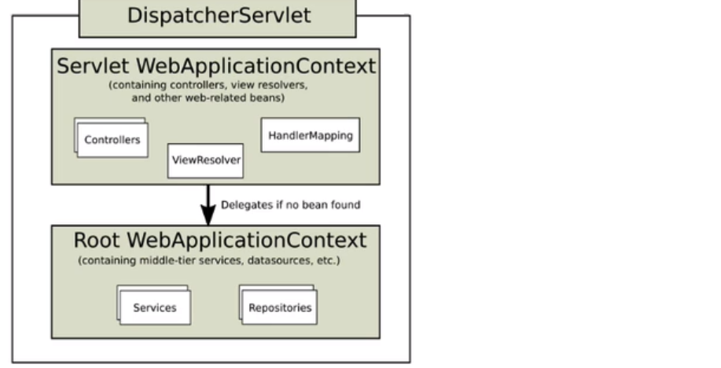

    - `DispatcherServlet`은 앞선 포스팅에서 살펴본 `ContextLoaderListener`에 의해 `ServletContext`에 등록된 `ApplicationContext`를 상속받아 `WebApplicationContext`를 생성합니다. 위 그림의 `Root WebApplicationContext`가 ContextLoaderListener에 의해 등록된 ApplicationContext이며 `Servlet WebApplicationContext`가 그것을 상속받아 `DispatcherServlet`에서 자동으로 만든 ApplicationContext입니다.
    - 요약을 하자면 **Root WebApplicationContext**는`ContextLoaderListener`에 의해 `ServletContext`에 등록되는 ApplicationContext로 모든 Servlet이 사용가능하다.
    - **Servlet WebApplicationContext**는`DispatcherServlet`에서 `Root WebApplicationContext`를 상속받아 만든 ApplicationContext 으로 해당 `DispathcerServlet` 안에서만 사용이 가능하다.

  - 구조의 이유

    - 위의 그림을 자세히 보시면 Root WebApplicationContext에는 모든 Servlet에서 공용으로 사용가능하게 보이는 `Services, Repositories` Bean이 등록되어 있는것을 볼 수 있습니다. 때문에, `DispatcherServlet`이 여러개가 필요한 Application이 있을 수도 있기 때문에, `Root WebApplicationContext`을 `DispatcherServlet`에서 다시 상속을 받아 필요한 기능을 추가하여 사용하도록 구조를 만들어 두었다고 한다.

  

### 프로젝트 생성 

- Maven 프로젝트를 선택 후 Next 버튼을 클릭

  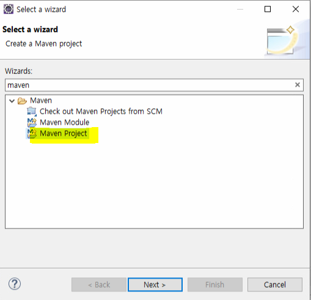 

 

- **Create a simple project 체크 후 Next 클릭**

  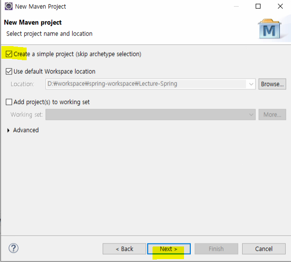 

 

- **입력창에 다음과 같이 입력 후 Finish 클릭**

  - war는 웹을 구성

  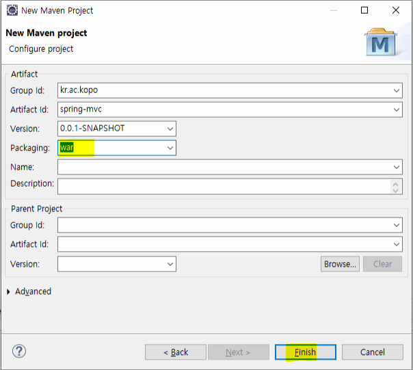 


- **pom.xml**

  - dependency 추가

  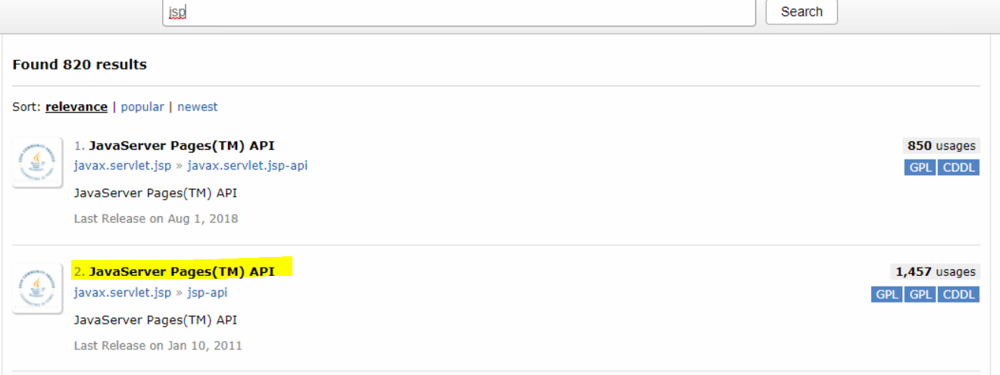

  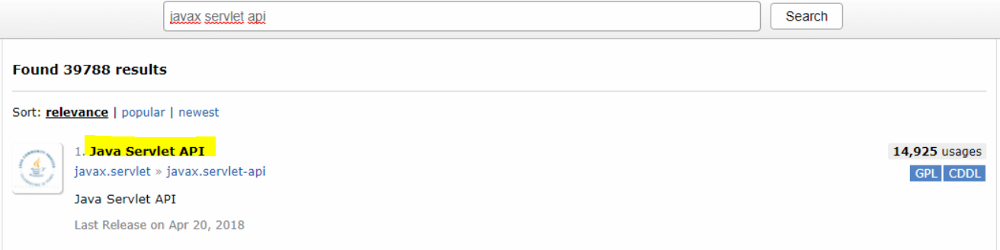

```xml
<project xmlns="http://maven.apache.org/POM/4.0.0" xmlns:xsi="http://www.w3.org/2001/XMLSchema-instance" xsi:schemaLocation="http://maven.apache.org/POM/4.0.0 https://maven.apache.org/xsd/maven-4.0.0.xsd">
  <modelVersion>4.0.0</modelVersion>
  <groupId>kr.ac.kopo</groupId>
  <artifactId>spring-mvc</artifactId>
  <version>0.0.1-SNAPSHOT</version>
  <packaging>war</packaging>
  <dependencies>
  	<!-- javax.servlet.jsp/jsp-api -->
	<dependency>
	    <groupId>javax.servlet.jsp</groupId>
	    <artifactId>jsp-api</artifactId>
	    <version>2.2</version>
	    <scope>provided</scope>
	</dependency>
  	<!-- javax.servlet/javax.servlet-api -->
	<dependency>
	    <groupId>javax.servlet</groupId>
	    <artifactId>javax.servlet-api</artifactId>
	    <version>4.0.1</version>
	    <scope>provided</scope>
	</dependency>
  	<!-- https://mvnrepository.com/artifact/org.springframework/spring-context -->
      <dependency>
         <groupId>org.springframework</groupId>
         <artifactId>spring-webmvc</artifactId>
         <version>5.3.9</version>
      </dependency>
  	
  </dependencies>
</project>
```


- **스프링 설정 파일 작성**

  - src main resources 하위에 config spring 폴더 작성

  - <context:component-scan base-package="kr.co.mlec" /> : 특정 패키지 내의 클래스를 스캔하고 Annotation(`@controller`, `@component`, `@service`, `@repository`)을 확인한 후 Bean 인스턴스로 생성한다.

  - < mvc:view-resolvers > : view와 관련된 내용이 들어오면 설정

    - prefix="/WEB-INF/jsp/" : 주소를 /WEB-INF/jsp/ 이렇게 붙여라
    - suffix=".jsp" : forward 시킬 확장자는 jsp라고 설정 

    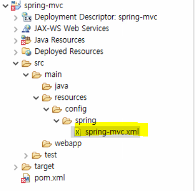 

```xml
<?xml version="1.0" encoding="UTF-8"?>
<beans xmlns="http://www.springframework.org/schema/beans"
    xmlns:mvc="http://www.springframework.org/schema/mvc"
    xmlns:context="http://www.springframework.org/schema/context"
    xmlns:xsi="http://www.w3.org/2001/XMLSchema-instance"
    xsi:schemaLocation="http://www.springframework.org/schema/beans   
    http://www.springframework.org/schema/beans/spring-beans.xsd
    http://www.springframework.org/schema/context   
    http://www.springframework.org/schema/context/spring-context.xsd
    http://www.springframework.org/schema/mvc
    http://www.springframework.org/schema/mvc/spring-mvc.xsd">

	<context:component-scan base-package="kr.co.mlec" />
    <mvc:annotation-driven />
	<mvc:default-servlet-handler />
	<mvc:view-resolvers>
		<mvc:jsp prefix="/WEB-INF/jsp/" suffix=".jsp" />
	</mvc:view-resolvers>

</beans>
```


- **DispatcherServlet의 ViewResolver**
  - ViewResolver는 사용자가 요청한 것에 대한 응답 view를 렌더링하는 역할
  - view 이름으로부터 사용될 view 객체를 맵핑하는 역할


- **기본 디렉토리 생성**

  - / spring mvc / src / main / webapp 에 WEB INF 폴더 생성한 후 web.xml
  - <servlet-name>dispatcher</servlet-name> : 대표 서블릿을 이미 스프링이 제공하고 있음
  - <init-param> : 스프링 컨테이너에 대한 환경설정 파일(classpath:config/spring/spring-mvc.xml)
  - <servlet-mapping> : URL이 *.do로 되어있으면 dispatcher가 받겠다.
  - <filter> : 인코딩

  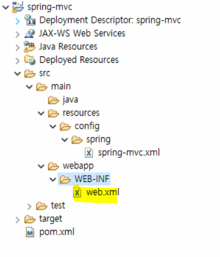 

```XML
<?xml version="1.0" encoding="UTF-8"?>
<web-app xmlns:xsi="http://www.w3.org/2001/XMLSchema-instance" xmlns="http://java.sun.com/xml/ns/javaee" xsi:schemaLocation="http://java.sun.com/xml/ns/javaee http://java.sun.com/xml/ns/javaee/web-app_3_0.xsd" id="WebApp_ID" version="3.0">
  <display-name>spring-mvc</display-name>
  
  <servlet>
  	<servlet-name>dispatcher</servlet-name>
  	<servlet-class>org.springframework.web.servlet.DispatcherServlet</servlet-class>
  	<init-param>
  		<param-name>contextConfigLocation</param-name>
  		<param-value>
  			classpath:config/spring/spring-mvc.xml
  		</param-value>
  	</init-param>
  	<load-on-startup>1</load-on-startup>
  </servlet>
  
  <servlet-mapping>
  	<servlet-name>dispatcher</servlet-name>
	<url-pattern>*.do</url-pattern>  
  </servlet-mapping>
  
  <filter>
  	<filter-name>encodingFilter</filter-name>
  	<filter-class>org.springframework.web.filter.CharacterEncodingFilter</filter-class>
  	<init-param>
  		<param-name>encoding</param-name>
  		<param-value>UTF-8</param-value>
  	</init-param>
  </filter>

  <filter-mapping>
  	<filter-name>encodingFilter</filter-name>
	<url-pattern>/*</url-pattern>  
  </filter-mapping>
  
  <welcome-file-list>
    <welcome-file>index.html</welcome-file>
    <welcome-file>index.htm</welcome-file>
    <welcome-file>index.jsp</welcome-file>
    <welcome-file>default.html</welcome-file>
    <welcome-file>default.htm</welcome-file>
    <welcome-file>default.jsp</welcome-file>
  </welcome-file-list>
</web-app>
```


- 컨트롤러 만들기

  - / spring mvc / src / main / java 폴더에 HelloController 생성

  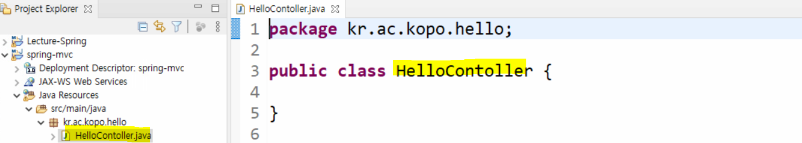

```java
package kr.co.mlec.hello;

import org.springframework.stereotype.Controller;
import org.springframework.web.bind.annotation.RequestMapping;
import org.springframework.web.servlet.ModelAndView;

@Controller
public class HelloContoller {
	
	@RequestMapping("/hello/hello.do")
	public ModelAndView hello() {
		ModelAndView mav = new ModelAndView("hello/hello"); //forward시킬 jsp주소
											//view와 관련된 내용이 들어감
        mav.addObject("msg", "hi 스프링");
		return mav;
	}
}

```

- jsp 생성 - hello.jsp

  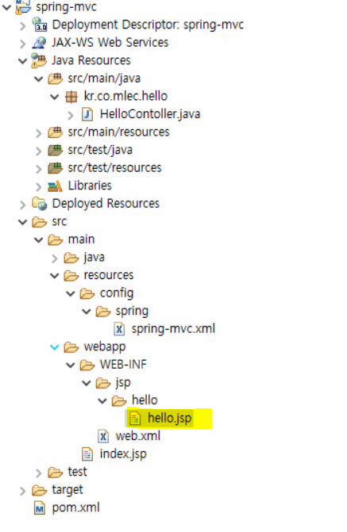 

```jsp
<%@ page language="java" contentType="text/html; charset=UTF-8"
    pageEncoding="UTF-8"%>
<!DOCTYPE html>
<html>
<head>
<meta charset="UTF-8">
<title>Insert title here</title>
</head>
<body>
	서버에서 받은 메시지 : ${msg}
</body>
</html>
```


------------

### post, get 방식

- / spring mvc / src / main / java 폴더에 MethodController 생성

```java
package kr.co.mlec.method;

import org.springframework.web.bind.annotation.RequestMapping;
import org.springframework.web.bind.annotation.RequestMethod;

public class MethodController {
	
	@RequestMapping(value="/method/method.do", 
			method=RequestMethod.GET)
	public String callGet() {
		return "method/methodForm";
	}
	
	@RequestMapping(value="/method/method.do", 
			method=RequestMethod.POST)
	public String callPost() {
		return "method/methodProcess";
	}
}

```

- jsp 생성

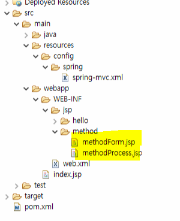

- methodForm.jsp

```jsp
<%@ page language="java" contentType="text/html; charset=UTF-8"
    pageEncoding="UTF-8"%>
<!DOCTYPE html>
<html>
<head>
<meta charset="UTF-8">
<title>Insert title here</title>
</head>
<body>
	<form action="<%=request.getContextPath()%>/method/method.do" method="post">
	
		<input type="submit" value="호출">
	</form>
</body>
</html>
```

- index.jsp
  - a태그는 get방식이므로 get방식의 request가 호출이 된다.

```jsp
<%@ page language="java" contentType="text/html; charset=UTF-8"
    pageEncoding="UTF-8"%>
<!DOCTYPE html>
<html>
<head>
<meta charset="UTF-8">
<title>Insert title here</title>
</head>
<body>
	<a href="<%=request.getContextPath() %>/hello/hello.do">hello</a>
	<a href="<%=request.getContextPath() %>/method/method.do">method</a>
</body>
</html>
```


- requestMapping의 return은 String, mav, void


- 만약 하나의 컨트롤러에 requestMapping value가 모두 같고 method만 다른 경우에는 controller에도 requestMapping을 붙여서 사용할 수 있음

  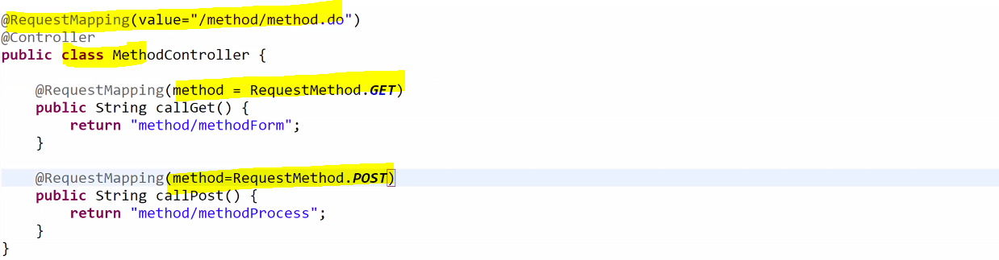


-----

### Form 데이터 처리

- index.jsp에 추가

```jsp
<a href="<%=request.getContextPath() %>/form/joinForm.do">join</a> <br>
```


- / spring mvc / src / main / java 폴더에 MemberController 생성
  - controller에 requestMapping으로 "/form"이 추가되어 있다.
  - 그래서 @RequestMapping("/joinForm.do")은 "/form/joinForm.do"와 같은 말임

```java
package kr.co.mlec.form;

import org.springframework.stereotype.Controller;
import org.springframework.web.bind.annotation.RequestMapping;

@Controller
@RequestMapping("/form")
public class MemberController {
	
	@RequestMapping("/joinForm.do")
	public String joinForm() {
		return "form/joinForm";
	}
}

```


- **joinForm.jsp 생성**

```jsp
<%@ page language="java" contentType="text/html; charset=UTF-8"
    pageEncoding="UTF-8"%>
<!DOCTYPE html>
<html>
<head>
<meta charset="UTF-8">
<title>Insert title here</title>
</head>
<body>
	<form action="<%=request.getContextPath()%>/form/join.do">
		아이디 : <input type="text" name="id" size="20"> <br>
		암호 : <input type="text" name="password" size="20"> <br>
		이름 : <input type="text" name="name" size="20"> <br>
		<input type="submit" value="저장">
	</form>
</body>
</html>
```


- **[ 방법 1 ] Form 데이터 처리 - HttpServletRequest request** 
  - MemberController 코드 추가

```java
@RequestMapping("join.do")
public String join(HttpServletRequest request) {
    String id = request.getParameter("id");
    String password = request.getParameter("password");
    String name = request.getParameter("name");
    MemberVO member = new MemberVO();
    member.setId(id);
    member.setPassword(password);
    member.setName(name);
    request.setAttribute("member", member);

    return "form/memberInfo";
}
```


- **form 폴더 하위 memberInfo.jsp 페이지 작성**

```jsp
<%@ page language="java" contentType="text/html; charset=UTF-8"
    pageEncoding="UTF-8"%>
<!DOCTYPE html>
<html>
<head>
<meta charset="UTF-8">
<title>Insert title here</title>
</head>
<body>
	<h1> 회원 정보 </h1>
	id : ${member.id} <br>
	password : ${member.password} <br>
	name : ${member.name} <br>
</body>
</html>
```


- **[ 방법 2 ] form 데이터 처리 - VO 객체 활용**
  - MemberController 소스 수정
  - MemberVO에서 맨 앞글자가 소문자로 바껴서 알아서 공유영역에 등록이 됨
  - 대신 VO에 있는 변수명과 jsp에 있는 name의 값이 같아야 한다.

```java
@RequestMapping("join.do")
    public String join(MemberVO member) { //(@ModelAttribute MemberVO member)와 같음
    		//즉, 어노테이션을 생략 가능
    System.out.println(member.getId());
    System.out.println(member.getPassword());
    System.out.println(member.getName());
    //MemberVO에서 맨 앞글자가 소문자로 바껴서 알아서 공유영역에 등록이 됨
    //memberVO
    return "form/memberInfo";
}
```

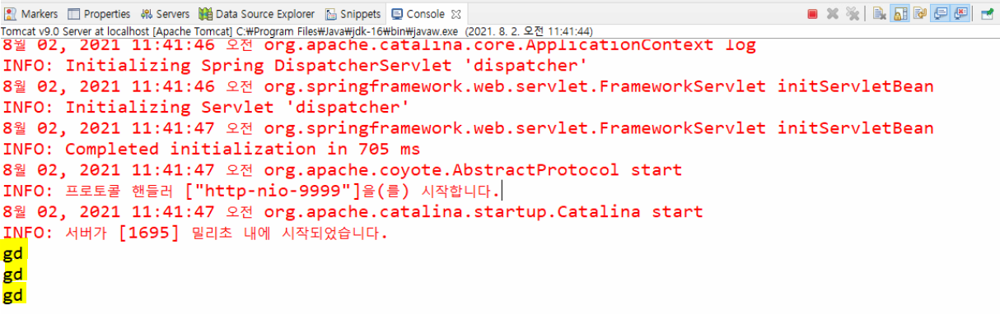


- **form 폴더 하위 memberInfo.jsp 페이지 수정 후 실행**

```jsp
<%@ page language="java" contentType="text/html; charset=UTF-8"
    pageEncoding="UTF-8"%>
<!DOCTYPE html>
<html>
<head>
<meta charset="UTF-8">
<title>Insert title here</title>
</head>
<body>
	<h1> 회원 정보 </h1>
	id : ${memberVO.id} <br>
	password : ${memberVO.password} <br>
	name : ${memberVO.name} <br>
</body>
</html>
```


- **[ 방법 3 ] Form 데이터 처리 - @ModelAttribute 사용하여 JSP 에서 사용할 공유 객체명 변경**
  - 내가 원하는 이름으로 공유 영역에 저장하고 싶을 때

```java
@RequestMapping("join.do")
public String join(@ModelAttribute("member") MemberVO member) {
    System.out.println(member.getId());
    System.out.println(member.getPassword());
    System.out.println(member.getName());
    return "form/memberInfo";
}
```

 

- **form 폴더 하위 memberInfo.jsp 페이지에 공유 객체명을 다시 member로 수정** 

```jsp
<%@ page language="java" contentType="text/html; charset=UTF-8"
    pageEncoding="UTF-8"%>
<!DOCTYPE html>
<html>
<head>
<meta charset="UTF-8">
<title>Insert title here</title>
</head>
<body>
	<h1> 회원 정보 </h1>
	id : ${member.id} <br>
	password : ${member.password} <br>
	name : ${member.name} <br>
</body>
</html>
```


- **[ 방법 4 ] Form 데이터 처리 - ModelAndView view 페이지 및 view 에서 사용할 객체 공유**

```java
@RequestMapping("join.do")
public ModelAndView join(MemberVO member) {
    ModelAndView mav = new ModelAndView();
    mav.setViewName("form/memberInfo"); 
    //또는 ModelAndView mav = new ModelAndView("form/memberInfo");
    mav.addObject("member", member);
    return mav;
}
```


- **[방법 5] Form 데이터 처리 - @requestParam을 사용하여 받아오기**

```java
@RequestMapping("join.do")
public String join(@RequestParam("id") String id, 
                   @RequestParam("password") String password,
                   @RequestParam("name") String name,
                   HttpServletRequest request) {

    MemberVO member = new MemberVO();
    member.setId(id);
    member.setName(name);
    member.setPassword(password);
    System.out.println(member);
    request.setAttribute("member", member);
    return "form/memberInfo";
```


- **[ 방법 6 ] Form 데이터 처리 - Model 객체 및 redirect 사용**
  - redirect를 사용하면 공유영역을 사용할 수 없어서 member가 넘어가지 않음

```java
@RequestMapping("join.do")
public String join(MemberVO member, Model model) {
    //model 객체를 받아와서 직접 객체를 공유영역에 등록
    model.addAttribute("member", member);
    return "form/memberInfo";
    //return "redirect:/form/memberInfo"
}
```


- **@ModelAttribute 선언 후 자동으로 진행되는 작업**
  - 파라미터로 넘겨 준 타입의 오브젝트를 자동으로 생성한다. 위의 코드에서는 MemberVO 클래스의 객체 member를 자동으로 생성한다. 이때 @ModelAttribute가 지정되는 클래스는 Bean 클래스이어야 한다. 그리고 getter와 setter가 명명 규칙에 맞게 만들어져 있어야 한다.
  - 생성된 오브젝트에(info) HTTP로 넘어 온 값들을 자동으로 바인딩한다. 위의 코드의 경우는 name=Gildong&id=25&password=327 이렇게 들어오는 name, id, password의 값이 MemberInfo의 해당 변수의 setter를 통해서 해당 멤버 변수에로 binding된다.
  - @ModelAttribute 어노테이션이 붙은 객체가(여기서는 MemberInfo 객체) 자동으로 Model 객체에 추가되고 따라서 MemberInfo 객체가 .jsp 뷰단까지 전달이 된다.


------

### responseBody

- **@ResponseBody 는 xml 또는 json 과 같은 메시지 기반의 서비스를 만들 경우 사용**
  - ex) AJAX 서비스를 제공하는 컨트롤러
  - jsp로 포워드 시키는 것이 아니고 비즈니스 로직에 의해서 가져온 정보를 컨트롤러가 요청 클라이언트에게 응답을 바로 해주는 것이 목적
  - spring 4버전부터 @RestController가 새로 생김
    - class에 붙이는 것임
    - 아예 class에 @Controller 대신에 @RestController를 붙이고 responseBody를 지워준다. 그러면 그 컨트롤러 안에 있는 모든 메소드들은 메시지 기반의 서비스에 사용 
  - 메소드에 붙음


- **컨트롤러 만들기**
  - / spring mvc / src / main / java 폴더에 ResBodyController 생성

```java
package kr.co.mlec.body;

import org.springframework.stereotype.Controller;
import org.springframework.web.bind.annotation.RequestMapping;
import org.springframework.web.bind.annotation.ResponseBody;

@Controller
@RequestMapping("/ajax")
public class ResBodyController {
	
	@RequestMapping("/resBody.do")
	@ResponseBody //이것을 붙이지 않으면 return의 jsp주소로 착각해서 이 파일명을 가진
    			  //jsp를 찾음 
	public String resStringBody() {
		return "OK, 성공";
	}
}

```


- **index 파일에 코드 추가 후 테스트**

```jsp
<%@ page language="java" contentType="text/html; charset=UTF-8"
    pageEncoding="UTF-8"%>
<!DOCTYPE html>
<html>
<head>
<meta charset="UTF-8">
<title>Insert title here</title>
</head>
<body>
	<a href="<%=request.getContextPath() %>/hello/hello.do">hello</a> <br>
	<a href="<%=request.getContextPath() %>/method/method.do">method</a> <br>
	<a href="<%=request.getContextPath() %>/form/joinForm.do">join</a> <br>
	<a href="<%=request.getContextPath() %>/ajax/resBody.do">문자열응답</a> <br>
</body>
</html>
```

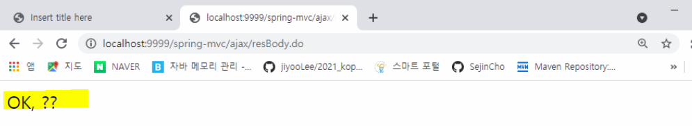


- **한글처리**
  - jsp의 인코딩 설정은 되어있지만, 메시지 인코딩 설정은 안되어있다. (찾아보기)
  - spring mvc.xml 파일 수정 후 페이지 호출 테스트

```xml
<?xml version="1.0" encoding="UTF-8"?>
<beans xmlns="http://www.springframework.org/schema/beans"
    xmlns:mvc="http://www.springframework.org/schema/mvc"
    xmlns:context="http://www.springframework.org/schema/context"
    xmlns:xsi="http://www.w3.org/2001/XMLSchema-instance"
    xsi:schemaLocation="http://www.springframework.org/schema/beans   
    http://www.springframework.org/schema/beans/spring-beans.xsd
    http://www.springframework.org/schema/context   
    http://www.springframework.org/schema/context/spring-context.xsd
    http://www.springframework.org/schema/mvc
    http://www.springframework.org/schema/mvc/spring-mvc.xsd">

	<context:component-scan base-package="kr.co.mlec" />
    <mvc:annotation-driven>
    	<mvc:message-converters>
    		<bean class="org.springframework.http.converter.StringHttpMessageConverter">
    			<property name="supportedMediaTypes">
    				<list>
    					<value>text/html; charset=UTF-8</value>
    				</list>
    			</property>
    		</bean>
    	</mvc:message-converters>
    </mvc:annotation-driven>
	
	<mvc:default-servlet-handler />
	<mvc:view-resolvers>
		<mvc:jsp prefix="/WEB-INF/jsp/" suffix=".jsp" />
	</mvc:view-resolvers>

</beans>
```


- **JSON 응답 처리**
  - ResBodyController 코드 추가

```java
@RequestMapping("/resBody.json")
@ResponseBody
public Map<String, String> resJsonBody() {
    Map<String, String> result = new HashMap<String, String>();
    result.put("id", "sbc");
    result.put("name", "hong");
    result.put("addr", "서울");
    return result;
}
```


- **web.xml**
  - url pattern 추가

```xml
<url-pattern>*.json</url-pattern> 
```

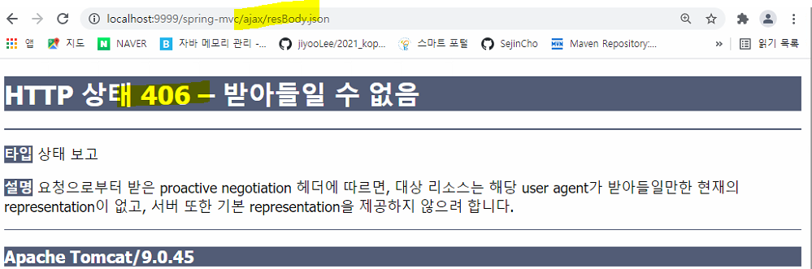


- **json 처리 컨버터 등록**
  - spring-mvc.xml 파일 수정
  - mvc:message converters 의 하위 태그로 등록

```xml
<?xml version="1.0" encoding="UTF-8"?>
<beans xmlns="http://www.springframework.org/schema/beans"
    xmlns:mvc="http://www.springframework.org/schema/mvc"
    xmlns:context="http://www.springframework.org/schema/context"
    xmlns:xsi="http://www.w3.org/2001/XMLSchema-instance"
    xsi:schemaLocation="http://www.springframework.org/schema/beans   
    http://www.springframework.org/schema/beans/spring-beans.xsd
    http://www.springframework.org/schema/context   
    http://www.springframework.org/schema/context/spring-context.xsd
    http://www.springframework.org/schema/mvc
    http://www.springframework.org/schema/mvc/spring-mvc.xsd">

	<context:component-scan base-package="kr.co.mlec" />
    <mvc:annotation-driven>
    	<mvc:message-converters>
    		<bean class="org.springframework.http.converter.StringHttpMessageConverter">
    			<property name="supportedMediaTypes">
    				<list>
    					<value>text/html; charset=UTF-8</value>
    					<value>application/json; charset=UTF-8</value>
    				</list>
    			</property>
    		</bean>
    	</mvc:message-converters>
    </mvc:annotation-driven>
	
	<mvc:default-servlet-handler />
	<mvc:view-resolvers>
		<mvc:jsp prefix="/WEB-INF/jsp/" suffix=".jsp" />
	</mvc:view-resolvers>

</beans>
```


- **message-converters**
  - 메세지 컨버터는 XML이나 JSON을 이용한 AJAX 기능이나 웹 서비스를 개발할 때 사용할 수 있다.
  - HTTP 요청 프로퍼티를 모델 오브젝트의 프로퍼티에 개별적으로 바인딩하고 모델 오브젝트를 다시 뷰를 이용해 클라이언트로 보낼 콘텐츠를 만드는 대신, **HTTP 요청 메세지 본문과 HTTP 응답 메세지 본문을 통째로 메세지로 다루는 방식이다.** 메세지 컨버터는 파라미터의 `@RequestBody`와 메소드에 부여한 `@ResponseBody`를 이용한다.


- **그리고 map에 있는 데이터를 알아서 json으로 바꿔주는 라이브러리를 추가**

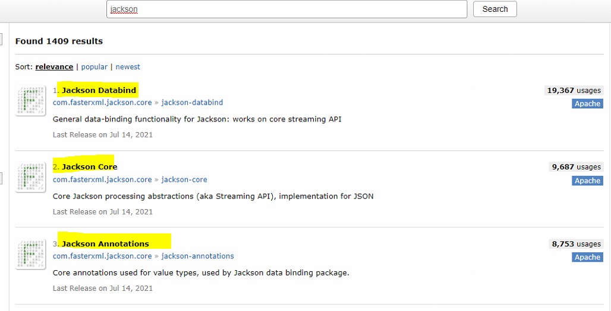

```xml
<!-- jackson-databind -->
<dependency>
    <groupId>com.fasterxml.jackson.core</groupId>
    <artifactId>jackson-databind</artifactId>
    <version>2.12.4</version>
</dependency>
<!-- jackson-core -->
<dependency>
    <groupId>com.fasterxml.jackson.core</groupId>
    <artifactId>jackson-core</artifactId>
    <version>2.12.4</version>
</dependency>
<!-- jackson-annotations -->
<dependency>
    <groupId>com.fasterxml.jackson.core</groupId>
    <artifactId>jackson-annotations</artifactId>
    <version>2.12.4</version>
</dependency>
```


- **테스트**

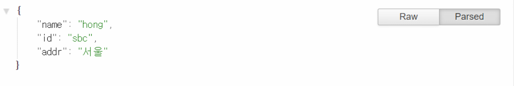


- **JSON 응답처리(vo)**
  - ResBodyController 코드 추가

```java
@RequestMapping("/resVOBody.json")
@ResponseBody
public MemberVO resJsonVOBody() {
    MemberVO vo = new MemberVO();
    vo.setId("sbc");
    vo.setName("sbc");
    vo.setPassword("1234");
    return vo;
}
```

- index 코드 추가

```jsp
<%@ page language="java" contentType="text/html; charset=UTF-8"
    pageEncoding="UTF-8"%>
<!DOCTYPE html>
<html>
<head>
<meta charset="UTF-8">
<title>Insert title here</title>
</head>
<body>
	<a href="<%=request.getContextPath() %>/hello/hello.do">hello</a> <br>
	<a href="<%=request.getContextPath() %>/method/method.do">method</a> <br>
	<a href="<%=request.getContextPath() %>/form/joinForm.do">join</a> <br>
	<a href="<%=request.getContextPath() %>/ajax/resBody.do">문자열응답</a> <br>
	<a href="<%=request.getContextPath() %>/ajax/resBody.json">문자열응답 json</a> <br>
	<a href="<%=request.getContextPath() %>/ajax/resVOBody.json">문자열응답 json vo</a> <br>
</body>
</html>
```

- **JSON 응답처리(vo) test**

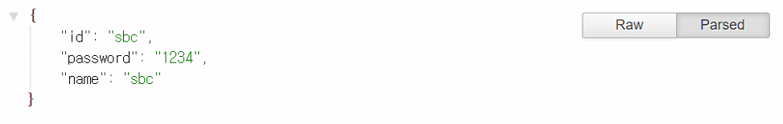


- **JSON 응답 처리(List< String >)**
  - ResBodyController 코드 추가

```java
@RequestMapping("/resStringListBody.json")
@ResponseBody
public List<String> resJsonStringListBody() {
    List<String> list = new ArrayList<String>();
    for(int i=1; i<4; i++ ) {
        list.add(String.valueOf(i));
    }
    return list;
}
```


- **index 추가**

```jsp
<%@ page language="java" contentType="text/html; charset=UTF-8"
    pageEncoding="UTF-8"%>
<!DOCTYPE html>
<html>
<head>
<meta charset="UTF-8">
<title>Insert title here</title>
</head>
<body>
	<a href="<%=request.getContextPath() %>/hello/hello.do">hello</a> <br>
	<a href="<%=request.getContextPath() %>/method/method.do">method</a> <br>
	<a href="<%=request.getContextPath() %>/form/joinForm.do">join</a> <br>
	<a href="<%=request.getContextPath() %>/ajax/resBody.do">문자열응답</a> <br>
	<a href="<%=request.getContextPath() %>/ajax/resBody.json">문자열응답 json</a> <br>
	<a href="<%=request.getContextPath() %>/ajax/resVOBody.json">문자열응답 json vo</a> <br>
	<a href="<%=request.getContextPath() %>/ajax/resStringListBody.json">문자열응답 json String list</a> <br>
</body>
</html>
```


- **JSON 응답처리(string list) test**

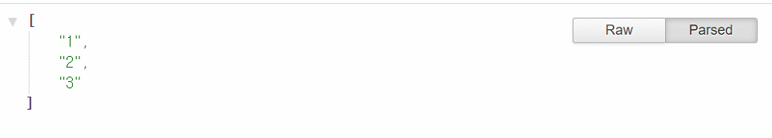


- **JSON 응답 처리 (List< VO >)**
  - ResBodyController 코드 추가

```java
@RequestMapping("/resVOListBody.json")
@ResponseBody
public List<MemberVO> resJsonVOListBody() {
    List<MemberVO> list = new ArrayList<MemberVO>();
    for(int i=1; i<4; i++ ) {
        MemberVO vo = new MemberVO();
        vo.setId("sbc");
        vo.setName("sbc");
        vo.setPassword("1234");
        list.add(vo);
    }
    return list;
}
```


- **index 추가 후 test**

```jsp
<a href="<%=request.getContextPath() %>/ajax/resVOListBody.json">문자열응답 json vo list</a> <br>
```

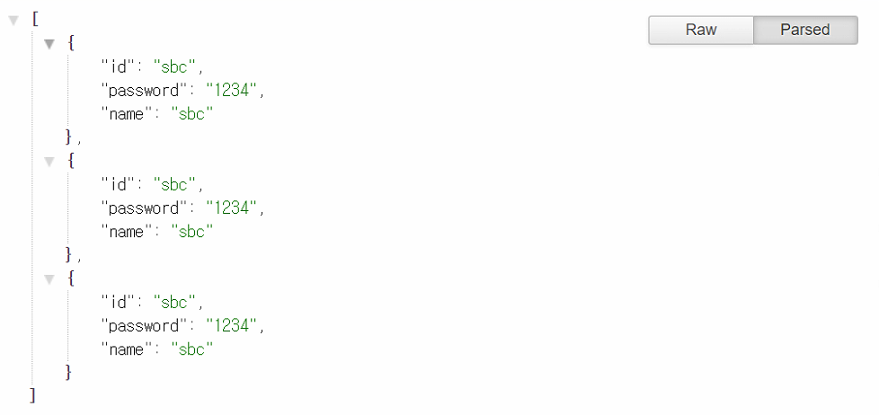


- 모두 알아서 json으로 변환되고 있는 것을 확인할 수 있다.
- responseBody는 자바로 만들어진 객체 값을 클라이언트가 인식할 수 있는 json형태로 바꿔주는 것임
- requestBody는 json형태로 날아오는 데이터를 자바 객체로 바꿔주는 것임


-------------

### 컨트롤러 없이 페이지 매핑

- **/ spring mvc / webapp / WEB INF / jsp 에 file 폴더 생성**
  - 생성된 폴더에 fileUploadForm.jsp 생성

```jsp
<%@ page language="java" contentType="text/html; charset=UTF-8"
    pageEncoding="UTF-8"%>
<!DOCTYPE html>
<html>
<head>
<meta charset="UTF-8">
<title>Insert title here</title>
</head>
<body>
	<form action="<%=request.getContextPath()%>/file/upload.do" method="post" enctype="multipart/form data">
		<input type="text" name="id" value="test"> <br>
		<input type="file" name="attachFile1"> <br>
		<input type="file" name="attachFile2"> <br>
		<input type="submit" value="업로드" > <br>
	</form>
</body>
</html>
```


- **spring mvc.xml 파일에 내용 추가**

```xml
<mvc:view-controller path ="/file/uploadForm.do" view-name ="file/fileUploadForm" />
```


- **호출**
  - index 파일 코드 추가

```jsp
<a href="<%=request.getContextPath() %>/file/uploadForm.do">파일업로드</a> <br>
```

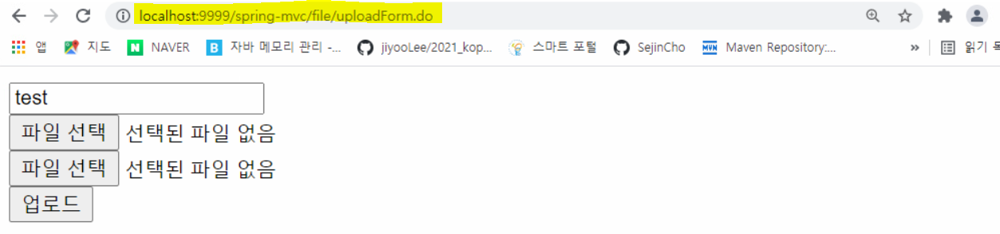


------

### 파일 업로드

- spring mvc.xml 파일에 내용 추가

```xml
<bean id="multipartResolver" class="org.springframework.web.multipart.commons.CommonsMultipartResolver">
    <!-- 최대 업로드 파일 사이즈 : 10MB -->
    <property name="maxUploadSize" value="10485760" />
</bean>
```


- pom.xml 파일 dependency 추가

```xml
<!-- commons-fileupload -->
<dependency>
    <groupId>commons-fileupload</groupId>
    <artifactId>commons-fileupload</artifactId>
    <version>1.4</version>
</dependency>
```


- 컨트롤러 만들기
  - / spring mvc / src / main / java 폴더에 UploadController 생성

```java
package kr.co.mlec.file;

import java.io.File;
import java.util.Iterator;
import java.util.UUID;

import javax.servlet.ServletContext;

import org.springframework.beans.factory.annotation.Autowired;
import org.springframework.stereotype.Controller;
import org.springframework.web.bind.annotation.RequestMapping;
import org.springframework.web.bind.annotation.RequestMethod;
import org.springframework.web.multipart.MultipartFile;
import org.springframework.web.multipart.MultipartHttpServletRequest;
import org.springframework.web.servlet.ModelAndView;

@RequestMapping("/file")
@Controller
public class UploadController {

	@Autowired
	ServletContext servletContext;
	  
	@RequestMapping(value="/upload.do", method=RequestMethod.POST)
	public ModelAndView fileUpload(MultipartHttpServletRequest mRequest) throws Exception {
		
		// 실행되는 웹어플리케이션의 실제 경로 가져오기
		String uploadDir = servletContext.getRealPath("/upload/");
		System.out.println(uploadDir);

		ModelAndView mav = new ModelAndView("file/uploadResult");

		String id = mRequest.getParameter("id");
		System.out.println("id : " + id);
		
		Iterator<String> iter = mRequest.getFileNames();
		while(iter.hasNext()) {
			
			String formFileName = iter.next();
			// 폼에서 파일을 선택하지 않아도 객체 생성됨
			MultipartFile mFile = mRequest.getFile(formFileName);
			
			// 원본 파일명
			String oriFileName = mFile.getOriginalFilename();
			System.out.println("원본 파일명 : " + oriFileName);
			
			if(oriFileName != null && !oriFileName.equals("")) {
			
				// 확장자 처리
				String ext = "";
				// 뒤쪽에 있는 . 의 위치 
				int index = oriFileName.lastIndexOf(".");
				if (index != -1) {
					// 파일명에서 확장자명(.포함)을 추출
					ext = oriFileName.substring(index);
				}
				
				// 파일 사이즈
				long fileSize = mFile.getSize();
				System.out.println("파일 사이즈 : " + fileSize);
				
				// 고유한 파일명 만들기	
				String saveFileName = "mlec-" + UUID.randomUUID().toString() + ext;
				System.out.println("저장할 파일명 : " + saveFileName);
			
				// 임시저장된 파일을 원하는 경로에 저장
				mFile.transferTo(new File(uploadDir + saveFileName));
			} 
		} 
		return mav;
	}
	/*
	@RequestMapping("/uploadForm.do")
	public String upload() {
		
		return "file/fileUploadForm";
	}
	*/
}

```


- 결과 페이지 만들기
  - / spring mvc / webapp / WEB INF / jsp 에 file 폴더에 uploadResult.jsp 생성

```jsp

```

