## myBatis

#### myBatis 정의 및 특성

- 2010년에 iBatis가 Apache를 떠나 Google Code로 이동하면서 이름이 myBatis로 변경됨
- 더 빠른 JDBC 코딩을 위한 일반화된 프레임워크
- SQL을 자바 코드가 아닌 XML로 따로 분리
- SQL의 실행 결과를 Map 또는 자바 클래스로 자동 매핑
- SQL을 XML이나 인터페이스 내에 어노테이션을 활용하여 처리
- mapper XML이 실제 SQL을 가지고 있음 
- mybatis-config.xml에서 db를 접속하고 쿼리를 관리하는 역할을 한다.

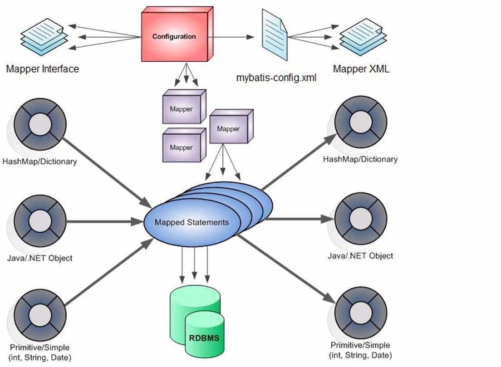


#### myBatis 적용

- 쿼리를 실행하기 위해서 SqlSession 객체가 필요하다.

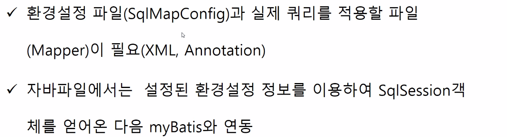


#### 자바 프로젝트 하나 생성

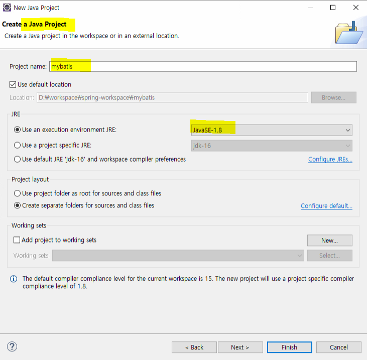

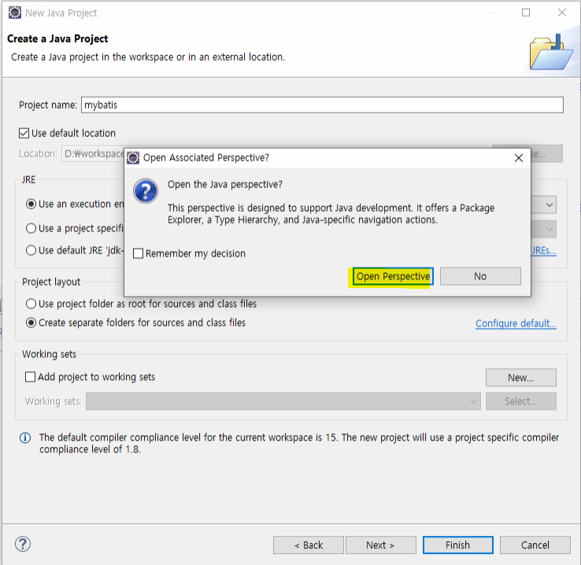


#### mybatis를 사용하기 위한 세팅

https://mybatis.org/mybatis-3/ko/getting-started.html

- **mybatis jar 가져오기**

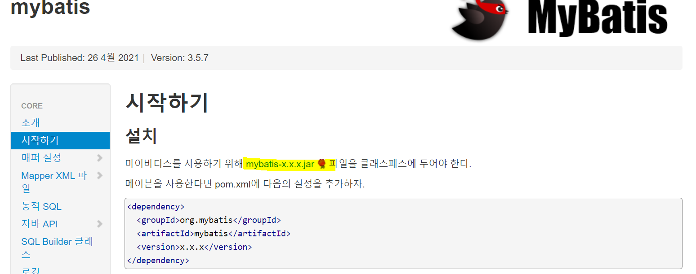


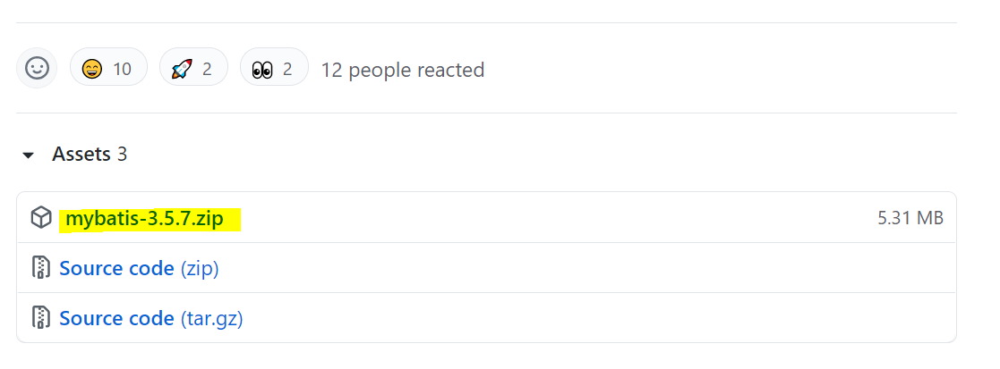


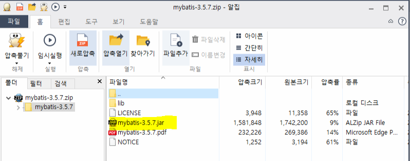


- **빌드패스 추가 해야 함**

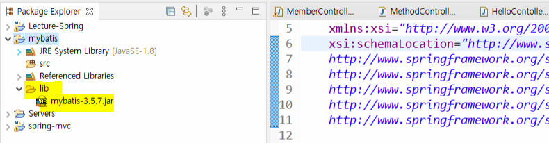


#### XML에서 SqlSessionFactory 빌드하기

- https://mybatis.org/mybatis-3/ko/getting-started.html

  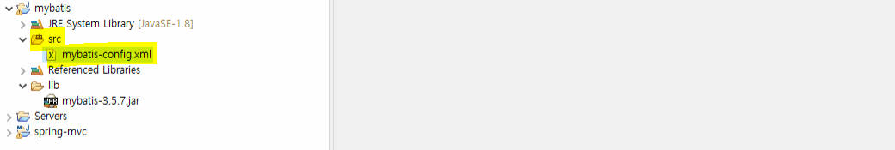

```xml
<?xml version="1.0" encoding="UTF-8" ?>
<!DOCTYPE configuration
  PUBLIC "-//mybatis.org//DTD Config 3.0//EN"
  "http://mybatis.org/dtd/mybatis-3-config.dtd">
<configuration>
  <environments default="development">
    <environment id="development">
      <transactionManager type="JDBC"/>
      <dataSource type="POOLED">
        <property name="driver" value="${driver}"/>
        <property name="url" value="${url}"/>
        <property name="username" value="${username}"/>
        <property name="password" value="${password}"/>
      </dataSource>
    </environment>
  </environments>
  <mappers>
    <mapper resource="org/mybatis/example/BlogMapper.xml"/>
  </mappers>
</configuration>
```


#### db의 정보를 입력하기 위한 properties 파일 생성

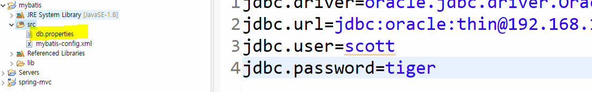

```properties
jdbc.driver=oracle.jdbc.driver.OracleDriver
jdbc.url=jdbc:oracle:thin@192.168.119.119:1521
jdbc.user=scott
jdbc.password=tiger
```


- **xml 파일 수정**
  - propeties를 사용하여 설정

```xml
<?xml version="1.0" encoding="UTF-8" ?>
<!DOCTYPE configuration
  PUBLIC "-//mybatis.org//DTD Config 3.0//EN"
  "http://mybatis.org/dtd/mybatis-3-config.dtd">
<configuration>
	<properties resource="db.properties"/>
	<environments default="development">
	  <environment id="development">
	    <transactionManager type="JDBC"/>
	    <dataSource type="POOLED">
	      <property name="driver" value="${jdbc.driver}"/>
	      <property name="url" value="${jdbc.url}"/>
	      <property name="username" value="${jdbc.user}"/>
	      <property name="password" value="${jdbc.password}"/>
	    </dataSource>
	  </environment>
	</environments>
  <!-- 
  <mappers>
    <mapper resource="org/mybatis/example/BlogMapper.xml"/>
  </mappers>
   -->
</configuration>
```


#### mybatis 설정파일 읽는 class생성

```java
package kr.ac.kopo;

import java.io.IOException;
import java.io.InputStream;

import org.apache.ibatis.io.Resources;
import org.apache.ibatis.session.SqlSessionFactory;
import org.apache.ibatis.session.SqlSessionFactoryBuilder;

public class MyConfig {
	public MyConfig() {
		//myconfig class 객체가 생성되면 mybatis-config.xml을 읽어옴
		InputStream inputStream;
		try {
			String resource = "mybatis-config.xml";
			inputStream = Resources.getResourceAsStream(resource);
			SqlSessionFactory sqlSessionFactory = new SqlSessionFactoryBuilder().build(inputStream);
		} catch (IOException e) {
			// TODO Auto-generated catch block
			e.printStackTrace();
		}
	}
}

```


- **메인 클래스 생성하여 test**

  - 에러가 안나면 여기까지 성공
  - sqlSessionFactory를 얻어올 수 있음 

  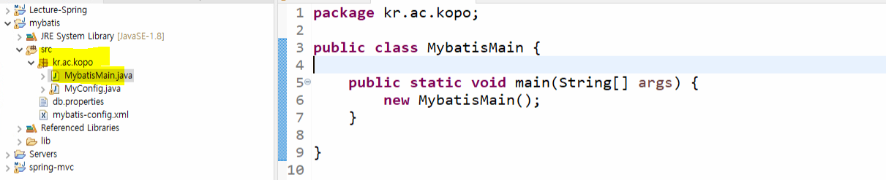

```java
package kr.ac.kopo;

public class MybatisMain {

	public static void main(String[] args) {
		new MybatisMain();
	}

}
```


#### SqlSessionFactory 에서 SqlSession 만들기

```java
package kr.ac.kopo;

import java.io.IOException;
import java.io.InputStream;

import org.apache.ibatis.io.Resources;
import org.apache.ibatis.session.SqlSession;
import org.apache.ibatis.session.SqlSessionFactory;
import org.apache.ibatis.session.SqlSessionFactoryBuilder;

public class MyConfig {
	private SqlSession session ; 
	
	public MyConfig() {
		//myconfig class 객체가 생성되면 mybatis-config.xml을 읽어옴
		InputStream inputStream;
		try {
			String resource = "mybatis-config.xml";
			inputStream = Resources.getResourceAsStream(resource);
			SqlSessionFactory sqlSessionFactory = new SqlSessionFactoryBuilder().build(inputStream);
			
			this.session = sqlSessionFactory.openSession();
			
			System.out.println("session : " + session);
		} catch (IOException e) {
			// TODO Auto-generated catch block
			e.printStackTrace();
		}
	}
	
	public SqlSession getInstance() {
		return session;
	}
}

```


- **main에서 test**

```java
package kr.ac.kopo;

import org.apache.ibatis.session.SqlSession;

public class MybatisMain {

	public static void main(String[] args) {
		SqlSession session = new MyConfig().getInstance();
		System.out.println("session : " + session);
	}

}

```

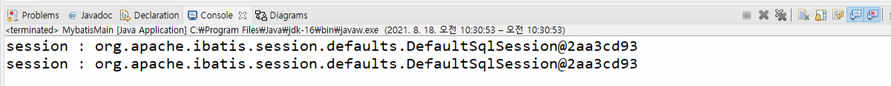


#### mapper 정보 설정

- mapper 태그

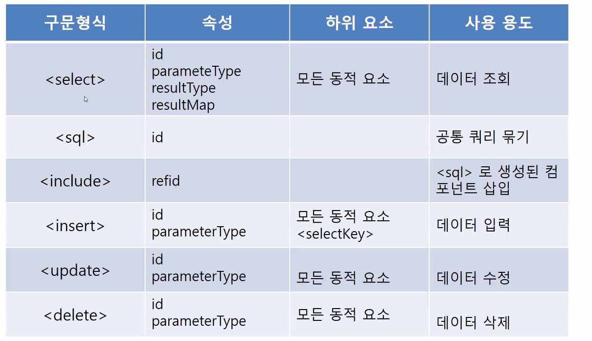


- **xml 설정**

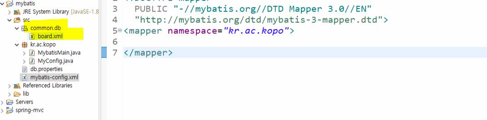

```xml
<?xml version="1.0" encoding="UTF-8" ?>
<!DOCTYPE configuration
  PUBLIC "-//mybatis.org//DTD Config 3.0//EN"
  "http://mybatis.org/dtd/mybatis-3-config.dtd">
<configuration>
	<properties resource="db.properties"/>
	<environments default="development">
	  <environment id="development">
	    <transactionManager type="JDBC"/>
	    <dataSource type="POOLED">
	      <property name="driver" value="${jdbc.driver}"/>
	      <property name="url" value="${jdbc.url}"/>
	      <property name="username" value="${jdbc.user}"/>
	      <property name="password" value="${jdbc.password}"/>
	    </dataSource>
	  </environment>
	</environments>
  <mappers>
    <mapper resource="common/db/board.xml"/>
  </mappers>
</configuration>
```


- **mapper 생성**

```xml
<?xml version="1.0" encoding="UTF-8" ?>
<!DOCTYPE mapper
  PUBLIC "-//mybatis.org//DTD Mapper 3.0//EN"
  "http://mybatis.org/dtd/mybatis-3-mapper.dtd">
<mapper namespace="kr.ac.kopo">
  
</mapper>
```


#### BoardDAO 생성

```java
package kr.ac.kopo.board;

import org.apache.ibatis.session.SqlSession;

import kr.ac.kopo.MyConfig;

public class BoardDAO {
	private SqlSession session;
	
	public BoardDAO() {
		session = new MyConfig().getInstance();
		System.out.println(session);
	}
}

```


- **main에서 test**

```java
package kr.ac.kopo;

import org.apache.ibatis.session.SqlSession;

import kr.ac.kopo.board.BoardDAO;

public class MybatisMain {

	public static void main(String[] args) {
		new BoardDAO();
	}

}
```

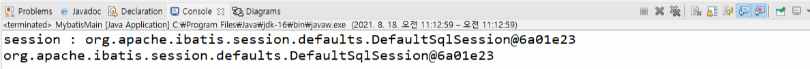


#### insert 진행

- **VO 생성**

```java
package kr.ac.kopo.board;

import org.apache.ibatis.session.SqlSession;

import kr.ac.kopo.MyConfig;

public class BoardDAO {
	private SqlSession session;
	
	public BoardDAO() {
		session = new MyConfig().getInstance();
		System.out.println(session);
	}
	
	public void work() {
		
		
		insert();
	}
	
	private void insert() {
		BoardVO board =new BoardVO();
		board.setContent("content");
		board.setTitle("title");
		board.setNo(3);
		board.setWriter("writer");
		
		session.insert("kr.ac.kopo.board.BoardDAO.newBoard", board);
		session.commit();
		System.out.println("삽입완료");
	}
	
	
}

```


- **dao**

```java
package kr.ac.kopo.board;

import org.apache.ibatis.session.SqlSession;

import kr.ac.kopo.MyConfig;

public class BoardDAO {
	private SqlSession session;
	
	public BoardDAO() {
		session = new MyConfig().getInstance();
		System.out.println(session);
	}
	
	public void work() {
		
		
		insert();
	}
	
	private void insert() {
		BoardVO board =new BoardVO();
		board.setContent("content");
		board.setTitle("title");
		board.setNo(3);
		board.setWriter("writer");
		
		session.insert("kr.ac.kopo.board.BoardDAO.newBoard", board);
		session.commit();
		System.out.println("삽입완료");
	}
	
	
}

```


- **board.xml**

```xml
<?xml version="1.0" encoding="UTF-8" ?>
<!DOCTYPE mapper
  PUBLIC "-//mybatis.org//DTD Mapper 3.0//EN"
  "http://mybatis.org/dtd/mybatis-3-mapper.dtd">
<mapper namespace="kr.ac.kopo.board.BoardDAO">
	<insert id="newBoard" parameterType="kr.ac.kopo.board.BoardVO">
		insert into t_board(no,title,writer,content) 
		values(#{no},#{title},#{writer},#{content})
	</insert>
</mapper>
```


- **main**

```java
package kr.ac.kopo;

import org.apache.ibatis.session.SqlSession;

import kr.ac.kopo.board.BoardDAO;

public class MybatisMain {

	public static void main(String[] args) {
		BoardDAO dao = new BoardDAO();
		dao.work();
	}

}
```


#### alias 설정

- 매번 parameterType이나 resultType에 클래스명을 적는 것은 번거로우니 alias 설정
- mybatis-config

```xml
<?xml version="1.0" encoding="UTF-8" ?>
<!DOCTYPE configuration
  PUBLIC "-//mybatis.org//DTD Config 3.0//EN"
  "http://mybatis.org/dtd/mybatis-3-config.dtd">
<configuration>
	<properties resource="db.properties"/>
	<typeAliases>
		<typeAlias type="kr.ac.kopo.board.BoardVO" alias="board"/>
	</typeAliases>
	<environments default="development">
	  <environment id="development">
	    <transactionManager type="JDBC"/>
	    <dataSource type="POOLED">
	      <property name="driver" value="${jdbc.driver}"/>
	      <property name="url" value="${jdbc.url}"/>
	      <property name="username" value="${jdbc.user}"/>
	      <property name="password" value="${jdbc.password}"/>
	    </dataSource>
	  </environment>
	</environments>
  <mappers>
    <mapper resource="common/db/board.xml"/>
  </mappers>
</configuration>
```


- **board.xml**

```xml
<?xml version="1.0" encoding="UTF-8" ?>
<!DOCTYPE mapper
  PUBLIC "-//mybatis.org//DTD Mapper 3.0//EN"
  "http://mybatis.org/dtd/mybatis-3-mapper.dtd">
<mapper namespace="kr.ac.kopo.board.BoardDAO">
	<insert id="newBoard" parameterType="board">
		insert into t_board(no,title,writer,content) 
		values(#{no},#{title},#{writer},#{content})
	</insert>
</mapper>
```


- myBatis doc

  https://mybatis.org/mybatis-3/ko/getting-started.html

  

-----------


## resultMap

- 컬럼 이름과 VO의 변수명을 자동으로 매핑

```xml
<?xml version="1.0" encoding="UTF-8" ?>
<!DOCTYPE mapper
  PUBLIC "-//mybatis.org//DTD Mapper 3.0//EN"
  "http://mybatis.org/dtd/mybatis-3-mapper.dtd">
<mapper namespace="kr.ac.kopo.board.BoardDAO">
	<insert id="newBoard" parameterType="board">
		insert into t_board(no,title,writer,content) 
		values(#{no},#{title},#{writer},#{content})
	</insert>
	
	<resultMap type="board" id="boardMap">
		<result column="view_cnt" property="viewCnt"/>
		<result column="reg_date" property="regDate"/>
	</resultMap>
	
	<select id="selectBoardListMap" resultMap="boardMap">
		select no, title, writer, content, view_cnt, to_char(reg_date,'yyyy-mm-dd') as reg_date from t_board
	</select>
	<select id="selectBoardList" resultType="board">
		select * from t_board
	</select>
</mapper>
```


-----------


## include

- 공통 쿼리 묶기
- xml

```xml
<sql id="selectBoard2" >
    select no, title, writer, content, view_cnt, to_char(reg_date,'yyyy-mm-dd') as reg_date from t_board
</sql>
<select id="selectBoard3">
    <include refid="selectBoard2"/>
    where no = #{no}
</select>
```


---------


## 동적 태그

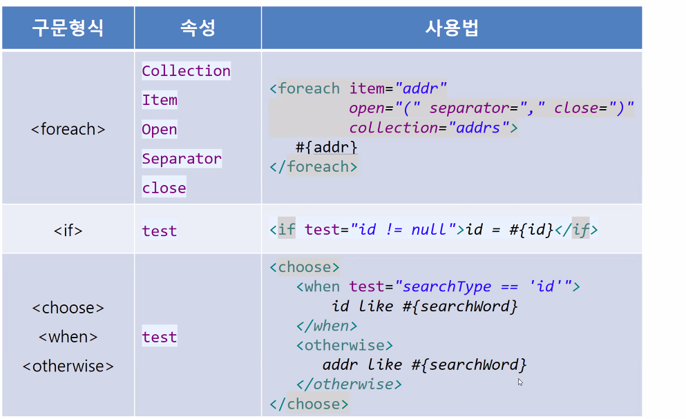


- **상황에 따라서 and와 ,가 알아서 생략이 된다.**

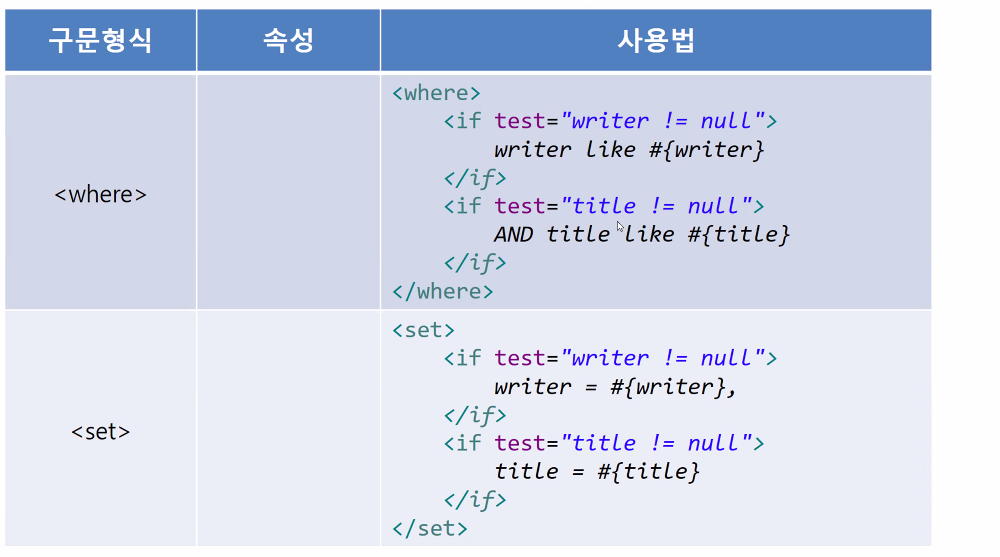


----------

## foreach

- 공통 배열 데이터

```java
String[] userArray = {"1", "2", "3"}
```


#### 배열 파라미터를 Map을 통해 넘겼을 경우

- parameterType="hashmap"

- **collection을 꼭! 넘겨주는 배열 변수 값과 동일하게 작성해야 한다.**

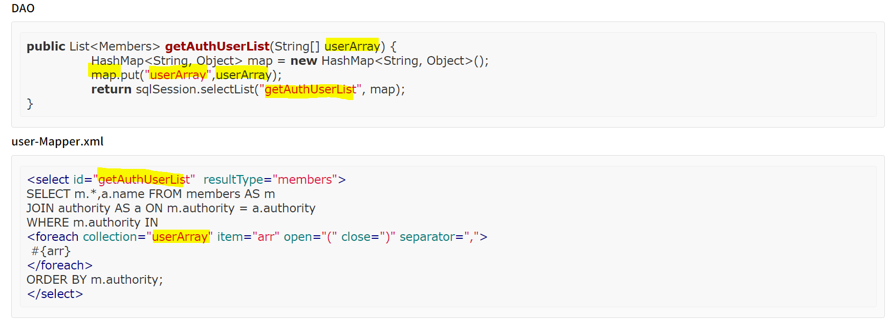


#### 배열 파라미터를 직접 넘겼을 경우

- **※ 주의 : collection을 꼭! "array"로 작성해야 한다.**

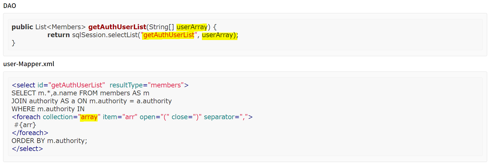


#### 리스트 Map을 통해 넘겼을 경우

- **리스트 안에 뽑고 싶은 결괏값을 {key.value} 형태로 뽑으면 된다.**
- **※ 주의 : collection을 꼭! 넘겨주는 리스트 변수 값과 동일하게 작성해야 한다.**

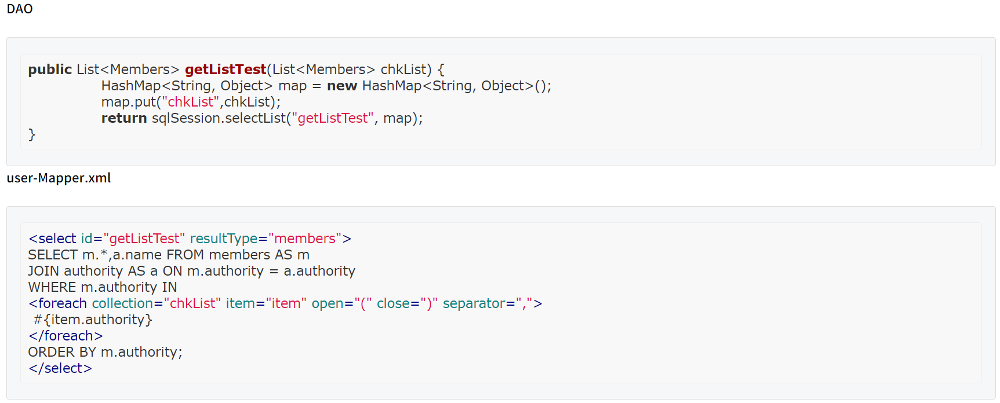


#### 리스트 파라미터를 직접 넘겼을 경우

- parameterType="java.util.List"

- **리스트 안에 뽑고 싶은 결괏값을 {key.value} 형태로 뽑으면 된다.**
- **※ 주의 : collection을 꼭! "list"로 작성해야 한다.**

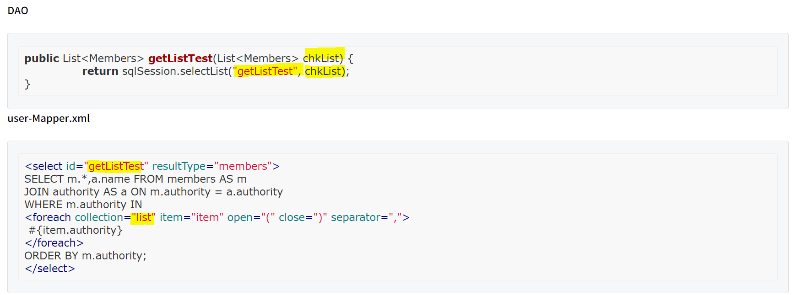


--------

## where

- where 태그를 사용하면 title이 없는 경우에 and를 알아서 지워준다.

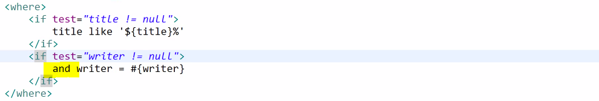


