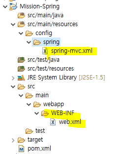
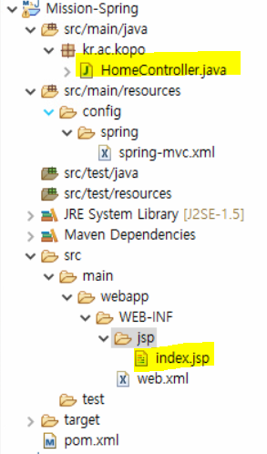
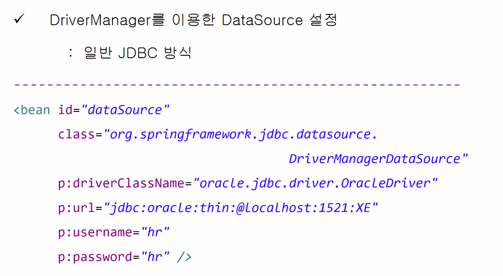
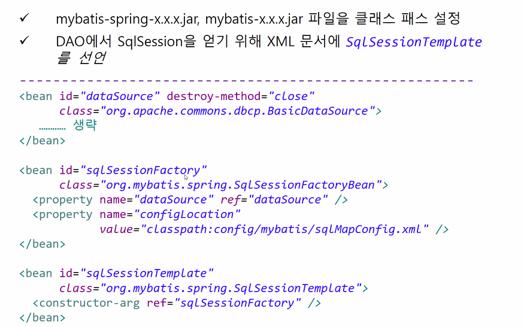
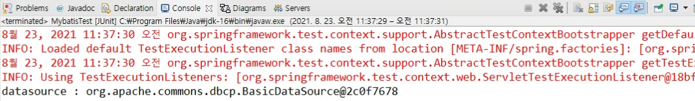
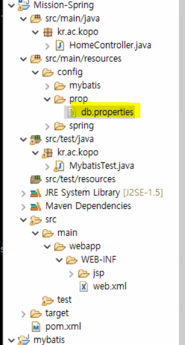
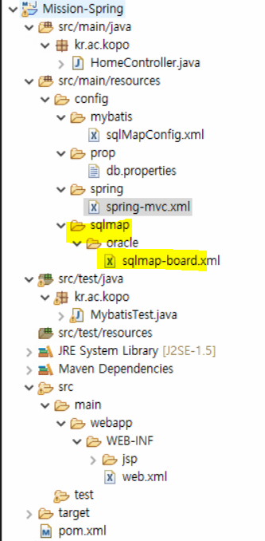

## Spring 

#### 프로젝트 생성

- **Maven 프로젝트**


#### 설정파일 생성

 

- **web.xml**

```xml
<?xml version="1.0" encoding="UTF-8"?>
<web-app xmlns:xsi="http://www.w3.org/2001/XMLSchema-instance" xmlns="http://java.sun.com/xml/ns/javaee" xsi:schemaLocation="http://java.sun.com/xml/ns/javaee http://java.sun.com/xml/ns/javaee/web-app_3_0.xsd" id="WebApp_ID" version="3.0">
  <display-name>spring-mvc</display-name>
  
  <servlet>
  	<servlet-name>dispatcher</servlet-name>
  	<servlet-class>org.springframework.web.servlet.DispatcherServlet</servlet-class>
  	<init-param>
  		<param-name>contextConfigLocation</param-name>
  		<param-value>
  			classpath:config/spring/spring-mvc.xml
  		</param-value>
  	</init-param>
  	<load-on-startup>1</load-on-startup>
  </servlet>
  
  <servlet-mapping>
  	<servlet-name>dispatcher</servlet-name>
	<url-pattern>/</url-pattern>  
  </servlet-mapping>
  
  <filter>
  	<filter-name>encodingFilter</filter-name>
  	<filter-class>org.springframework.web.filter.CharacterEncodingFilter</filter-class>
  	<init-param>
  		<param-name>encoding</param-name>
  		<param-value>UTF-8</param-value>
  	</init-param>
  </filter>

  <filter-mapping>
  	<filter-name>encodingFilter</filter-name>
	<url-pattern>/*</url-pattern>  
  </filter-mapping>
  
  <welcome-file-list>
    <welcome-file>index.html</welcome-file>
    <welcome-file>index.htm</welcome-file>
    <welcome-file>index.jsp</welcome-file>
    <welcome-file>default.html</welcome-file>
    <welcome-file>default.htm</welcome-file>
    <welcome-file>default.jsp</welcome-file>
  </welcome-file-list>
</web-app>
```


- **spring-mvc.xml**

```xml
<?xml version="1.0" encoding="UTF-8"?>
<beans xmlns="http://www.springframework.org/schema/beans"
    xmlns:mvc="http://www.springframework.org/schema/mvc"
    xmlns:context="http://www.springframework.org/schema/context"
    xmlns:xsi="http://www.w3.org/2001/XMLSchema-instance"
    xsi:schemaLocation="http://www.springframework.org/schema/beans   
    http://www.springframework.org/schema/beans/spring-beans.xsd
    http://www.springframework.org/schema/context   
    http://www.springframework.org/schema/context/spring-context.xsd
    http://www.springframework.org/schema/mvc 
    http://www.springframework.org/schema/mvc/spring-mvc.xsd">
  

	<context:component-scan base-package="kr.ac.kopo" />
    <mvc:annotation-driven>
    	<mvc:message-converters>
    		<bean class="org.springframework.http.converter.StringHttpMessageConverter">
    			<property name="supportedMediaTypes">
    				<list>
    					<value>text/html; charset=utf-8</value>	
    				</list>
    			</property>
    		</bean>
    		<bean class="org.springframework.http.converter.json.MappingJackson2HttpMessageConverter">
    			<property name="supportedMediaTypes">
    				<list>
    					<value>text/html; charset=utf-8</value>
    					<value>application/json; charset=utf-8</value>
    				</list>
    			</property>
    		</bean>
    	</mvc:message-converters>
    </mvc:annotation-driven>
    <bean id="multipartResolver" class="org.springframework.web.multipart.commons.CommonsMultipartResolver">
    	<property name="maxUploadSize" value="10485760" />
    </bean>
	<mvc:default-servlet-handler />
	<mvc:view-resolvers>
		<mvc:jsp prefix="/WEB-INF/jsp/" suffix=".jsp" />
	</mvc:view-resolvers>

</beans>
```


- **pom.xml**

```xml
<project xmlns="http://maven.apache.org/POM/4.0.0" xmlns:xsi="http://www.w3.org/2001/XMLSchema-instance" xsi:schemaLocation="http://maven.apache.org/POM/4.0.0 https://maven.apache.org/xsd/maven-4.0.0.xsd">
  <modelVersion>4.0.0</modelVersion>
  <groupId>kr.ac.kopo</groupId>
  <artifactId>Mission-Spring</artifactId>
  <version>0.0.1-SNAPSHOT</version>
  <packaging>war</packaging>
  
  <dependencies>
	<!-- spring-context -->
	<dependency>
	   <groupId>org.springframework</groupId>
	   <artifactId>spring-webmvc</artifactId>
	   <version>5.3.9</version>
	</dependency>
	
	<!-- jsp-api -->
	<dependency>
	    <groupId>javax.servlet.jsp</groupId>
	    <artifactId>jsp-api</artifactId>
	    <version>2.2</version>
	    <scope>provided</scope>
	</dependency>
	 	<!-- javax.servlet-api -->
	<dependency>
	    <groupId>javax.servlet</groupId>
	    <artifactId>javax.servlet-api</artifactId>
	    <version>4.0.1</version>
	    <scope>provided</scope>
	</dependency>
    
  </dependencies>
</project>
```


#### 실행되는지 test



- HomeContoller.java

```java
package kr.ac.kopo;

import org.springframework.stereotype.Controller;
import org.springframework.web.bind.annotation.RequestMapping;

@Controller
public class HomeController {
	@RequestMapping("/")
	public String home() {
		return "index";
	}
}

```


#### datasource 설정




#### spring + mybatis 연동



- pom.xml

```xml
<!-- https://mvnrepository.com/artifact/commons-dbcp/commons-dbcp -->
<dependency>
    <groupId>commons-dbcp</groupId>
    <artifactId>commons-dbcp</artifactId>
    <version>1.4</version>
</dependency>
<!-- https://mvnrepository.com/artifact/com.oracle.database.jdbc/ojdbc8 -->
<dependency>
    <groupId>com.oracle.database.jdbc</groupId>
    <artifactId>ojdbc8</artifactId>
    <version>21.1.0.0</version>
</dependency>

```

- spring-mvc.xml

```xml
<?xml version="1.0" encoding="UTF-8"?>
<beans xmlns="http://www.springframework.org/schema/beans"
    xmlns:mvc="http://www.springframework.org/schema/mvc"
    xmlns:context="http://www.springframework.org/schema/context"
    xmlns:xsi="http://www.w3.org/2001/XMLSchema-instance"
    xsi:schemaLocation="http://www.springframework.org/schema/beans   
    http://www.springframework.org/schema/beans/spring-beans.xsd
    http://www.springframework.org/schema/context   
    http://www.springframework.org/schema/context/spring-context.xsd
    http://www.springframework.org/schema/mvc 
    http://www.springframework.org/schema/mvc/spring-mvc.xsd">
  

	<context:component-scan base-package="kr.ac.kopo" />
    <mvc:annotation-driven>
    	<mvc:message-converters>
    		<bean class="org.springframework.http.converter.StringHttpMessageConverter">
    			<property name="supportedMediaTypes">
    				<list>
    					<value>text/html; charset=utf-8</value>	
    				</list>
    			</property>
    		</bean>
    		<bean class="org.springframework.http.converter.json.MappingJackson2HttpMessageConverter">
    			<property name="supportedMediaTypes">
    				<list>
    					<value>text/html; charset=utf-8</value>
    					<value>application/json; charset=utf-8</value>
    				</list>
    			</property>
    		</bean>
    	</mvc:message-converters>
    </mvc:annotation-driven>
    <bean id="multipartResolver" class="org.springframework.web.multipart.commons.CommonsMultipartResolver">
    	<property name="maxUploadSize" value="10485760" />
    </bean>
	
	<!-- db연동 -->
	<bean id="dataSource" class="org.apache.commons.dbcp.BasicDataSource" destroy-method="close">
		<property name="driverClassName" value="orcle.jdbc.driver.OracleDriver"/>
		<property name="url" value="jdbc:oracle:thin:@192.168.217.202:1521/KOPODA"/>
		<property name="username" value="da2106"/>
		<property name="password" value="da06"/>
	</bean>
		
	
	<mvc:default-servlet-handler />
	<mvc:view-resolvers>
		<mvc:jsp prefix="/WEB-INF/jsp/" suffix=".jsp" />
	</mvc:view-resolvers>
	
</beans>
```


- db 연동이 잘 되었는지 test

```java
package kr.ac.kopo;

import static org.junit.Assert.assertNotNull;

import javax.sql.DataSource;

import org.junit.Test;
import org.junit.runner.RunWith;
import org.springframework.beans.factory.annotation.Autowired;
import org.springframework.test.context.ContextConfiguration;
import org.springframework.test.context.junit4.SpringJUnit4ClassRunner;

@RunWith(SpringJUnit4ClassRunner.class)
@ContextConfiguration(locations = {"classpath:config/spring/spring-mvc.xml"})
public class MybatisTest {
	@Autowired
	private DataSource dataSource;
	
	@Test
	public void DataSource생성테스트() throws Exception {
		System.out.println("datasource : " + dataSource);
		assertNotNull(dataSource);
	}
}

```




#### mybatis

- pom.xml

```xml
<!-- https://mvnrepository.com/artifact/org.mybatis/mybatis -->
<dependency>
    <groupId>org.mybatis</groupId>
    <artifactId>mybatis</artifactId>
    <version>3.5.6</version>
</dependency>
<!-- https://mvnrepository.com/artifact/org.mybatis/mybatis-spring -->
<dependency>
    <groupId>org.mybatis</groupId>
    <artifactId>mybatis-spring</artifactId>
    <version>2.0.6</version>
</dependency>
<!-- https://mvnrepository.com/artifact/org.springframework/spring-jdbc -->
<dependency>
    <groupId>org.springframework</groupId>
    <artifactId>spring-jdbc</artifactId>
    <version>5.3.9</version>
</dependency>

```

- mybatis-config.xml

```xml
<?xml version="1.0" encoding="UTF-8" ?>
<!DOCTYPE configuration
  PUBLIC "-//mybatis.org//DTD Config 3.0//EN"
  "http://mybatis.org/dtd/mybatis-3-config.dtd">
<configuration>
	
</configuration>
```

- spring-mvc.xml

```xml
<?xml version="1.0" encoding="UTF-8"?>
<beans xmlns="http://www.springframework.org/schema/beans"
    xmlns:mvc="http://www.springframework.org/schema/mvc"
    xmlns:context="http://www.springframework.org/schema/context"
    xmlns:xsi="http://www.w3.org/2001/XMLSchema-instance"
    xsi:schemaLocation="http://www.springframework.org/schema/beans   
    http://www.springframework.org/schema/beans/spring-beans.xsd
    http://www.springframework.org/schema/context   
    http://www.springframework.org/schema/context/spring-context.xsd
    http://www.springframework.org/schema/mvc 
    http://www.springframework.org/schema/mvc/spring-mvc.xsd">
  

	<context:component-scan base-package="kr.ac.kopo" />
    <mvc:annotation-driven>
    	<mvc:message-converters>
    		<bean class="org.springframework.http.converter.StringHttpMessageConverter">
    			<property name="supportedMediaTypes">
    				<list>
    					<value>text/html; charset=utf-8</value>	
    				</list>
    			</property>
    		</bean>
    		<bean class="org.springframework.http.converter.json.MappingJackson2HttpMessageConverter">
    			<property name="supportedMediaTypes">
    				<list>
    					<value>text/html; charset=utf-8</value>
    					<value>application/json; charset=utf-8</value>
    				</list>
    			</property>
    		</bean>
    	</mvc:message-converters>
    </mvc:annotation-driven>
    <bean id="multipartResolver" class="org.springframework.web.multipart.commons.CommonsMultipartResolver">
    	<property name="maxUploadSize" value="10485760" />
    </bean>
	
	<!-- db연동 -->
	<bean id="dataSource" class="org.apache.commons.dbcp.BasicDataSource" destroy-method="close">
		<property name="driverClassName" value="orcle.jdbc.driver.OracleDriver"/>
		<property name="url" value="jdbc:oracle:thin:@192.168.217.202:1521/KOPODA"/>
		<property name="username" value="da2106"/>
		<property name="password" value="da06"/>
	</bean>
	
	<bean id="sqlSessionFactory" class="org.mybatis.spring.SqlSessionFactoryBean">
		<property name="dataSource" ref="dataSource" />
		<property name="configLocation" value="classpath:config/mybatis/sqlMapConfig.xml" />
	</bean>
		
	
	<mvc:default-servlet-handler />
	<mvc:view-resolvers>
		<mvc:jsp prefix="/WEB-INF/jsp/" suffix=".jsp" />
	</mvc:view-resolvers>
	
</beans>
```


- **테스트**

```java
package kr.ac.kopo;

import static org.junit.Assert.assertNotNull;

import javax.sql.DataSource;

import org.apache.ibatis.session.SqlSession;
import org.apache.ibatis.session.SqlSessionFactory;
import org.junit.Ignore;
import org.junit.Test;
import org.junit.runner.RunWith;
import org.springframework.beans.factory.annotation.Autowired;
import org.springframework.test.context.ContextConfiguration;
import org.springframework.test.context.junit4.SpringJUnit4ClassRunner;

@RunWith(SpringJUnit4ClassRunner.class)
@ContextConfiguration(locations = {"classpath:config/spring/spring-mvc.xml"})
public class MybatisTest {
	@Autowired
	private DataSource dataSource;
	@Autowired
	private SqlSessionFactory sqlFactory;
	
	@Ignore
	@Test
	public void DataSource생성테스트() throws Exception {
		System.out.println("datasource : " + dataSource);
		assertNotNull(dataSource);
		
	}
	
	@Test
	public void mybatis연동테스트() throws Exception {
		assertNotNull(sqlFactory);
	}
	
}

```


#### SqlSessionTemplate 설정

- spring-mvc.xml

```xml
<?xml version="1.0" encoding="UTF-8"?>
<beans xmlns="http://www.springframework.org/schema/beans"
    xmlns:mvc="http://www.springframework.org/schema/mvc"
    xmlns:context="http://www.springframework.org/schema/context"
    xmlns:xsi="http://www.w3.org/2001/XMLSchema-instance"
    xsi:schemaLocation="http://www.springframework.org/schema/beans   
    http://www.springframework.org/schema/beans/spring-beans.xsd
    http://www.springframework.org/schema/context   
    http://www.springframework.org/schema/context/spring-context.xsd
    http://www.springframework.org/schema/mvc 
    http://www.springframework.org/schema/mvc/spring-mvc.xsd">
  

	<context:component-scan base-package="kr.ac.kopo" />
    <mvc:annotation-driven>
    	<mvc:message-converters>
    		<bean class="org.springframework.http.converter.StringHttpMessageConverter">
    			<property name="supportedMediaTypes">
    				<list>
    					<value>text/html; charset=utf-8</value>	
    				</list>
    			</property>
    		</bean>
    		<bean class="org.springframework.http.converter.json.MappingJackson2HttpMessageConverter">
    			<property name="supportedMediaTypes">
    				<list>
    					<value>text/html; charset=utf-8</value>
    					<value>application/json; charset=utf-8</value>
    				</list>
    			</property>
    		</bean>
    	</mvc:message-converters>
    </mvc:annotation-driven>
    <bean id="multipartResolver" class="org.springframework.web.multipart.commons.CommonsMultipartResolver">
    	<property name="maxUploadSize" value="10485760" />
    </bean>
	
	<!-- db연동 -->
	<bean id="dataSource" class="org.apache.commons.dbcp.BasicDataSource" destroy-method="close">
		<property name="driverClassName" value="orcle.jdbc.driver.OracleDriver"/>
		<property name="url" value="jdbc:oracle:thin:@192.168.217.202:1521/KOPODA"/>
		<property name="username" value="da2106"/>
		<property name="password" value="da06"/>
	</bean>
	
	<bean id="sqlSessionFactory" class="org.mybatis.spring.SqlSessionFactoryBean">
		<property name="dataSource" ref="dataSource" />
		<property name="configLocation" value="classpath:config/mybatis/sqlMapConfig.xml" />
	</bean>
	
	<bean id="sqlSessionTemplate" class="org.mybatis.spring.SqlSessionTemplate">
		<constructor-arg ref="sqlSessionFactory"/>
	</bean>
		
	
	<mvc:default-servlet-handler />
	<mvc:view-resolvers>
		<mvc:jsp prefix="/WEB-INF/jsp/" suffix=".jsp" />
	</mvc:view-resolvers>
	
</beans>
```


- test

```java
package kr.ac.kopo;

import static org.junit.Assert.assertNotNull;

import javax.sql.DataSource;

import org.apache.ibatis.session.SqlSession;
import org.apache.ibatis.session.SqlSessionFactory;
import org.junit.Ignore;
import org.junit.Test;
import org.junit.runner.RunWith;
import org.mybatis.spring.SqlSessionTemplate;
import org.springframework.beans.factory.annotation.Autowired;
import org.springframework.test.context.ContextConfiguration;
import org.springframework.test.context.junit4.SpringJUnit4ClassRunner;

@RunWith(SpringJUnit4ClassRunner.class)
@ContextConfiguration(locations = {"classpath:config/spring/spring-mvc.xml"})
public class MybatisTest {
	@Autowired
	private DataSource dataSource;
	@Autowired
	private SqlSessionFactory sqlFactory;
	
	@Autowired
	private SqlSessionTemplate sessionTemplate;
	
	@Ignore
	@Test
	public void DataSource생성테스트() throws Exception {
		System.out.println("datasource : " + dataSource);
		assertNotNull(dataSource);
		
	}
	
	@Test
	public void mybatis연동테스트() throws Exception {
		//assertNotNull(sqlFactory);
		assertNotNull(sessionTemplate);
	}
	
	
}

```


## 프로퍼티 파일을 사용

 

- db.properties 생성

```properties
driver=orcle.jdbc.driver.OracleDriver
url=jdbc:oracle:thin:@192.168.217.202:1521/KOPODA
user=da2106
password=da06
```


- spring-mvc.xml

```xml
<?xml version="1.0" encoding="UTF-8"?>
<beans xmlns="http://www.springframework.org/schema/beans"
    xmlns:mvc="http://www.springframework.org/schema/mvc"
    xmlns:context="http://www.springframework.org/schema/context"
    xmlns:xsi="http://www.w3.org/2001/XMLSchema-instance"
    xsi:schemaLocation="http://www.springframework.org/schema/beans   
    http://www.springframework.org/schema/beans/spring-beans.xsd
    http://www.springframework.org/schema/context   
    http://www.springframework.org/schema/context/spring-context.xsd
    http://www.springframework.org/schema/mvc 
    http://www.springframework.org/schema/mvc/spring-mvc.xsd">
  

	<context:component-scan base-package="kr.ac.kopo" />
    <mvc:annotation-driven>
    	<mvc:message-converters>
    		<bean class="org.springframework.http.converter.StringHttpMessageConverter">
    			<property name="supportedMediaTypes">
    				<list>
    					<value>text/html; charset=utf-8</value>	
    				</list>
    			</property>
    		</bean>
    		<bean class="org.springframework.http.converter.json.MappingJackson2HttpMessageConverter">
    			<property name="supportedMediaTypes">
    				<list>
    					<value>text/html; charset=utf-8</value>
    					<value>application/json; charset=utf-8</value>
    				</list>
    			</property>
    		</bean>
    	</mvc:message-converters>
    </mvc:annotation-driven>
    <bean id="multipartResolver" class="org.springframework.web.multipart.commons.CommonsMultipartResolver">
    	<property name="maxUploadSize" value="10485760" />
    </bean>
	
	<bean class="org.springframework.beans.factory.config.PropertyPlaceholderConfigurer">
		<property name="Location" value="classpath:config/prop/db.properties"/>
		<property name="fileEncoding" value="UTF-8"/>
	</bean>
	
	<!-- db연동 -->
	<bean id="dataSource" class="org.apache.commons.dbcp.BasicDataSource" destroy-method="close">
		<property name="driverClassName" value="${driver}"/>
		<property name="url" value="${url}"/>
		<property name="username" value="${user}"/>
		<property name="password" value="${password}"/>
	</bean>
	
	<bean id="sqlSessionFactory" class="org.mybatis.spring.SqlSessionFactoryBean">
		<property name="dataSource" ref="dataSource" />
		<property name="configLocation" value="classpath:config/mybatis/sqlMapConfig.xml" />
	</bean>
	
	<bean id="sqlSessionTemplate" class="org.mybatis.spring.SqlSessionTemplate">
		<constructor-arg ref="sqlSessionFactory"/>
	</bean>
		
	
	<mvc:default-servlet-handler />
	<mvc:view-resolvers>
		<mvc:jsp prefix="/WEB-INF/jsp/" suffix=".jsp" />
	</mvc:view-resolvers>
	
</beans>
```


## 게시판을 위한 map 생성



- sqlmap-board.xml 생성

```xml
<?xml version="1.0" encoding="UTF-8" ?>
<!DOCTYPE mapper
  PUBLIC "-//mybatis.org//DTD Mapper 3.0//EN"
  "http://mybatis.org/dtd/mybatis-3-mapper.dtd">
<mapper namespace="kr.ac.kopo.board.BoardDAO">
	
</mapper>
```

- spring-mvc.xml 수정

```xml
<bean id="sqlSessionFactory" class="org.mybatis.spring.SqlSessionFactoryBean">
    <property name="dataSource" ref="dataSource" />
    <property name="configLocation" value="classpath:config/mybatis/sqlMapConfig.xml" />
    <property name="mapperLocations" value="classpath:config/sqlmap/oracle/sqlmap-*.xml" />
</bean>
```

