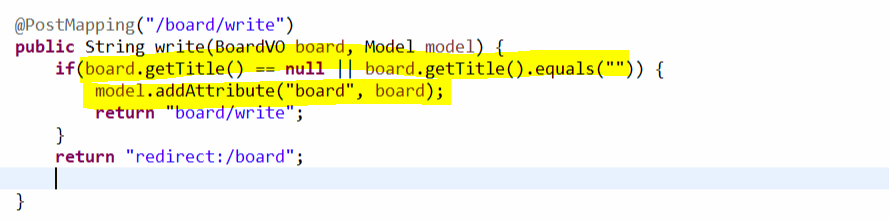
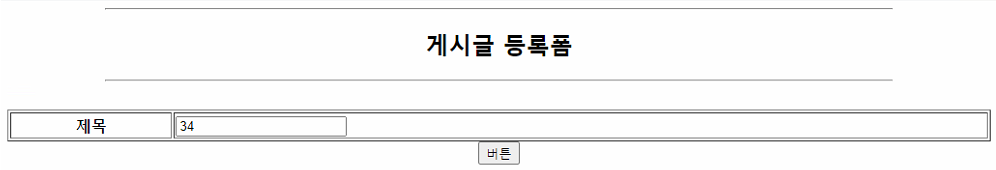
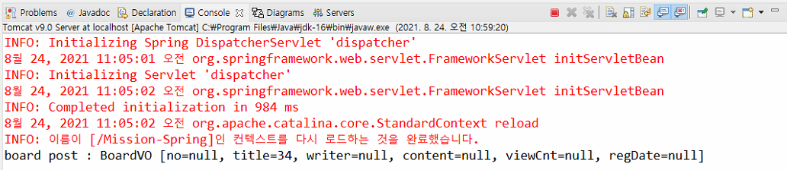
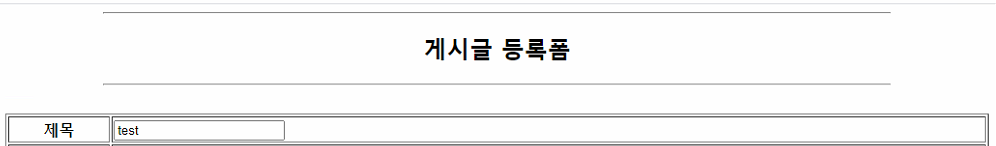
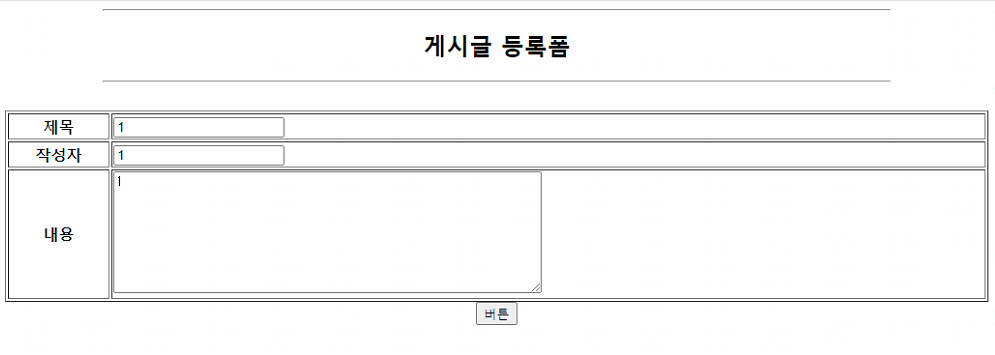
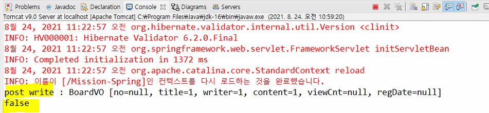
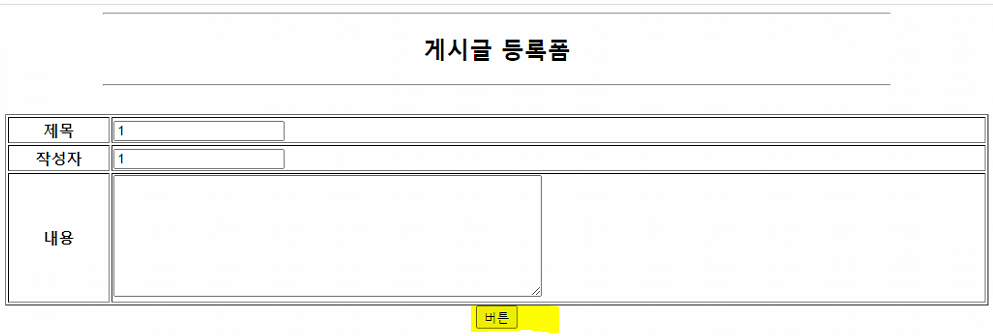
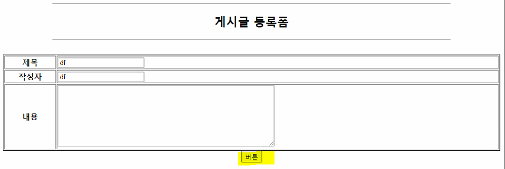
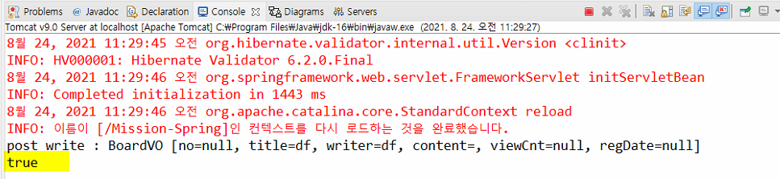
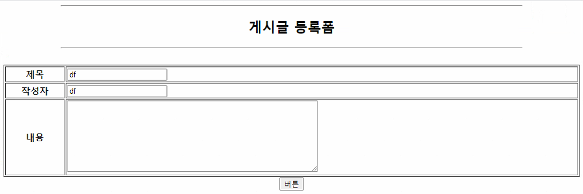

## Spring 

- 컨트롤러에 return을 void로 사용하면 uri와 같은 경로의 페이지로 이동시킨다.
- form에서 post 방식으로 현재와 같은 uri로 이용시킬 때 action을 사용하지 않아도 된다.


#### 필수항목 입력했는지 판단

- service로 데이터를 전달하기 전에 필수항목을 모두 입력했는지 확인
- 그 전에 사용자가 입력한 값이 그대로 있어야함
- 작성 버튼을 누르면 디스패처 서블릿이 컨트롤러로 가서 컨트롤러에서 필수입력 입력 확인하고 입력하지 않았으면 다시 디스패처 서블릿이 jsp 페이지로 보내준다.
- 그런데 데이터가 저장이 되지 않아서 공유영역의 객체를 이용한다. 그래서 컨트롤러에서 공유영역에 등록시켜서 다시 화면에 뿌려줘야 한다.



- 이렇게 하나하나 사용하는 것이 불편해서 **spring form tag**가 나왔음


#### form 태그

- **taglib** 추가

```jsp
<%@ taglib prefix="form" uri="http://www.springframework.org/tags/form" %>
```

- 위에처럼 원래 적었던 값이 적혀있도록
- 그러면 @GetMapping에 먼저 공유영역에 객체 하나를 등록시킨다.
  - 그래서 이 공유영역에 

```java
package kr.ac.kopo.board.controller;

import org.springframework.beans.factory.annotation.Autowired;
import org.springframework.stereotype.Controller;
import org.springframework.ui.Model;
import org.springframework.web.bind.annotation.GetMapping;
import org.springframework.web.bind.annotation.PostMapping;
import org.springframework.web.bind.annotation.RequestMapping;

import kr.ac.kopo.board.service.BoardService;
import kr.ac.kopo.board.vo.BoardVO;

@Controller
public class BoardController {
	@Autowired
	BoardService service;
	
	@RequestMapping("/board")
	public String board(Model model) {
		
		model.addAttribute("boardList", service.selectAllBoard()) ;
		return "list";
	}
	
	@GetMapping("/board/write")
	public String writeFormGet(Model model) {
		model.addAttribute("boardVO", new BoardVO()); //공유영역에 객체를 하나 올림
		return "write";
	}
	@PostMapping("/board/write")
	public String writeFormPost(Model model, BoardVO board) {
		System.out.println("board post : " + board);
		return "redirect:/board";
	}
	
	/*
	@PostMapping("/board/write")
	public String writePost(BoardVO board, Model model) {
		if(board.getTitle() == null || board.getTitle().equals("")) {
			model.addAttribute("board", board);
			return "board/write";
		}
		return "redirect:/board";
		
	}
	*/
}

```


- **jsp**
  - get, post의 url이 같아서 action은 생략 가능
  - modelAttribute="boardVO" 는 전에 getMapping에서 공유영역에 등록한 객체를 의미
  - 이걸 가져와서 이 전에 입력했던 값을 출력해준다.
  - <td><form:input path="title"/></td> 을 보면 boardVO안에 있는 변수를 path에 적는데 getTitle과 setTitle을 모두 의미한다.
  - 즉, 먼저 getTitle로 화면에 뿌려주고 
  - 그래서 get으로 먼저 write 페이지를 호출하고 값을 적은 뒤 submit button을 누르면 getTitle로 title이 저장될 수 있도록 한다. 그래서 postMapping controller에 값을 넘겨줄 수 있다.

```jsp
<%@ page language="java" contentType="text/html; charset=UTF-8"
    pageEncoding="UTF-8"%>
<%@ taglib prefix="c" uri="http://java.sun.com/jsp/jstl/core" %>    
<%@ taglib prefix="form" uri="http://www.springframework.org/tags/form" %>
<!DOCTYPE html>
<html>
<head>
<meta charset="UTF-8">
<title>새글등록</title>
<link rel="stylesheet" href="${ pageContext.request.contextPath }/resources/css/layout.css" />
<link rel="stylesheet" href="${ pageContext.request.contextPath }/resources/css/board.css" />
<script type="text/javascript" src="${ pageContext.request.contextPath }/resources/js/jquery-3.6.0.min.js"></script>
<script>

</script>
</head>
<body>
	<header>
		<%-- <jsp:include page="/jsp/include/topMenu.jsp" /> --%>
	</header>
	<section>
		<div align="center">
			<hr width="80%">
			<h2>게시글 등록폼</h2>
			<hr width="80%">
			<br>
			<form:form method="post" modelAttribute="boardVO">
				<table border="1" style="width:100%">
					<tr>
						<th>제목</th>
						<td><form:input path="title"/></td>
					</tr>
				</table>
				<form:button type="submit">버튼</form:button>
			</form:form>
		</div>
	</section>
	<footer>
		<%-- <%@ include file="/jsp/include/bottom.jsp" %> --%>
	</footer>
</body>
</html>
```


- **test**

  - 먼저 submit 버튼을 눌렀을 때 board 데이터가 넘어오는지 확인

  

  


- **test**

  - get 방식으로 write를 불렀을 때 getMapping 컨트롤러에서 지정된 값이 form에 전달되는지 확인

  - controller

  ```java
  @GetMapping("/board/write")
  public String writeFormGet(Model model) {
      BoardVO board = new BoardVO();
      board.setTitle("test");
      model.addAttribute("boardVO", board); //공유영역에 객체를 하나 올림
      return "write";
  }
  ```

  


- **form 내용 추가**

```jsp
<%@ page language="java" contentType="text/html; charset=UTF-8"
    pageEncoding="UTF-8"%>
<%@ taglib prefix="c" uri="http://java.sun.com/jsp/jstl/core" %>    
<%@ taglib prefix="form" uri="http://www.springframework.org/tags/form" %>
<!DOCTYPE html>
<html>
<head>
<meta charset="UTF-8">
<title>새글등록</title>
<link rel="stylesheet" href="${ pageContext.request.contextPath }/resources/css/layout.css" />
<link rel="stylesheet" href="${ pageContext.request.contextPath }/resources/css/board.css" />
<script type="text/javascript" src="${ pageContext.request.contextPath }/resources/js/jquery-3.6.0.min.js"></script>
<script>

</script>
</head>
<body>
	<header>
		<%-- <jsp:include page="/jsp/include/topMenu.jsp" /> --%>
	</header>
	<section>
		<div align="center">
			<hr width="80%">
			<h2>게시글 등록폼</h2>
			<hr width="80%">
			<br>
			<form:form method="post" modelAttribute="boardVO">
				<table border="1" style="width:100%">
					<tr>
						<th>제목</th>
						<td><form:input path="title"/></td>
					</tr>
					<tr>
						<th>작성자</th>
						<td><form:input path="writer"/></td>
					</tr>
					<tr>
						<th>내용</th>
						<td><form:textarea path="content" rows="8" cols="60" /> </td>
					</tr>
				</table>
				<form:button type="submit">버튼</form:button>
			</form:form>
		</div>
	</section>
	<footer>
		<%-- <%@ include file="/jsp/include/bottom.jsp" %> --%>
	</footer>
</body>
</html>
```


- **controller null인지 확인**
  - 위의 처음처럼 if문으로 title이 null인지, content가 널인지 하나하나 확인하는 것은 번거로움 그래서 `validator` 사용
  - `validator`를 위한 dependency 추가

```xml
<!-- https://mvnrepository.com/artifact/org.hibernate.validator/hibernate-validator -->
<dependency>
    <groupId>org.hibernate.validator</groupId>
    <artifactId>hibernate-validator</artifactId>
    <version>6.2.0.Final</version>
</dependency>

```


- **무조건 값이 들어가야 하는 변수에 `@NotEmpty`를 추가**
  - BoardVO

```java
package kr.ac.kopo.board.vo;

import javax.validation.constraints.NotEmpty;

/**
 * @author HP
 *
 */
public class BoardVO {
	private String no;
	@NotEmpty
	private String title;
	@NotEmpty
	private String writer;
	@NotEmpty
	private String content;
	private String viewCnt;
	private String regDate;
	public String getNo() {
		return no;
	}
	public void setNo(String no) {
		this.no = no;
	}
	public String getTitle() {
		return title;
	}
	public void setTitle(String title) {
		this.title = title;
	}
	public String getWriter() {
		return writer;
	}
	public void setWriter(String writer) {
		this.writer = writer;
	}
	public String getContent() {
		return content;
	}
	public void setContent(String content) {
		this.content = content;
	}
	public String getViewCnt() {
		return viewCnt;
	}
	public void setViewCnt(String viewCnt) {
		this.viewCnt = viewCnt;
	}
	public String getRegDate() {
		return regDate;
	}
	public void setRegDate(String regDate) {
		this.regDate = regDate;
	}
	@Override
	public String toString() {
		return "BoardVO [no=" + no + ", title=" + title + ", writer=" + writer + ", content=" + content + ", viewCnt="
				+ viewCnt + ", regDate=" + regDate + "]";
	}	
}
```


- **컨트롤러 @PostMapping에 `@Valid` 추가**
  - Errors error : valid에 대한 error 내용

```java
package kr.ac.kopo.board.controller;

import javax.validation.Valid;

import org.springframework.beans.factory.annotation.Autowired;
import org.springframework.stereotype.Controller;
import org.springframework.ui.Model;
import org.springframework.validation.Errors;
import org.springframework.web.bind.annotation.GetMapping;
import org.springframework.web.bind.annotation.PostMapping;
import org.springframework.web.bind.annotation.RequestMapping;

import kr.ac.kopo.board.service.BoardService;
import kr.ac.kopo.board.vo.BoardVO;

@Controller
public class BoardController {
	@Autowired
	BoardService service;
	
	@RequestMapping("/board")
	public String board(Model model) {
		
		model.addAttribute("boardList", service.selectAllBoard()) ;
		return "list";
	}
	
	@GetMapping("/board/write")
	public String writeFormGet(Model model) {
		model.addAttribute("boardVO", new BoardVO()); //공유영역에 객체를 하나 올림
		return "write";
	}
	@PostMapping("/board/write")
	public String writeFormPost(@Valid BoardVO board, Errors error) {
		System.out.println("post write : " + board);
		System.out.println(error.hasErrors()); //true, false 값으로 나타낸다. 
        //에러가 있으면 true
		return "redirect:/board";
	}
	
	/*
	@PostMapping("/board/write")
	public String writePost(BoardVO board, Model model) {
		if(board.getTitle() == null || board.getTitle().equals("")) {
			model.addAttribute("board", board);
			return "board/write";
		}
		return "redirect:/board";
		
	}
	*/
}

```


- **test - 모두 다 입력**






- **test 모두 다 입력 안 했을 경우**




- error.hasErrors()로 에러 확인하고 어디 페이지로 이동할지 check
  - controller

```java
package kr.ac.kopo.board.controller;

import javax.validation.Valid;

import org.springframework.beans.factory.annotation.Autowired;
import org.springframework.stereotype.Controller;
import org.springframework.ui.Model;
import org.springframework.validation.Errors;
import org.springframework.web.bind.annotation.GetMapping;
import org.springframework.web.bind.annotation.PostMapping;
import org.springframework.web.bind.annotation.RequestMapping;

import kr.ac.kopo.board.service.BoardService;
import kr.ac.kopo.board.vo.BoardVO;

@Controller
public class BoardController {
	@Autowired
	BoardService service;
	
	@RequestMapping("/board")
	public String board(Model model) {
		
		model.addAttribute("boardList", service.selectAllBoard()) ;
		return "list";
	}
	
	@GetMapping("/board/write")
	public String writeFormGet(Model model) {
		model.addAttribute("boardVO", new BoardVO()); //공유영역에 객체를 하나 올림
		return "write";
	}
	@PostMapping("/board/write")
	public String writeFormPost(@Valid BoardVO board, Errors error) {
		System.out.println("post write : " + board);
		System.out.println(error.hasErrors()); //true, false 값으로 나타낸다. 
		
		if(error.hasErrors()) {
			//BoardVO로 받으면 알아서 boardVO라는 이름으로 객체가 알아서 등록된다.
			//class이름의 첫 글자가 소문자로 등록 됨
			//그래서 직접 공유영역에 넣지 않아도 된다.
			return "board/write";
		}
		
		return "redirect:/board";
	}
	
	/*
	@PostMapping("/board/write")
	public String writePost(BoardVO board, Model model) {
		if(board.getTitle() == null || board.getTitle().equals("")) {
			model.addAttribute("board", board);
			return "board/write";
		}
		return "redirect:/board";
		
	}
	*/
}
```


- 여기까지 test








- **오류 발생해서 다시 write로 갔을 때 메시지 띄울 수 있게 `message` 추가**
  - vo

```java
package kr.ac.kopo.board.vo;

import javax.validation.constraints.NotEmpty;

/**
 * @author HP
 *
 */
public class BoardVO {
	private String no;
	@NotEmpty(message = "필수항목입니다")
	private String title;
	@NotEmpty(message = "필수항목입니다")
	private String writer;
	@NotEmpty(message = "필수항목입니다")
	private String content;
	private String viewCnt;
	private String regDate;
	public String getNo() {
		return no;
	}
	public void setNo(String no) {
		this.no = no;
	}
	public String getTitle() {
		return title;
	}
	public void setTitle(String title) {
		this.title = title;
	}
	public String getWriter() {
		return writer;
	}
	public void setWriter(String writer) {
		this.writer = writer;
	}
	public String getContent() {
		return content;
	}
	public void setContent(String content) {
		this.content = content;
	}
	public String getViewCnt() {
		return viewCnt;
	}
	public void setViewCnt(String viewCnt) {
		this.viewCnt = viewCnt;
	}
	public String getRegDate() {
		return regDate;
	}
	public void setRegDate(String regDate) {
		this.regDate = regDate;
	}
	@Override
	public String toString() {
		return "BoardVO [no=" + no + ", title=" + title + ", writer=" + writer + ", content=" + content + ", viewCnt="
				+ viewCnt + ", regDate=" + regDate + "]";
	}
	
	
}

```


- **form `<form:errors path=""/>` 추가**

```jsp
<%@ page language="java" contentType="text/html; charset=UTF-8"
    pageEncoding="UTF-8"%>
<%@ taglib prefix="c" uri="http://java.sun.com/jsp/jstl/core" %>    
<%@ taglib prefix="form" uri="http://www.springframework.org/tags/form" %>
<!DOCTYPE html>
<html>
<head>
<meta charset="UTF-8">
<title>새글등록</title>
<link rel="stylesheet" href="${ pageContext.request.contextPath }/resources/css/layout.css" />
<link rel="stylesheet" href="${ pageContext.request.contextPath }/resources/css/board.css" />
<script type="text/javascript" src="${ pageContext.request.contextPath }/resources/js/jquery-3.6.0.min.js"></script>
<style type="text/css">
.error {
	color: red;
}

</style>
</head>
<body>
	<header>
		<%-- <jsp:include page="/jsp/include/topMenu.jsp" /> --%>
	</header>
	<section>
		<div align="center">
			<hr width="80%">
			<h2>게시글 등록폼</h2>
			<hr width="80%">
			<br>
			<form:form method="post" modelAttribute="boardVO">
				<table border="1" style="width:100%">
					<tr>
						<th>제목</th>
						<td>
							<form:input path="title"/>
							<form:errors id="error" path="title"/>
						</td>
					</tr>
					<tr>
						<th>작성자</th>
						<td>
							<form:input path="writer"/>
							<form:errors id="error" path="writer"/>
						</td>
					</tr>
					<tr>
						<th>내용</th>
						<td>
							<form:textarea path="content" rows="8" cols="60" /> 
							<form:errors id="error" path="content"/>
						</td>
					</tr>
				</table>
				<form:button type="submit">버튼</form:button>
			</form:form>
		</div>
	</section>
	<footer>
		<%-- <%@ include file="/jsp/include/bottom.jsp" %> --%>
	</footer>
</body>
</html>

```


- **그외 유효성 검사**

```java
package kr.ac.kopo.board.vo;

import javax.validation.constraints.NotEmpty;
import javax.validation.constraints.Pattern;

import org.hibernate.validator.constraints.Length;

/**
 * @author HP
 *
 */
public class BoardVO {
	private String no;
	@Length(min=2, max=40, message = "최소 2글자이상 최대 40글자만 가능합니다.")
	@NotEmpty(message = "필수항목입니다")
	private String title;
	@Pattern(regexp = "^[A-Za-z]*$", message = "영어만 입력하세요")
	@NotEmpty(message = "필수항목입니다")
	private String writer;
	@NotEmpty(message = "필수항목입니다")
	private String content;
	private String viewCnt;
	private String regDate;
	public String getNo() {
		return no;
	}
	public void setNo(String no) {
		this.no = no;
	}
	public String getTitle() {
		return title;
	}
	public void setTitle(String title) {
		this.title = title;
	}
	public String getWriter() {
		return writer;
	}
	public void setWriter(String writer) {
		this.writer = writer;
	}
	public String getContent() {
		return content;
	}
	public void setContent(String content) {
		this.content = content;
	}
	public String getViewCnt() {
		return viewCnt;
	}
	public void setViewCnt(String viewCnt) {
		this.viewCnt = viewCnt;
	}
	public String getRegDate() {
		return regDate;
	}
	public void setRegDate(String regDate) {
		this.regDate = regDate;
	}
	@Override
	public String toString() {
		return "BoardVO [no=" + no + ", title=" + title + ", writer=" + writer + ", content=" + content + ", viewCnt="
				+ viewCnt + ", regDate=" + regDate + "]";
	}
	
	
}
```


## 디스패처 서블릿이 세션에 로그인 정보 올리기

#### `@SessionAttributes `사용

- 컨트롤러

```java
package kr.ac.kopo.member.controller;

import javax.servlet.http.HttpServletRequest;
import javax.servlet.http.HttpSession;

import org.springframework.beans.factory.annotation.Autowired;
import org.springframework.stereotype.Controller;
import org.springframework.ui.Model;
import org.springframework.web.bind.annotation.GetMapping;
import org.springframework.web.bind.annotation.PostMapping;
import org.springframework.web.bind.annotation.SessionAttributes;

import kr.ac.kopo.member.service.MemberService;
import kr.ac.kopo.member.vo.MemberVO;

@SessionAttributes("vo") //vo로 된 이름은 session에 알아서 저장
@Controller
public class MemberController {
	
	@Autowired
	private MemberService service;
	
	@GetMapping("/login")
	public String loginForm() {
		return "login";
	}
	
	@PostMapping("/login")
	public String loginPro(MemberVO member, Model model) {
		MemberVO vo = service.login(member);
		String msg = "";
		if(vo == null) {
			msg = "실패";
			model.addAttribute("msg", msg);
			return "login";
		}
		model.addAttribute("vo", vo); //request 영역이 아닌 세션에 저장이 된다.
        //@SessionAttributes("vo")
		
		return "redirect:/";
	}
}
```


#### 로그아웃시 세션 지우기

- **위에 어노테이션을 사용하는 경우 직접 세션을 삭제할 수 없다.**
  - `SessionStatus` 사용
- 컨트롤러

```java
@GetMapping("/logout")
public String logout(SessionStatus sessionStatus) {
    sessionStatus.setComplete();
    return "redirect:/";
}
```


------

## Interceptor

#### 설정

- spring-config.xml
  - <mvc:mapping path="/**"/> : 모든 루트에 인터셉터 컨트롤러로 이동
  - <mvc:exclude-mapping path=""/> : 해당 path만 제외

```xml
<bean class="kr.ac.kopo.interceptor.LoginInterceptor" id="loginInterceptor" />
<mvc:interceptors>
    <mvc:interceptor>
        <mvc:mapping path="/**"/>
        <mvc:exclude-mapping path="/login"/>
        <mvc:exclude-mapping path="/resources/**"/>
        <mvc:exclude-mapping path="/"/>
        <ref bean="loginInterceptor"/>
    </mvc:interceptor>
</mvc:interceptors>
```

- 컨트롤러

```java
package kr.ac.kopo.interceptor;

import javax.servlet.http.HttpServletRequest;
import javax.servlet.http.HttpServletResponse;

import org.springframework.web.servlet.handler.HandlerInterceptorAdapter;

public class LoginInterceptor extends HandlerInterceptorAdapter{
	@Override
	public boolean preHandle(HttpServletRequest request, HttpServletResponse response, Object handler)
			throws Exception {
		System.out.println("로그인 인터셉처리...");
		return super.preHandle(request, response, handler);
	}
}

```


#### 로그인 안했으면 로그인 페이지로 이동하기 

- 인터셉터 컨트롤러 

```java
package kr.ac.kopo.interceptor;

import javax.servlet.http.HttpServletRequest;
import javax.servlet.http.HttpServletResponse;
import javax.servlet.http.HttpSession;

import org.springframework.web.servlet.handler.HandlerInterceptorAdapter;

import kr.ac.kopo.member.vo.MemberVO;

public class LoginInterceptor extends HandlerInterceptorAdapter{
	@Override
	public boolean preHandle(HttpServletRequest request, HttpServletResponse response, Object handler)
			throws Exception {
		
		//로그인 여부 판단
		HttpSession session = request.getSession();
		MemberVO vo = (MemberVO) session.getAttribute("vo");
		
		if(vo == null) {
			String uri = request.getRequestURI();
			uri = uri.substring(request.getContextPath().length());
			System.out.println("uri : " + uri);
			
			session.setAttribute("dest", uri); //sendRedirect라서 session에 저장
			
			//만약에 board/detail?no=3 인 경우
			//uri : board/detail밖에 안가져 오는데  => request.getRequestURI();
			//no=3은 (query)
			//request.getQueryString()으로 가져오면 된다.
			//uri = uri + "?" + query
			response.sendRedirect(request.getContextPath() + "/login");
			return false;
		}
		return true;
	}
}

```

- 로그인 컨트롤러

```java
@PostMapping("/login")
public String loginPro(MemberVO member, Model model, HttpSession session) {
    MemberVO vo = service.login(member);
    String msg = "";
    if(vo == null) {
        msg = "실패";
        model.addAttribute("msg", msg);
        return "login";
    }
    model.addAttribute("vo", vo);

    String dest = (String) session.getAttribute("dest");
    if(dest != null) {
        session.removeAttribute(dest);
        return "redirect:" + dest; 
    }

    return "login";
}
```

