### 정보시스템 개요 

-------

#### github 

- 개념 설명
  
- Repository : 
  
- 사용 방법

  - https://github.com/ 에서 Sing in

  


--------

#### git 설치

- https://git-scm.com/ 

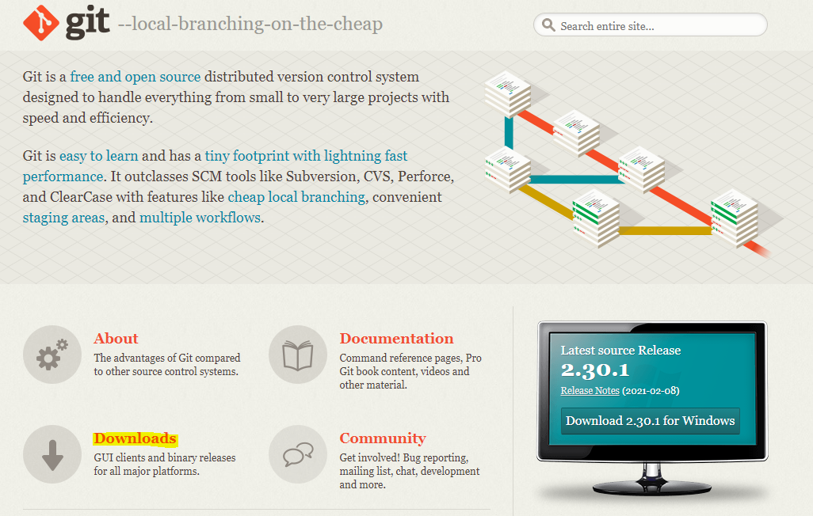


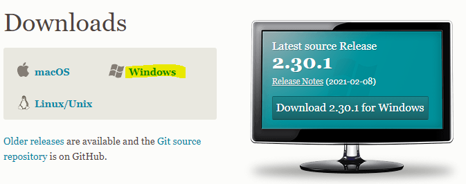


#### Git 기본 사용 방법

- Git Bash

 


- 기본 리눅스 사용 명령어

  - 현재 디렉토리 확인

   

  - 디렉토리 들어가기

   

  - 디렉토리 생성

   


- Git 저장소 만들기
  - 현재 디렉토리에 .git의 숨김 파일이 생성 

```
git init
```

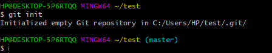 

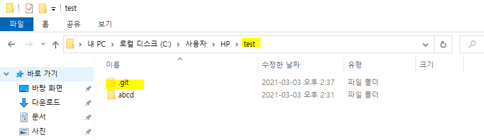


- 저장소 상태를 확인

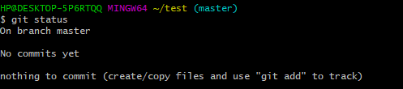 


- Git이 관리해야 할 파일을 지정

  -  git add를 하지 않으면 commit시에 git에 반영이 되지 않는다.

  ```
  git add 파일명
  ```

   


- 변경사항을 최종 저장

  - Add한 파일을  commit

  ```
  git commit -m 설명
  ```

  

  - 사용자 setting을 하지 않아 에러 발생

  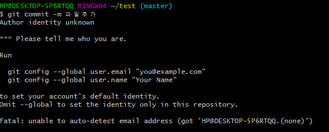 

  

- 기본 사용자 setting

```
git config --global user.name "홍길동"
git config --global user.email "hong@naver.com"
```

 

 


- 변경사항 최종 저장

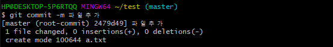 


- 변경사항 파악
  - commit 전의 마지막 버전 대배 변경된 내용을 확인 가능

```
git diff
```

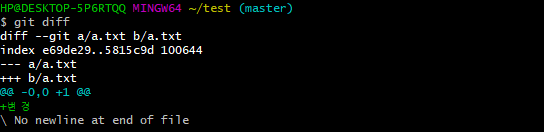 


- 전체 변경 내역 조회

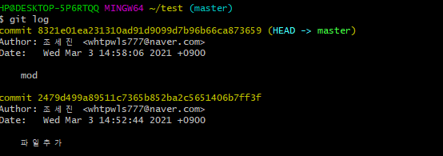 


-------

#### Branch 

- 정의
  - 독립적인 작업을 진행하기 위한 다른 장소
  - 서로 영향을 받지 않고, 여러 작업이 동시에 진행 가능하다.
  - 다른 브랜치와 병합(Merge)하여, 하나의 브랜치로 모을 수 있다.


- Branch가 필요한 경우 예시
  - 안정적인 버전 외에 새로운 기능을 추가할 때
  - 개발과 운영을 따로 할 때
  - 고객사 별로 새로운 기능을 제공해야 할 때


- 기본 규칙
  - Master branch - 안정화  branch
  - Feature branch 
    - 새로운 기능 구현을 위한 branch
    - 이름을 다른 사람들도 이해하기 쉽도록
  - Feature branch에서 master branch로 병합


- 현재 branch 확인

```
git branch
```

 


- branch 생성

```
git branch 새로운_branch_명
```

 


- 현재 branch 변경

```
git checkout 변경하고자_하는_branch_명
```

 


- new_branch에만 내용 변경

  - new_branch로 설정한 뒤 a.txt의 내용 수정

  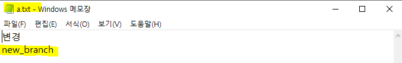

  

  -  수정사항 commit

   

   

  

  - master branch로 변경

   

  

  - a.txt를 확인하면 new_branch에서 변경된 내용이 반영되지 않은 것을 확인할 수 있다.

  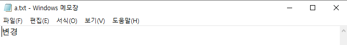 


- Merge branch

  - new branch를 master에 merge

  ```
  git merge 병합할_branch_명
  ```

  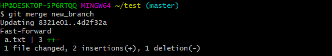 

  

  - 병합 성공

  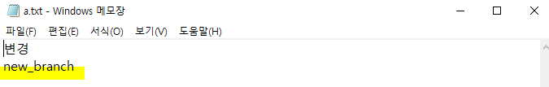 


--------

#### Remote 저장소 추가 및 관리

- 원격 저장소와 로컬 저장소
  - 원격 저장소(Remote Repository): 여러 사람이 함께 공유하기 위한 저장소로 파일이 원격 저장소 전용 서버에서 관리된다.
  - 로컬 저장소(Local Repository): 내 PC에 파일이 저장되는 개인 전용 저장소


- 로컬저장소와 Remote 저장소(Github/외부 서버) 연결

  - git remote를 이용해서 원격 저장소를 관리할 수 있다.

  ```
  git remote add 저장소_이름 원격저장소_주소		//원격저장소 저장
  ```

  

  - github에 들어가서 원격저장소 주소를 copy

  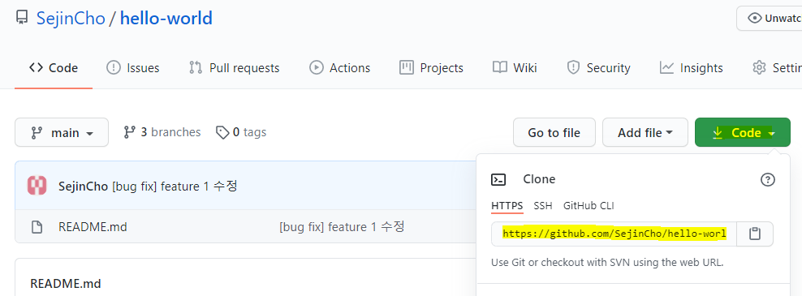

  

  - origin이라는 이름으로 원격저장소 주소를 등록 

   


- 원격저장소 목록

  - 만약 주소까지 확인하고 싶다면 v 옵션을 추가 (git remote -v)

  ```
  git remote
  ```

   

  

- Remote 삭제

  ```
  git remote rm 저장소_이름
  ```


####  remote 저장소에 전체 가져오기(git Clone)

- test안의 abcd 폴더에 위의  원격저장소인 orgin을 clone

  - 현재 디렉토리 이동한 뒤 clone

  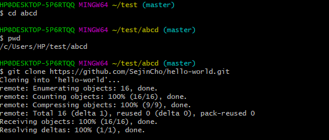 

  - copy 확인 

  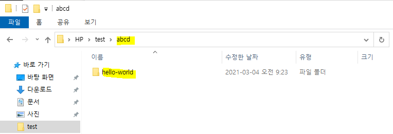

  - **clone 하면 디폴트 branch만 clone 된다.**

  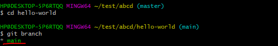 

  - *만약 다른 branch를 clone하고 싶다면??*


#### clone시 디폴트 branch 이외의 다른 branch 가져오기

- remote  저장소 branch 확인

  - 리모트 저장소 브랜치 리스트

  ```
  git branch -r
  ```

  - Local, Remote 저장소 branch 리스트

  ```
  git branch -a
  ```

  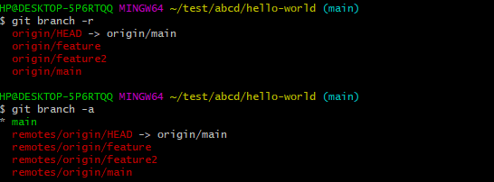 


- remote  저장소에 디폴트 이외의 branch 가져오기

  ```
  git checkout -t 외부특정_branch 
  ```

  - test 폴더에 있던 hello-world를 abcd 폴더에 hello-world 저장소를 clone
  - test폴더에 있던 feature branch(디폴트 이외의 branch)를 abcd 폴더에 clone

  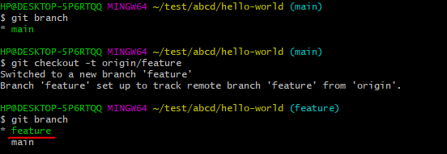 


#### Remote 저장소에 변경사항 업데이트 받기(Git Pull)

- Pull

  - remote 저장소의 내용을 로컬 저장소로 가져오는 것
  - 다른 사람이 작업한 내용을 업데이트

  ```
  git pull
  ```

  

  - remote 저장소에 test 파일을 추가

  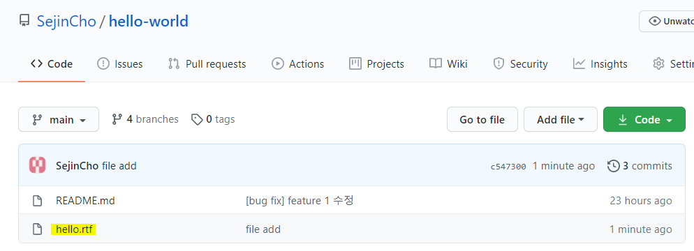

  

  - local 저장소로 pull

  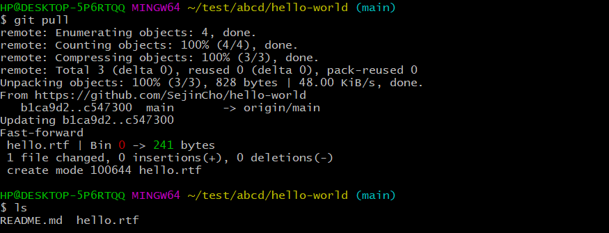


- Push

  - Local 저장소의 내용을 Remote 저장소로 보내기 위한 명령어
  - Local 저장소에 commit 한 것은 remote 저장소에 자동으로 저장되지 안항서 명시적으로 작업이 필요함

  ```
  git push 
  ```

  

- Local branch와 이름이 다른 remote branch에 반영을 할 경우

  ```
  git push remote저장소이름 local_branch:remote_branch
  git push origin localbranch:remotebranch
  ```


