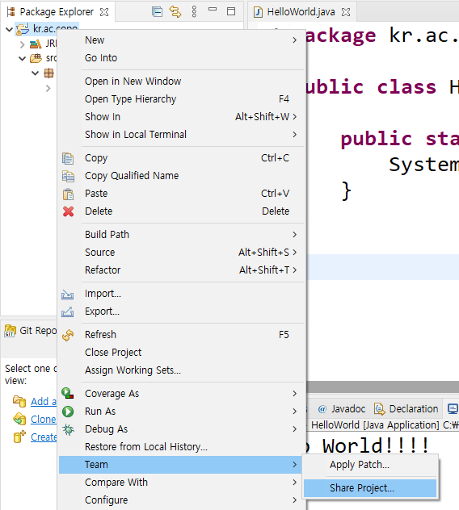
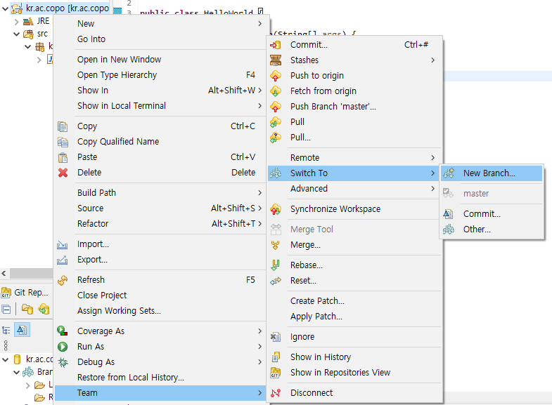

### 정보시스템 개요 

-------

#### Eclicpse와 Git 연동

- Git Repositories 뷰 꺼내오기

  - Window > Show View > Other > Git Repositories

   

- 기존 프로젝트에서 Team-Share Project

  - Team > Share Project

  

  

  - Local git repository 설정
    - 따로 로컬 레포지토리를 생성하지 않고 이클립스 프로젝트를 local git repository로 사용

  

- 원격 레포지토리 생성

  - 원격 레포지토리를 (github.com) 과 연결한다

  

  - Remote (원격 레포지토리)의 이름을 정한다. (default- origin) 

   

  

  - Origin이 가리키는 원격 정보 주소를 넣는다

   

  

   

  

   

- commit & push

  - Remotes > Team > Commit

   

  

  - Git hub에 Push할 파일 선택 > 간단한 comment > Commit and Push

   

  

  - master branch에 push

   

  - Log in

   

  

  - Push

   

  

  - 깃허브에 가서 master branch에 push 된 내용을 확인

   

  

- 브랜치 생성

  - Team > Switch To > New Branch

  

  

  - branch명 입력

   

   

  

  - branch 생성 다른 방법

   

- Git Repository Clone

  - Github에존재하는repository를내local computer에그대로가져오는기능
    - Zip으로가져오는경우: 해당그snapshot만가져옴
    - Clone하는경우: 모든branch, commit정보를가지고온다.

  

  - 1) github 홈페이지에서repository 주소를copy한다.
    - 위에 사용했던 repository에서 이름을 변경한 것

  

  

  - 2) Git Repositories에서 Clone a Git repository

   

  

  - 3) Branch Selection 
    - branch는 나중에 추가 가능

   

  

  - 4) Destination–clone할 위치 선정
    - initial branch는 위에서 master에 java project를 생성했으므로 master를 가져온다.

   

  

  - 5) Finish

   

  

  

- Package Explorer에package 추가

  - Working Tree에서Import Projects 선택

   

  

  - Import Projects from File System of Archive 선택

  

  

  - clone 확인

   

  

- Clone한repository를실행시키자

  - 실행방법 정의 – Java Application으로실행

  

  - run

  

  

  - 콘솔에 출력된 것을 확인할 수 있다.

  

