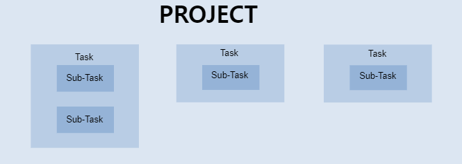

### 정보시스템 개요 

----

#### 금융 IT 시스템의 구조

- **계정계(Core Bangking)**
  - 본연의 금융 업무 처리 시스템으로, 고객의 거래 데이터 자체를 다루는 영역
  - 업무 : 계좌 개설 및 폐쇄, 입금, 출금, 계좌이체, 외환 시스템 처리 등
  - 특징 : 가장 핵심적인 시스템으로, 장애가 바로 금전적 피해로 이어져 가장 보수적으로 운영됨

- **정보계**
  - 계정계 데이터를 기반으로 영업점 및 각 부서의 업무 처리를 위해 필요한, 고객의 거래 데이터에 대한 "기록" 및 기록의 "통계"를 관리하는 시스템
  - 업무
    - 목적별 전문 데이터 관리 : 신용평가, 여신승인, 리스크 관리
    - 기업 전략을 위한 데이터 관리 : 수익 관리, 고객관계 관리, 성과 관리, 위험 관리, 마케팅 등
    - 특징 : 최근 고객 중심 서비스가 중요해지며, 고객 접점 채널에 즉각적인 마케팅과 개인화가 가능하도록 빅데이터 분석 기술이 가장 많이 활용되고 있음

- 대외계
  - 은행 외부 기관과 연계되는 업무를 처리하기 위한 대외(금융공동망 등) 연결 시스템
  - 업무 : 인터넷 뱅킹, 테렐뱅킹, CD 공동망, 타행이체, 카드결제, 주식주문 등
  - 특징 : 거래내역 검증, 네트워크 오류 관리 등 매우 복잡한 구조로 운영됨. 대용량 처리보다는 정확성과 안정성 중심.

- **채널계**
  - 대외계 시스템 및 다양한 비대면 채널들을 관리하는 시스템을 모두 아울러서 채널계라고 부르기도 함.
  - 즉, End User에 따른 다양한 접속 채널에서 발생하는 데이터를 관리하는 시스템.
  - 업무: 모바일 뱅킹, 인터넷 뱅킹, 현업의 단말기 데이터, 콜센터, 제휴 업체 정보 연계 등
  - 특징: 고객 유입 채널 다양해지며, 최근 중요성이 높아짐.

- 운영계
  - IT 시스템의 안정적인 운영을 위한 통합 관제, 네트워크 모니터링, 유지보수 등을 담당하는 시스템.

- 기간계 (Legacy, Existing)
  - 새로운 시스템 도입 시점에서, 고객이 기존에 사용하던 시스템을 의미.

- 채널 

-------------

#### 형상관리

- 형상관리란?
  - 소프트웨어의 변경사항을 체계적으로 추적하고 통제하는 것
  -  형상관리 유형
    - Code 관리 : Git
    - 문서관리 : 요구사항, 수정사항, 설계문서, 디자인 문서, test case 문서 등
    - 출시된 제품 관리(유지보수, 버그수정)
- 체계적인 문서 관리의 장점
  - 프로젝트의 history를 남겨놓아, 인수인계가 수월
  - Bug 발생시 원인 파악 수월
  - 정량화 된 평가 가능

----------

#### 형상관리 도구 - JIRA

- JIRA란?
  - Project 관리 도구
    - 기간 , 리소스 등에 대한 계획 수립
    - 이슈들의 진행 상태 추적
    - 통합된 리포트 및 대시보드 제공
    - 개발 과정이나 업무 처리에 필요한 다양한 도구와 연동(Git, wiki)

- 용어

  - Issue

    - 실제 해야 할 업무를 등록
    - 특정 프로젝트에 속함
    - 기본적인 트래킹 단위
    - 워크플로우에 적용되어 있다.
    - Task : 일반적인 작업으로 가장 작은 규모
    - Sub-Task : 하나의 이슈를 세부적으로 나누는 하위 이슈

    

    - Bug : 제품이 설계대로 동작하지 않는 문제점
    - Improvement : 제품이 가지고 있는 기능을 개선 또는 향상시키는 것
    - Epic : 애자일에서 큰 규모의 작업으로 여러 Story 들의 집합
    - Story : 일반적인 작업으로 중간정도의 규모

  - Workflow

    - Open : 이슈가 최초 생성되어 아직 작업에 들어가기 전 상태
    - In Progress : 담당자가 정해지고 이슈에 대한 작업이 진행 중인 상태
    - Resolved : 담당자가 작업을 완료한 상태
    - Closed : 이슈를 요청했던 요청자가 담당자의 작업 결과에만족하여 이슈의 완료에 동의한 상태
    - Reopened : 완료된 이슈에 문제가 발견되어다시 작업을 진행하는 상태

